# Badges

Badges show notifications, counts, or status information on navigation items and icons

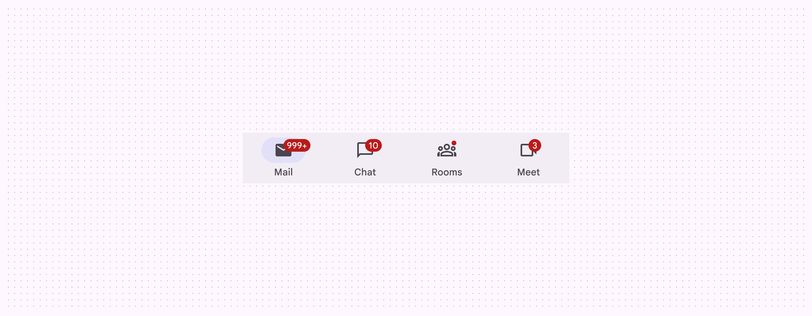

Large badges and a small badge in a navigation bar

## Usage

Badges are used to indicate a notification, item count, or other information relating to a navigation destination. They are placed on the ending edge of icons, typically within other components. There are two variants:

1. Small badge
2. Large badge

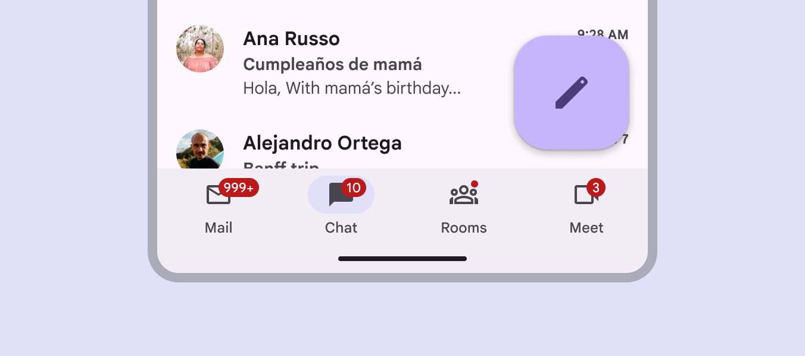

Navigation bar with four badges

A **small badge** is a simple circle, used to indicate an unread notification. A **large badge** contains label text communicating item count information.

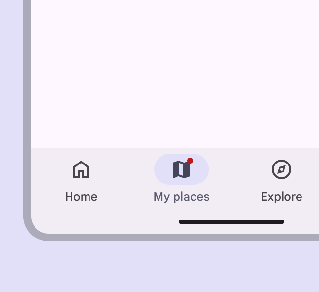

Small badge

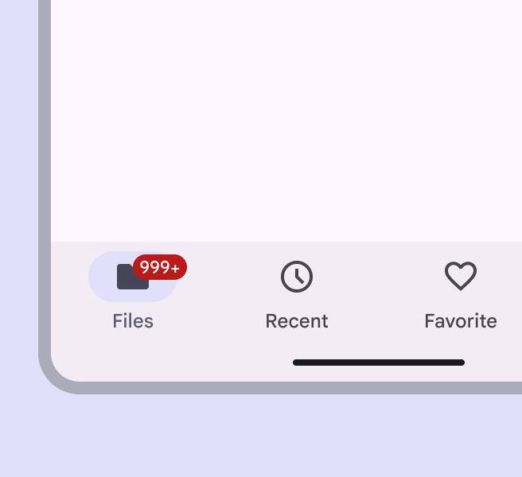

Large badge

### With other components

Badges are most commonly used within other components, such as navigation bar [More on navigation bars](/m3/pages/navigation-bar/overview), navigation rail [More on navigation rails](/m3/pages/navigation-rail/overview), app bars [More on app bars](/m3/pages/app-bars/overview), and tabs [More on tabs](/m3/pages/tabs/overview).

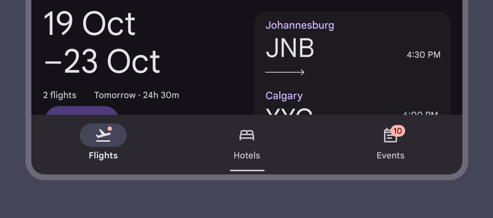

In navigation bars, hide the badge once the destination has been selected

## Anatomy

1. Small badge
2. Large badge container
3. Large badge label

## Container

There are two container options for the badge: 

- Small badge with no text
- Large badge with text

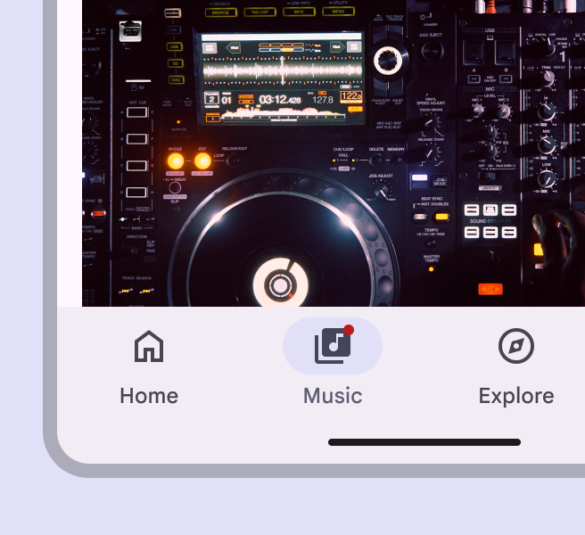

A small badge uses only shape to indicate a status change or new notification

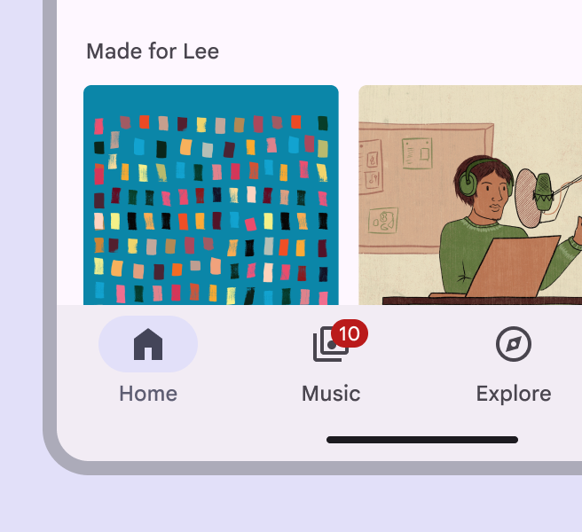

A large badge displays a number within a container to indicate a quantifiable status change related to a destination

Badge containers are anchored inside the icon bounding box. As the number count increases for large badges , their width expands, but keeps the same placement. Badges use a color intended to stand out against labels, icons, and navigation elements. Use the default color mapping to avoid color conflict issues.

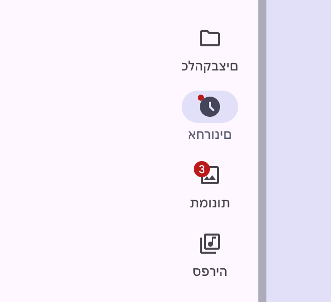

check Do

Change the position of the badge for right-to-left languages

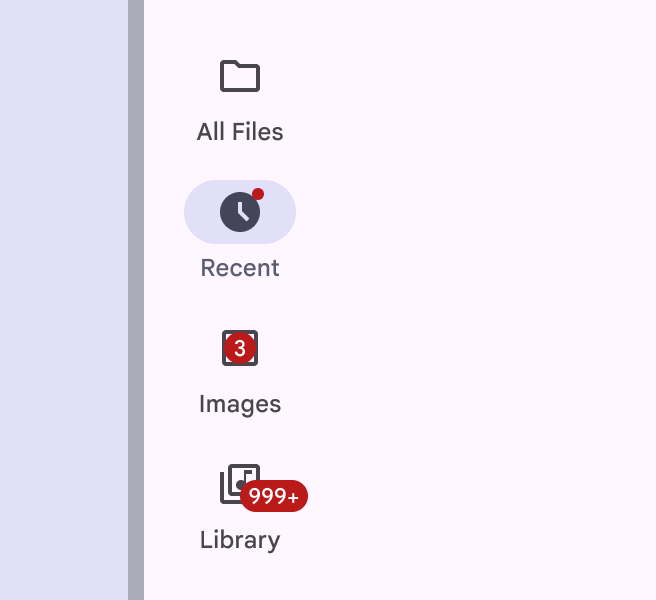

close Don’t

Badges have fixed positions. Don’t change the position of the badge arbitrarily or place the badge over the icon.

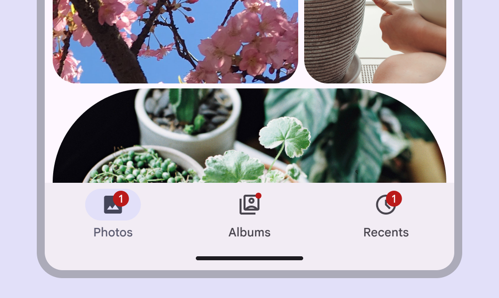

check Do

Use the default badge color

close Don’t

Avoid using custom color roles for the badge container and label text. If custom roles are necessary, make sure they have contrast of at least 3:1.

### Label text

Label large badges with counts or a status. The maximum number of characters within large badge label text is four, including a + to indicate more.

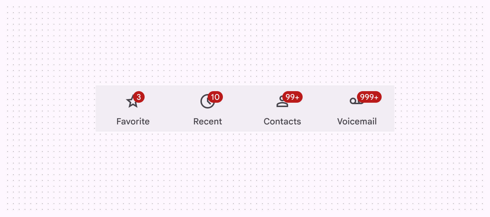

Large badges with one to four characters

Use the recommended maximum character count to ensure labels don’t extend beyond the badge container.

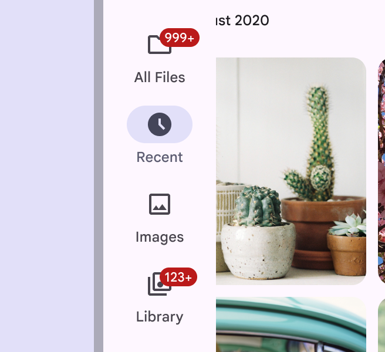

check Do

Truncate badge labels as needed

close Don’t

Don’t let the badge get cut off or collide with another element

## Placement

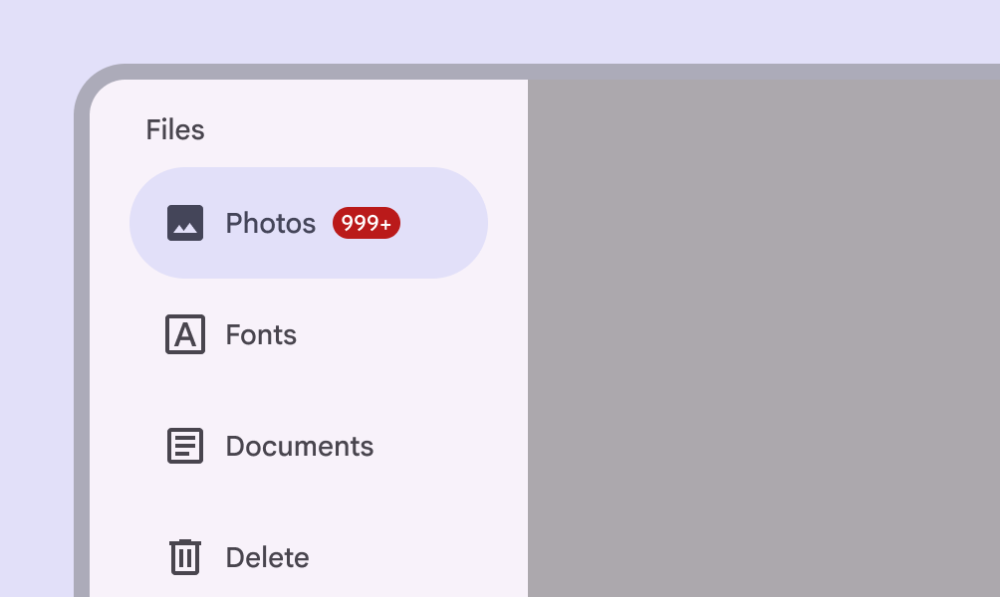

check Do

Use a large badge to show count information when visual collisions aren’t an issue, such as in a navigation rail

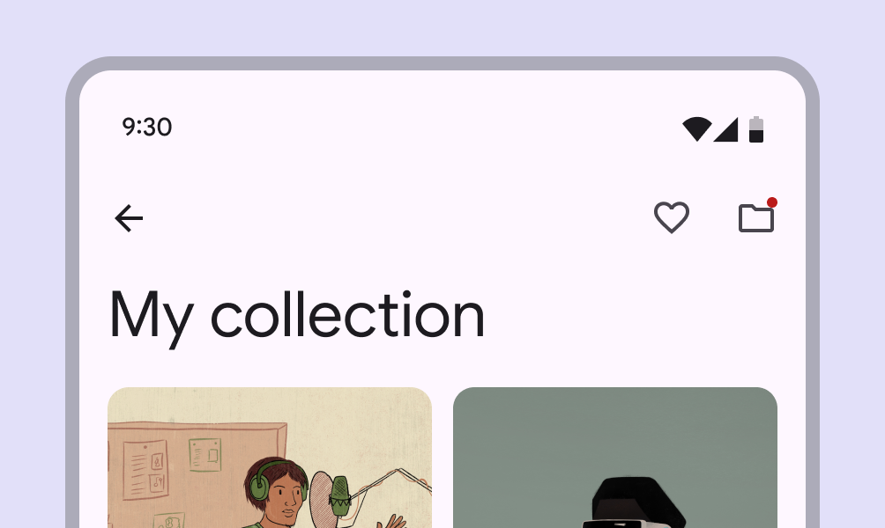

exclamation Caution

Use a small badge when spaces are tightly constrained, such as app bars. Small badges won’t run into the edge of the screen.

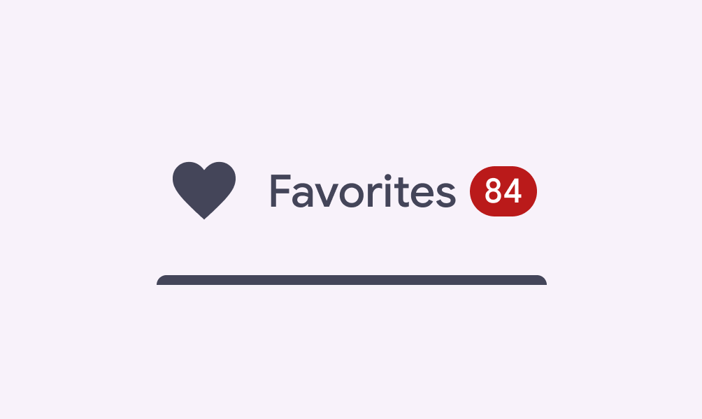

check Do

When an icon with a badge is followed by text or another element, place a large badge at the trailing edge

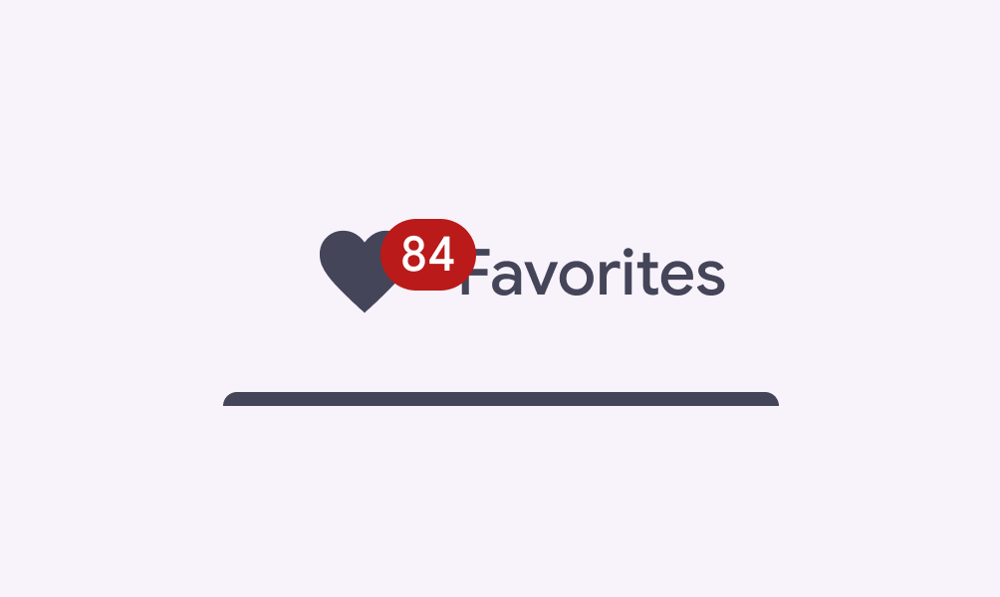

close Don’t

Avoid using a large badge when it might overlap with a trailing element. Either place it at the trailing edge or use a small badge instead.

