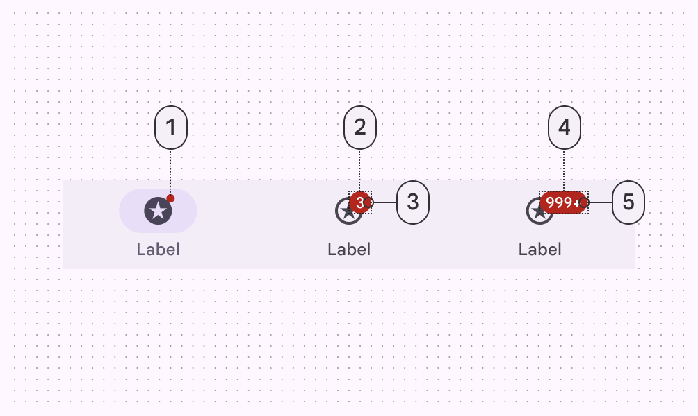
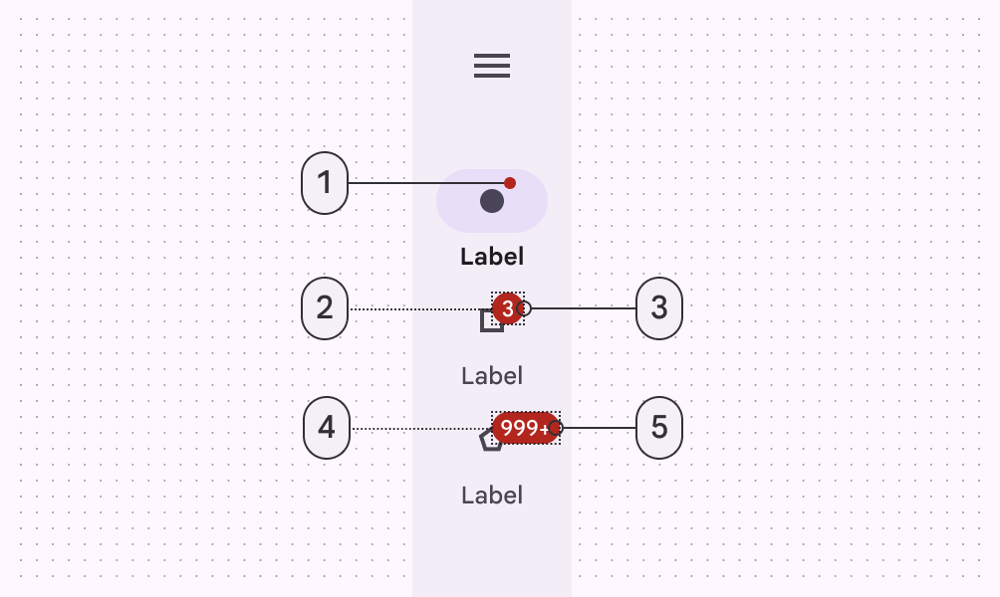
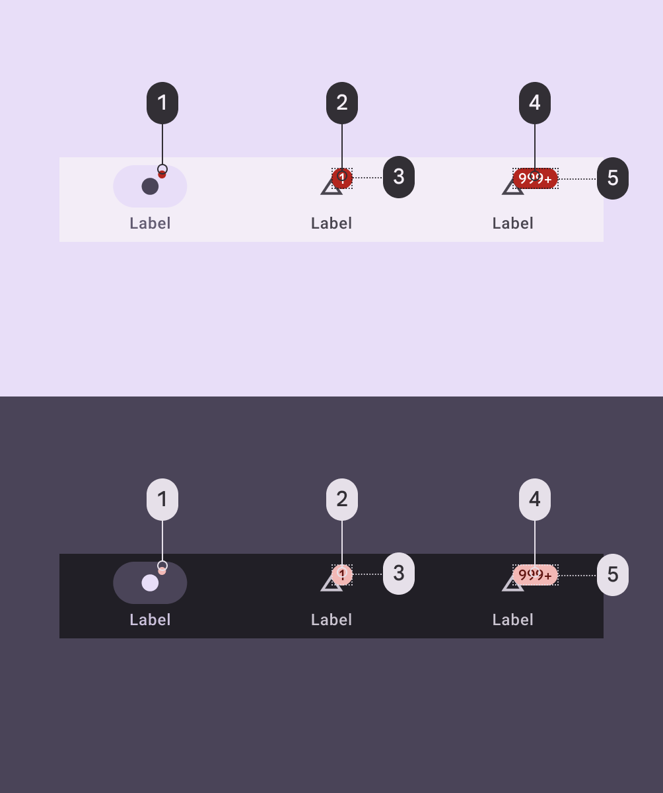
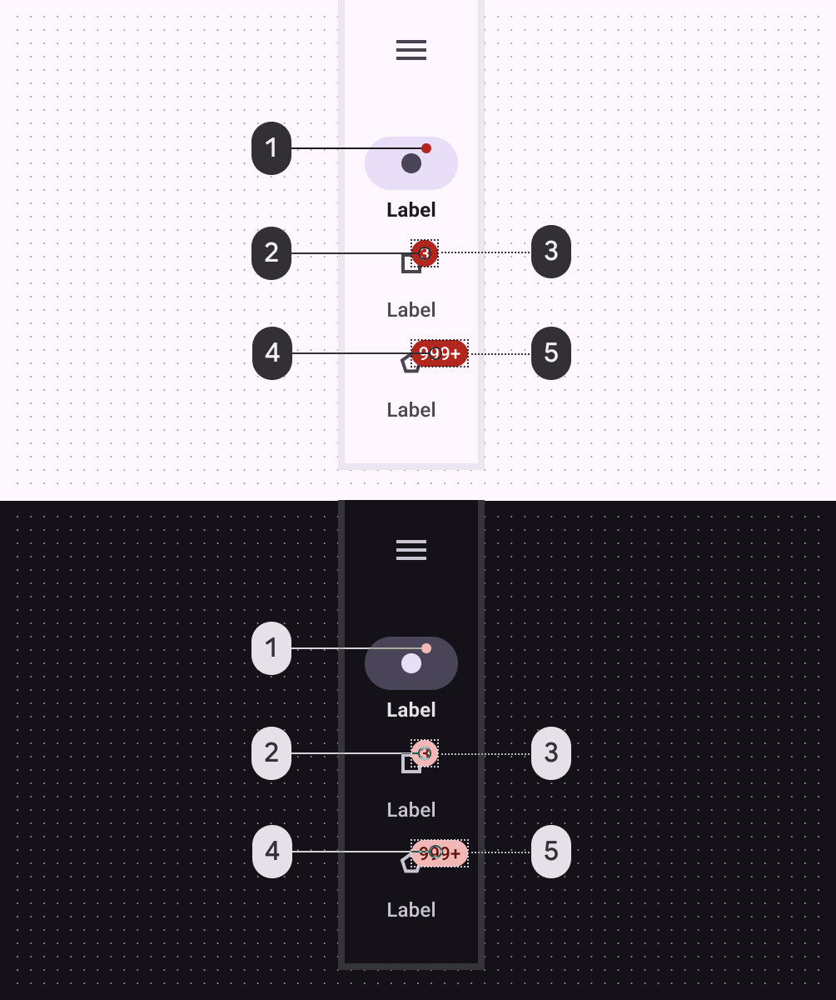
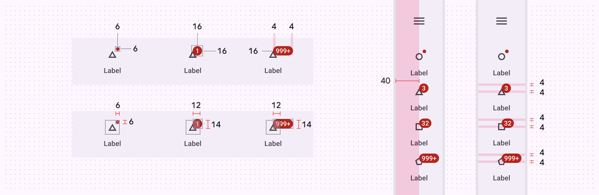
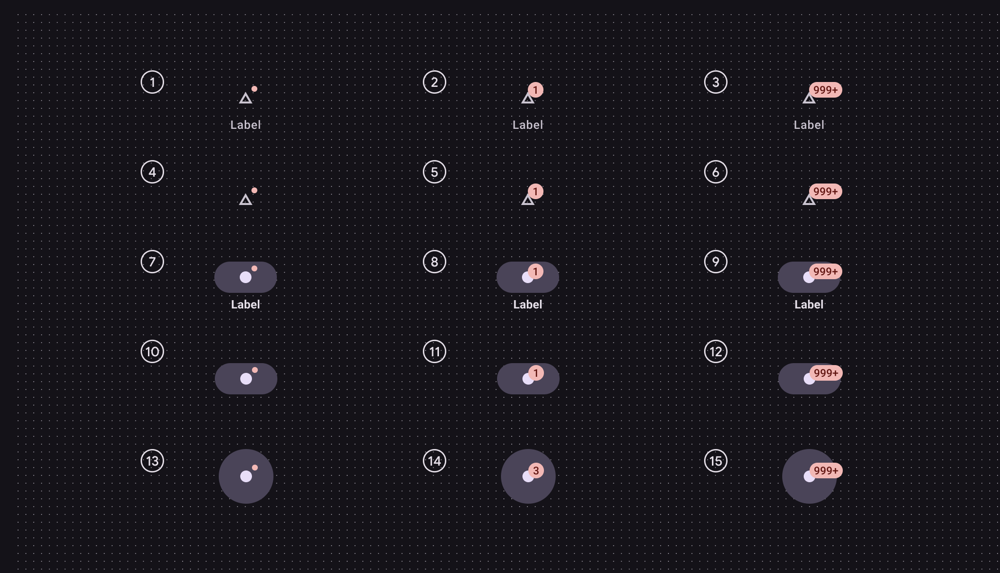

# Badges

Badges show notifications, counts, or status information on navigation items and icons

Navigation bar

1. Small badge
2. Large badge container
3. Large badge label
4. Large badge maximum character count container
5. Large badge maximum character count label

Navigation rail

1. Small badge
2. Large badge container
3. Large badge label
4. Large badge maximum character count container
5. Large badge maximum character count label

## Tokens & specs

Browse the component elements, attributes, tokens, and their values. Badges

Token

Default, Light

Enabled

## Color

Color values are implemented through design tokens [More on tokens](/m3/pages/design-tokens/overview). For design, this means working with color values that correspond with tokens. For implementation, a color value will be a token that references a value. [Learn more about design tokens](/m3/pages/design-tokens/overview)

Badge color roles used for light and dark schemes in navigation bar:

1. Error
2. Error
3. On error
4. On error
5. Error

Badge color roles used for light and dark schemes in navigation rail:

1. Error
2. On error
3. Error
4. On error
5. Error

## Measurements

Badge padding and size measurements

|
Attribute

 |

Value

 |
| --- | --- |
|

Small badge shape

 |

3dp corner radius

 |
|

Small badge size (HxW)

 |

6dp

 |
|

Large badge shape

 |

8dp corner radius

 |
|

Large badge one digit size (HxW)

 |

16dp

 |
|

Large badge max character count size (HxW)

 |

16x34dp

 |
|

Small badge: distance from top trailing icon corner to bottom leading badge corner (HxW)

 |

6x6dp

 |
|

Large badge: distance from top trailing icon corner to bottom leading badge corner (HxW)

 |

14x12dp

 |
|

Large badge padding between badge and text container

 |

4dp

 |

## Configuration

Different badges are shown on navigation destinations in various states. [More on states](/m3/pages/interaction-states/overview)

1. Inactive with label - small badge
2. Inactive with label - large badge
3. Inactive with label - large badge max character count
4. Inactive - small badge
5. Inactive - large badge
6. Inactive - large badge max character count
7. Active with label - small badge
8. Active with label - large badge
9. Active with label - large badge max character count
10. Active nav bar no label - small badge
11. Active nav bar no label - large badge
12. Active nav bar no label - large badge max character count
13. Active nav rail no label - small badge
14. Active nav rail no label - large badge
15. Active nav rail no label - large badge max character count

