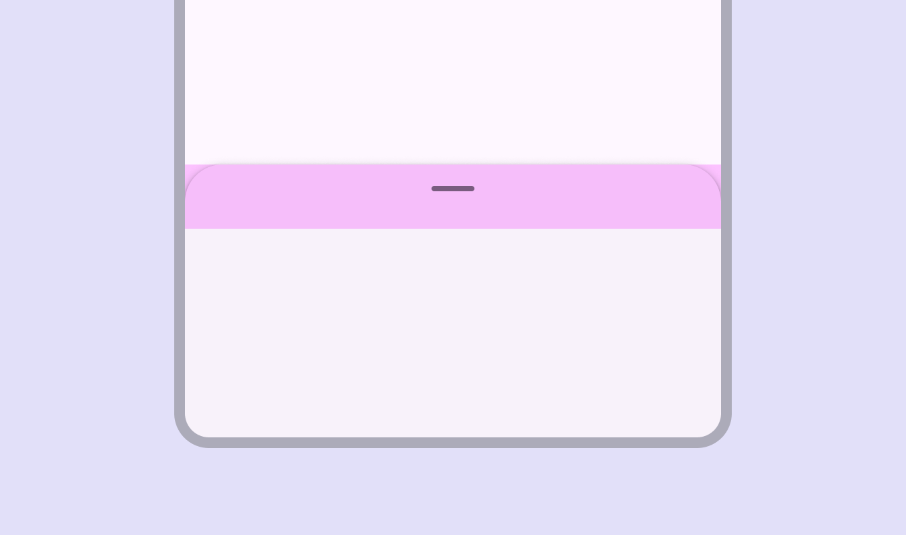
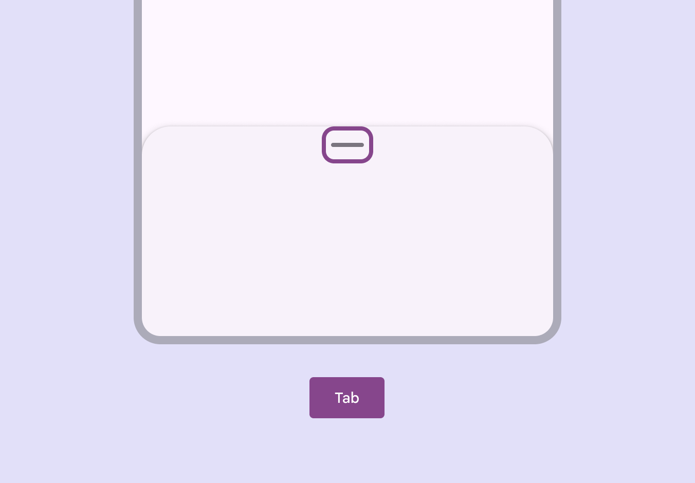
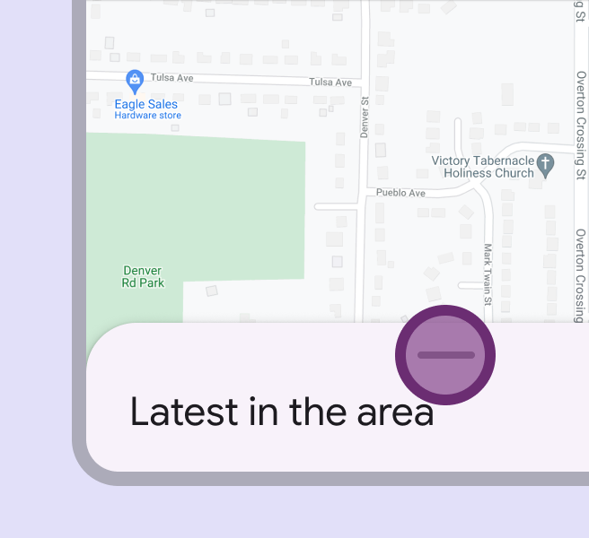
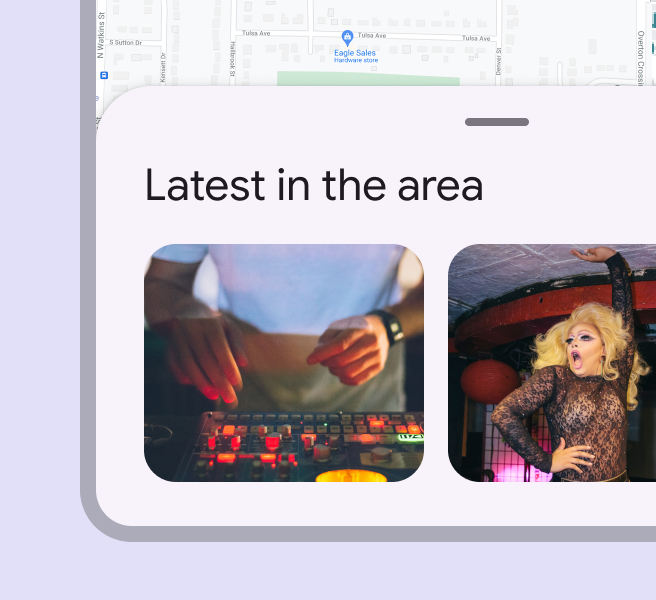
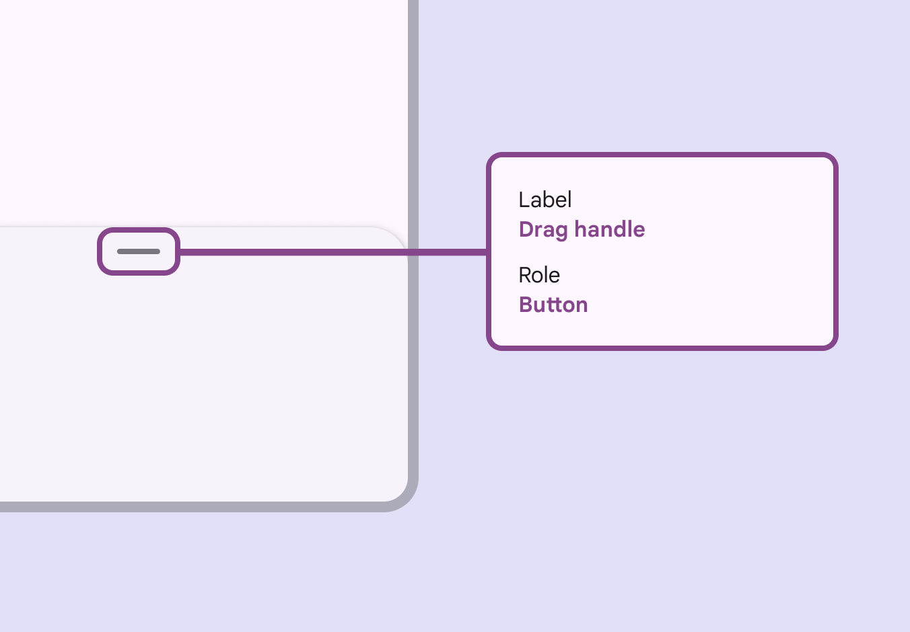

# Bottom sheets

Bottom sheets show secondary content anchored to the bottom of the screen

## Use cases

Users should be able to:

- Resize bottom sheets without having to rely on touch gestures

## Interaction & style

### Touch target area

The top 48dp portion of the bottom sheet is interactive when user-initiated resizing is available and the drag handle is present.

To ensure touch target accessibility, the top portion of a bottom sheet can be reserved for resize interactions

### Initial focus

The optional drag handle can be focused [More on focused state](/m3/pages/interaction-states/applying-states#bc6d6853-48ef-490e-8076-448e89e69f0f) in the tab order and interacted with using non-touch inputs , such as keyboard or switch [More on switches](/m3/pages/switch/overview) controls.

Visible focus shown on the drag handle affordance

### Dragging

Include a single-pointer alternative for any action that can be completed by dragging. Drag handles should cycle the bottom sheet through available heights when selected. If a drag handle can’t be used, add a button to do this action.

Interacting with the drag handle can quickly move a bottom sheet through preset heights

A bottom sheet can automatically resize to another height after interacting with the drag handle

## Keyboard navigation

|
Keys

 |

Actions

 |
| --- | --- |
| Tab | Focus lands on drag handle |
| Space / Enter | Toggles between available heights |

## Labeling

Label only the drag handle. The accessibility [More on accessibility](/m3/pages/overview) role for the drag handle is “button.”

Label the drag handle

