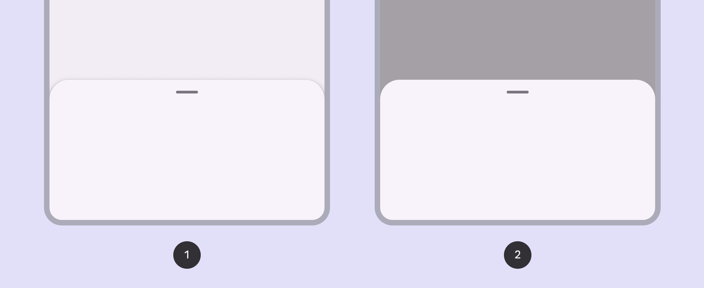
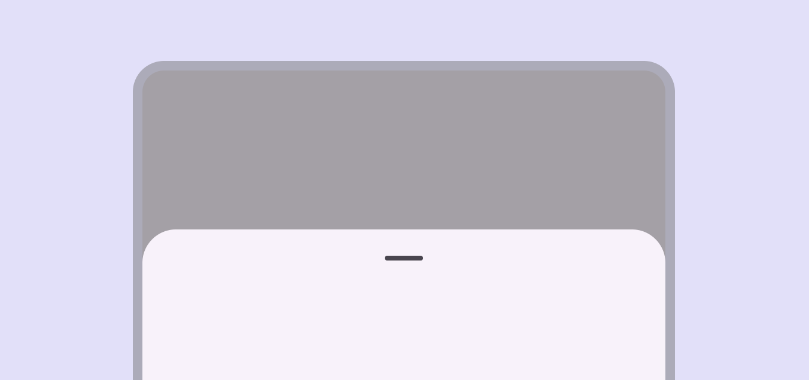

# Bottom sheets

Bottom sheets show secondary content anchored to the bottom of the screen

- Use bottom sheets in compact [More on compact window size class](/m3/pages/breakpoints/compact) and medium window sizes [More on medium window size class](/m3/pages/breakpoints/medium)
- Two variants: standard and modal
- Content should be additional or secondary (not the app’s main content)
- Bottom sheets can be dismissed in order to interact with the main content

1. Standard bottom sheet
2. Modal bottom sheet

## Availability & resources

| Type | Resource | Status |
| --- | --- | --- |
| Design | [Design Kit (Figma)](https://www.figma.com/community/file/1035203688168086460) | Available |
| Implementation |  | Available |
| Implementation |  | Available |
| Implementation | [Jetpack Compose](https://developer.android.com/develop/ui/compose/components/bottom-sheets) | Available |

## Differences from M2

- Color: New color mappings and compatibility with dynamic color [More on dynamic color](/m3/pages/dynamic/choosing-a-source)
- Shape: Bottom sheets have a 28dp top corner radius
- Layout: New max-width of 640dp and an optional drag handle with an accessible 48dp hit target

