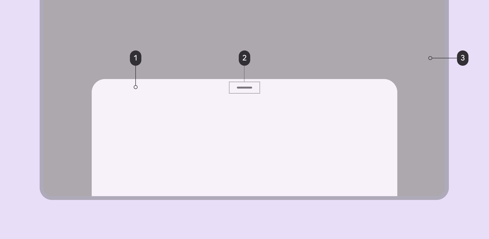
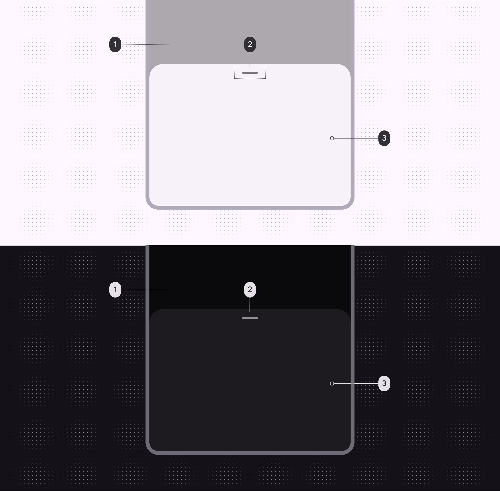
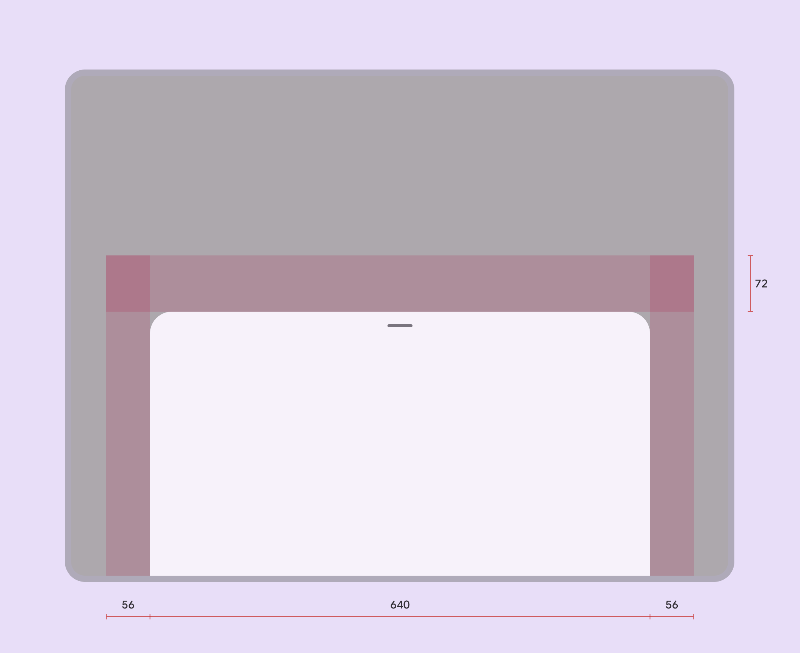

# Bottom sheets

Bottom sheets show secondary content anchored to the bottom of the screen

Modal bottom sheets are above a scrim while standard bottom sheets don't have a scrim. Besides this, both variants of bottom sheets have the same specs.



1. Container
2. Drag handle (optional)
3. Scrim

## Tokens and specs

Browse the component elements, attributes, tokens, and their values. [Learn more about design tokens](/m3/pages/design-tokens/overview)

```
Sheets - Bottom
```

```
Sheets - Bottom
```

```
Sheets - Bottom
```

```
Sheets - Bottom
```

Sheets - Bottom

Token

Default, Light

Enabled

## Color

Color values are implemented through design tokens [More on tokens](/m3/pages/design-tokens/overview). For design, this means working with color values that correspond with tokens. For implementation, a color value will be a token that references a value. [Learn more about design tokens](/m3/pages/design-tokens/overview)



Bottom sheet color roles used for both light and dark schemes:

1. Scrim\*
2. On surface variant
3. Surface container low

\*On Android platforms, the scrim color and opacity is automatically handled by the system UI.

## Measurements



Bottom sheet padding and size measurements

Bottom sheets span the full window width up to 640dp. When the window width exceeds 640dp, bottom sheets adjust to have a top margin of 56dp and side margins of 56dp. 

| Attribute | Value |
| --- | --- |
|
Drag handle alignment (horizontal)

 |

Center

 |
|

Drag handle padding top/bottom

 |

22dp

 |
|

Top margin

 |

72dp

 |
| Top margin (window width > 640dp) | 56dp |
|

Start/end margin (window width > 640dp)

 |

56dp

 |
|

Width

 |

Full width, up to max-width 640dp

 |
| Height | Variable |

