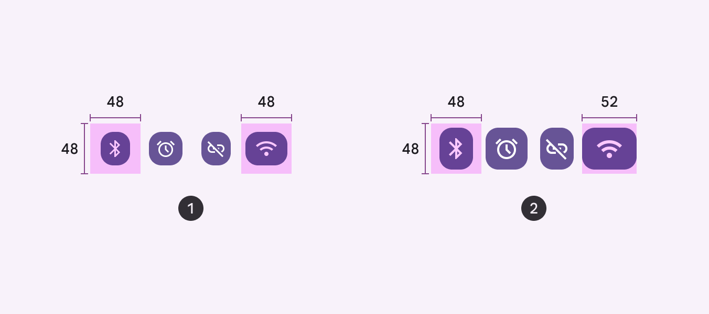
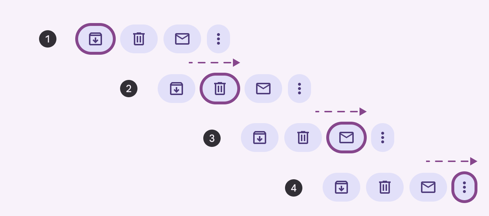
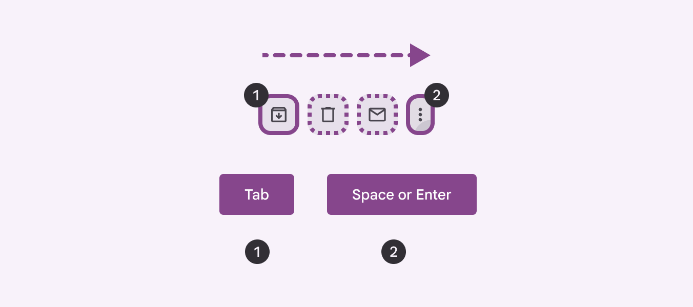
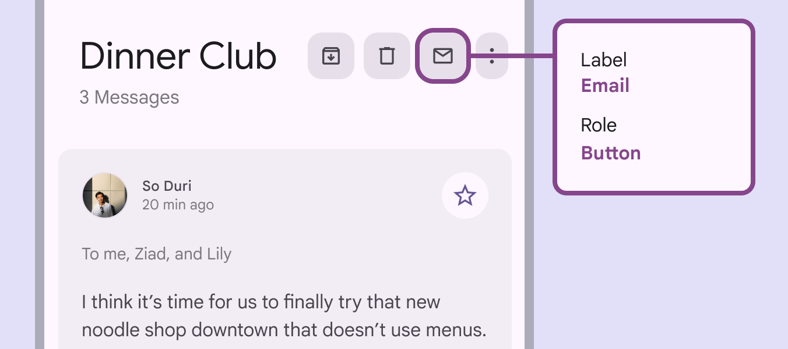

# Button groups

Button groups organize buttons and add interactions between them

## Use cases

People should be able to do the following with assistive technology:

- Navigate to and interact with each button in the group
- Identify when buttons are selected

## Interaction & style

Each button in a group should have a minimum 48x48dp target. Extra small and small button groups have larger inner padding to ensure accessible targets. Avoid reducing the padding in these sizes.

1. Extra small button group
2. Small button group

### Initial focus

The button group container is not a focusable element. Initial focus should land on the first button in the group and then move to each button.

Initial focus should land on the first button, not on the container

Use **Tab** to navigate through each item in the group, and **Space** or **Enter** to select buttons.

1. Initial focus
2. Selected button

## Keyboard navigation

|
Keys

 |

Actions

 |
| --- | --- |
| Tab | Navigates to the next button |
| Space or Enter | Activates the focused button |

## Labeling elements

The button group container does not need to be labeled. Label each button according to the button [More on buttons](/m3/pages/common-buttons/overview) and icon button [More on icon buttons](/m3/pages/icon-buttons/overview) accessibility guidance.

Label each button within the button group

