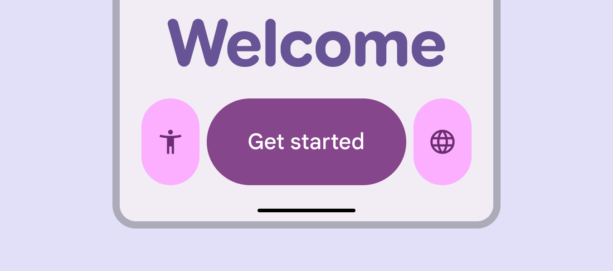
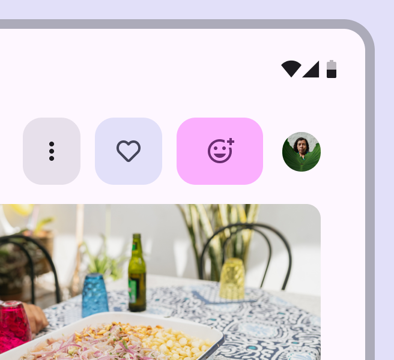
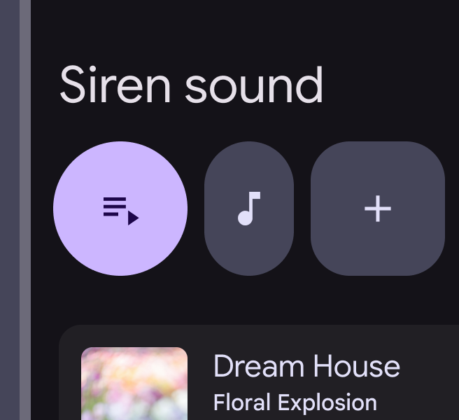
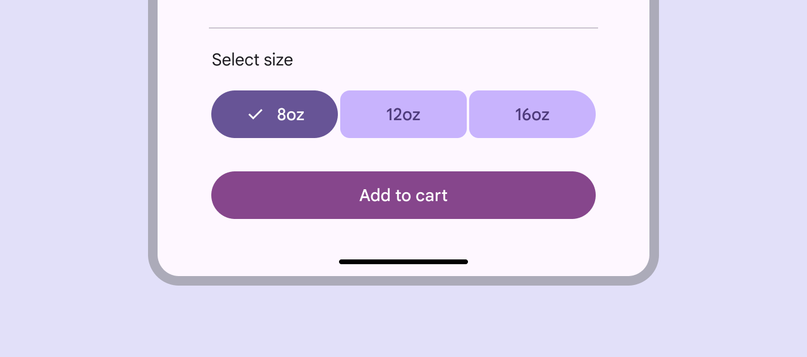
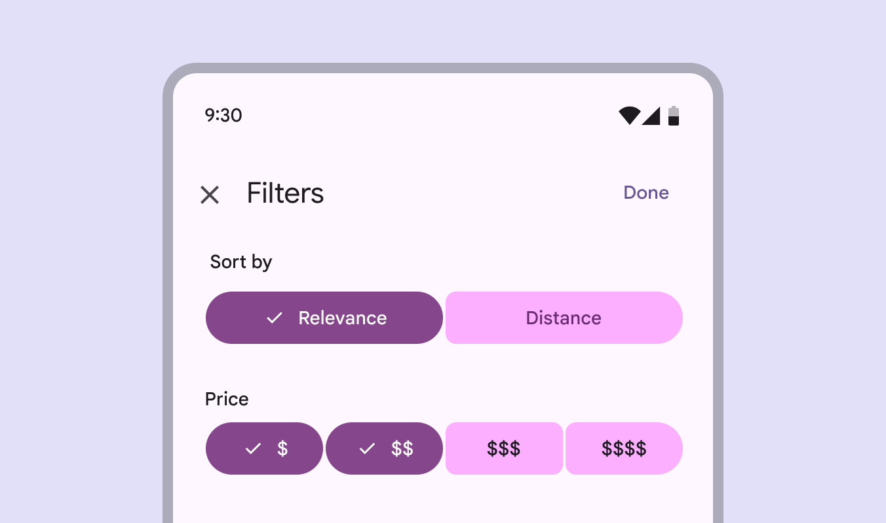
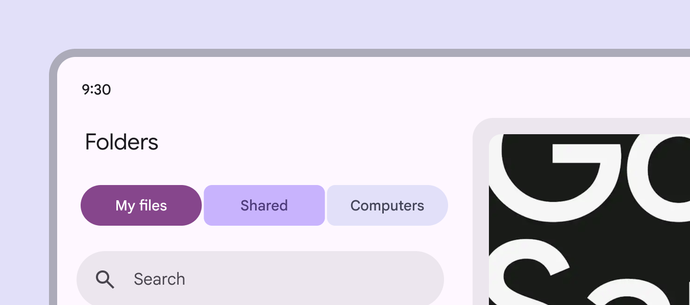
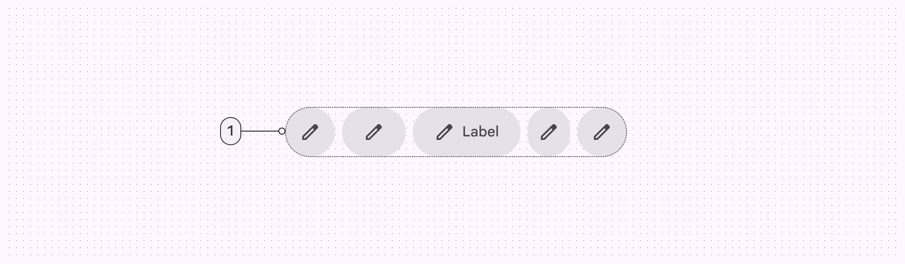
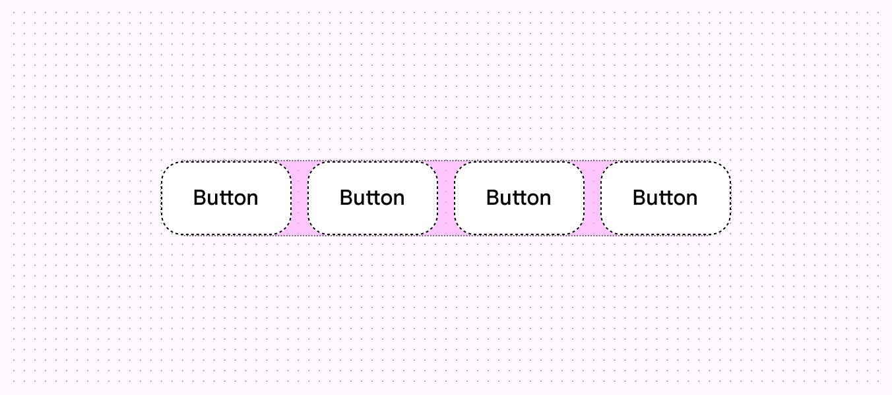
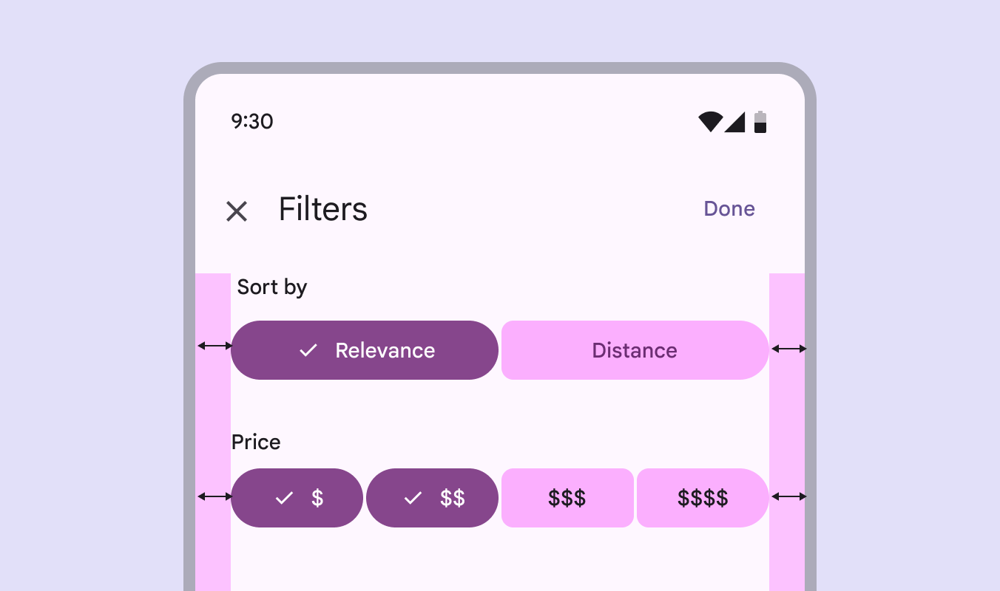
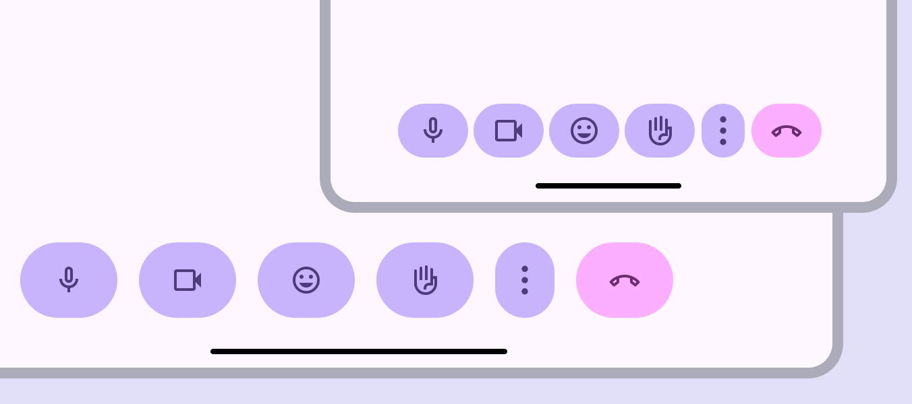

# Button groups

Button groups organize buttons and add interactions between them

Standard button groups add interaction between adjacent buttons

## Usage

There are two variants of button groups: **standard** and **connected**. 

**Standard button groups** add interaction between adjacent buttons so they respond to each other. When a button in a standard group is selected:

- The selected button changes shape and width
- A selected toggle button also changes color
- Adjacent buttons move and temporarily change width

Button groups add more expression to a product

Mix and match the different button variants, widths, and colors to emphasize what’s important, and to visually group related buttons. By default, all buttons in a standard group should be the same size (XS to XL) and shape (round or square).

- Only use multiple sizes in a group for hero moments
- Avoid mixing sizes frequently
- Only use a different shape in a group when a button is selected, or to add meaning or contrast

check Do

Use the same shapes for buttons in a group, but change other properties like width and color

exclamation Caution

Reserve shape differences in button groups for key interactions

**Connected button groups** help people select options, switch views, or sort elements in a page. They behave similarly to standard groups, except they don’t affect adjacent buttons. Connected groups should replace the baseline segmented button [More on segmented buttons](/m3/pages/segmented-buttons/overview), which is no longer recommended. Connected button groups can be used to toggle between similar actions

Use connected button groups when the button content is related, and buttons can be selected.

Closely related actions work well in a connected button group

Connected button groups should be used for single or multi-select patterns that use toggle buttons. Avoid using a connected group when none of the buttons can be toggled.

Use the connected button group with single or multi-select patterns

### Color

Avoid mixing color styles in connected button groups; it can make selection and emphasis unclear.

close Don’t

Don’t mix color styles in connected button groups

## Anatomy

1. Container

### Container

The standard button group container has padding between buttons so they can animate width and shape without disrupting the product layout. The standard button group hugs the width of the buttons inside.

Button groups can animate without affecting their surroundings

The connected button group should span the width of the page or surface it’s placed on, increasing the button widths inside. In larger windows, consider adding a maximum width to the connected group to avoid it growing too wide.

Connected button groups increase the widths of each button inside and expand to their container width

## Adaptive design

Adaptive design allows an interface to respond or change based on context, such as the user, device, and usage. [More on adaptive design](/m3/pages/layout-overview/adaptive-design/)

### Resizing

Button groups should move through layouts together in a single line. They shouldn’t wrap to a second line. Multiple button groups can be stacked to keep items close together. However, button groups don’t interact vertically. Button groups and individual buttons can be set to **fixed** or **flexible** resizing:

- **Fixed**: Manually define the button width (narrow to wide), size (XS to XL), or padding at each window size.
- **Flexible**: Automatically increase or decrease the width of buttons and the button group. Button groups grow until all flexible buttons are at their largest width. If adjusting button width manually, avoid stretching icon buttons beyond the wide setting.

Buttons can have width, size, and padding manually adjusted to fit different window sizes

In compact windows [More on compact window size class](/m3/pages/breakpoints/compact), consider using smaller, narrower buttons so all buttons in the button group can fit. In large [More on large window size class](/m3/pages/breakpoints/large-extra-large) and extra large [More on extra-large window size class](/m3/pages/breakpoints/large-extra-large) windows, consider using larger, wider buttons to better fill in the available space. Flexible buttons or button groups will automatically adjust width. Set the size, shape, and padding to manually adjust the button group at different window sizes

When scaling to larger window sizes, make sure that the visual hierarchy of each button is preserved using qualities like color and size. For example, the primary action should remain the largest, widest, or most visually prominent button at all window sizes. Maintain hierarchy across layouts and devices

### Presentation

Buttons at the trailing edge of the button group can be customized to collapse into an overflow menu at smaller window sizes, and become visible again at larger sizes. Place the overflow menu at the trailing end of the group. Buttons outside the group aren’t affected by button group behavior. Buttons should become hidden in an overflow menu or visible again, depending on screen size. Buttons outside the button group, like the **end call** button, will not be affected.

## Behavior

### Pressed

When a button is pressed, it changes width and shape. In a standard button group, pressing a button also affects the width of adjacent buttons. In a connected button group, only the shape of the pressed button changes. Pressing buttons in a standard group changes the width of adjacent buttons

### Selected

A selected button should change shape from round to square, or square to round. Selected buttons should change shape

