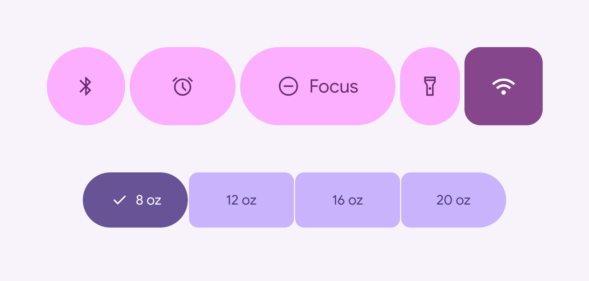
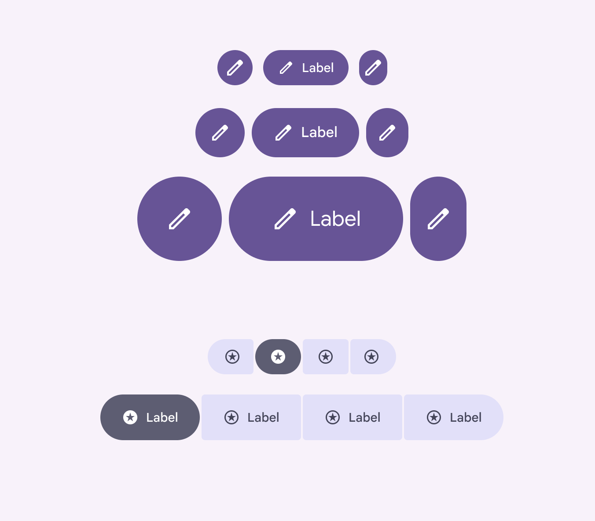

# Button groups

Button groups organize buttons and add interactions between them

- Two variants: **standard** and **connected**
- Applies shape morph when pressed and selected
- Connected button groups replace the segmented button [More on segmented buttons](/m3/pages/segmented-buttons/overview)
- Works with all button sizes: XS, S, M, L, and XL
- Support for single-select, multi-select, and selection-required

Button groups can contain buttons and icon buttons

## Availability & resources

| Type | Resource | Status |
| --- | --- | --- |
| Design | [Design Kit (Figma)](https://www.figma.com/community/file/1035203688168086460) | Available |
| Implementation | [Jetpack Compose: Expressive](https://developer.android.com/reference/kotlin/androidx/compose/material3/package-summary#ButtonGroup\(androidx.compose.ui.Modifier,kotlin.Float,androidx.compose.foundation.layout.Arrangement.Horizontal,kotlin.Function1\)) | Available |
| Implementation |  | Available |

## M3 Expressive update

Button groups apply shape, motion, and width changes to buttons [More on buttons](/m3/pages/common-buttons/overview) and icon buttons [More on icon buttons](/m3/pages/icon-buttons/overview) to make them more interactive. [More on M3 Expressive](https://m3.material.io/blog/building-with-m3-expressive)

**May 2025**

New component added to catalog. Variants and naming:

- Added standard button group
- Added connected button group

    - Use instead of segmented button [More on segmented buttons](/m3/pages/segmented-buttons/overview), which is no longer recommended

Configurations:

- Works with all button sizes: XS, S, M, L, and XL
- Applies default shape to all buttons: round or square

Button groups are containers that hold buttons of many shapes and sizes

