# Button groups

Button groups organize buttons and add interactions between them

## Variants

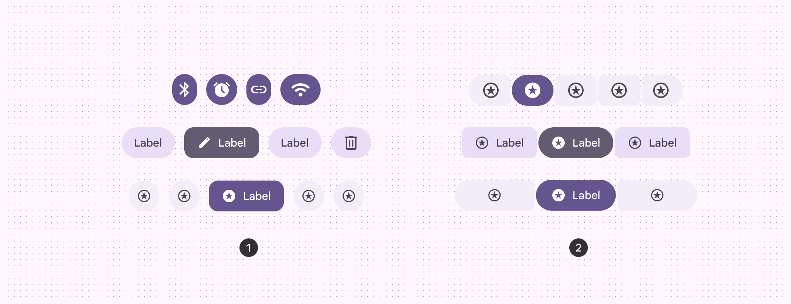

1. Standard button group
2. Connected button group

|
Variant

 |

M3  

 |

M3 Expressive

 |
| --- | --- | --- |
|

Standard button group

 |

\--

 |

Available

 |
|

Connected button group

 |

Available as segmented button [More on segmented buttons](/m3/pages/segmented-buttons/overview)

 |

Available

 |

## Configurations

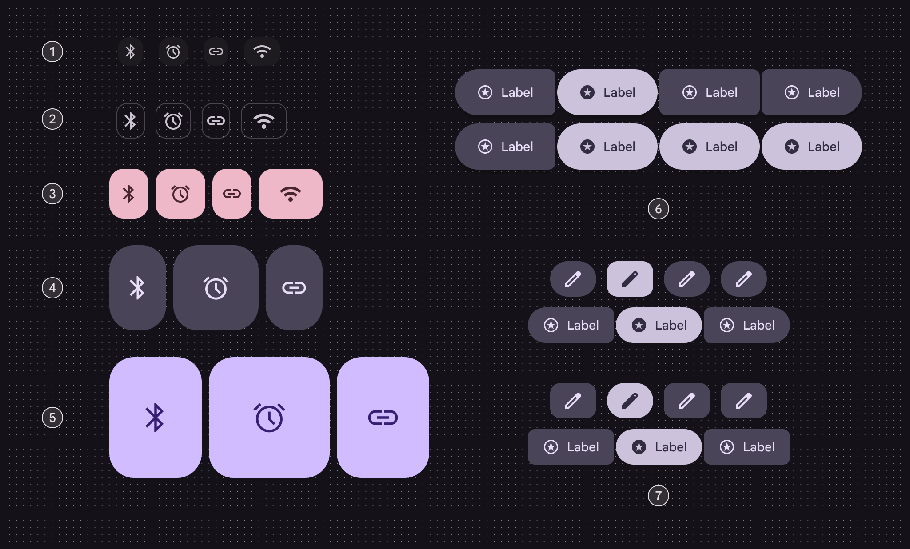

Configurations for both variants of button groups:

1. Extra small
2. Small
3. Medium
4. Large
5. Extra large
6. Single-select and multi-select
7. Round and square

|
Category

 |

Configuration

 |

M3

 |

M3 Expressive

 |
| --- | --- | --- | --- |
|

Size

 |

XS, S, M, L, XL

 |

\--

 |

Available

 |
|

Default shape

 |

Round, square

 |

\--

 |

Available

 |
|

Selection

 |

Single-select, multi-select, selection-required

 |

Available as segmented button [More on segmented buttons](/m3/pages/segmented-buttons/overview)

 |

Available

 |

## Tokens & specs

Standard and connected button group tokens are organized by size. Select the variant and size from the token set menu. Go to the [button](/m3/pages/common-buttons/specs/) and [icon button](/m3/pages/icon-buttons/specs/) pages to view their tokens. [Learn about design tokens](/m3/pages/design-tokens/overview/)

```
Button group standard - Size - XsmallTokenValueButton group xsmall container heightmd.comp.button-group.standard.xsmall.container.height32dpButton group xsmall between spacemd.comp.button-group.standard.xsmall.between-space18dpPressed
```

```
Button group standard - Size - XsmallTokenValueButton group xsmall container heightmd.comp.button-group.standard.xsmall.container.height32dpButton group xsmall between spacemd.comp.button-group.standard.xsmall.between-space18dpPressed
```

```
Button group standard - Size - XsmallTokenValueButton group xsmall container heightmd.comp.button-group.standard.xsmall.container.height32dpButton group xsmall between spacemd.comp.button-group.standard.xsmall.between-space18dpPressed
```

```
Button group standard - Size - Xsmall
```

```
Button group standard - Size - Xsmall
```

```
Button group standard - Size - Xsmall
```

```
Button group standard - Size - Xsmall
```

Button group standard - Size - Xsmall

Token

Value

Button group xsmall container height

md.comp.button-group.standard.xsmall.container.height

32dp

Button group xsmall between space

md.comp.button-group.standard.xsmall.between-space

18dp

Pressed

## Anatomy

Button groups are invisible containers that add padding between buttons and modify button shape. They don’t contain any buttons by default.

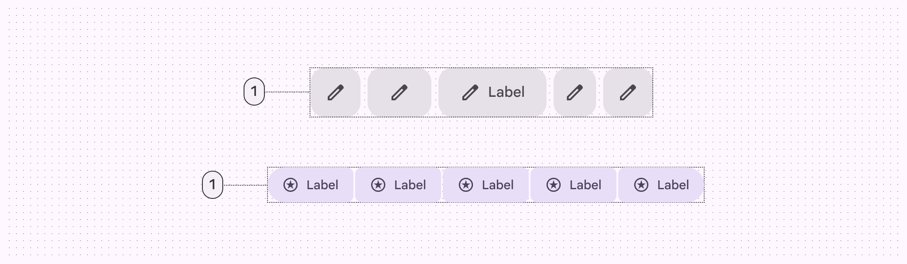

1. Container

### Common layouts

Mix and match buttons and icon buttons for different scenarios.

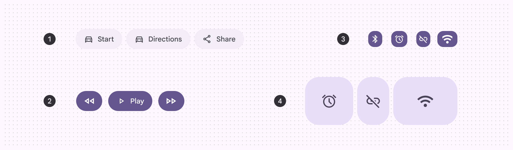

1. Label buttons
2. Label buttons and icon buttons
3. Extra small icon buttons
4. Large icon buttons

### Color

Button groups have no color properties. They can use the default button or toggle button color styles, like filled, tonal, and outlined. Avoid using standard icon buttons or text buttons, as they have no container treatment.

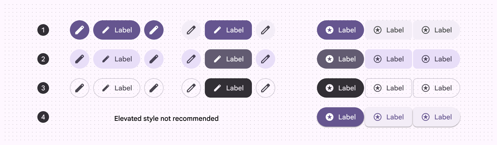

1. Filled
2. Tonal
3. Outlined
4. Elevated

## Selection & activation

**Standard button groups** add interaction between adjacent buttons when a button is selected or activated. This interaction changes the width, shape, and padding of the selected or activated button, which adjusts the width of buttons directly next to it. A selected button changes shape, and briefly changes the width of itself and adjacent buttons

**Connected button groups** don’t add any interaction between buttons when selected or activated. They only affect the shape of the button being selected or activated. A selected button changes shape without affecting adjacent buttons

## States

### Standard button group

When a button is pressed, standard button groups modify the width and shape of that button and adjacent buttons.

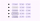

1. Enabled
2. Disabled
3. Hovered
4. Focused
5. Pressed

When a toggle button is selected in a standard button group, its shape should change between square and round. The color should change according to the [button specs](/m3/pages/common-buttons/specs).

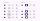

1. Enabled
2. Disabled
3. Hovered
4. Focused
5. Pressed

### Connected button group

Connected button groups have different shape changes than standard button groups. Selecting a button does not affect adjacent buttons.

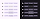

Connected button group unselected states:

1. Enabled
2. Disabled
3. Hovered
4. Focused
5. Pressed


Connected button group selected states:

1. Enabled
2. Hovered
3. Focused
4. Pressed

## Measurements

### Standard button group

Standard groups apply padding between all buttons. The amount of padding changes based on button size to ensure a minimum accessible target size of 48dp. More details on padding: [Button specs](/m3/pages/common-buttons/specs), [icon button specs](/m3/pages/icon-buttons/specs)

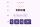

Standard button group inner padding:

1. XS: 18dp
2. S: 12dp
3. M: 8dp
4. L: 8dp
5. XL: 8dp

### Connected button group

For all connected button groups, use 2dp padding. This provides visual consistency at scale. 

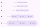

Round connected button group inner padding is 2dp at every size. The outer shape is fully round, and the inner shape remains square with the following corner sizes:

1. XS: 4dp
2. S: 8dp
3. M: 8dp
4. L: 16dp
5. XL: 20dp

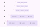

Square connected button group inner padding is 2dp at every size. The outer shape has the following corner sizes:

1. XS: 4dp
2. S: 8dp
3. M: 8dp
4. L: 16dp
5. XL: 20dp

### Minimum widths

Extra small and small connected button groups have 48dp target areas and a minimum width of 48dp.


1. Extra small
2. Small

## Density

Button groups adapt to density of the buttons inside. [More on density](/m3/pages/grids-spacing/density)


Button groups adapt to the height of the buttons inside, including when density is applied

