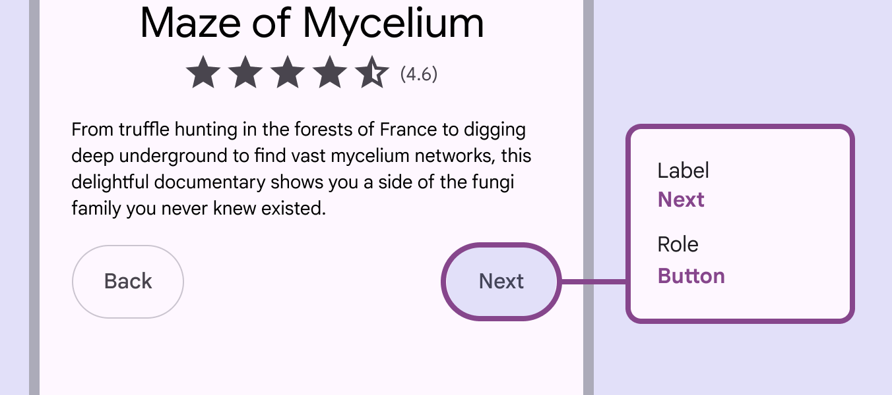

# Buttons

Buttons prompt most actions in a UI.

## Use cases

People should be able to do the following with assistive technology: 

- Use a button to perform an action
- Navigate to and activate a button

## Interaction & style

### Color contrast

Enabled buttons need a 3:1 contrast ratio with the background to meet accessibility best practices. This is measured from the container for elevated, filled, and tonal button styles, and the label text for outlined and text button styles.

Higher contrast helps differentiate elements

### 200% text size

Avoid excessive text wrapping or truncation by choosing concise strings. On Android, button labels should be kept concise enough to fit within two lines after the text size is increased to 200%. If a button label exceeds this limit and gets truncated, provide an alternative way to access the full content in a single tap.

exclamation Caution

Avoid excessive text wrapping or truncation by choosing concise strings

### Rapid clicks

On the web, you can use a modified motion curve to avoid resonant effects from overlapping animations. This provides a smoother experience for interactions where you anticipate multiple clicks or taps in succession. Use the modified motion curve if rapid click or pointer interactions are expected

## Keyboard navigation

| Keys | Actions |
| --- | --- |
| Tab | Navigate to a button |
| Space or Enter | Activate a button |

## Labeling elements

The accessibility label for a button should match the visible label text on the button such as **Done**, **Send**, or **Reply**. It can contain extra contextual information if necessary.

