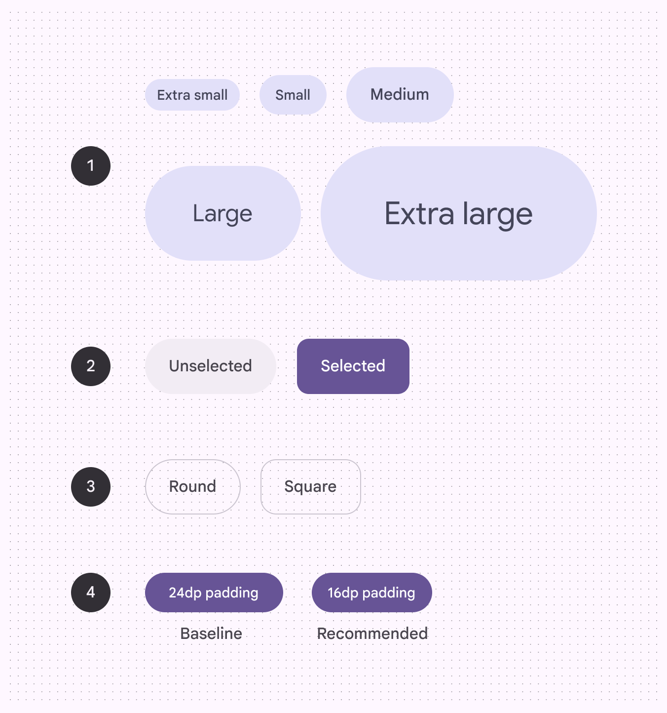
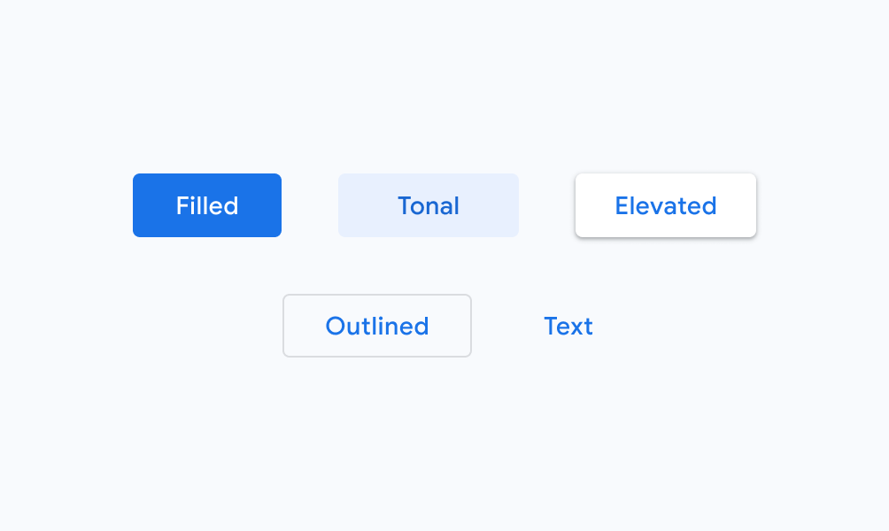
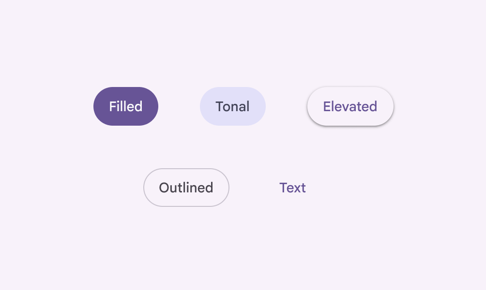

# Buttons

Buttons prompt most actions in a UI.

- Two variants: default and toggle
- Can contain an optional leading icon
- Five color options: elevated, filled, tonal, outlined, and text
- Five size recommendations: extra small, small, medium, large, and extra large
- Two shape options: round and square
- Keep labels concise and use sentence case

1. Elevated button
2. Filled button
3. Filled tonal button
4. Outlined button
5. Text button

## Availability & resources

| Type | Resource | Status |
| --- | --- | --- |
| Design | [Design Kit (Figma)](https://www.figma.com/community/file/1035203688168086460) | Available |
| Implementation |  | Available |
| Implementation | [Jetpack Compose](https://developer.android.com/develop/ui/compose/components/button) | Available |
| Implementation | [Jetpack Compose: Expressive](https://developer.android.com/reference/kotlin/androidx/compose/material3/package-summary#Button\(kotlin.Function0,androidx.compose.ui.Modifier,kotlin.Boolean,androidx.compose.ui.graphics.Shape,androidx.compose.material3.ButtonColors,androidx.compose.material3.ButtonElevation,androidx.compose.foundation.BorderStroke,androidx.compose.foundation.layout.PaddingValues,androidx.compose.foundation.interaction.MutableInteractionSource,kotlin.Function1\)) | Available |
| Implementation |  | Available |
| Implementation |  | Available |
| Implementation |  | Available |

## M3 Expressive update

**May 2025**

Buttons now have a wider variety of shapes and sizes, toggle functionality, and can change shape when selected. [More on M3 Expressive](https://m3.material.io/blog/building-with-m3-expressive)

Variants and naming:

- Default and toggle (selection)
- Color styles are now configurations (elevated, filled, tonal, outlined, text)

Shapes: 

- Round and square
- Shape morphs when pressed
- Shape morphs when selected

Sizes:

- Extra small
- Small (existing, default)
- Medium
- Large
- Extra large

New padding for **small** buttons:

- 16dp (recommended to match padding of new sizes)
- 24dp (no longer recommended)

1. Five sizes
2. Toggle (selection)
3. Two shapes
4. Two small padding widths

## Differences from M2

- Color: New color mappings and compatibility with dynamic color. Icons and labels now share the same color. Neutral text button is no longer recommended.
- Icons: Standard size for leading and trailing icons is now 20dp
- Shape: Fully-rounded corner radius and additional height options

M2: Buttons have a height of 36dp and slightly rounded corner radius

M3: Default buttons are taller at 40dp and have fully rounded corners

