# Buttons

Buttons prompt most actions in a UI.

## Variants

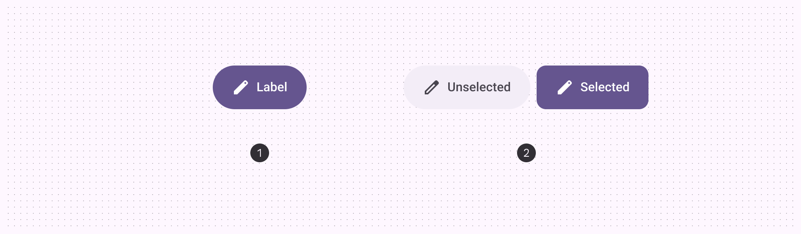

1. Default button
2. Toggle button

|
Variant

 |

M3

 |

M3 Expressive

 |
| --- | --- | --- |
|

Default

 |

Available

 |

Available

 |
|

Toggle (selection)

 |

\--

 |

Available

 |

## Configurations

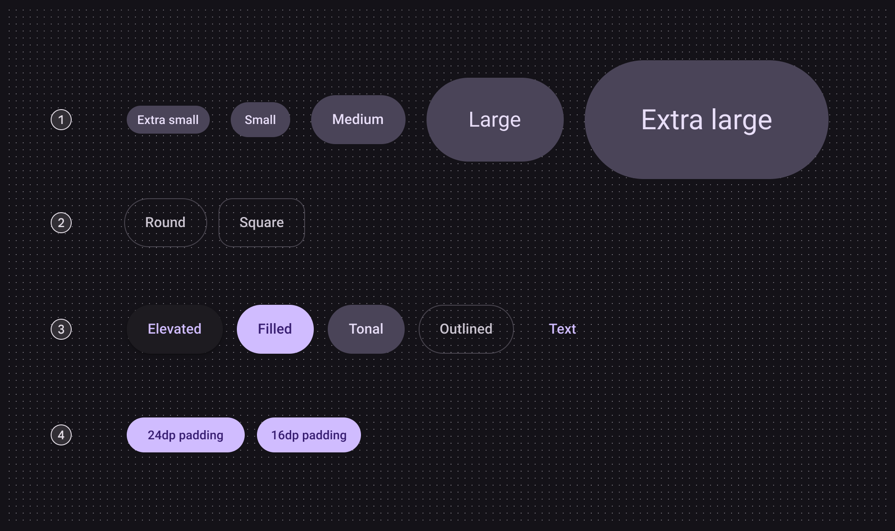

1. Size
2. Shape
3. Color
4. Small button padding

|
Category

 |

Configuration

 |

M3

 |

M3 Expressive

 |
| --- | --- | --- | --- |
|

Size

 |

Small (default)

 |

Available

 |

Available

 |
|

XS, M, L, XL

 |

\--

 |

Available

 |
|

Shape

 |

Round (default)

 |

Available

 |

Available

 |
|

Square

 |

\--

 |

Available

 |
|

Color

 |

Elevated, filled (default), tonal, outlined, text

 |

Available

 |

Available

 |
|

Small button padding

 |

24dp

 |

Available

 |

Not recommended. Use 16dp

 |
|

16dp

 |

\--

 |

Available

 |

## Tokens & specs

Use the table's menu to select a token set. Button token sets are separated into common tokens, color, and size. [View baseline tokens](/m3/pages/common-buttons/specs#c305d304-a6c0-466a-a48c-8d0718a29ae2)

```
Button - Color - Elevated
```

```
Button - Color - Elevated
```

```
Button - Color - Elevated
```

```
Button - Color - Elevated
```

Button - Color - Elevated

Token

Default, Light

Enabled

Disabled

Hovered

Focused

Pressed

## Anatomy

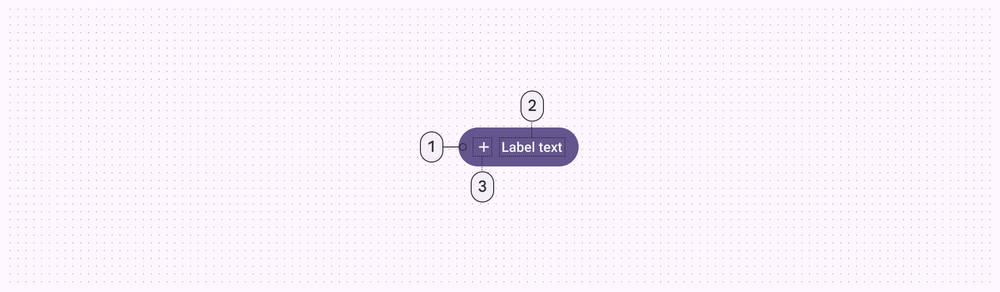

1. Container
2. Label text
3. Icon (optional)

## Color

Color values are implemented through design tokens [More on tokens](/m3/pages/design-tokens/overview). For designers, this means working with color values that correspond with tokens. In implementation, a color value will be a token that references a value.

- There are five built-in button color styles: elevated, filled, tonal, outlined, and text
- The default and toggle buttons use different colors
- Toggle buttons don’t use the text style

star

Note:

These color roles were chosen to create design coherence and familiarity. Other color roles can be used as long as the container and text have a 3:1 contrast ratio. For example, tertiary and on tertiary.

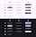

A. Elevated, B. Filled, C. Tonal, D. Outlined, E. Text

1. Default
2. Toggle: unselected
3. Toggle: selected

|
 |

1\. Default

 |

2\. Toggle unselected

 |

3\. Toggle selected

 |
| --- | --- | --- | --- |
|

Elevated container

Elevated icon & label

 |

Surface container low

Primary

 |

Surface container low

Primary

 |

Primary

On primary

 |
|

Filled container

Filled icon & label

 |

Primary
On primary

 |

Surface container

On surface variant

 |

Primary

On primary

 |
|

Tonal container

Tonal icon & label

 |

Secondary container

On secondary container

 |

Secondary container

On secondary container

 |

Secondary

On secondary

 |
|

Outlined container

Outlined icon & label

 |

Outline variant (outline)

On surface variant

 |

Outline variant (outline)

On surface variant

 |

Inverse surface

Inverse on surface

 |
|

Text icon & label

 |

Primary

 |

\--

 |

\--

 |

## States [More on states](/m3/pages/interaction-states/overview) are visual representations used to communicate the status of a component or interactive element.

### Elevated button states

The elevated button style has an elevation of 1 by default and 0 when disabled.

#### Default

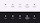

1. Enabled
2. Disabled
3. Hovered
4. Focused
5. Pressed

#### Toggle

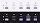

A. Unselected, B. Selected

1. Enabled
2. Disabled
3. Hovered
4. Focused
5. Pressed

### Filled button states

#### Default

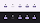

1. Enabled
2. Disabled
3. Hovered
4. Focused
5. Pressed

#### Toggle

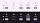

A. Unselected, B. Selected

1. Enabled
2. Disabled
3. Hovered
4. Focused
5. Pressed

### Tonal button states

#### Default

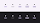

1. Enabled
2. Disabled
3. Hovered
4. Focused
5. Pressed

#### Toggle

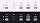

A. Unselected, B. Selected

1. Enabled
2. Disabled
3. Hovered
4. Focused
5. Pressed

### Outlined button states

The outlined button’s container fill is invisible at rest, but the opacity and state layers behave the same as other button styles when disabled, hovered, focused, or pressed.

#### Default

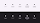

1. Enabled
2. Disabled
3. Hovered
4. Focused
5. Pressed

#### Toggle

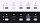

1. Enabled
2. Disabled
3. Hovered
4. Focused
5. Pressed

### Text button style states

The text button’s container is invisible at rest, but the opacity and state layers behave the same as other button styles when disabled, hovered, focused, or pressed. There is no toggle text button.

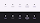

1. Enabled
2. Disabled
3. Hovered
4. Focused
5. Pressed

## Shape morph

### Pressed state

When pressed, buttons can morph to become more square. Both round and square buttons should have the same pressed shape. The corner radius value differs for each button size. [See full button corner measurements](/m3/pages/common-buttons/specs#b1f39738-6f3a-409b-8f08-4cab6d78d756)

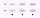

A. Round button, B. Square button

1. Enabled
2. Hovered
3. Pressed

### When selected

In addition to changing shape when pressed, toggle buttons also change the resting shape from round (unselected) to square (selected). If the resting unselected shape is square, the selected shape should be round.

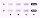

A. Round button, B. Square button

1. Enabled
2. Hovered
3. Pressed
4. Selected

## Measurements

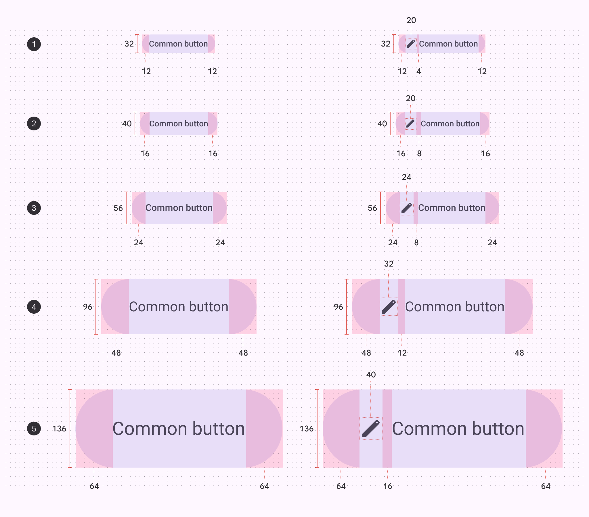

Padding and size measurements of each button size

1. Extra small
2. Small
3. Medium
4. Large
5. Extra large

### Target areas

Extra small and small icon buttons must have a target size of 48x48dp or larger to be accessible.

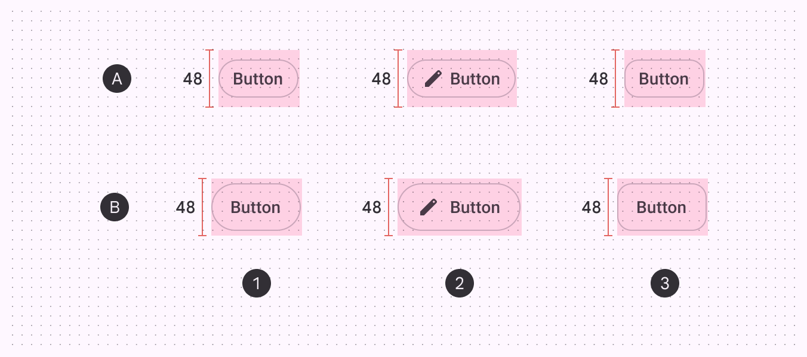

A. Extra small  B. Small

1. Round button
2. Button with icon
3. Square button

### Corner sizes

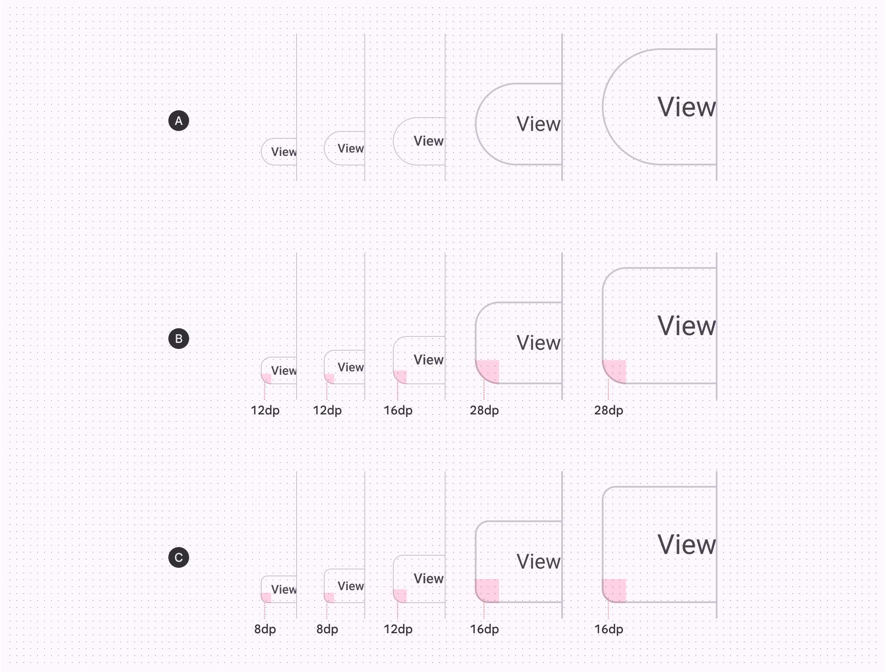

|
 | XS
 | S
 | M
 | L
 | XL
 |
| --- | --- | --- | --- | --- | --- |
| A. Round button | Full | Full | Full | Full | Full |
| B. Square button | 12dp | 12dp | 16dp | 28dp | 28dp |
| C. Pressed state | 8dp | 8dp | 12dp | 16dp | 16dp |

## Baseline tokens

Use the table's menu to switch token sets. The baseline button token sets are organized by color. 

\[Deprecated\] Button - Elevated

Token

Default, Light

\[Deprecated\] Enabled

\[Deprecated\] Disabled

\[Deprecated\] Hovered

\[Deprecated\] Focused

\[Deprecated\] Pressed (ripple)

