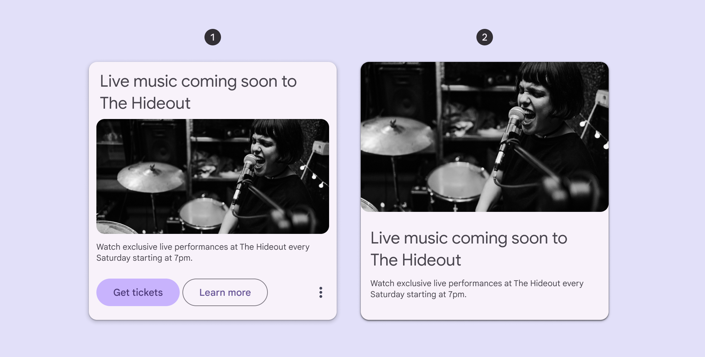
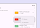
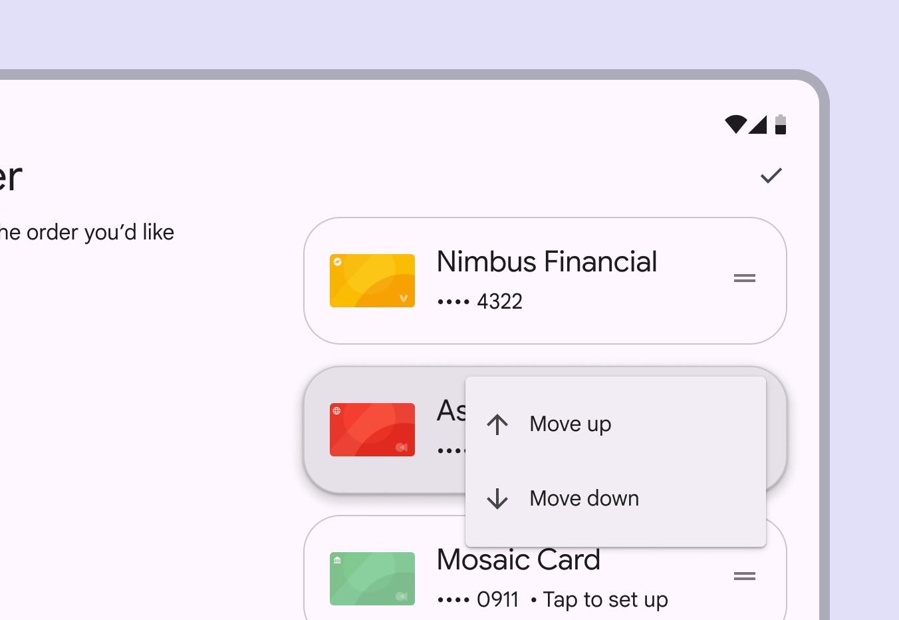
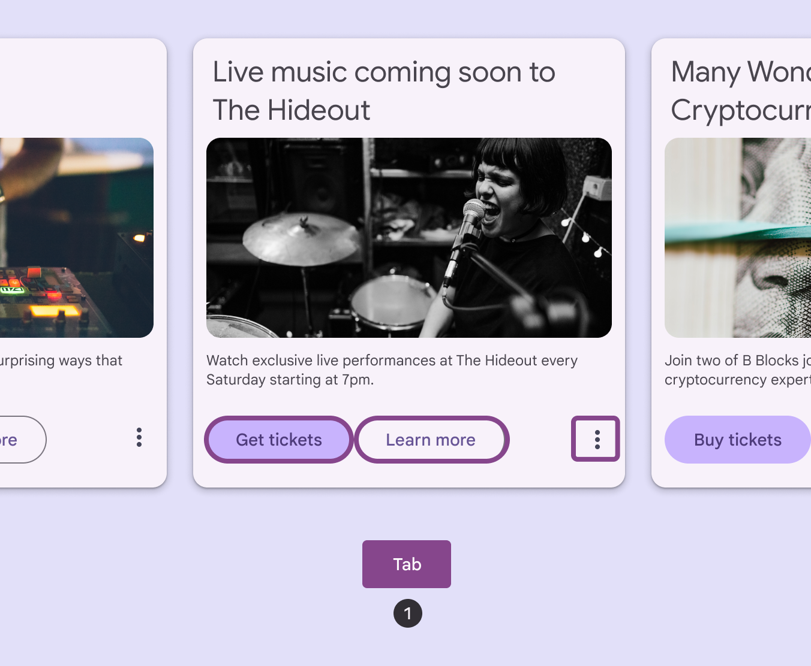
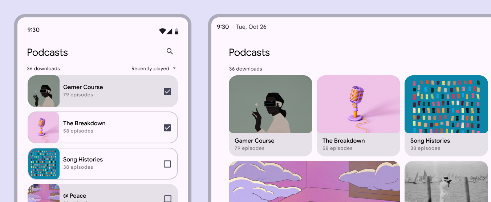
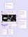

# Cards

Cards display content and actions about a single subject

## Use cases

People should be able to do the following using assistive technology:

- Navigate to a card and the elements within a card
- Get appropriate feedback based on input type documented under [Interaction & style](/m3/pages/cards/accessibility#ce764d54-6b59-42db-807f-b3cb370eecdb)

## Interaction & style

A card can be a non-actionable container that holds actions like buttons [More on buttons](/m3/pages/common-buttons/overview) and links, or it can be directly actionable without any buttons or links. This is to avoid stacking actionable elements. An action shouldn’t be placed on an actionable surface.

1. Non-actionable card with buttons
2. Directly actionable card with no buttons

### Touch

When a user taps on a directly actionable card, a touch ripple appears across the card, indicating feedback. Non-actionable cards don’t ripple. Touch: Tap

### Dragging and dismissing

To meet Material's accessibility standards, any dragging and swiping interactions need a single-pointer alternative, like selecting the same actions from a menu. For example, tapping a card, or pressing and holding, should open a menu to change its position in a list. That menu could also contain an action to delete the card. Use containers like bottom sheets or menus to show single-pointer options

It isn’t recommended to place menus on top of the card on the draggable state. If doing so is necessary, ensure that the interaction can be completed.

exclamation Caution

Ensure that the menu doesn't cover the card

### Cursor

When a directly actionable card is hovered, the hover state [More on hover state](/m3/pages/interaction-states/applying-states#bf01ead3-12e0-4077-98d1-05927d284c35) provides a visual cue to the person that the element is interactive. Non-actionable cards don’t have a hover state. When a directly actionable card is clicked, a ripple appears, providing feedback. Cursor: Hover, Click

### Keyboard

A focus indicator appears around actionable elements when tabbing through cards. This provides a visual cue to a person that the destination is now focused [More on focused state](/m3/pages/interaction-states/applying-states#bfc1624f-6bcc-4306-b0c1-425e2d8a1bf9) and an action can be taken. A person can **Tab** to navigate between actionable elements of the cards. If the cards are non-actionable, **Tab** navigates directly to the actionable buttons [More on buttons](/m3/pages/common-buttons/overview) or links within the cards. When engaging with a focused actionable card or element using the **Space** or **Enter** key, an action is performed or a secondary action is available, such as a Menus display a list of choices on a temporary surface. More on menus [More on menus](/m3/pages/menus/overview). Within the menu, a person is able to **Arrow** through the menu items, **Space** or **Enter** to select an item, or **Tab** to exit. Keyboard: Tab, Arrows

## Focus

All interactive elements of cards need a tab stop so they can be focused [More on focused state](/m3/pages/interaction-states/applying-states#bfc1624f-6bcc-4306-b0c1-425e2d8a1bf9). Directly actionable cards are tab stops. For non-actionable cards, the card itself is not a tab stop. However, every actionable element in the card is a tab stop so they’re all visited before focus navigates to the next card.

Use **T****ab** to navigate through all buttons in a card

Card layouts can change on different devices

## Keyboard navigation

| Keys | Actions |
| --- | --- |
| **Tab** |
Move to the next actionable element

**Directly actionable cards:** Move to next card container

**Non-actionable cards with actionable elements:** Move to next actionable element

 |
| **Space** or **Enter** | Confirm action |

## Labeling elements

The informative contents of a card are verbalized when navigating to them using a screen reader. If an image in a card is purely decorative, hide it from screen readers. All actionable elements must receive both screen reader and keyboard focus. Directly actionable cards can have the **button** or role, depending on how they’re used. Non-actionable cards are purely containers, so they don’t need a role.

Non-actionable card elements are navigable, focused in order, and verbalized when in focus. In this example, the order is:

1. Heading
2. Image
3. Body text
4. Primary button
5. Secondary button

