# Cards

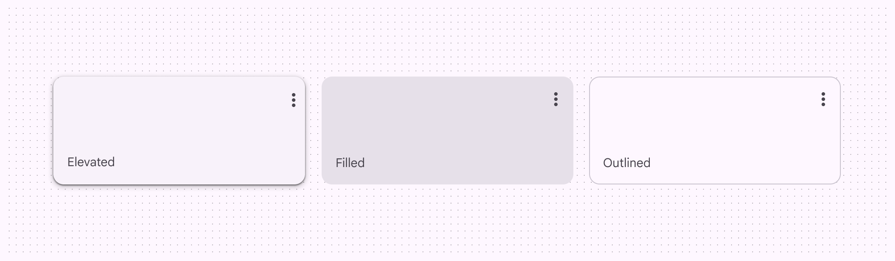

## Usage

Use a card to display content and actions on a single topic. Cards should be easy to scan for relevant and actionable information. Elements like text and images should be placed on cards in a way that clearly indicates hierarchy.

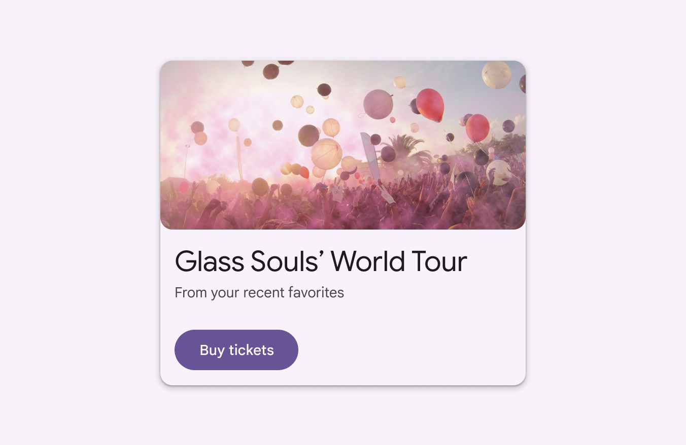

Cards can display content and actions on a single topic

Cards can serve as entry points into deeper levels of detail or navigation, such as a music album or details on an upcoming vacation.

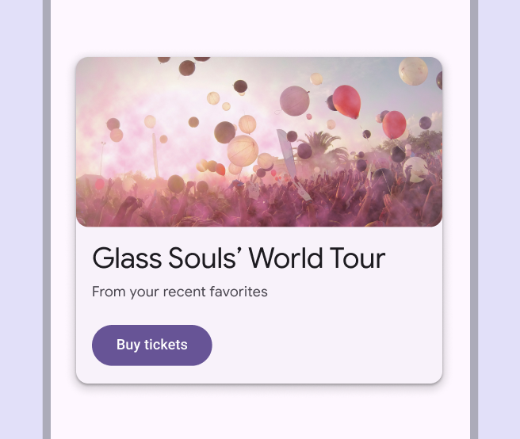

Card text and image show a clear hierarchy

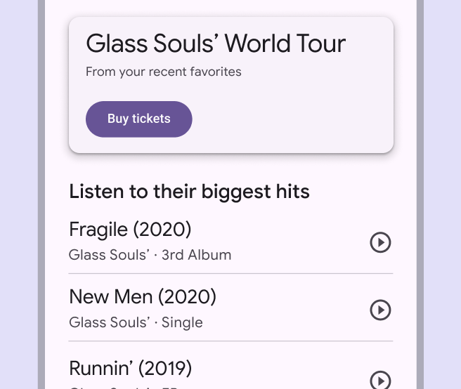

Use cards to display related information on a single subject

Cards can be displayed together in a grid, vertical list, or carousel [More on carousels](/m3/pages/carousel/overview).

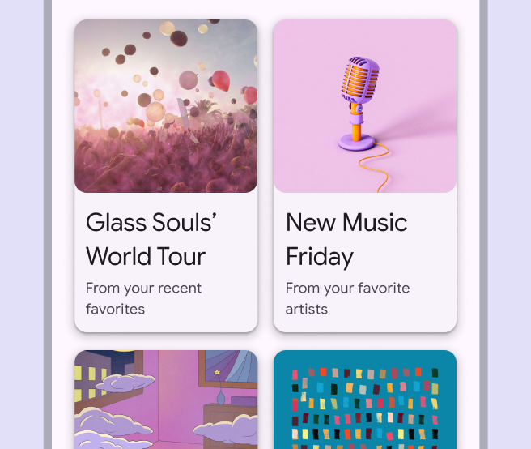

check Do

Cards can be shown together

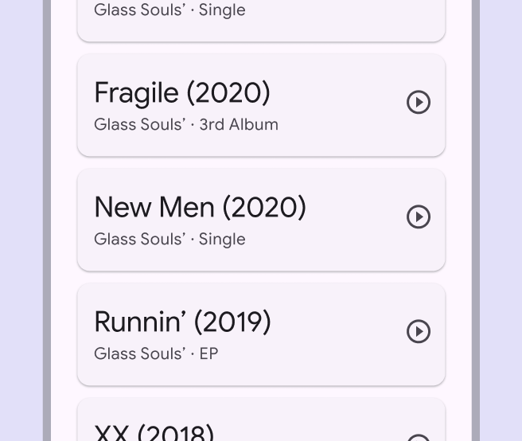

close Don’t

Don't force content into cards when spacing, headlines, or dividers would create a simpler visual hierarchy

There are three card variants:

- Elevated
- Filled
- Outlined

Each provides the same legibility and functionality, so the variant you use depends on style alone.

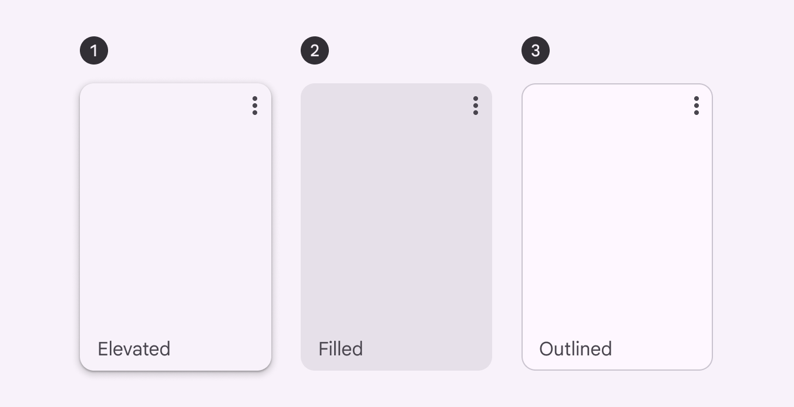

1. Elevated card
2. Filled card
3. Outlined card

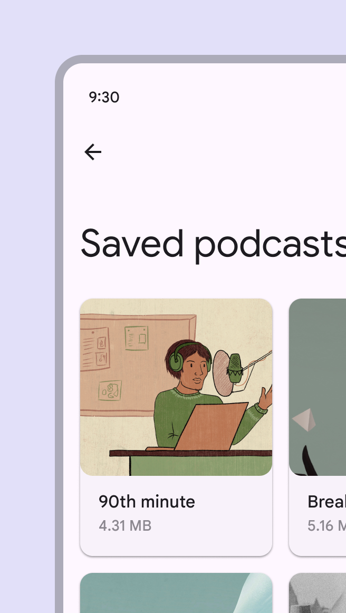

Elevated cards have a drop shadow, providing more separation from the background than filled cards, but less than outlined cards

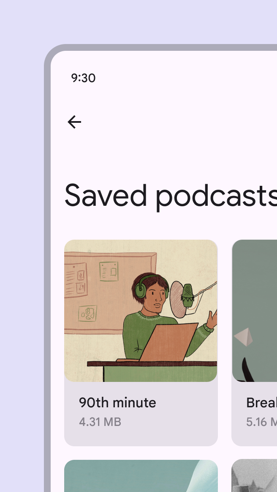

Filled cards provide subtle separation from the background. This has less emphasis than elevated or outlined cards.

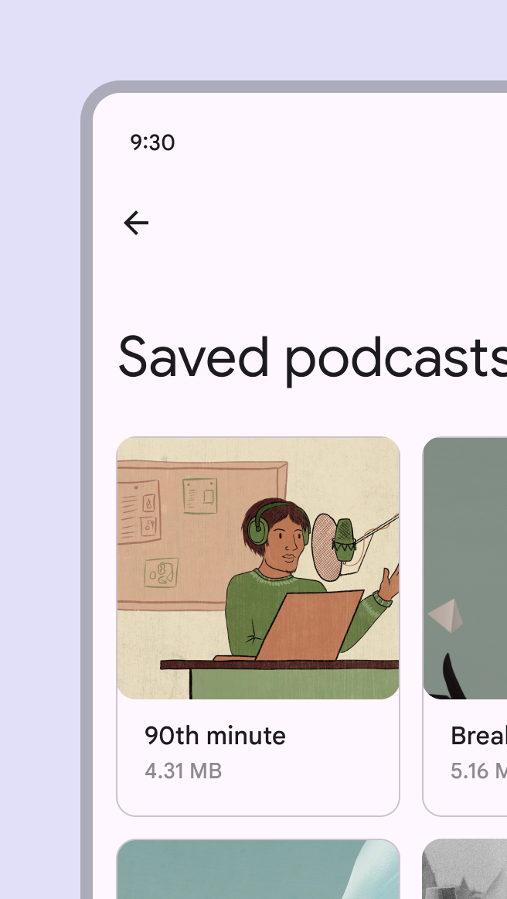

Outlined cards have a visual boundary around the container. This can provide greater emphasis than the other variants.

## Anatomy

The card container is the only required element in a card. Card layouts can vary to support the kinds of content they contain. Below is a common configuration of elements.

1. Container
2. Image
3. Button
4. Supporting text
5. Subhead
6. Headline

### Container

Card containers hold all card elements. Their size is determined by the space those elements occupy. Card elevation is expressed by the container. The card container is the only required element of a card. All other elements are optional.

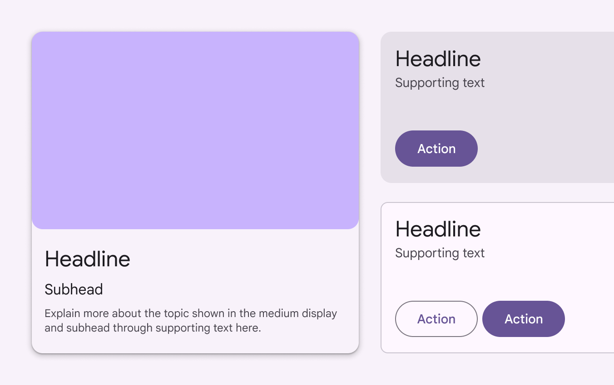

Card size is determined by the elements it contains

### Content blocks

Card contents are grouped into blocks. Content can have different levels of visual emphasis depending on importance. Card layouts vary to support the kinds of content they contain.

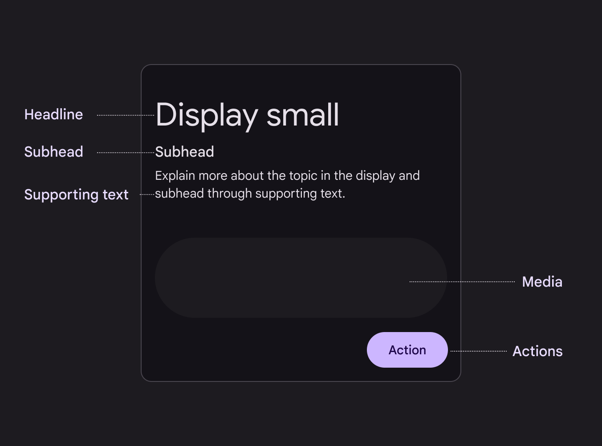

Cards can contain a headline, subhead, supporting text, media, and actions

### Dividers

[Dividers](/m3/pages/divider/specs) can separate regions in cards or indicate areas of a card that can expand.

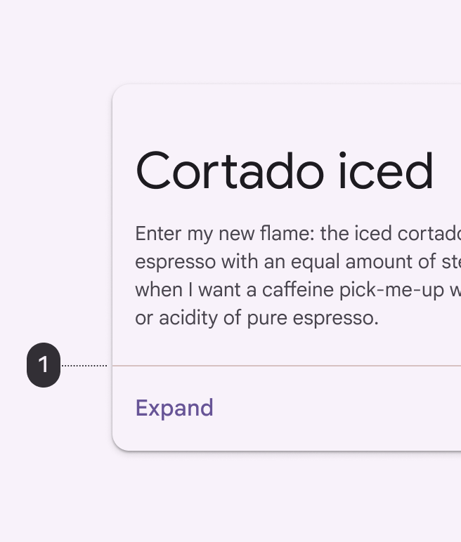

1\. Use full-width dividers for content that can be expanded

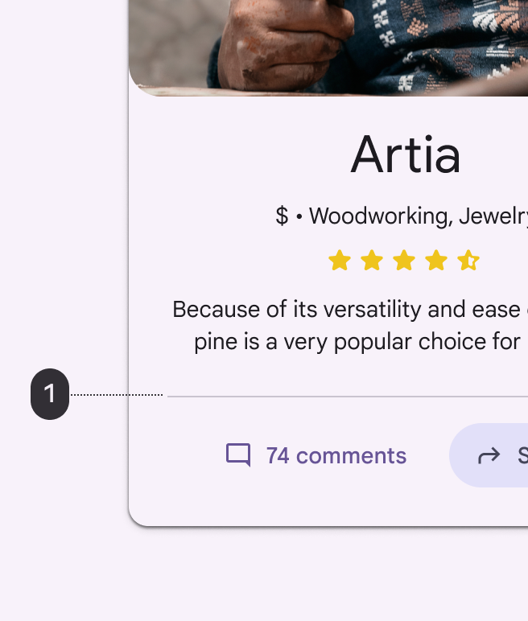

1\. Use inset dividers, which don’t run the full width of a card, to separate related content

### Media

**Thumbnail**
Cards can include thumbnails for an avatar or logo.

**Image**
Cards can include photos, illustrations, and other graphics, such as weather icons.

**Video**
Cards can include video.

Cards can contain thumbnails, images, and video

### Text

**Headline**
Headline text often communicates the subject of the card, such as the name of a photo album or article.

**Subhead**
Subheads are smaller text elements, such as an article byline or a tagged location.

**Supporting text**
Supporting text includes body content, such as an article summary or a restaurant description.

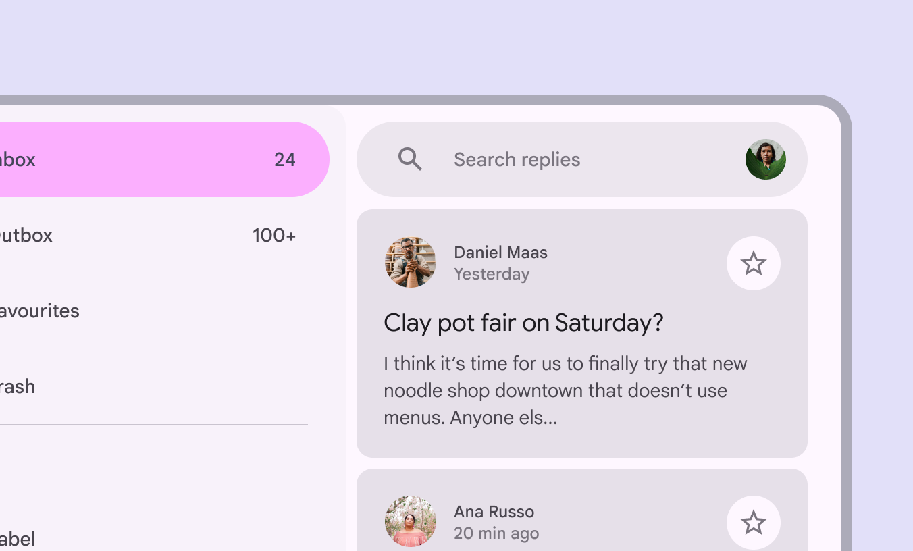

Headline, subhead, and supporting text in a card

#### Layering text, icons, and images

It isn’t recommended to place text or icons on images. If it’s necessary, ensure the background image provides sufficient contrast for the text to meet accessibility [More on accessibility](/m3/pages/cards/accessibility) standards. Add a translucent scrim or bounding shape beneath the text or icon to help ensure proper contrast.

exclamation Caution

Ensure that text on images meets accessible contrast standards

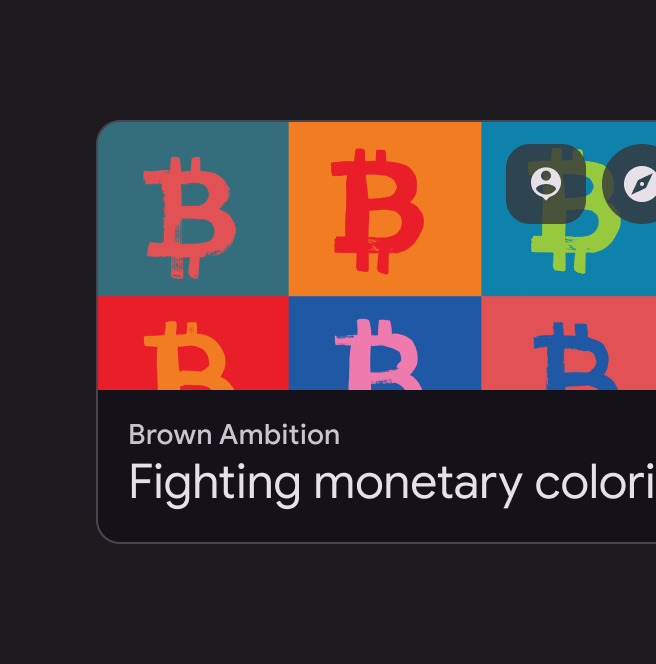

exclamation Caution

When placing text or icons on images, consider using a bounding shape to ensure proper contrast

### Actions

#### **Primary action area**

Cards can be one large touch target triggering an expanded detail screen.

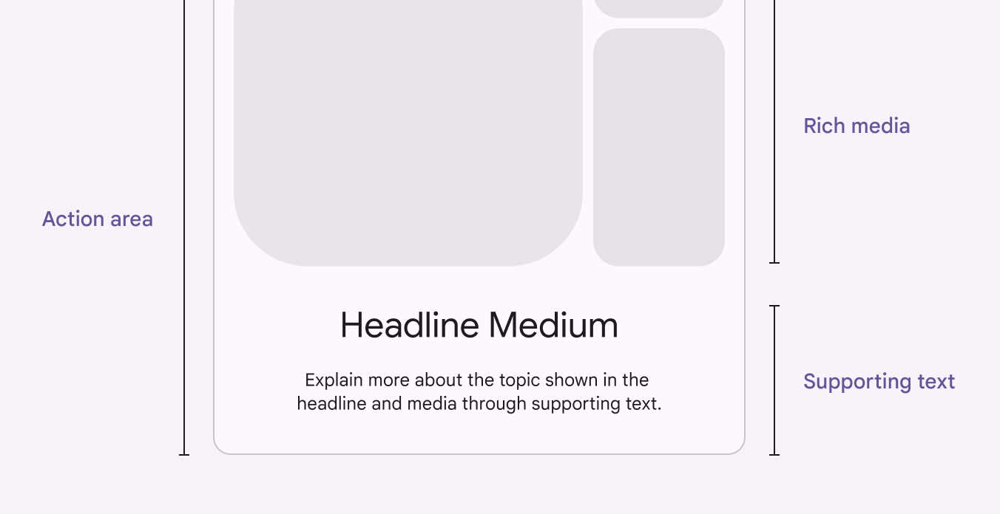

Cards can include a primary action area that expands into a full-screen view

**Buttons**
Cards can include buttons [More on buttons](/m3/pages/common-buttons/overview) for actions such as **Learn more** or **Add to cart**.

**Icon buttons**
Cards can include icon buttons [More on icon buttons](/m3/pages/icon-buttons/overview) for actions such as **Save**, **Heart**, or **Leave a 4-star review**.

**Selection controls**
Cards can also include chips [More on chips](/m3/pages/chips/overview), sliders [More on sliders](/m3/pages/sliders/overview), checkboxes [More on checkboxes](/m3/pages/checkbox/overview), and other selection controls.

**Linked text**
There can be a link in the supporting text on a card.

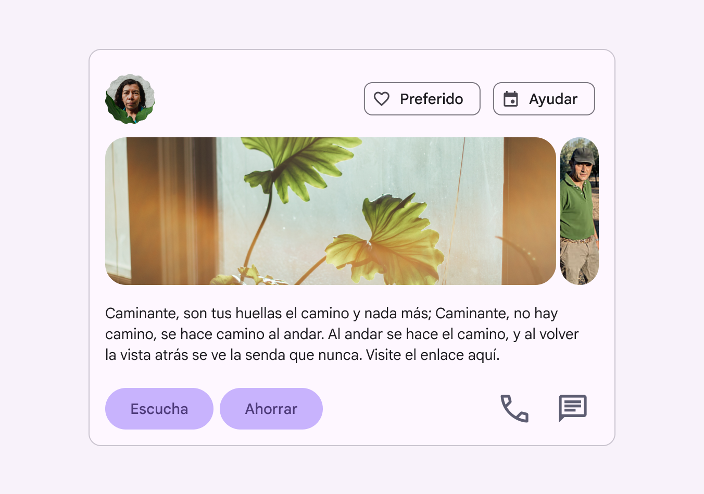

Cards can include multiple action areas containing buttons, links, and other controls

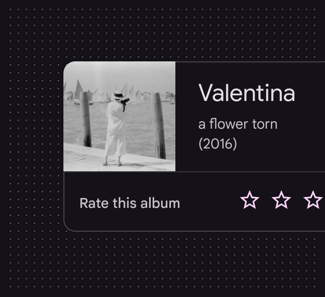

Cards can contain icon buttons like stars to rate content

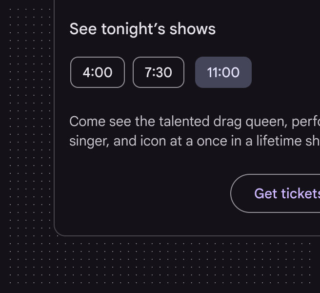

Cards can contain choice chips in the action area

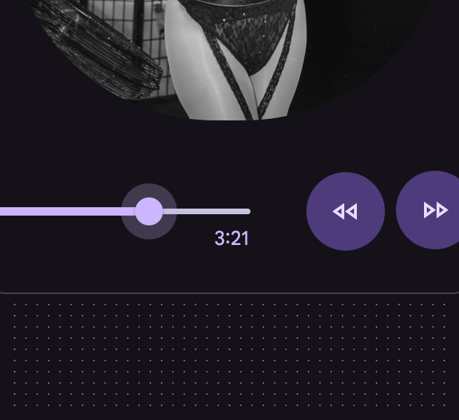

Cards can contain a slider control in the action area

**Overflow menu**
Overflow menus contain related actions. They are typically placed in the upper-right or lower-right corner of a card.

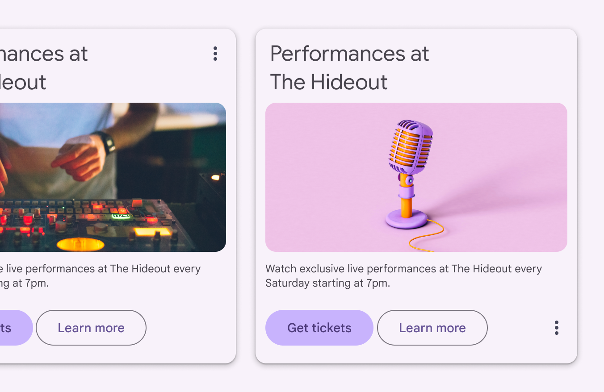

Overflow menus are usually located in the upper-right or lower-right corner of a card

## Cards in a collection

Multiple cards can be grouped together into collections displayed in a grid, list [More on lists](/m3/pages/lists/overview), or carousel [More on carousels](/m3/pages/carousel/overview). By default, cards in a collection are coplanar. They share the same resting elevation unless they're picked up or dragged [More on dragged state](/m3/pages/interaction-states/applying-states#198c29c7-771e-4264-91e9-70c32b8902ec).

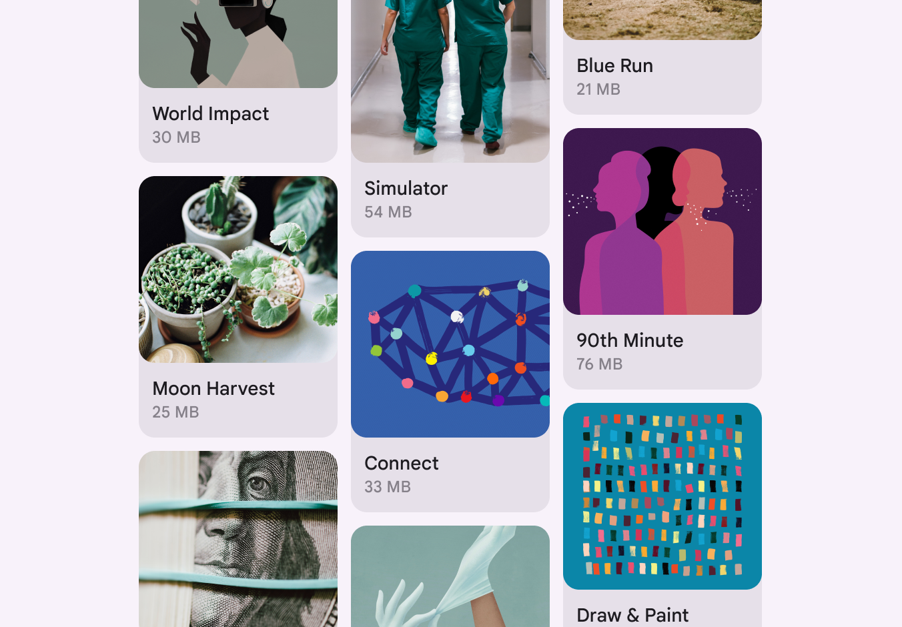

Multiple cards can be grouped into collections with a shared resting elevation

#### Filtering and sorting

Card collections can be filtered in a variety of ways, including by date or alphabetical order. If a collection can be filtered, the filter must apply to each card in the collection. Filter or sorting options should be placed outside of the card collection.

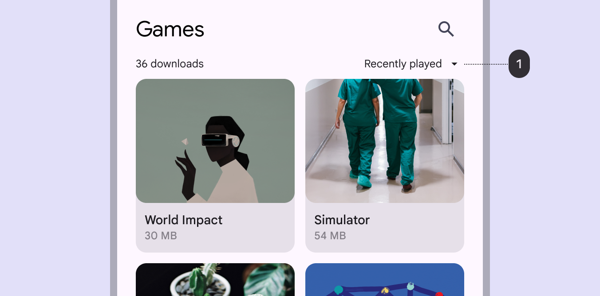

Card collections can be filtered in a variety of ways, including by date:
1\. A sort-by-date option is placed outside of the card collection 

Organize card collections so that they'e easy to use. Their layout [More on layout](/m3/pages/understanding-layout/overview) affects how they are perceived.

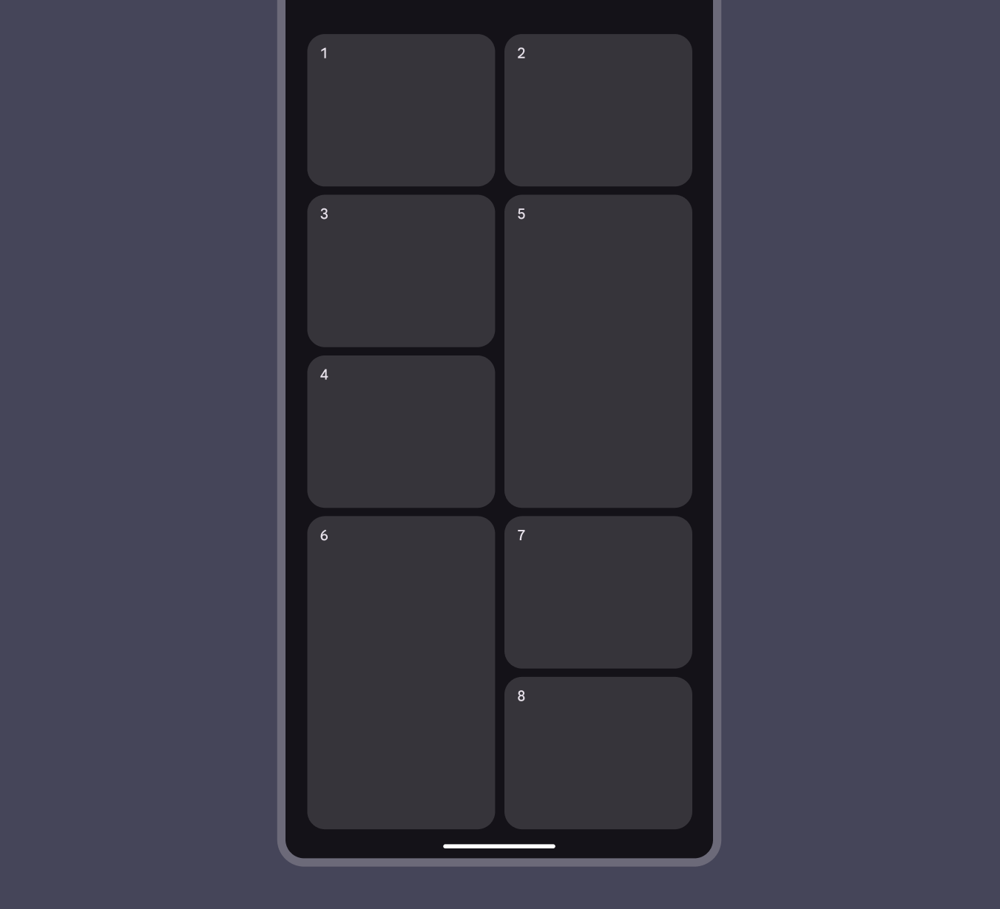

Place cards in a collection in a straightforward, easy-to-use manner

### Grid

Cards can be displayed together in a grid. Cards displayed in a grid

The default grid can be customized in code to show cards in staggered or mosaic grids.

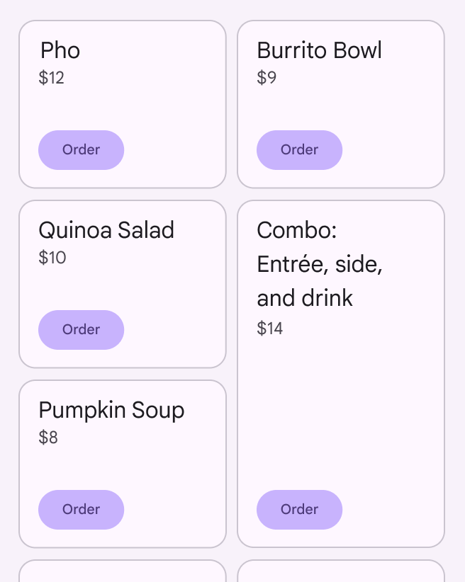

Custom mosaic grid

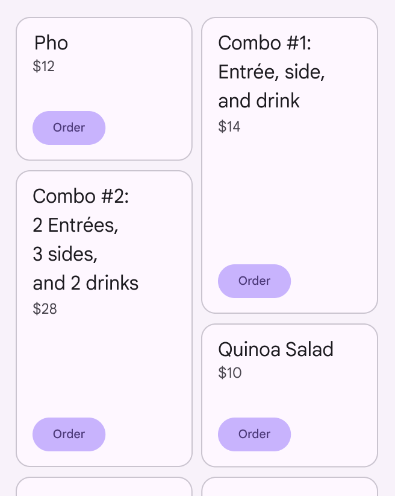

Custom staggered grid

### Vertical list

Cards can be displayed together in a vertical list. Cards can be shown in a vertical list

### Carousel

Cards can be displayed together in a horizontal row or carousel [More on carousels](/m3/pages/carousel/overview). Cards displayed together in a horizontal row or carousel

## Adaptive design

As cards scale to adapt to different [window size classes](/m3/pages/breakpoints), their position and alignment can also change. Cards and their elements can align left, right, or center as the layout scales.

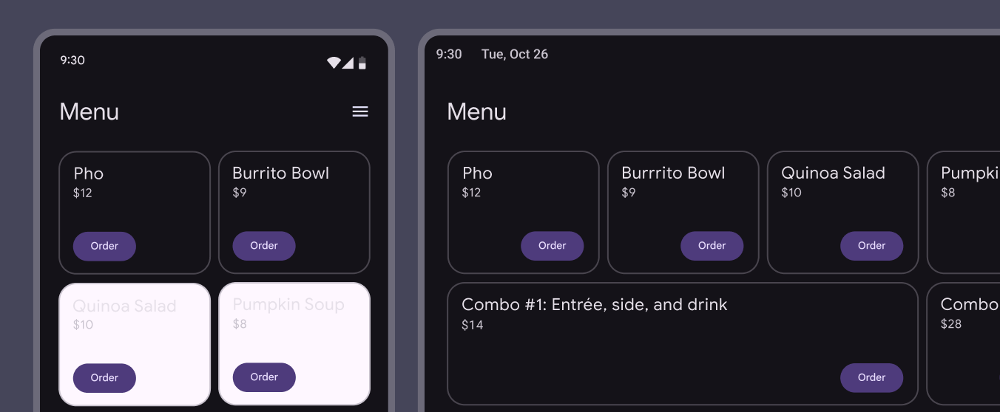

Card position and alignment changes as the screen size changes

### Ergonomics

Adjust the layout [More on layout](/m3/pages/understanding-layout/overview) of cards to meet the ergonomic needs of large screens. For example, a horizontally-oriented card in a compact window size [More on compact window size class](/m3/pages/breakpoints/compact) may become a larger, vertically-oriented card in an expanded window size [More on expanded window size class](/m3/pages/breakpoints/expanded), with more space for images and text on the larger screen.

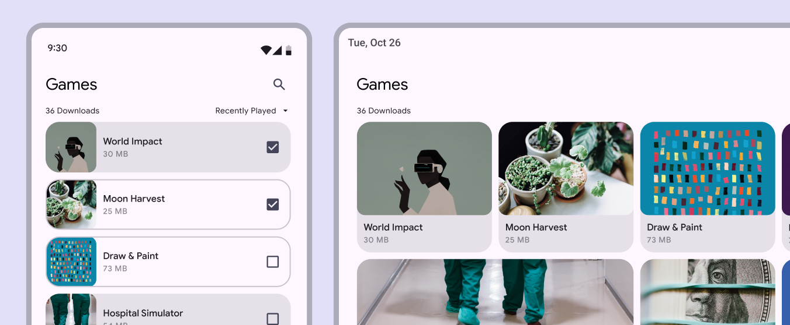

Adjust the card layout so content remains the main focus on large screens

### Visual presentation

To adjust the presentation of content-focused components, begin with spacing. Allow components like lists [More on lists](/m3/pages/lists/overview), cards, and images to optimize space while filling the region of a screen that suits a device breakpoint’s ergonomic needs.

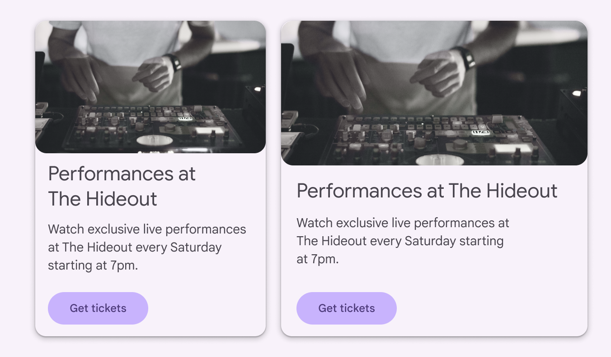

Spacing adjusts for components such as cards, lists, and images

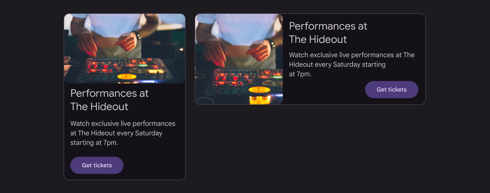

Example of the same card with two different orientations and element positioning

### Column-based layouts

In mobile layouts, components such as lists [More on lists](/m3/pages/lists/overview) or cards are stretched to fit the full width of the screen without compromising visual quality or user experience. When designing for large screens with an expanded window size [More on expanded window size class](/m3/pages/applying-layout/expanded), use multiple columns to display content. Avoid extending UI elements across the screen when possible. On larger screens, rearrange groups of related cards into horizontal rows or carousels [More on carousels](/m3/pages/carousel/overview), to allow for better content organization.

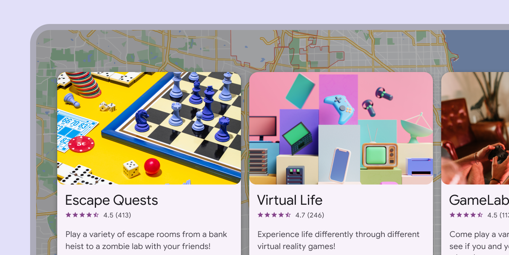

When designing for large screens, use multiple columns to display content

### Small screens

On smaller screens with the compact window size [More on compact window size class](/m3/pages/applying-layout/compact), consider swapping cards for lists [More on lists](/m3/pages/lists/overview), which can display images and text in a more compact form. Make sure that controls, actions, and other component-specific elements are maintained. Certain devices or user contexts require different components to meet platform expectations

## Behavior

### Expanding

Cards can use a [container transform](/m3/pages/motion-transitions/transition-patterns#b67cba74-6240-4663-a423-d537b6d21187) transition pattern to reveal additional content. Reserve this pattern for hero moments that are meant to be expressive. A card expands to fill the full screen using a parent-child transition

check Do

Expand a card to reveal information

close Don’t

Don’t scroll within a card to reveal information

### Navigation

Cards can use a [forward and backward](/m3/pages/motion-transitions/transition-patterns#df9c7d76-1454-47f3-ad1c-268a31f58bad) transition pattern to navigate between screens at consecutive levels of hierarchy. This pattern has a simpler motion style compared to container transform, which makes it suitable for common navigation transitions. Cards can use a forward and backward transition pattern to navigate between screens

### Gestures

#### Swipe

A swipe gesture [More on gestures](/m3/pages/gestures) can be performed on a single card at a time, anywhere on that card. It can be used to:

- Dismiss a card
- Change the state [More on states](/m3/pages/interaction-states/overview) of a card, such as flagging or archiving it

check Do

A card should only have one swipe action assigned to it

close Don’t

Cards shouldn’t contain content that can be swiped, such as an image carousel or pagination. Also, swipe gestures shouldn’t cause portions of cards to detach upon swiping.

#### Pick up & move

The pick-up-and-move gesture [More on gestures](/m3/pages/gestures) allows users to move and reorder cards in a collection.

check Do

When moving a card, increase its elevation

close Don’t

Don’t let cards bump other elements out of the way. When a card is picked up, it appears in front of all elements, except app bars and navigation.

#### Scrolling

Card content that’s taller than the maximum card height is truncated and doesn’t scroll, but can be displayed by expanding the height of a card. A card can expand beyond the maximum height of the screen, in which case the card scrolls within the screen.

check Do On a mobile device, cards can expand to reveal more content, scrolling within the screen. Content within cards doesn’t scroll.

close Don’t

On a mobile device, cards can't internally scroll, as it could cause two scroll bars to be displayed

#### Scrolling on desktop

On a desktop device, card content can expand and scroll within a card. On a desktop, content can expand and scroll within a card

