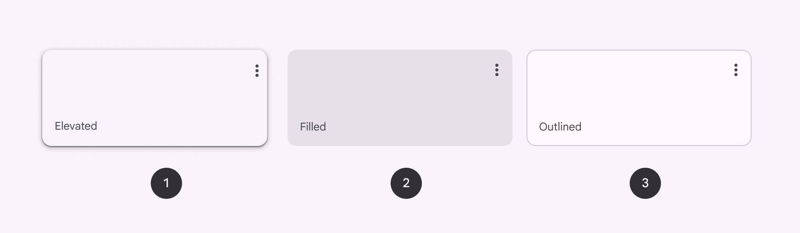
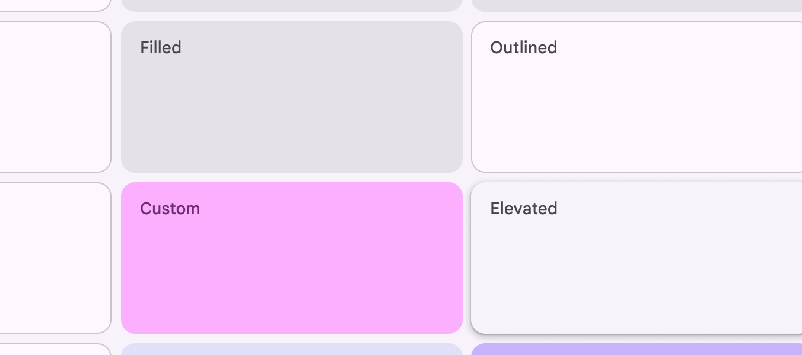

# Cards

Cards display content and actions about a single subject

- Use cards to contain related elements
- Three variants: elevated , filled , outlined
- Contents can include anything from images to headlines, supporting text, buttons [More on buttons](/m3/pages/common-buttons/overview), and lists [More on lists](/m3/pages/lists/overview)
- Can also contain other components
- Cards have flexible layouts [More on layout](/m3/pages/understanding-layout/overview) and dimensions based on their contents

1. Elevated card
2. Filled card
3. Outlined card

## Availability & resources

| Type | Resource | Status |
| --- | --- | --- |
| Design | [Design Kit (Figma)](https://www.figma.com/community/file/1035203688168086460) | Available |
| Implementation |  | Available |
| Implementation |  | Available |
| Implementation | [Jetpack Compose](https://developer.android.com/develop/ui/compose/components/card) | Available |

## Differences from M2

- Color: New color mappings and compatibility with dynamic color [More on dynamic color](/m3/pages/dynamic-color/overview)
- Elevation: Lower elevation and no shadow by default
- Variants: Three official card variants – elevated , filled , and outlined

Cards have updated colors, elevation, and variants

