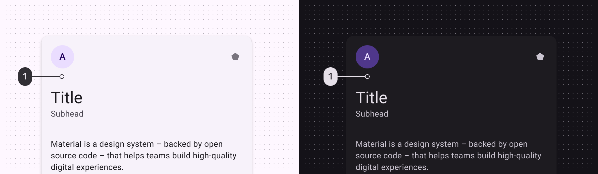
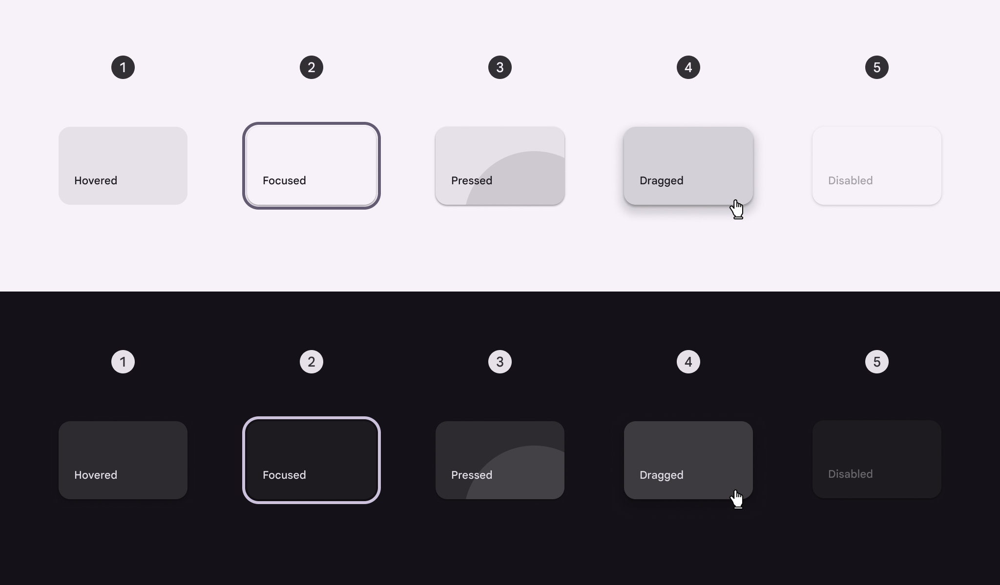
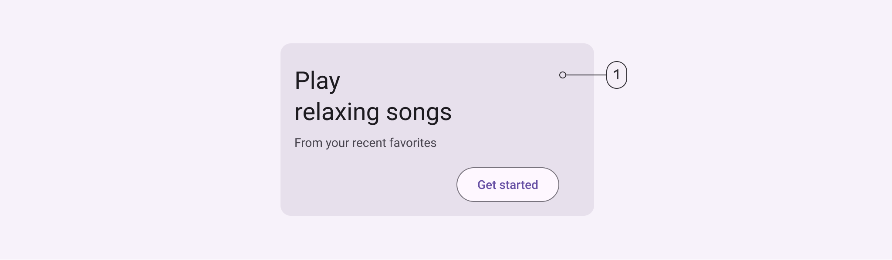
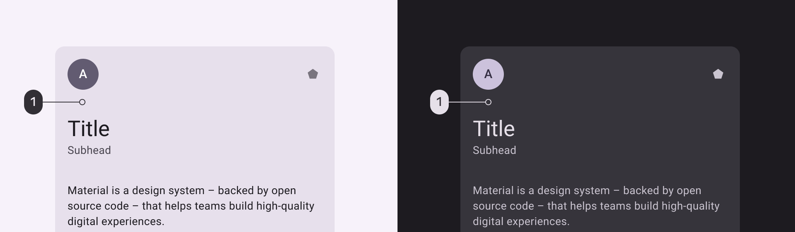
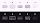
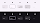

# Cards

Cards display content and actions about a single subject

## Tokens & specs

Select a component variant below to see its elements, attributes, tokens, and their values.

```
Card - Elevated
```

```
Card - Elevated
```

```
Card - Elevated
```

```
Card - Elevated
```

Card - Elevated

Token

Default, Light

Enabled

Disabled

Hovered

Focused

Pressed (ripple)

Dragged

## Elevated card


1. Container

### Elevated card color

Color values are implemented through design tokens. For design, this means working with color values that correspond with tokens. For implementation, a color value will be a token that references a value. [Learn more about design tokens](/m3/pages/design-tokens/overview/)



Elevated card color roles used for light and dark themes:

1. Surface container low

### Elevated card states

States are visual representations used to communicate the status of a component or interactive element. [Learn more about interaction states](/m3/pages/interaction-states)



Elevated card states: 

1. Hovered
2. Focused
3. Pressed
4. Dragged
5. Disabled

## Filled card



1. Container

### Filled card color

Color values are implemented through design tokens. For design, this means working with color values that correspond with tokens. For implementation, a color value will be a token that references a value. [Learn more about design tokens](/m3/pages/design-tokens/overview/)



Filled card color roles used for light and dark themes:

1. Surface container highest

### Filled card states

States are visual representations used to communicate the status of a component or interactive element. [Learn more about interaction states](/m3/pages/interaction-states)



Filled card states: 

1. Hovered
2. Focused
3. Pressed
4. Dragged
5. Disabled

## Outlined card


1. Container
2. Outline

### Outlined card color

Color values are implemented through design tokens. For design, this means working with color values that correspond with tokens. For implementation, a color value will be a token that references a value. [Learn more about design tokens](/m3/pages/design-tokens/overview/)


Outlined card color roles used for light and dark themes:

1. Surface
2. Outline variant

### Outlined card states

States are visual representations used to communicate the status of a component or interactive element. [Learn more about interaction states](/m3/pages/interaction-states)



Outlined card states: 

1. Hovered
2. Focused
3. Pressed
4. Dragged
5. Disabled

## Measurements


Card padding and size measurements

| Attribute
 | Value
 |
| --- | --- |
| Shape
 | 12dp corner radius |
| Left/right padding
 | 16dp |
| Padding between cards
 | 8dp max |
| Label text alignment
 | Start-aligned |

