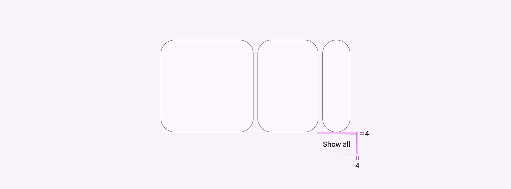
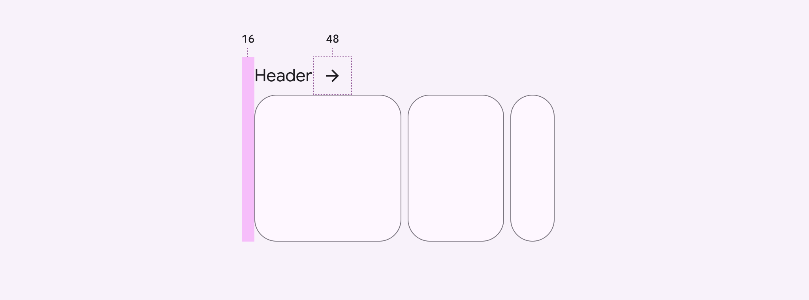
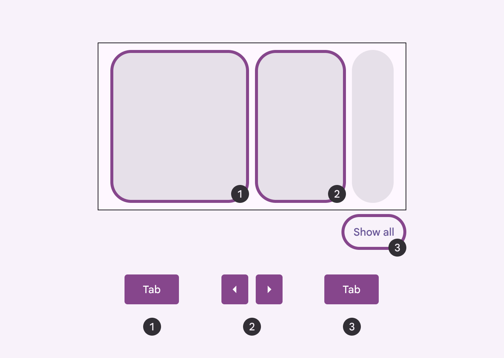
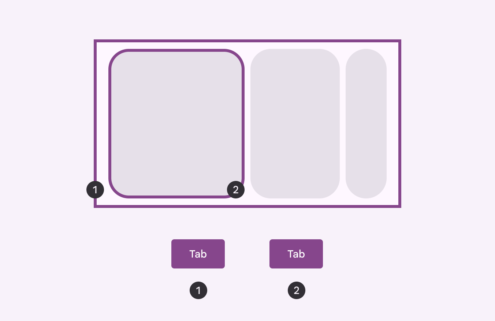
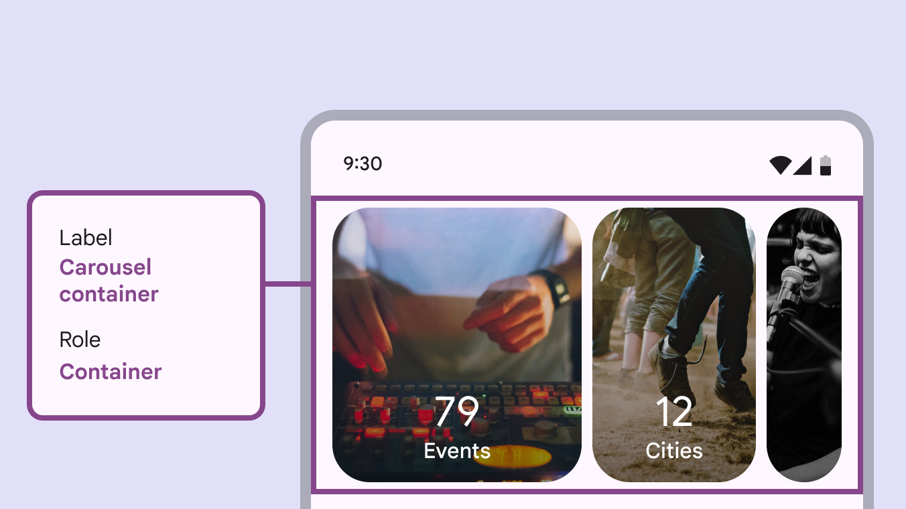
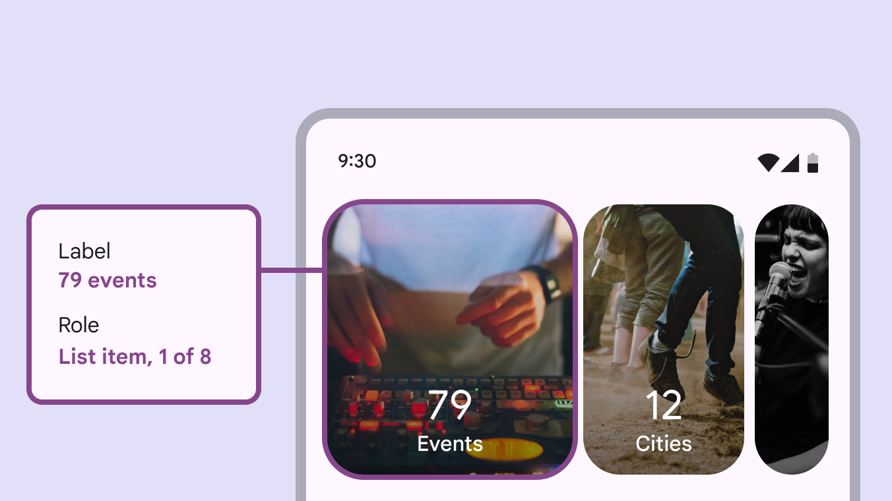

# Carousel

Carousels show a collection of items that can be scrolled on and off the screen

## Use cases

Users should be able to do the following with assistive technology:

- Navigate to the carousel container
- Navigate between different carousel items
- Activate a carousel item
- Skip over the carousel items

## Requirements on scrolling pages

On vertically-scrolling pages, carousels require an accessible way to view all the items without horizontally scrolling. (This requirement doesn't apply to full-screen carousels .)

Material recommends adding a **Show all** button below the carousel, which opens a dedicated vertically-scrolling page of all carousel items. Carousels without headers should use a **Show all** button to view all carousel items

The **Show all** button should have a padding of 4dp

If the carousel has a header, you can use an arrow icon button instead. Place the arrow icon directly next to the header or in the same row. Make sure the header is also displayed on the page of all carousel items. Carousels with headers should use an arrow to view all carousel items

Headers should align with the leading edge, and the arrow icon should have a size of 48dp 

Avoid customizing the accessibility solution when possible. However, if your product needs an alternative solution, consider adding a **Show all** button in nearby navigation, or add alternative control buttons close to the carousel. Avoid adding UI elements, like arrows or other icons, within or beside the carousel.

close Don’t

Avoid adding buttons into the carousel container or beside it. Place any buttons above or below the carousel.

close Don’t

Don't cover the carousel with buttons or other UI

## Interaction & style

### Touch

Tapping on a carousel item changes the shape slightly, and creates a touch ripple for interaction feedback. Touch: Tap

### Cursor

The hover state [More on hover state](/m3/pages/interaction-states/applying-states#71c347c2-dd75-485b-892e-04d2900bd844) provides a visual cue that the carousel item is interactive. When the carousel item is clicked (in both active and inactive states), a ripple appears for interaction feedback. Cursor: Hover, click

### Initial focus

When navigating to a carousel using assistive technology, use **Tab** to place initial focus on the first carousel item. Then, use **Tab** or the arrow keys to navigate the carousel items. Use the up and down arrow keys to leave the carousel and focus on the next element on the page, like the **Show all** button.

check Do

Set initial focus on the first carousel item, and use arrows to navigate items

close Don’t

Avoid focusing on the carousel container

## Keyboard navigation

| Keys | Actions |
| --- | --- |
| **Tab** or **Arrows** | Moves to the previous or next carousel item
 |
| **Space** or **Enter** | Activates the focused [More on focused state](/m3/pages/interaction-states/applying-states#bc6d6853-48ef-490e-8076-448e89e69f0f) carousel item |

## Labeling elements

The carousel container has the **container** role.

The carousel container is labelled appropriately and has the **container** role

Each carousel may have a different number of items, so the label reads out the total amount of items and the current item in focus.

The carousel item label indicates the current item in focus and the total number of items

## Reduced motion

When reduced motion settings are turned on, the parallax effect should be removed and carousel items should no longer expand as they come into view. All items are the same size. Make sure carousels with reduced motion reach the edges of the window to avoid clipping visuals.

1. Default carousel for multi-scroll
2. Carousel with reduced motion settings turned on

For hero carousels with reduced motion, the small carousel item is only partially shown on screen.

1. Default carousel for single-scroll
2. Carousel with reduced motion settings turned on

