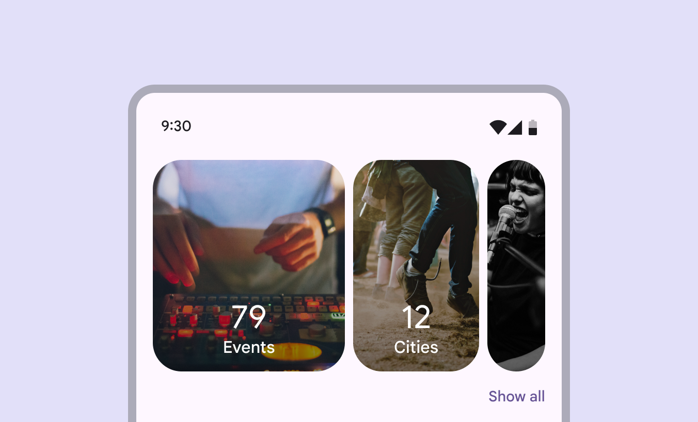
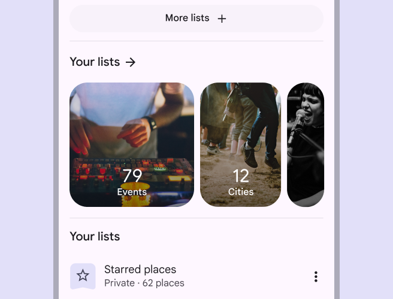
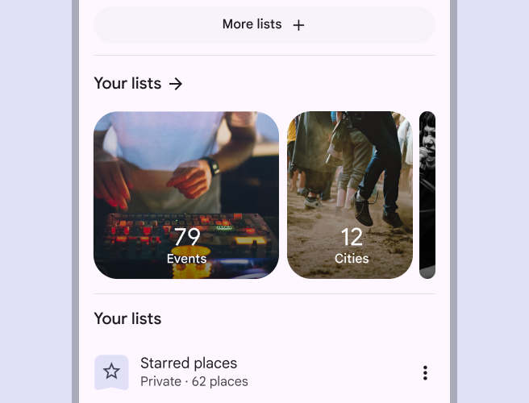
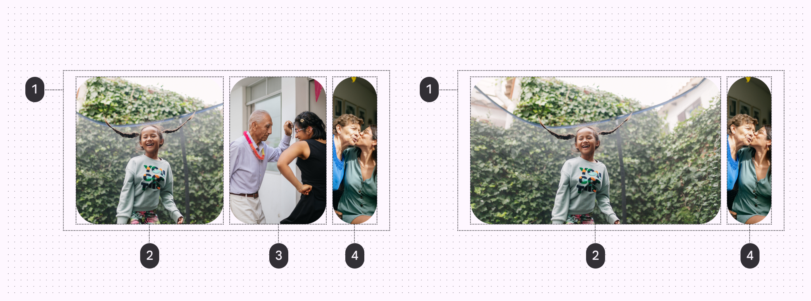
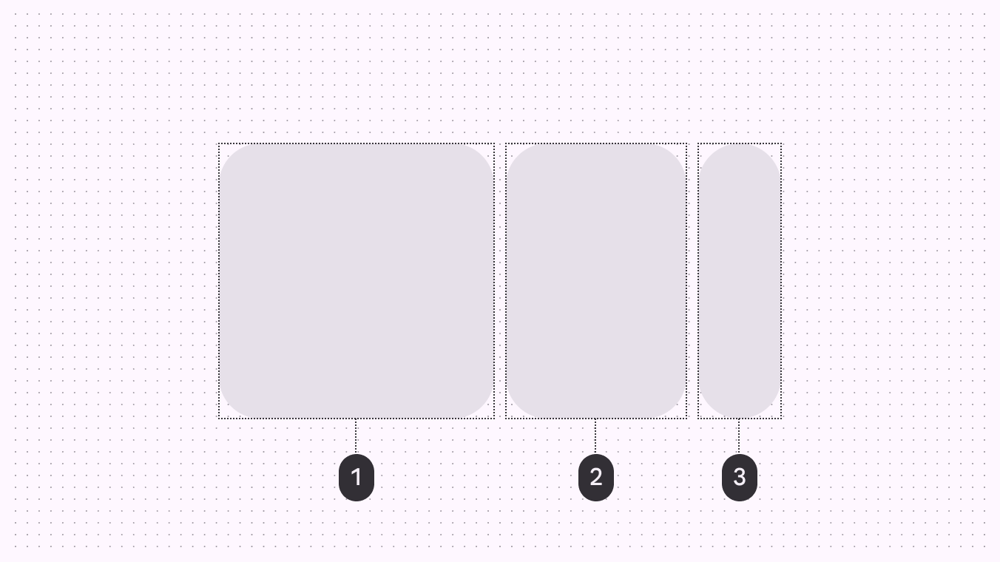
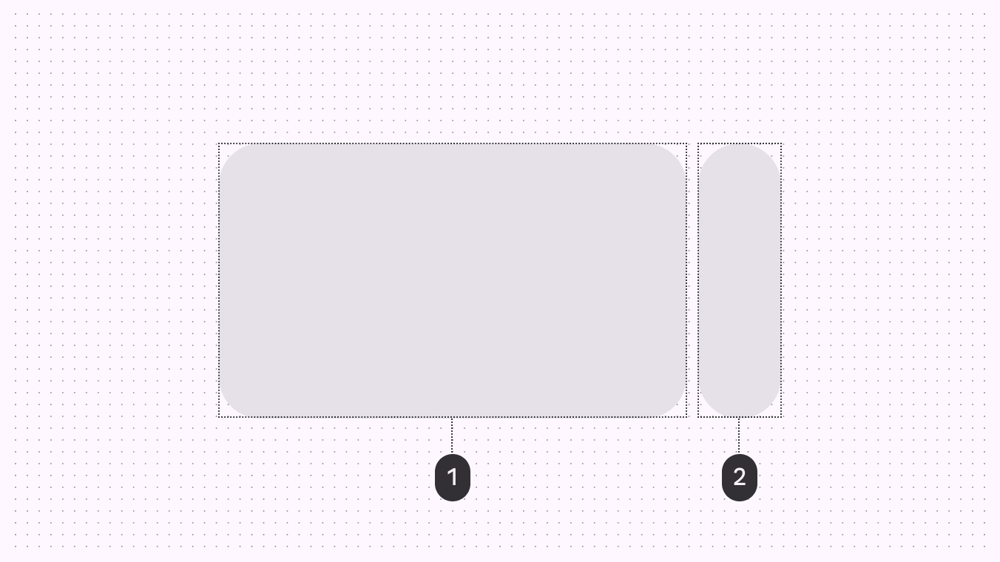
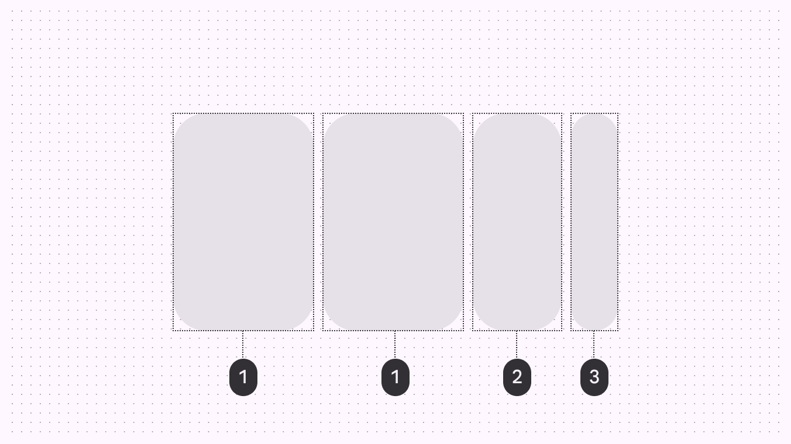
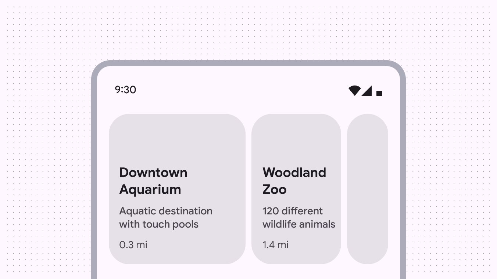
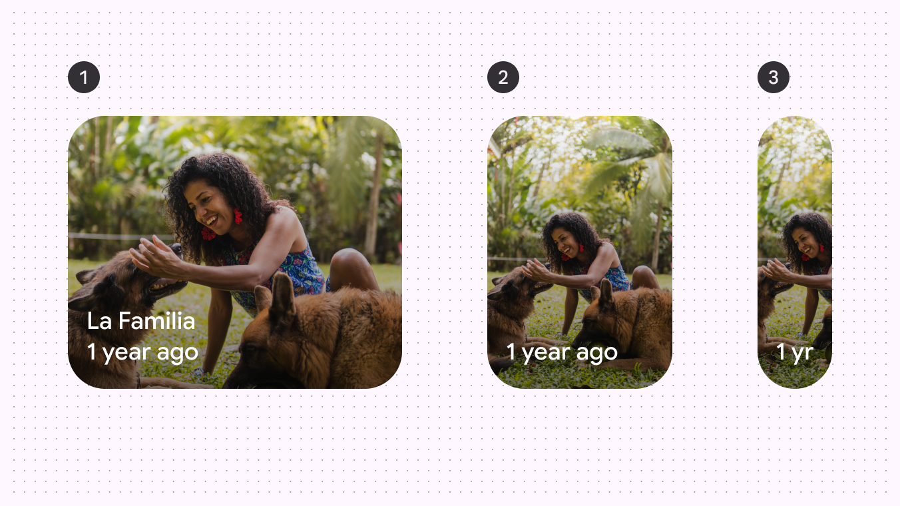

# Carousel

Carousels show a collection of items that can be scrolled on and off the screen

Carousel items adapt dynamically based on window size

## Usage

Carousels display a scrollable list of items. Carousel items emphasize visuals, but can also contain brief text that adapts to the item size. There are four carousel layouts:

- Multi-browse
- Uncontained
- Hero
- Full-screen

All of these layouts can be centered, though center-aligned hero is the most common centered carousel. Carousels can scroll in two ways:

- **Default**: Standard scrolling. Recommended for uncontained layouts.
- **Snap-scrolling**: Scrolled items snap to the carousel's layout. Recommended for multi-browse, hero, and full-screen layouts

A carousel can contain different sized items

Choose the best carousel layout for your product. Some layouts are more visual-focused, while others are more customizable.

|
Layout

 |

Best used for

 |
| --- | --- |
| [Multi-browse](/m3/pages/carousel/guidelines#d95cefa4-53df-45e2-bbb2-3aeeecbe9639) | Browsing many visual items at once (like photos), dynamic designs |
| [Uncontained](/m3/pages/carousel/guidelines#96c5c157-fe5b-4ee3-a9b4-72bf8efab7e9) | Highly-customized or text-heavy carousels, stacked imaged and text, traditional carousel behavior |
| [Hero](/m3/pages/carousel/guidelines#5991f961-79aa-4955-b86e-3e15432108e6) | Spotlighting very large visual items (like a movie or featured app) |
| [Center-aligned hero
](/m3/pages/carousel/guidelines#a9f8dcde-e5c5-464f-b488-d9ded9ae4a4a) | Centered, large visual items |
| [Full-screen
](/m3/pages/carousel/guidelines#ae0f1566-a956-4c4b-b153-d50ee20c32e7) | Vertically-scrolling video or image feeds, immersive experiences |

Carousel items must be fully visible on-screen (except for the uncontained layout ). When scrolled, items automatically change size and snap into place to maintain the same layout.

check Do

Set the large carousel item size to ensure the images and text are easy to read and recognize

close Don’t

Avoid setting carousel items so small that the image isn't recognizable

### Accessibility requirements on scrolling pages

On vertically-scrolling pages, carousels require an accessible way to view all the items without horizontally scrolling. (This requirement doesn't apply to full-screen carousels .)

Material recommends adding a **Show all** button below the carousel, which opens a dedicated vertically-scrolling page of all carousel items. If the carousel has a header, you can use an arrow icon button instead. View the [accessibility tab](/m3/pages/carousel/accessibility) for more details and alternate solutions. Make sure users can scroll vertically through all carousel items

### Multi-browse

The multi-browse layout is best for browsing many items at once, like photos or event feeds. Snap-scrolling is recommended to ensure items are recognizable and consistently sized. On larger screens, more large and medium items are visible in this layout. Avoid using this layout if the carousel items need lots of text or have complicated imagery. A multi-browse layout has different sized items within the carousel

In compact windows, only show up to three carousel items if they have text. If you need to show more than three items, make sure the images and content are easy to understand and recognize.

exclamation Caution

In compact windows, only show more than three items if the items are easy to understand and recognize

### Uncontained

The uncontained layout is most similar to a traditional carousel, where items are a single size and flow past the edge of the screen. Both default scrolling and snap-scrolling work well with this layout. Since items don't change size, this layout can be customized to show more text or other UI above or below each item without the text being masked or cropped. Carousel items are all the same size in an uncontained layout

### Uncontained multi-aspect ratio

The uncontained multi-aspect ratio carousel has the same layout as the uncontained carousel but contains items of various sizes. Item widths can range anywhere between 9:16 for min width size to 16:9 for max width. Only use this carousel layout if the items have various widths. Carousel items are of various sizes in an uncontained multi-aspect ratio layout

### Hero

The hero layout is best for spotlighting content that needs more attention, like movie, shows, or other media thumbnails. It highlights one large image to focus on, while providing a sneak peek of what’s next. On larger screens, more large items are visible. Use snap-scrolling so users can easily cycle through items one at a time. A hero carousel in compact windows should show one large item and one small item

### Center-aligned hero

When the hero layout is center-aligned, it adds an additional previewed item on the leading edge, making the large carousel item centered. A centered hero carousel has two small carousel items, with a large item centered

### Full-screen

The full-screen layout is best used for immersive experiences like video articles, featured headlines, or items that are visually rich. It can contain text and other UI elements on top of the image. This layout works best with content that is taller than it is wide, and scrolls vertically. It only works in portrait orientation in compact and medium windows. Don't use this layout in landscape orientation. Use snap-scrolling for full-screen layouts. Don't use default scrolling. Full-screen carousels fill the entire content area of the screen

## Anatomy

Multi-browse carousel (left) and hero carousel (right):

1. Container
2. Large carousel item
3. Medium carousel item
4. Small carousel item

### Container

The carousel container holds all carousel items. The number of carousel items visible in the container can change based on the carousel layout [More on layout](/m3/pages/understanding-layout/overview) and the window size class [More on window size classes](/m3/pages/breakpoints).

The carousel container is a rectangle. It can be used in many ways and stretched to any size.

### Carousel items

Carousel items hold content. A carousel item has no fixed width; it changes width depending on the window size or its position in the carousel's layout. There are three dynamic widths an item can be: **large**, **medium**, and **small**.

1. Large carousel item
2. Medium carousel item
3. Small carousel item

Large items have a max width that can be adjusted. This changes how all other large, medium, and small carousel items fit on screen. Large items must remain big enough to be easy to understand and recognize. Medium items adjust width dynamically to the carousel size and available space. Small items have a width range of 40–56dp.

1. Large item
2. Small item

When the large item's max width is narrow enough, more items can be shown on screen at once. In compact windows, this is only recommended for carousels with simple imagery.

1. Large item
2. Medium item
3. Small item

### Item text (optional)

Carousel items are primarily visual. Item text is optional and should be brief. If your carousel items require a lot of text, consider using the **uncontained layout** , which can show more information, or use a series of cards [More on cards](/m3/pages/cards/overview) instead.

exclamation Caution

Avoid exceeding two lines of text in carousel items in compact windows unless the background is simple, like a single color. Content within a carousel item can adapt dynamically based on the container and window size. Text should always be understandable at each size. Consider adapting the text to use brief labels on smaller carousel items.

1. Large carousel item with the full title and label text
2. Medium carousel item hiding the title text
3. Small carousel item abbreviating the label text

## Responsive layout

As the carousel container size increases, so do the number of carousel items visible at a time. In compact window sizes [More on compact window size class](/m3/pages/applying-layout/compact), carousels can comfortably show up to three carousel items at once. As the window size grows, more carousel items are added and scale in size. Full-screen carousels only ever show one item at once.

Carousels can show more items at once on larger screens

## Behavior

### Scrolling

Carousel items have a parallax effect when they're scrolled. The **default** scrolling behavior doesn't snap items to a layout grid. They can stop anywhere in the container. Only use this for the uncontained layout . The **snap-scrolling** behavior aligns carousel items to the layout grid after they're scrolled. Items snap to the grid when released. Use this for multi-browse , hero , and full-screen layouts . Carousel items with snap-scrolling maintain the same layout when released

In full-screen layouts, make sure the carousel items snap to the edges of the carousel container. Avoid letting them scroll freely or stop halfway. Full-screen layouts must use snap-scrolling.

close Don’t

Avoid scrolling freely on full-screen carousels

