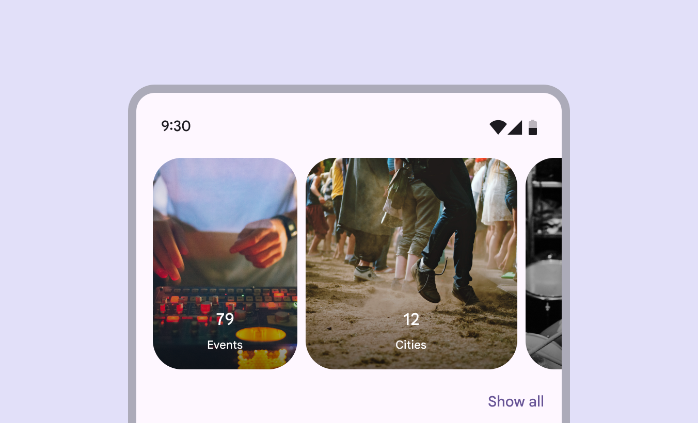

# Carousel

Carousels show a collection of items that can be scrolled on and off the screen

- Contain visual items like images or video, along with optional label text
- Six layouts: Multi-browse , uncontained , uncontained multi-aspect ratio , hero , center-aligned hero and full-screen
- Layouts can be start-aligned or center-aligned
- Item visuals have a parallax effect when scrolled
- Items change size as they move through the carousel

Carousels can show items of various sizes

## Availability & resources

| Type | Resource | Status |
| --- | --- | --- |
| Design | [Design Kit (Figma)](https://www.figma.com/community/file/1035203688168086460) | Available |
| Implementation |  | Available |
| Implementation | [Jetpack Compose](https://developer.android.com/develop/ui/compose/components/carousel) | Available |
| Implementation |  | Available |

## Updates

**November 2025**

New carousel layout:

- Uncontained multi-aspect ratio

**2023** 

Additional layouts and configurations:

- Uncontained
- Full-screen
- Centered carousels
- Hero carousel layout
- Multi-browse layout

New carousel layout: uncontained multi-aspect ratio

## Differences from M2

This component is new in Material 3.

- **Shape**: Dynamic carousel items change shape when scrolled
- **Motion**: Carousel items move at a different speed than their content, creating a parallax effect
- **Interaction**: When scrolled, carousel items snap into place to maintain the same layout. Hero carousels swipe through one item at a time. Multi-browse carousels scroll through many items at once.

Hero carousels scroll through one large item at a time

## Research

The Material Research Team conducted two studies (quantitative and qualitative) with over 200 participants to understand their perspectives of five different carousel designs. The studies measured their understanding of how to interact with each carousel, their expectations of the number of items in each design, and how they expected carousels to be used.

**Summary of findings:**

- Participants thought carousels were a good way to explore many different kinds of content
- A previewed or squished item strongly indicated that there was more content to swipe through
- Participants expected around 10 items in a carousel that scrolled multiple items at once
- While some contexts were considered better for some carousel designs, all designs were considered similarly usable

