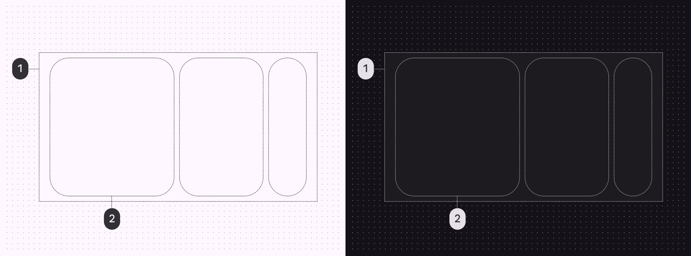
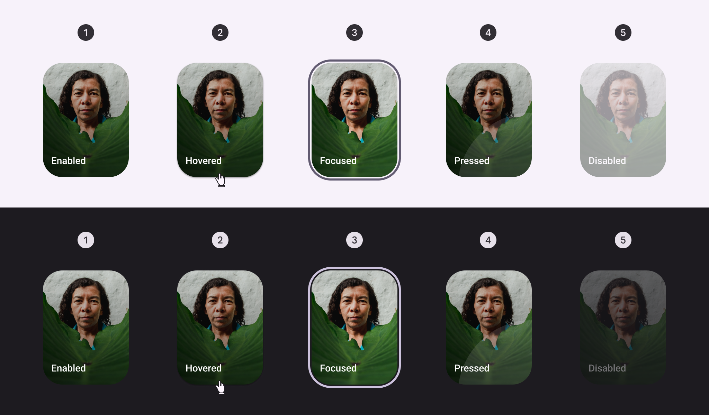
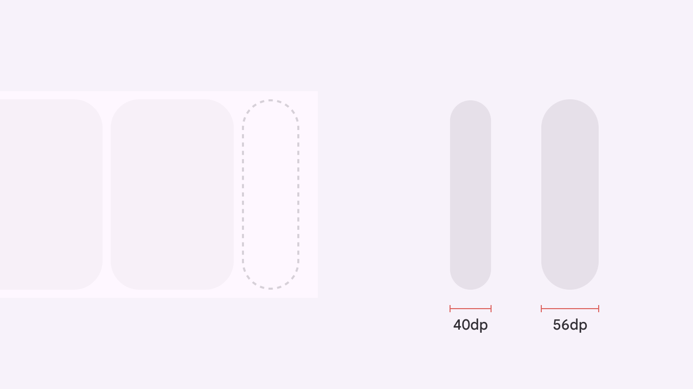
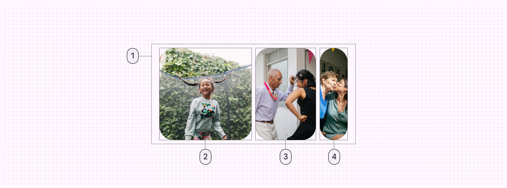

# Carousel

Carousels show a collection of items that can be scrolled on and off the screen

1. Container
2. Large carousel item
3. Medium carousel item
4. Small carousel item

## Tokens & specs

Browse the component elements, attributes, tokens, and their values. Carousel item

Token

Default, Light

Enabled

Hover

Focus

Pressed (ripple)

Disabled

## Color

Color values are implemented through design tokens [More on tokens](/m3/pages/design-tokens/overview). For design, this means working with color values that correspond with tokens. For implementation, a color value will be a token that references a value. [Learn more about design tokens](/m3/pages/design-tokens/overview/)

Carousel color roles used for light and dark schemes:

1. Container
2. Surface

## States [More on states](/m3/pages/interaction-states/overview) are visual representations used to communicate the status of a component or interactive element. [Learn more about interaction states](/m3/pages/interaction-states/overview)

1. Enabled
2. Hovered
3. Focused
4. Pressed
5. Disabled

## Carousel item dynamic widths

All kinds of carousel items dynamically adapt to the width of the container. Large items have a customizable maximum width that's used to optimally fit carousel items into the available space. Small carousel items have a minimum width of 40dp and a maximum width of 56dp. Items change size as they move through the carousel layout.

Small carousel items have a minimum and maximum width

## Multi-browse

The multi-browse layout shows at least one large, medium, and small carousel item.

1. Container
2. Large carousel item
3. Medium carousel item
4. Small carousel item

### Measurements

Multi-browse carousels have padding on both sides of the container

| Attribute | Value |
| --- | --- |
| Alignment | Vertically centered |
| Leading/trailing padding | 16dp |
| Top/bottom padding
 | 8dp |
| Padding between elements
 | 8dp |
| Large item width | Dynamic, or user-set |
| Medium item width | Dynamic |
| Small item width | 40–56dp, dynamic |
| Item corner radius | 28dp |

## Uncontained

The uncontained layout shows items that scroll to the edge of the container.

1. Container
2. Large carousel item

### Measurements

Uncontained carousel items bleed over the padding on each side when scrolling

| Attribute | Value |
| --- | --- |
| Alignment | Vertically centered |
| Leading padding | 16dp |
| Top/bottom padding
 | 8dp |
| Padding between elements
 | 8dp |
| Item corner radius | 28dp |

## Uncontained mutli-aspect ratio

The uncontained multi-aspect ratio layout shows carousel items of various widths.

1. Container
2. Carousel item (16:9)
3. Carousel item (9:16)
4. Carousel item (1:1)
5. Carousel item (3:4)

### Measurements

Uncontained multi-aspect ratio carousels only have leading padding, with 8dp of padding between items.

| Attribute | Value |
| --- | --- |
| Alignment | Vertically centered |
| Leading padding | 16dp |
| Top/bottom padding
 | 8dp |
| Padding between elements
 | 8dp |
| Item corner radius | 28dp |

## Hero

The hero layout shows at least one large item and one small item.

1. Container
2. Large carousel item
3. Small carousel item

### Measurements

Hero carousels have padding on both sides of the container

| Attribute | Value |
| --- | --- |
| Alignment | Vertically centered |
| Leading/Trailing padding | 16dp |
| Top/bottom padding | 8dp |
| Padding between elements | 8dp |
| Large item width | Dynamic |
| Small item width | 40-56dp, dynamic |
| Item corner radius | 28dp |

## Center-aligned hero

The center-aligned hero layout shows at least one large item and two small items.

1. Container
2. Large carousel item
3. Small carousel item

### Measurements

Center-aligned hero carousels have padding on both sides of the container

| Attribute | Value
 |
| --- | --- |
| Alignment | Vertically centered |
| Leading/Trailing padding | 16dp |
| Top/bottom padding | 8dp |
| Padding between elements | 8dp |
| Large item width | Dynamic |
| Small item width | 40-56dp, dynamic |
| Item corner radius | 28dp |

## Full-screen

The full-screen layout shows one edge-to-edge large item.

1. Container
2. Large carousel item

### Measurements

Full-screen carousels fill the window edge-to-edge

| Attribute | Value |
| --- | --- |
| Alignment | Centered |
| Leading/Trailing padding | 0dp |
| Top/bottom padding
 | 0dp |
| Padding between elements
 | 16dp |

