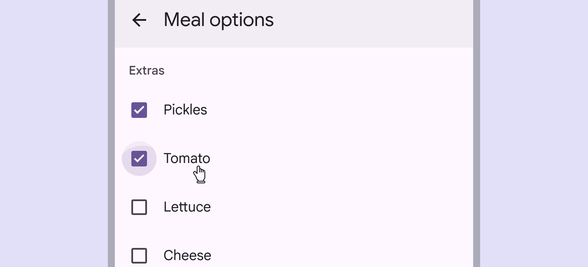
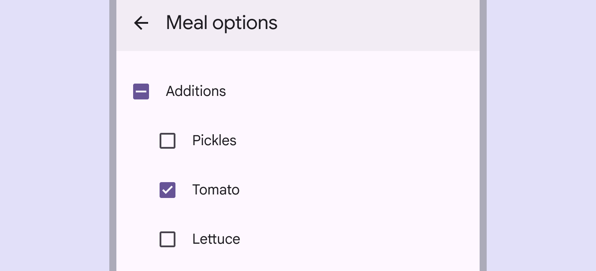
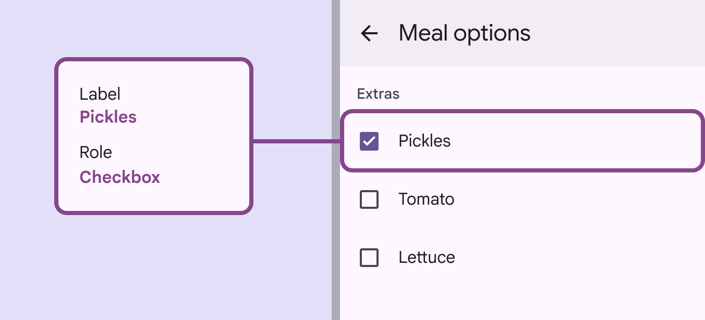

# Checkbox

Checkboxes let users select one or more items from a list, or turn an item on or off

## Use cases

People should be able to use assistive technology to:

- Navigate to a checkbox
- Toggle the checkbox on and off
- Get appropriate feedback based on input type documented under [Interaction & style](/m3/pages/checkbox/accessibility#6a2f55e5-2fa0-4204-b6d1-62362dda89c7)

## Interaction & style

Users should be able to select either the text label or the checkbox to select an option.

A checkbox selected via the text label

The parent checkbox has three states: selected, unselected, and indeterminate. Checkboxes can be selected or unselected regardless of the state of the other checkboxes in a group. If some, but not all, child checkboxes are checked, the parent checkbox becomes indeterminate. Selecting an indeterminate parent checkbox will check all of its child checkboxes.

An indeterminate selection indicating that at least one checkbox is selected within a group

## Avoid applying density by default

Don't apply density to checkboxes by default — this lowers their targets below our best practice of 48x48 CSS pixels. Instead, give people a way to choose a higher density, like selecting a denser layout or changing the theme. To ensure that this density setting can be easily reverted when it's active, keep all the targets to change it at minimum 48x48 CSS pixels each.

## Keyboard navigation

| Keys | Actions |
| --- | --- |
| **Tab** | Moves focus to enabled [More on enabled state](/m3/pages/interaction-states/applying-states#39b2fc90-01db-41b5-b6f8-47be61ed1479) chip or chip group |
| **Space** or **Enter** | Activates, selects, or deselects the focused chip |
| **Backspace** or **Delete** | Removes currently focused [More on focused state](/m3/pages/interaction-states/applying-states#bc6d6853-48ef-490e-8076-448e89e69f0f) input chip |
| **Arrows** | Moves focus between chips |

## Labeling elements

If the UI text is correctly linked to the checkbox, assistive tech (such as a screen reader) will read the UI text followed by the component’s role. The accessibility [More on accessibility](/m3/pages/overview/principles) label for an individual checkbox is typically the same as its adjacent text label.

The accessibility label clearly states the text label of the checkbox

