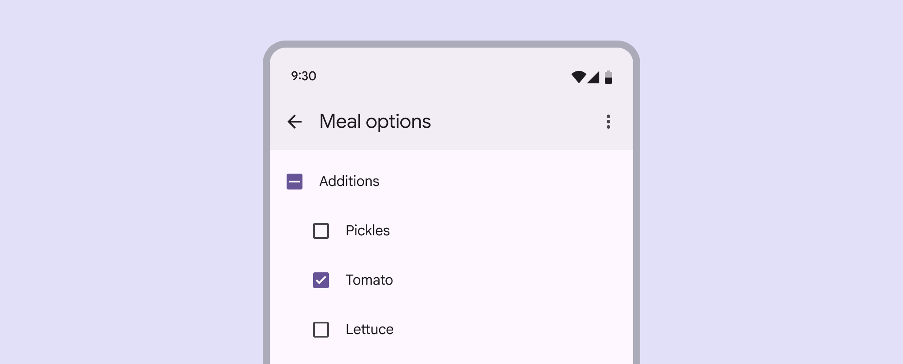
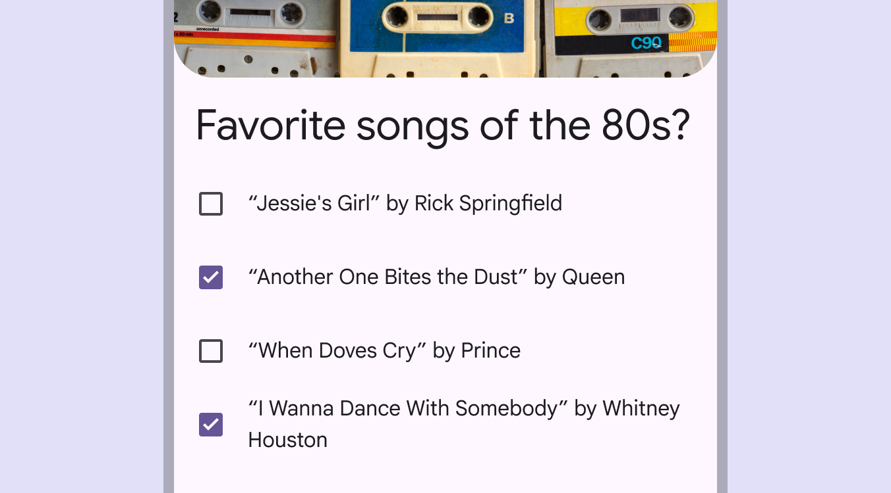
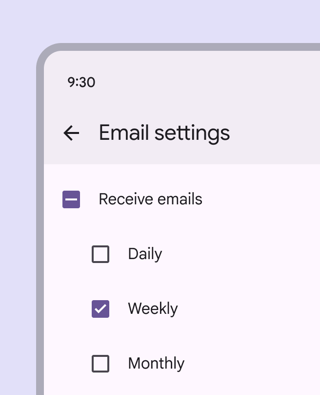
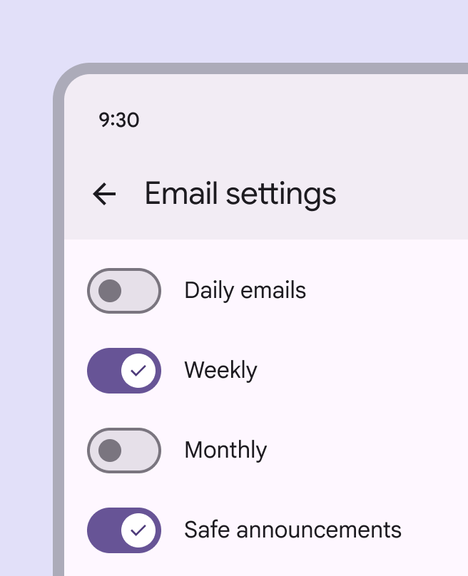
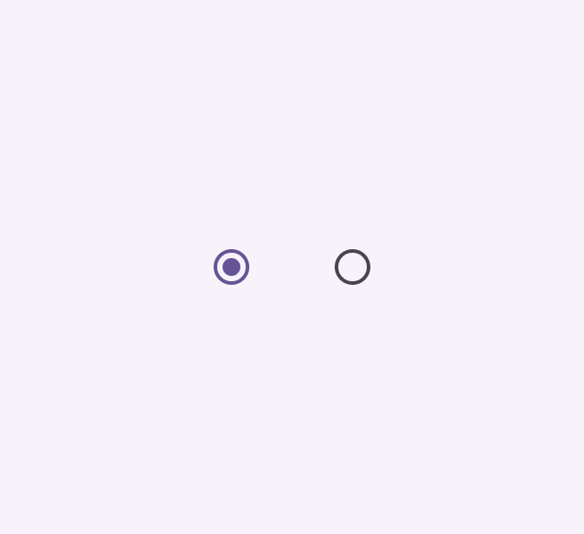
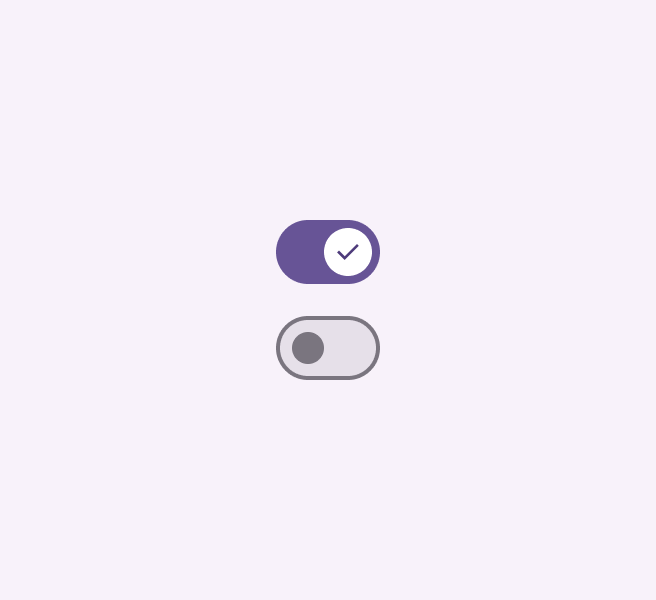
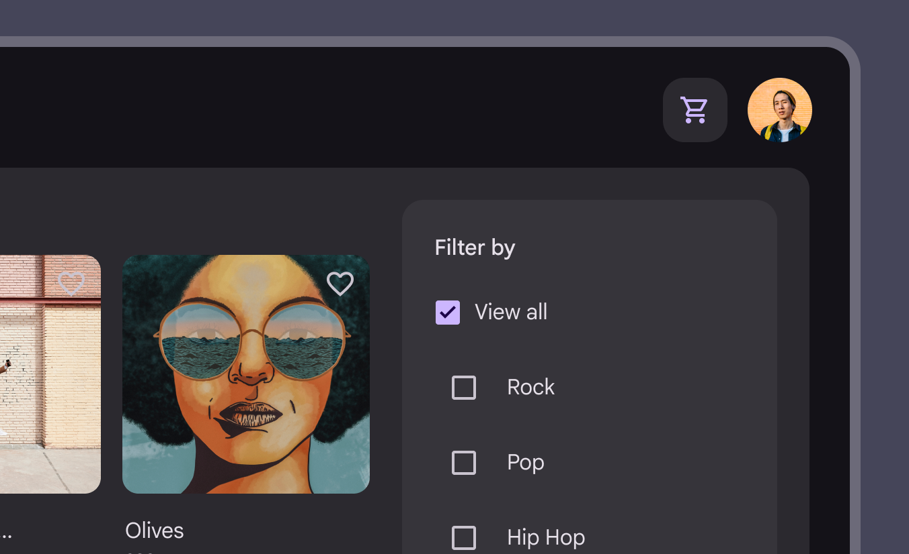

# Checkbox

Checkboxes let users select one or more items from a list, or turn an item on or off

Checkboxes in a list of items

## Usage

Use checkboxes to:


- Select one or more options from a list
- Present a list containing sub-selections
- Turn an item on or off in a desktop environment
- Visually group similar options together

Checkboxes select multiple, related options

Checkboxes should be used instead of switches [More on switches](/m3/pages/switch/overview) if multiple, related options can be selected from a list. Checkboxes visually group similar items effectively and take up less space than switches.

check Do

Checkboxes let users select one or more options from a list. A parent checkbox allows for easy selection or deselection of all items.

close Don’t

If a list consists of multiple options, don't use switches. Instead, use checkboxes. Checkboxes imply the items are related, and take up less visual space.

### Alternate selection controls

Checkboxes, radio buttons [More on radio buttons](/m3/pages/radio-button/overview), and switches [More on switches](/m3/pages/switch/overview) are the three main selection controls. They all help people make choices, like selecting options or switching settings on or off.

- Use checkboxes to select multiple related options in a list.
- Use radio buttons to select a single option in a list.
- Use switches to select standalone or more verbose options in a list, like settings.

Radio buttons

Switches

## Anatomy

1\. Container

2\. Icon

## Responsive layout

In expanded window sizes [More on expanded window size class](/m3/pages/applying-layout/expanded), placing checkboxes within a contained region such as a side sheet [More on side sheets](/m3/pages/side-sheets/overview) can help group related controls and available actions.

A side sheet can group related controls on larger screens

## Behavior

Multiple checkboxes in a list can be selected. Selecting multiple items in a list using checkboxes

Checkboxes can have a parent-child relationship with other checkboxes.

- When the parent checkbox is checked, all child checkboxes are checked
- If a parent checkbox is unchecked, all child checkboxes are unchecked
- If some, but not all, child checkboxes are checked, the parent checkbox becomes an indeterminate checkbox. Checking an indeterminate checkbox checks all child items. Use a parent checkbox to make it more efficient to select many items

When selected, a checkbox clearly and instantly communicates its selected state. If used to turn something on or off, the action should be immediately executed. Turning an item on or off using a checkbox

