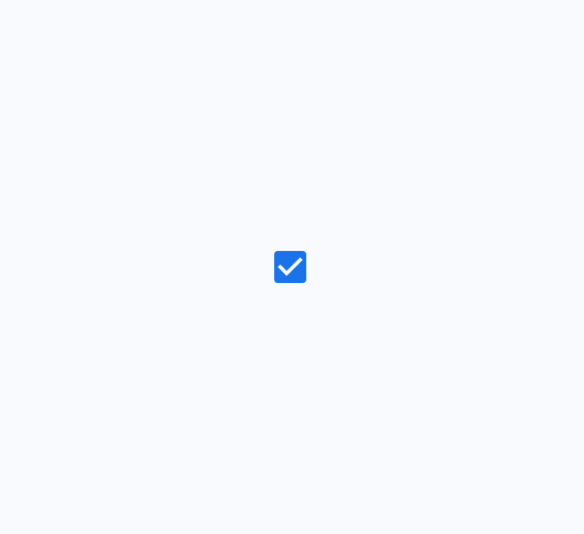

# Checkbox

Checkboxes let users select one or more items from a list, or turn an item on or off

- Use checkboxes (instead of switches [More on switches](/m3/pages/switch/overview) or radio buttons [More on radio buttons](/m3/pages/radio-button/overview)) if multiple options can be selected from a list [More on lists](/m3/pages/lists/overview)
- Label should be scannable
- Selected items are more prominent than unselected items

Unselected, selected (hover), and indeterminate checkboxes

## Availability & resources

| Type | Resource | Status |
| --- | --- | --- |
| Design | [Design Kit (Figma)](https://www.figma.com/community/file/1035203688168086460) | Available |
| Implementation |  | Available |
| Implementation | [Jetpack Compose](https://developer.android.com/develop/ui/compose/components/checkbox) | Available |
| Implementation |  | Available |
| Implementation |  | Available |

## Differences from M2

- Color: New color mappings and compatibility with dynamic color [More on dynamic color](/m3/pages/dynamic-color/overview)
- States [More on states](/m3/pages/interaction-states/overview): New indeterminate states as well as error states for unselected, selected, and indeterminate

M2

M3

