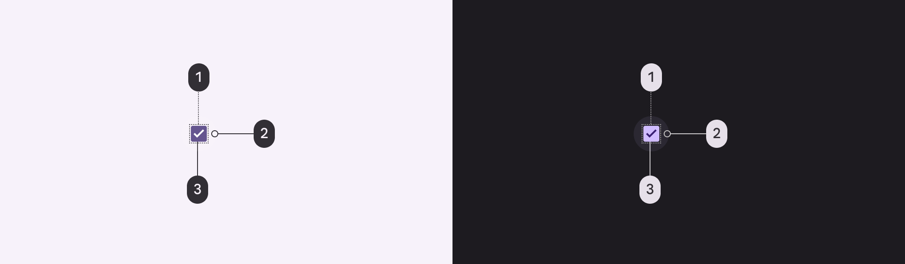
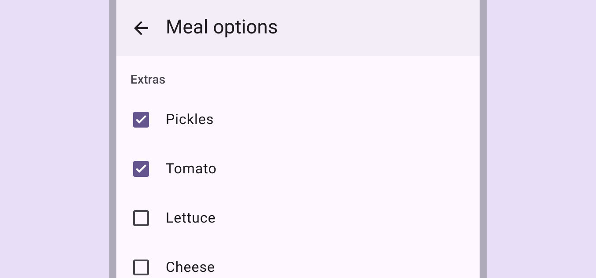
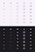
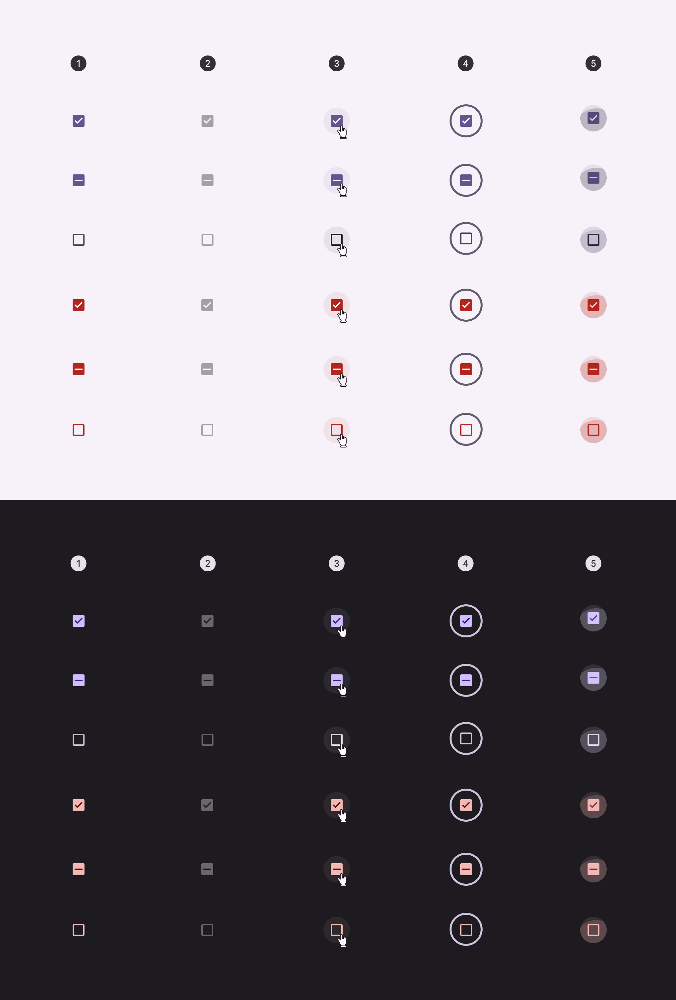

# Checkbox

Checkboxes let users select one or more items from a list, or turn an item on or off

## Tokens & specs

Browse the component elements, attributes, tokens, and their values. Checkbox

Token

Default, Light

Enabled

Disabled

Hovered

Focused

Pressed (ripple)

## Checkbox

1. Container
2. Icon

## Color

Color values are implemented through design tokens [More on tokens](/m3/pages/design-tokens/overview). For design, this means working with color values that correspond with tokens. For implementation, a color value will be a token that references a value. [Learn more about design tokens](/m3/pages/design-tokens/overview)

1. Checkbox
2. State-layer
3. Icon

### Adjacent text label color

Use the color role **on surface** for adjacent text labels. This remains the same even if interacting with the label or component.

The text color remains the same regardless if the checkbox is selected or not

## States

States are visual representations used to communicate the status of a component or interactive element. [Learn more about interaction states](/m3/pages/interaction-states/overview)

1. Enabled
2. Disabled
3. Hovered
4. Focused
5. Pressed

## Measurements

| Attribute | Value |
| --- | --- |
|
Container size

 |

18dp

 |
|

Container corner shape

 |

2dp

 |
|

Icon size

 |

18dp

 |
|

Icon alignment

 |

Center-aligned

 |
|

Target size

 |

48dp

 |
| State-layer size | 40dp |

