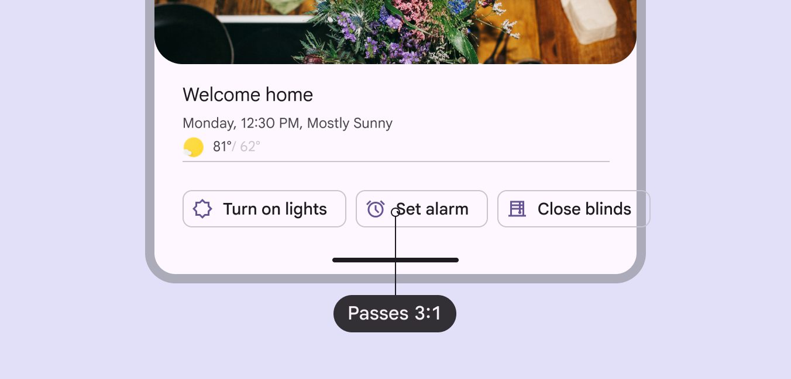
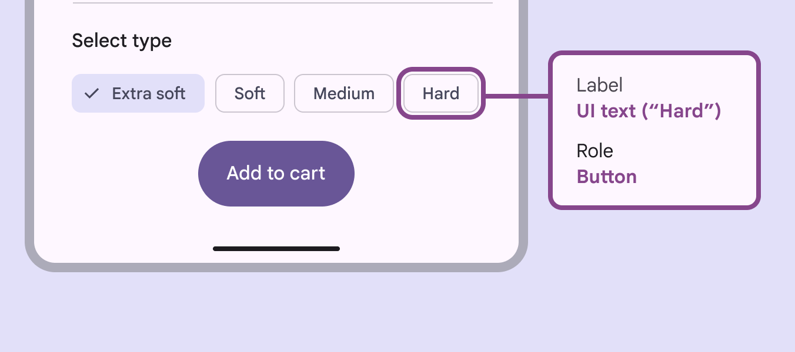
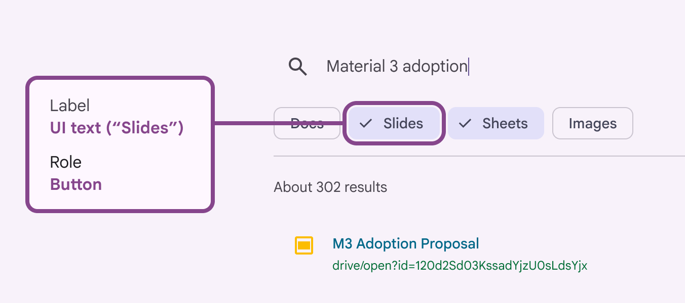
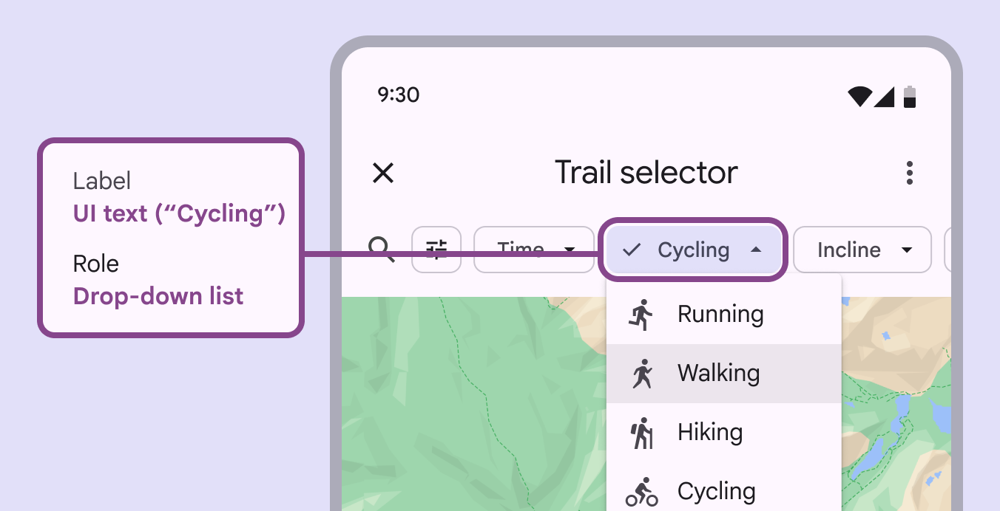
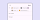
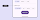
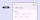
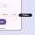
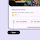

# Chips

Chips help people enter information, make selections, filter content, or trigger actions

## Use cases

People should be able to do the following with assistive technology:

- Use a chip to perform an action
- Navigate to a chip
- Activate a chip

## Interaction & style

The chip label needs at least 3:1 contrast with the background. A chip that performs an action should present the same semantics as a button [More on buttons](/m3/pages/common-buttons/overview) to a platform's accessibility API.

High contrast helps differentiate chips clustered together

### Horizontal overflow

When there are too many chips to fit on one row, provide a way to display them all at once and avoid scrolling. 

**Reflow method:** Use a filter chip as a leading element to reflow the horizontal list. This should shift down the content below and make room for all chips to show. The **Show all** filter chip is used to reflow the list, displaying all chips at once and pushing down the content below

**Menu method:** Create a leading button to display all chip options in a menu. Use this option to avoid shifting the position of the content below. Don’t use the menu method on chips with a second action, like a remove icon. The **Show all** leading button shows a menu of chip options, keeping the place of content below

### Avoid applying density by default

Don't apply density to chips by default — this lowers their targets below our best practice of 48x48 CSS pixels. Instead, give people a way to choose a higher density, like selecting a denser layout or changing the theme. To ensure that this density setting can be easily reverted when it's active, keep all the targets to change it at minimum 48x48 CSS pixels each.

## Keyboard navigation

| Keys | Actions |
| --- | --- |
| **Tab** | Moves focus to enabled [More on enabled state](/m3/pages/interaction-states/applying-states#79d4c7b3-bd64-49ba-90f1-3eeb62f1b328) chip or chip group |
| **Space** or **Enter** | Activates, selects, or deselects the focused chip |
| **Backspace** or **Delete** | Removes currently focused [More on focused state](/m3/pages/interaction-states/applying-states#bfc1624f-6bcc-4306-b0c1-425e2d8a1bf9) input chip |
| **Arrows** | Moves focus between chips |

## Labeling elements

|
Element

 |

A11y label

 |

Role (Web)

 |

Role (Android Views (MDC-Android))

 |

Role (Jetpack Compose)

 |
| --- | --- | --- | --- | --- |
|

Image / Icon within chip

 |

Hide image

 |

\-

 |

\-

 |

\-

 |
|

Basic chip (one action)

 |

“{chip content}”

 |

gridcell

 |

button

 |

button

 |
|

Selectable chip

 |

“{chip content}”

 |

gridcell

 |

radio button

 |

checkbox

 |
|

Remove icon (no other action)

 |

“Remove {chip content}”

 |

\-

 |

\-

 |

\-

 |
|

Two actions (e.g., select + remove)

 |

“{chip content}.” Then

“Remove {chip content}”.

 |

button or checkbox

 |

button or checkbox

 |

button or checkbox

 |

The accessibility label for a chip is the chip's label text. Additional actions, like remove, are labeled separately.

Accessibility tags should include both the label and role

### Multi-select

For multi-select chip sets, **Space** or **Enter** will select the focused chip and allow you to select all of the chips. **Space** or **Enter** will also deselect a focused selected chip. 

While multiple chips can be selected, only one can be in focus

### Drop-down list

The accessibility label should align with each list item’s text label. For list items with text and an icon, the accessibility label should be marked as decorative to avoid redundant verbalizations.

The accessibility label should be the text label

### Input chip remove action

Display the remove icon whenever a chip can be removed. On mobile, if remove is the only chip action, the remove icon isn't necessary. Instead the chip can be removed by selecting it and pressing the **Delete** key on the keyboard. Each chip is a focusable element. 

- If a chip only has a remove icon, the entire chip and icon are one focusable element.
- If a chip has a second action, like select, then the chip content and remove icon are two separate focusable elements.

The remove action is focused when the chip can also be selected

### Showing chip interactivity

Material requires that chips use a secondary indicator to show that they are interactive in context, allowing users with low vision and cognitive disabilities to see them. Use one of the following methods:


- Add a label before the chip group suggesting interaction, such as **Select type**

Labels introducing a chip group can indicate that they are selectable

- Provide interactive page context, such as **Filter results**, indicating chips can be selected to narrow results

Page context can indicate how search results will be narrowed by selecting chips

- Use the **outline** color role, instead of **outline variant**, to ensure a minimum 3:1 contrast
- Include an interactive chip label, such as **Turn on lights**, or leading icon

Chips can show they are interactive with a darker outline color stroke

Chips can also use a leading icon or label to show interactivity

