# Chips

Chips help people enter information, make selections, filter content, or trigger actions

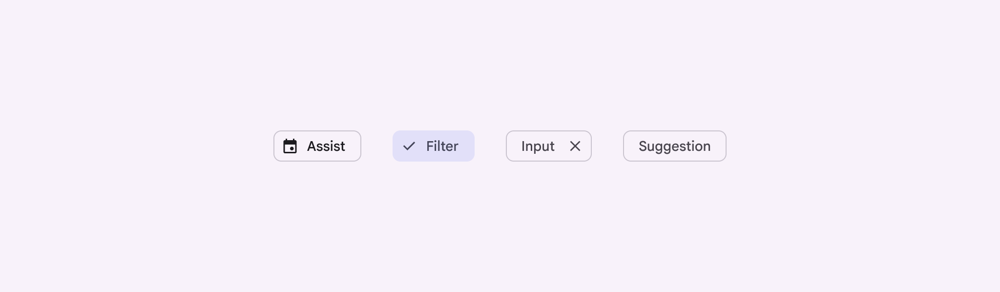

There are four variants of chips: Assist, filter, input, and suggestion

## Usage

Chips help people enter information, make selections, filter content, or trigger actions. They're best used to help people accomplish their current task faster and easier.

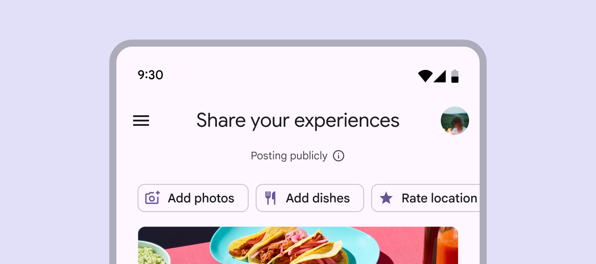

Chips appear as a group of interactive elements

### Chips aren’t buttons

Chips and buttons [More on buttons](/m3/pages/common-buttons/overview) are similar. They both provide visual cues to prompt people to take actions and make selections. While buttons appear consistently and with familiar calls to action, chips are dynamic to the situation, and appear as a group of interactive elements. Use chips to enhance a person's current journey and encourage action. Use buttons to progress them through the product and for significant actions.

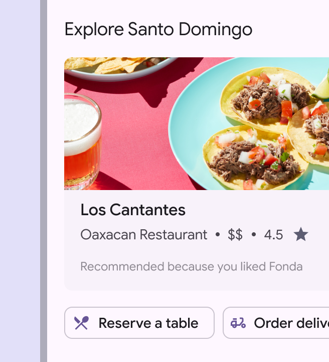

check Do

Use chips to present contextual, supplemental options

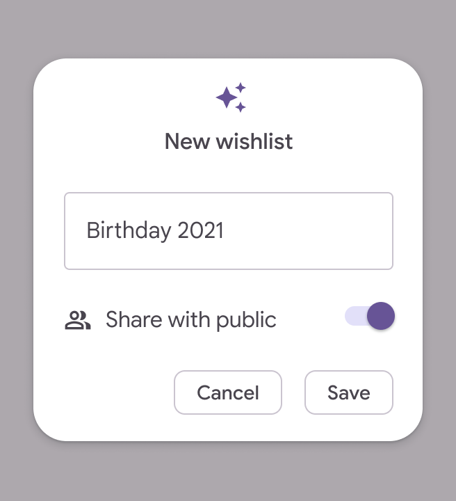

close Don’t

Avoid replacing major actions with chips. Actions that progress people to the next or previous step should always be displayed as buttons. Chips should dynamically offer various actions depending on the current task, whereas a button should be a persistent fixture of a layout. Chips represent forking paths for a current task, while buttons represent linear steps.

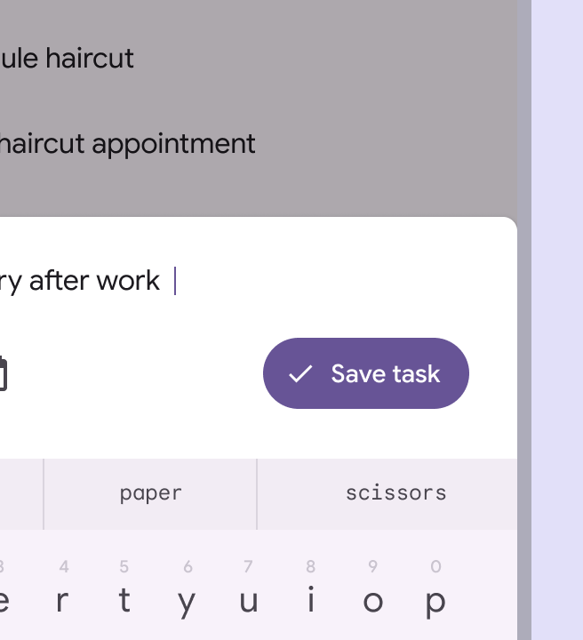

check Do

Use buttons for the final step in a task

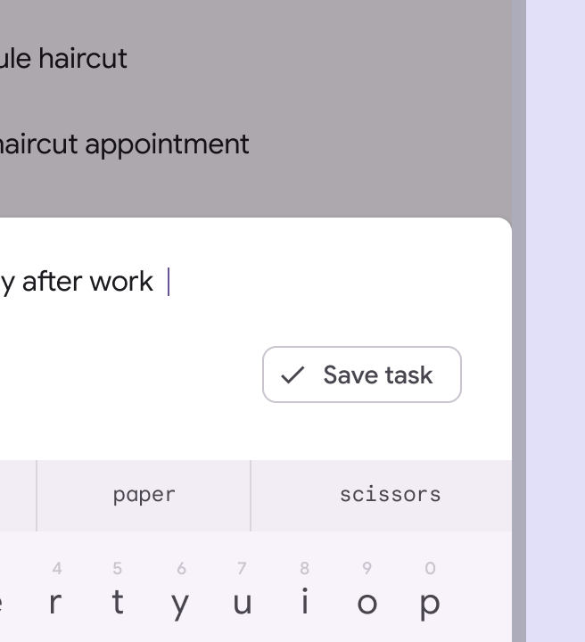

close Don’t

Avoid using chips to finish or progress a task

Multiple chips should appear together in a set, whereas there should be no more than 3 buttons in a single arrangement. Chip sets can be scrolled horizontally.

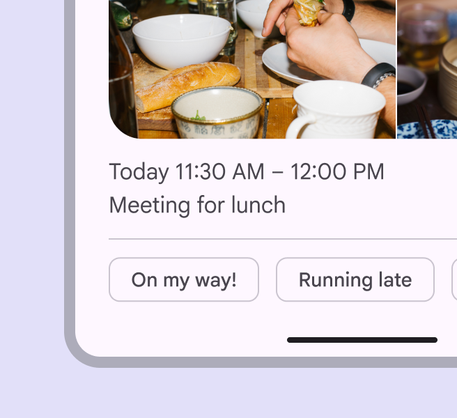

check Do

Chips can be scrolled horizontally

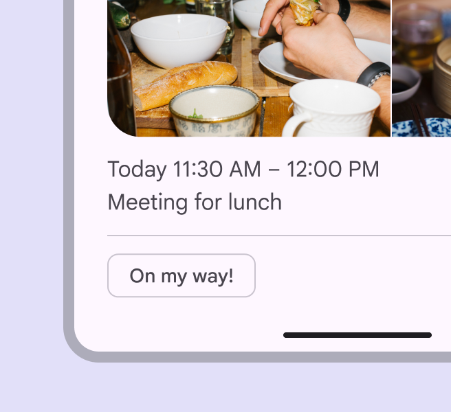

close Don’t

Don’t display a single chip by itself. Chips should appear in a set.

### Variants

Choose the chip variant based on its purpose and author. Does the chip represent an action (assist chip) or filter results (filter chip)? 

Is its content generated by the product (suggestion chip), or by the person using the product (input chip)?

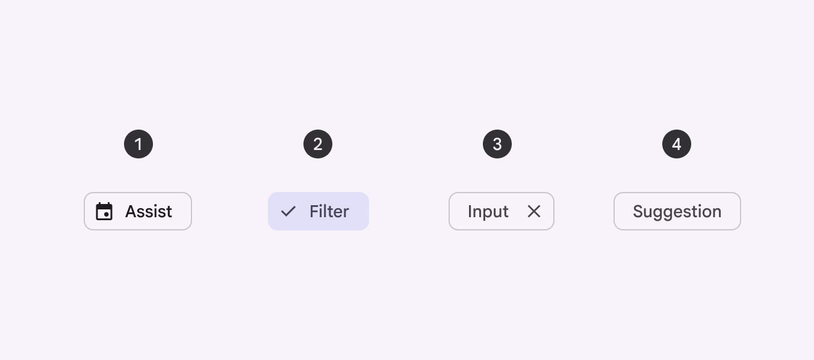

There are four chip variants: 

1. Assist
2. Filter
3. Input
4. Suggestion

|
Purpose

 |

Chip variant

 |

Rationale

 |

Example

 |
| --- | --- | --- | --- |
|

Action

 |

[Assist chip](/m3/pages/chips/guidelines#5dd1928c-1476-4029-bdc5-fde66fc0dcb1)

 |

Assist chips represent smart or automated actions that can span multiple apps

 |

**Add to calendar** action

 |
|

Filter

 |

[Filter chip](/m3/pages/chips/guidelines#8d453d50-8d8e-43aa-9ae3-87ed134d2e64)

 |

Filter chips represent filters for a collection

 |

Platform selector on material.io/components

 |
|

Information, user-authored

 |

[Input chip](/m3/pages/chips/guidelines#4d2d5ef5-3fcd-46e9-99f2-067747b2393f)

 |

Input chips represent discrete pieces of information entered by a person

 |

Gmail contact in the **To** field

 |
|

Information, product-authored

 |

[Suggestion chip](/m3/pages/chips/guidelines#36d7bb16-a9bf-4cf6-a73d-8e05510d66a7)

 |

Suggestion chips help narrow a person’s intent by presenting dynamically-generated suggestions

 |

Suggested chat response

 |

## Anatomy

1. Container
2. Label text
3. Leading icon or image (optional)
4. Trailing icon (required for input chips, optional for filter chips)

### Container

All chips are slightly rounded with an 8dp corner.

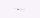

Chips have rounded corners

**Shadows & elevation**

Chip containers can be elevated if placed on top of an image or dynamic background.

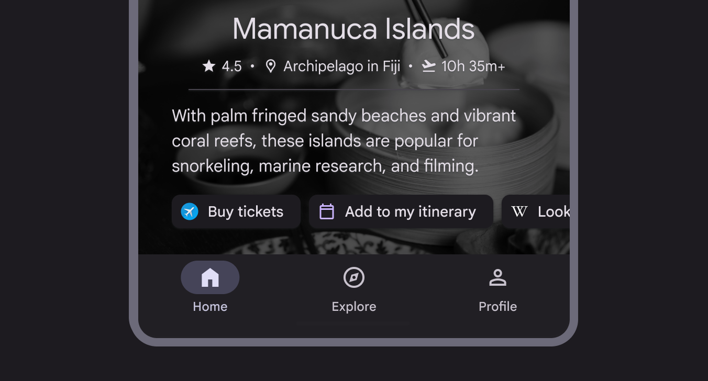

When on complicated backgrounds, chip containers can be elevated

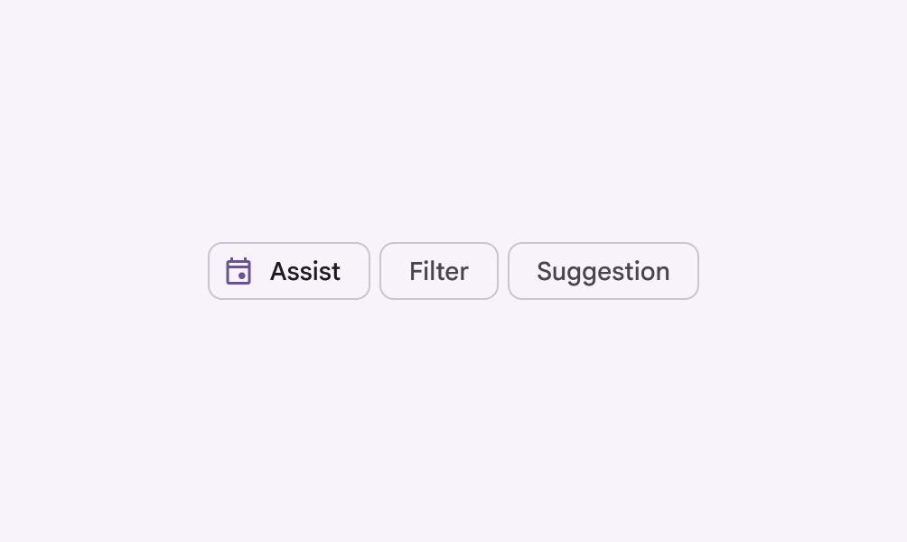

check Do

Use an outline to define the edge of the chip's container on regular backgrounds

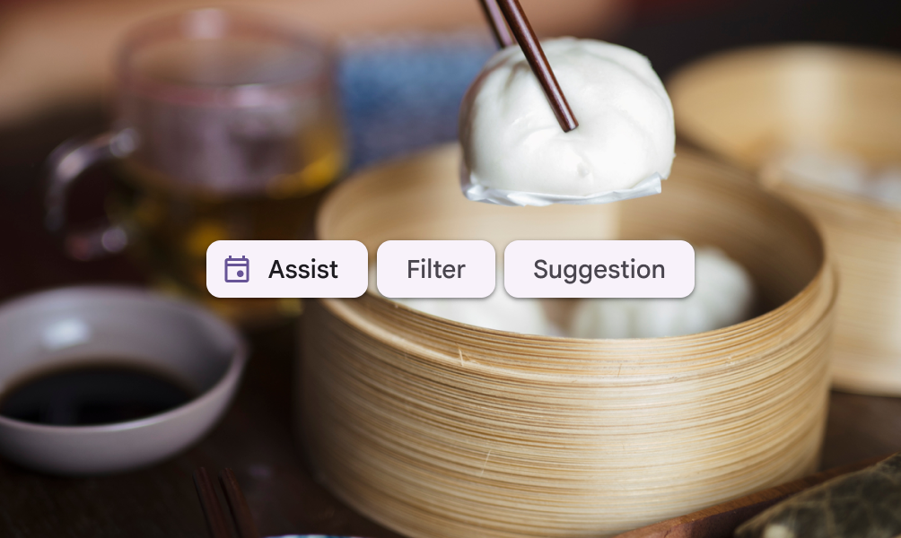

check Do

Chips may use elevation when placed on an image

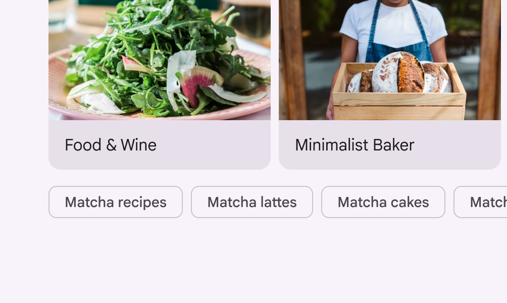

close Don’t

Chips shouldn't be elevated when placed directly on the page

close Don’t

Avoid using elevation to indicate a chip's pressed state. Instead, use the visual ripple effect.

### Label text

Chip label text should be 20 characters or fewer, and have the same typography style as buttons [More on buttons](/m3/pages/common-buttons/overview). Chip labels should remain brief for the limited space available. Skip conventional grammar rules, such as articles (take "a" walk), to save space.

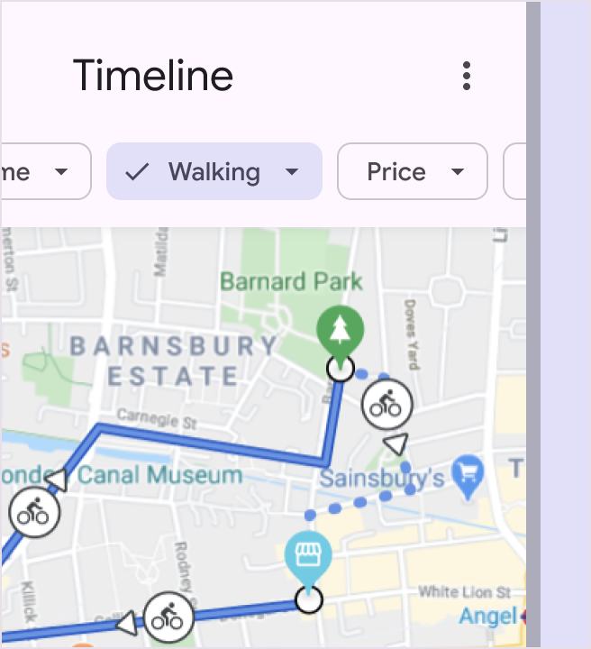

check Do

Keep chip labels short

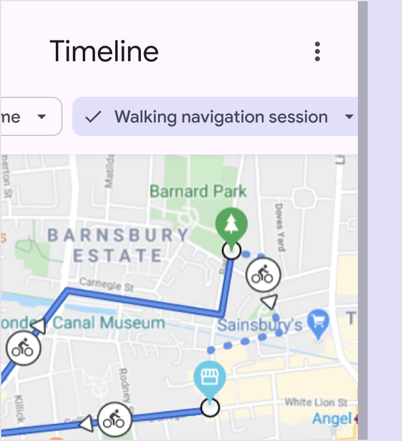

close Don’t

Avoid chip labels longer than 20 characters

### Leading icon or image (optional)

Chips can contain a leading icon, logo, or circular image. Use a system icon to help identify a chip's category.

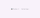

Chips can contain a logo, icon, or circular image

The leading icon color for unselected chips can be customized through theming. While the default color role [More on color roles](/m3/pages/color-roles) is **primary**, the **on surface variant** color role is a good alternative when the icon style requires less emphasis.

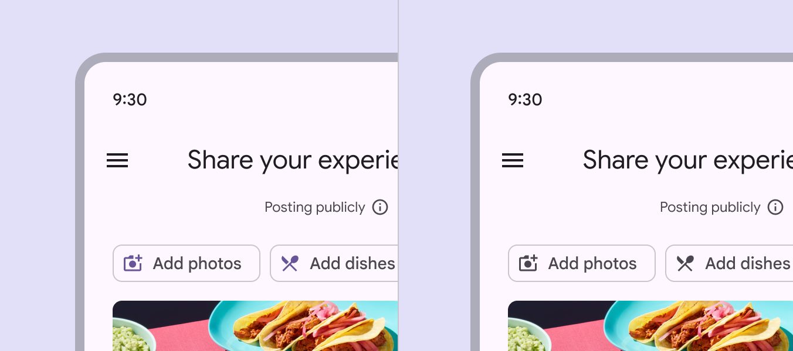

**Primary** color (left) and **on surface variant** color (right)

Leading circular images are sized larger than leading icons to provide more space for detail. Icons are designed to be legible at small sizes. See the [Specs tab](/m3/pages/chips/specs/) for precise measurement values.

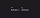

Leading images, such as avatars, are sized larger than leading icons or logos

### Trailing icon (optional, input and filter chips only)

The trailing icon is present for input and filter chips . On input chips, it's required and must be used to remove the chip. On filter chips, it's optional, and can be used to open a menu or remove the chip. Secondary actions (such as a trailing icon button for **Remove**) must have a 48x48dp interaction target that doesn’t interfere with the chip's primary action (such as **Edit** or **Drag**). To achieve this, apply a minimum width of 88dp to the chip, or 42dp to the label text.

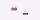

Interaction targets for actions like **Edit** or have a size of 48x48. This can be achieved by setting the minimum container width to 88dp.

## Assist chips

Assist chips represent smart or automated actions that can span multiple apps, such as opening a calendar event from the home screen. Assist chips function as though the person asked an assistant to complete the action. They should appear dynamically and contextually in a UI. An alternative to assist chips are buttons [More on buttons](/m3/pages/common-buttons/overview), which should appear persistently and consistently.

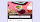

The text in most assist chips begins with a short verb, like **Get** or **Add**

An assist chip can surface supplemental information like a calendar event, as well as provide contextual actions

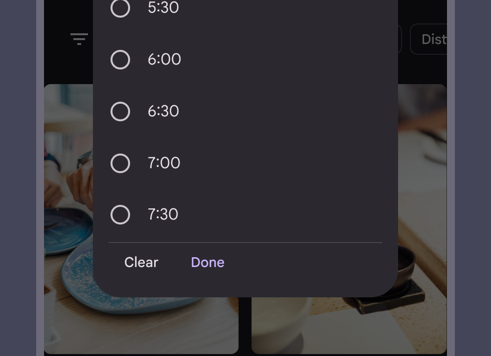

During an interaction, assist chips can transform into modals, transition into full-screen views of new content, or readjust to display more results inline

Assist chips can trigger an action or show progress and confirmation. Write assist chips like buttons: start with a verb. Adjust text dynamically if the state changes, like **Save** to **Saved**. Tapping an assist chip triggers a contextual action

Assist chips can show progress and confirmation feedback

Assist chips are displayed after primary content, such as below a card [More on cards](/m3/pages/cards/overview) or persistently at the bottom of a screen.

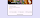

Assist chips should be shown underneath primary content

## Filter chips

Filter chips use tags or descriptive words to filter content. They can be a good alternative to segmented buttons [More on segmented buttons](/m3/pages/segmented-buttons/overview) or checkboxes [More on checkboxes](/m3/pages/checkbox/overview) when viewing a list or search results. Tapping on a filter chip activates it and appends a leading checkmark icon to the starting edge of the chip label. Write filter chips with nouns that describe the category to **include** in the results. Avoid negative phrases like **Exclude images**.

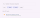

Filter chips rely on tags or descriptive words to filter content

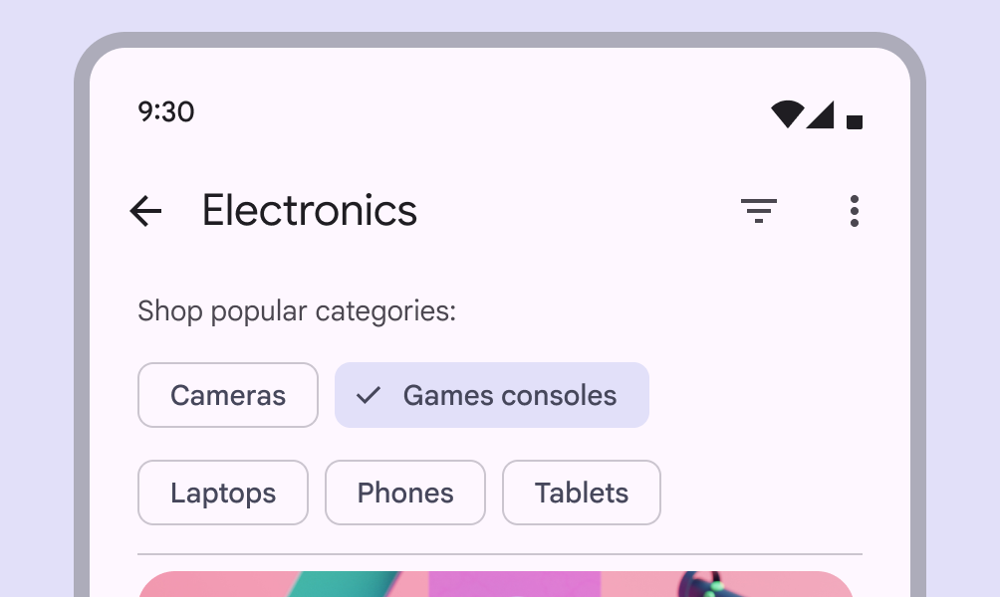

Filter chips in a shopping app

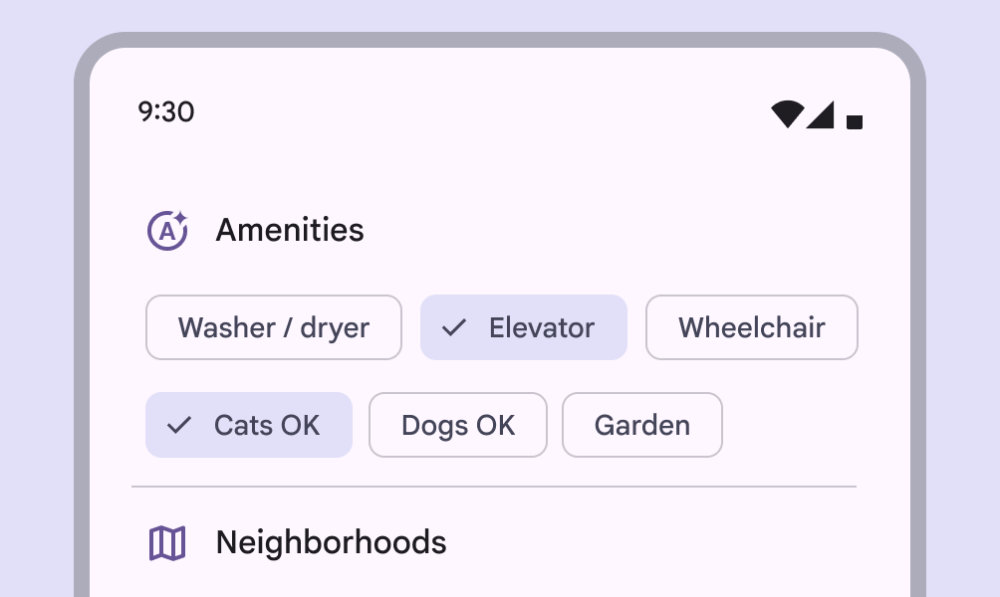

Filter chips in a real estate app

Tap a chip to select it. Multiple chips can be selected or unselected.

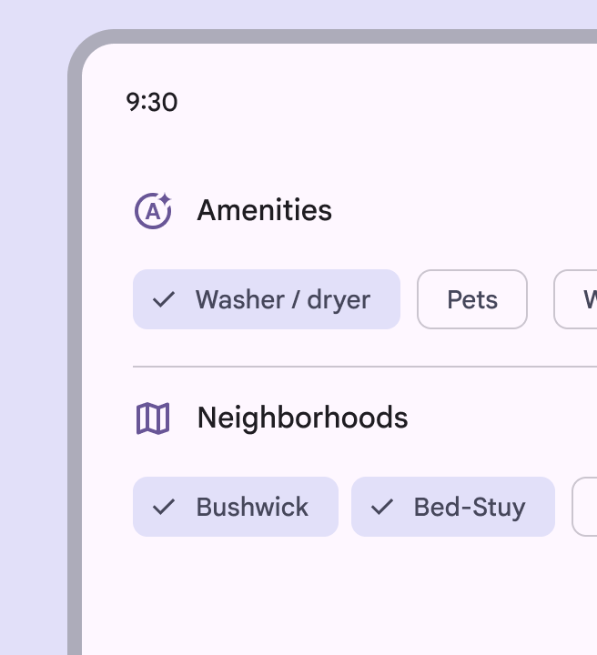

An icon can be added to indicate when a filter chip is selected

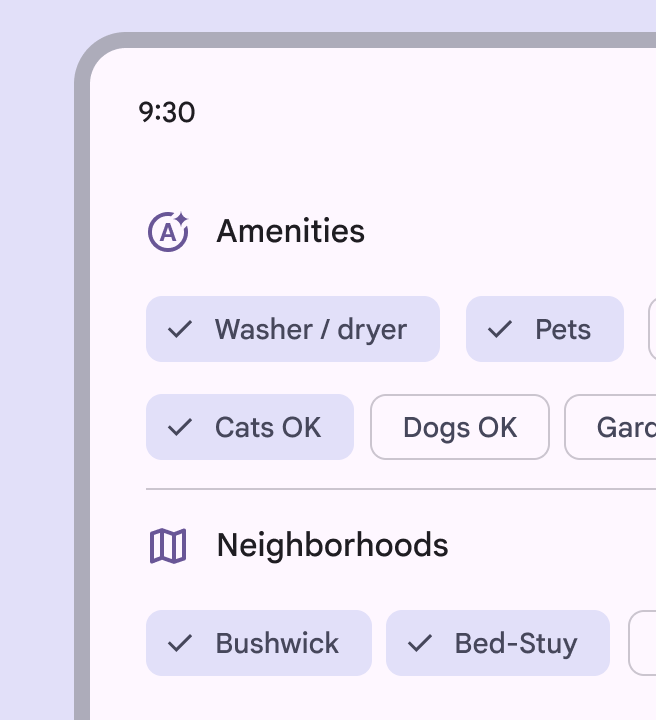

Filter chip suggestions can dynamically change as a person starts to select filters

Alternatively, a single chip can be selected. This offers an alternative to segmented buttons [More on segmented buttons](/m3/pages/segmented-buttons/overview), radio buttons [More on radio buttons](/m3/pages/radio-button/overview), or single select menus [More on menus](/m3/pages/menus/overview). However, avoid mixing chip set behaviors. All chip sets on a page should be either single-select or multi-select. Filter chips can be set so that selecting a single chip automatically deselects all other chips in the set

In medium [More on medium window size class](/m3/pages/applying-layout/medium) and expanded window sizes [More on expanded window size class](/m3/pages/applying-layout/expanded), filter chips may contain a trailing icon to directly remove the chip or open a menu of options. In compact windows [More on compact window size class](/m3/pages/applying-layout/compact), the trailing icon's target area is too small to be accessible on its own. However, if the whole chip can be selected to accomplish the action, the chip is likely still accessible.

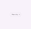

The remove icon helps users remove the filter

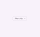

Filter chips can open a menu for more filtering options

When combined with a Menus display a list of choices on a temporary surface. More on menus [More on menus](/m3/pages/menus/overview), the filter chip opens a list of selectable options.

exclamation Caution

In compact windows, make sure the whole chip opens the menu. Otherwise, the target area is likely too small to be accessible. Filter chips can be used with other components, such as Search lets people enter a keyword or phrase to get relevant information. More on search [More on search](/m3/pages/search/overview) fields and sheets [More on side sheets](/m3/pages/side-sheets/overview).

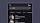

Filter chips can be shown underneath a search field

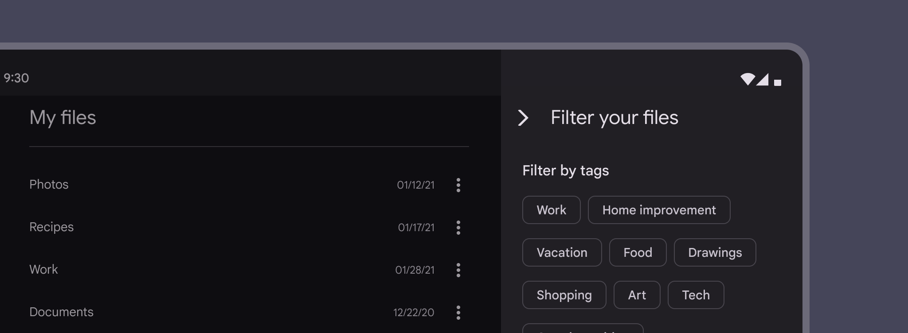

Use a side sheet to organize many filter chips

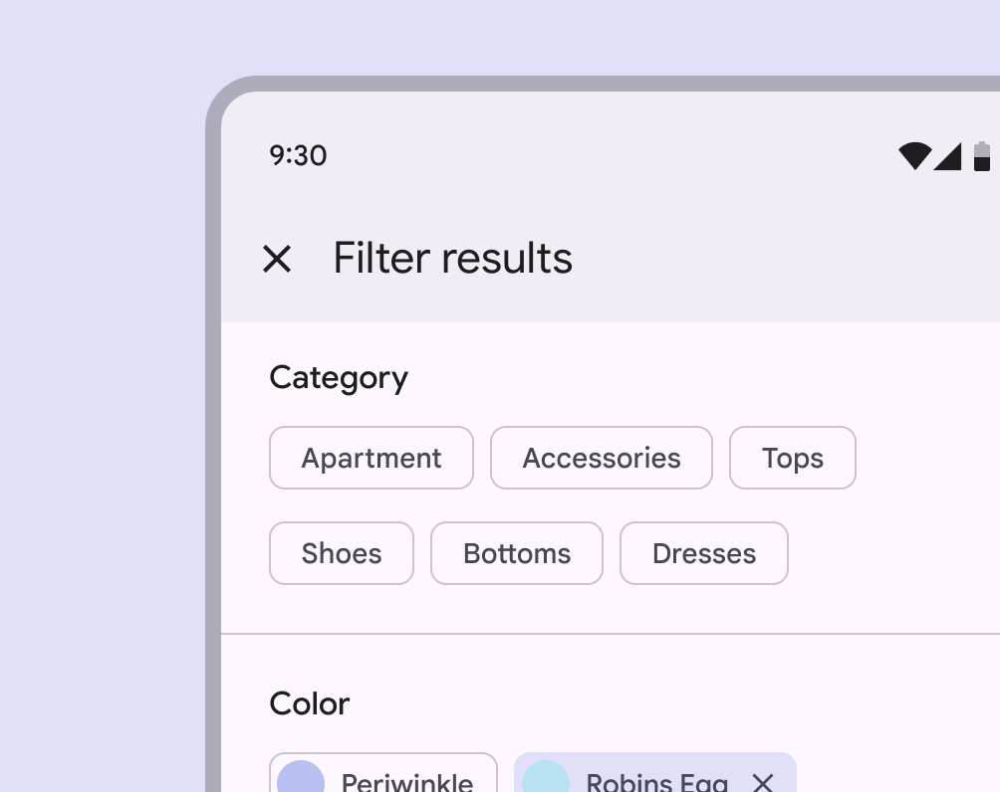

Filter chips can wrap to a new row. If there are more than two rows, consider using horizontal scrolling to access them all.

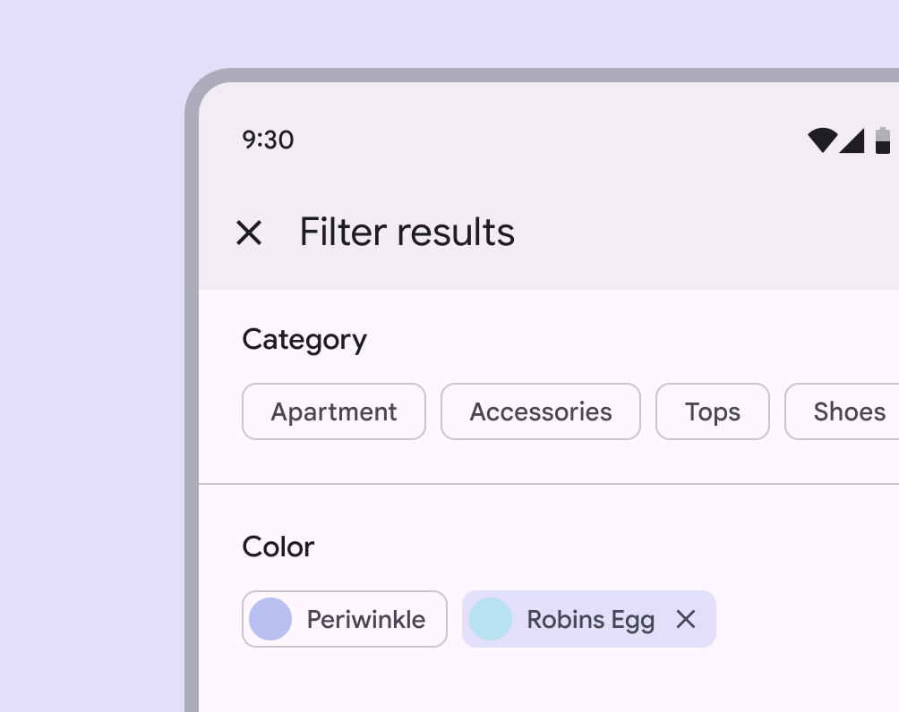

Filter chips can scroll horizontally to show many options

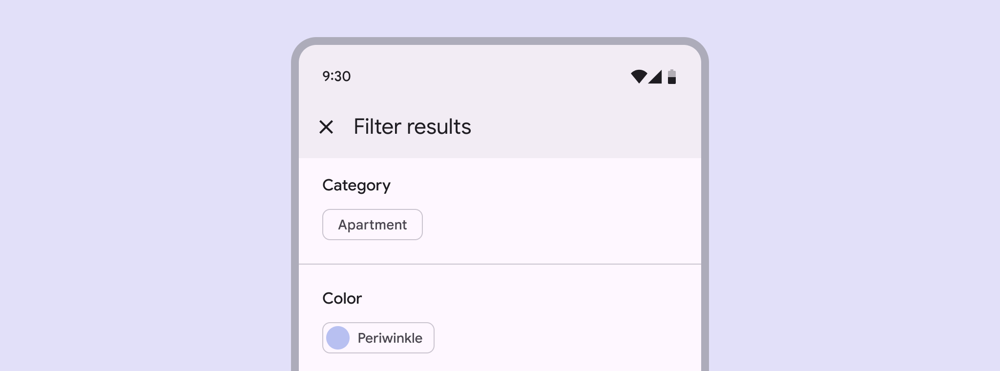

close Don’t

Filter chips should not present only a single option

## Input chips

Input chips represent discrete pieces of information entered by a person, such as Gmail contacts or filter options within a Search lets people enter a keyword or phrase to get relevant information. More on search [More on search](/m3/pages/search/overview) field. They enable user input and verify that input by converting text into chips.

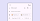

Input chips transform text based on a person's input

Input chips can support editing to change their contents, such as correcting an email address. In edit mode, the chip reverts back to a text string. Editing can be triggered by interacting with the chip, either by selecting it or by a second interaction after selection. Input chips converted from email addresses are editable

Using the backspace key with the cursor before a chip selects the entire chip. The chip can then be deleted when the user taps the backspace key again. A single field can contain multiple input chips . These chips can be reordered or moved into other fields.

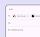

Multiple input chips in one field

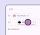

Input chips being moved from one field to another

Input chips can expand to show more information or options. A container transform transition pattern is used to reveal additional content. Input chips can expand

### Placement

Input chips can be integrated with other components. They can appear:

- Inline with the cursor in a text field
- In a stacked list
- In a list that can be horizontally scrolled

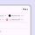

Input chips can wrap to a new row if all chips need to be visible

Input chips can scroll horizontally

### Icons & images

The leading icon of input chips can be an icon, logo, or circular image.

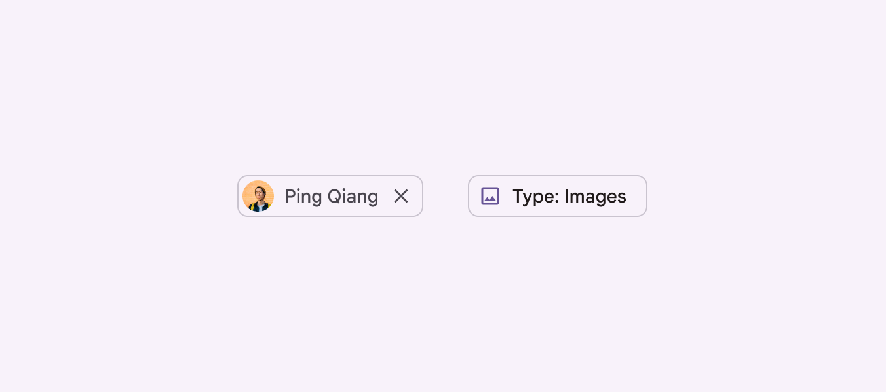

Input chips can contain an icon, logo, or circular image

The trailing icon is always aligned to the end side of the container. It’s placed:

- On the right for left-to-right (LTR) languages, such as English
- On the left for right-to-left (RTL) languages, such as Farsi

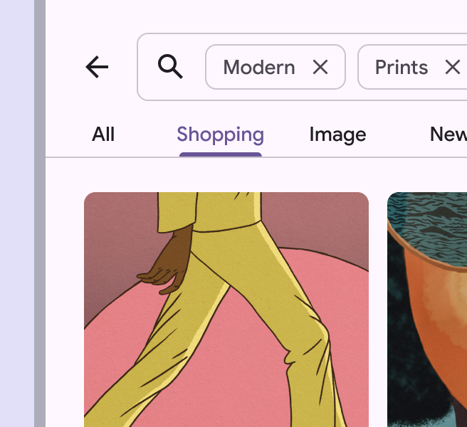

Input chips can be a more flexible way to filter search results, compared to filter chips

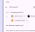

Input chips make it easier to add and remove contacts

Overflowed chips in a text field should follow the same behavior as regular text. An unfocused text field with overflowed content should display the beginning of the input. Tapping the field snaps the user to the end of the input with the cursor and keyboard active.

## Suggestion chips

Suggestion chips help narrow a user’s intent by presenting dynamically generated suggestions, such as possible responses or search filters. Write suggestion chips as nouns or short phrases, depending on context. Avoid exceeding 20 characters when possible.

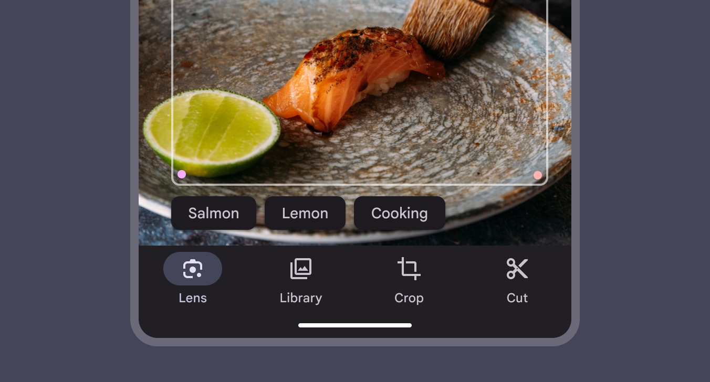

The text labels within suggestion chips are most often nouns or short phrases

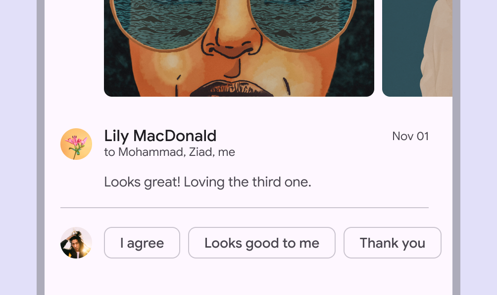

Suggestion chips can offer quick-reply options in a chat or email app

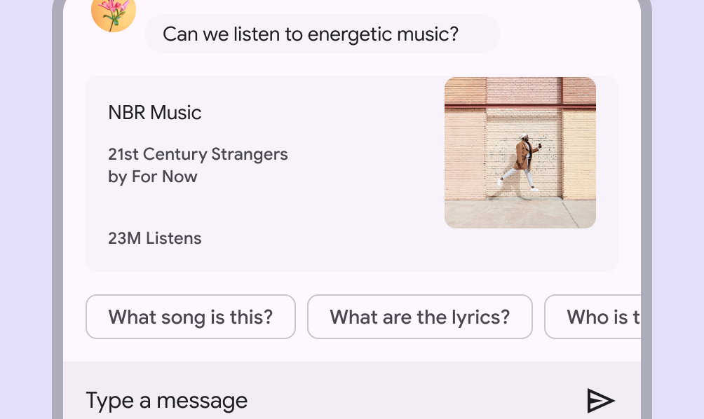

A suggestion chip can help the user start a search

### Placement

When displaying multiple chips together, place them inline as a row of options, not listed vertically. Overflowing chips should break to the next line. If the field is only one row high, chip sets can scroll horizontally instead. Keep an 8dp minimum space between chips. Chips must also have a minimum 48dp target size, regardless of placement or density. If required, the target can extend beyond the visible container of the chip. Text labels for chips should be concise. Chip labels will truncate when in a wrapped layout, and when they are wider than the full width of the window.

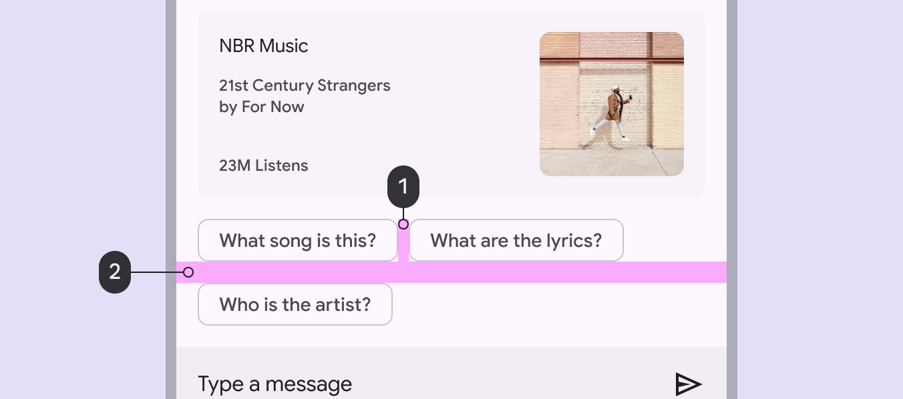

1. Margins between chips
2. Margin between each line

