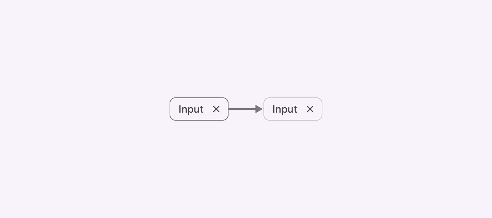
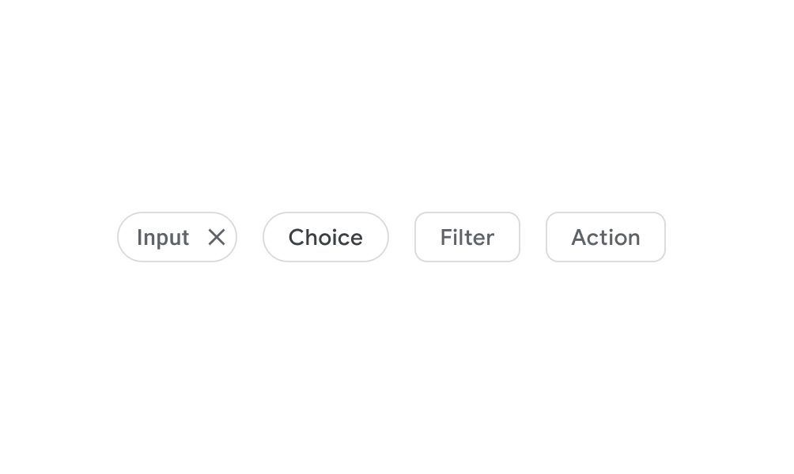
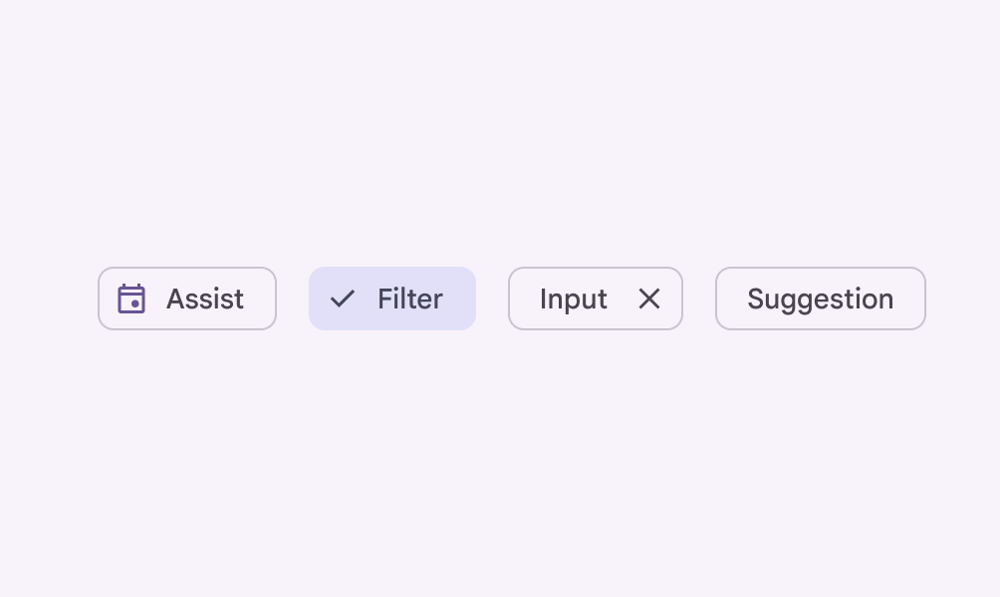

# Chips

Chips help people enter information, make selections, filter content, or trigger actions

- Use chips to show options for a specific context
- Four variants: assist , filter , input , and suggestion
- Chip elevation [More on elevation](/m3/pages/elevation/overview) defaults to 0 but can be elevated if they need more visual separation

1. Assist chip
2. Filter chip
3. Input chip
4. Suggestion chip

## Availability & resources

| Type | Resource | Status |
| --- | --- | --- |
| Design | [Design Kit (Figma)](https://www.figma.com/community/file/1035203688168086460) | Available |
| Implementation |  | Available |
| Implementation | [Jetpack Compose](https://developer.android.com/develop/ui/compose/components/chip) | Available |
| Implementation |  | Available |
| Implementation |  | Available |

## Updates

**Aug 2024**

Updated stroke color from **outline** to **outline variant**.

The stroke color was softened to improve visual hierarchy between chips and buttons

## Differences from M2

- Color: New color mappings and compatibility with dynamic color [More on dynamic color](/m3/pages/dynamic/choosing-a-source)
- Shape: Rounded rectangle
- Variants: Action chips have been separated into assist chips and suggestion chips . Choice chips are now a subset of filter chips

M2: Variants of chips are input, choice, filter, and action chips

M3: Variants of chips updated to assist, filter, input, and suggestion chips

