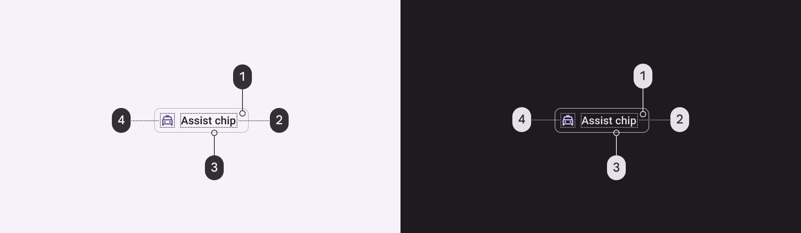
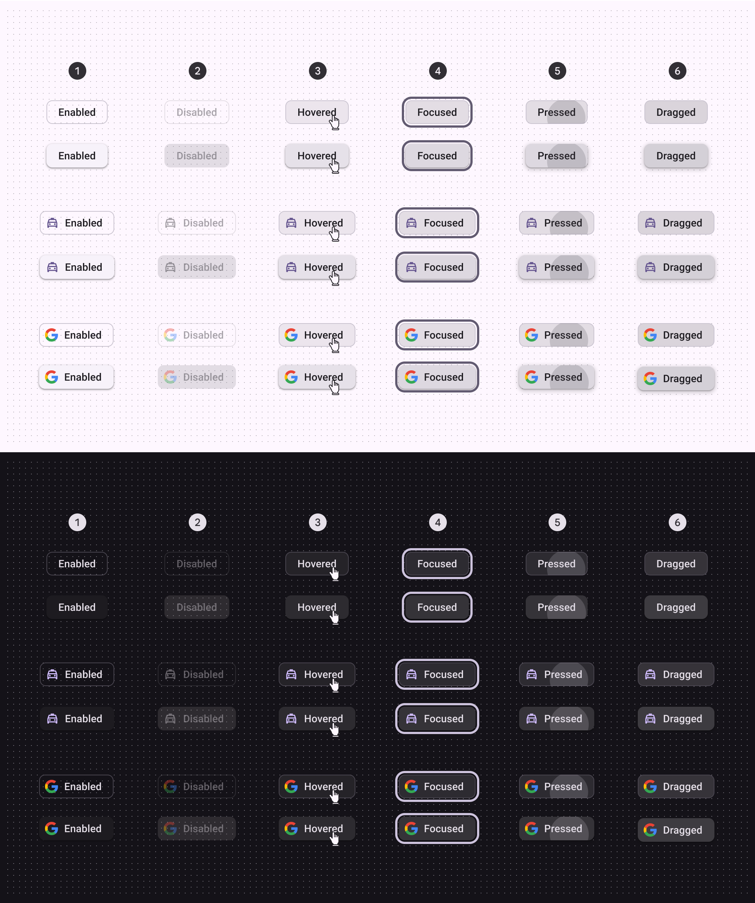
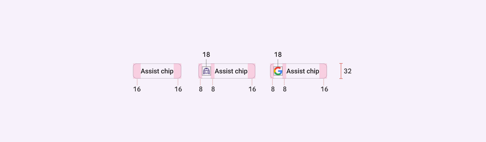
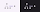
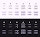
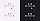
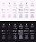
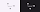
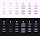

# Chips

Chips help people enter information, make selections, filter content, or trigger actions

## Tokens & specs

Select a component variant below to see its elements, attributes, tokens, and values.

```
Chip - Assist
```

```
Chip - Assist
```

```
Chip - Assist
```

```
Chip - Assist
```

Chip - Assist

Token

Default, Light

Enabled

Disabled

Hovered

Focused

Pressed (ripple)

Dragged

## Assist chip


1. Container
2. Label text
3. Leading icon

### Assist chip color

Color values are implemented through design tokens [More on tokens](/m3/pages/design-tokens/overview). For design, this means working with color values that correspond with tokens. For implementation, a color value will be a token that references a value. [Learn more about design tokens](/m3/pages/design-tokens/overview)



Assist chip color roles used for light and dark themes:

1. Surface container low (optional)
2. On surface
3. Outline
4. Primary

### Assist chip states

States [More on states](/m3/pages/interaction-states/overview) are visual representations used to communicate the status of a component or interactive element. [Learn more about interaction states](/m3/pages/interaction-states/overview)



Selected and unselected assist chip states:

1. Enabled
2. Disabled
3. Hovered
4. Focused
5. Pressed
6. Dragged

### Assist chip measurements



Assist chip padding and size measurements

| Attribute
 | Value
 |
| --- | --- |
| Height
 | 32dp |
| Shape
 | 8dp corner radius |
| Icon size
 | 18dp |
| Vertical label text alignment
 | Center-aligned |
| Horizontal label text alignment
 | Start-aligned |
| Left/right padding
 | 16dp |
| Left/right padding with icon
 | 8dp |
| Padding between elements
 | 8dp |

## Filter chip


1. Container
2. Label text
3. Leading icon
4. Trailing icon

### Filter chip color

Color values are implemented through design tokens [More on tokens](/m3/pages/design-tokens/overview). For design, this means working with color values that correspond with tokens. For implementation, a color value will be a token that references a value. [Learn more about design tokens](/m3/pages/design-tokens/overview)



Filter chip color roles used for light and dark themes:

1. On surface variant
2. On secondary container
3. Secondary container
4. Outline variant
5. Surface container low (optional)

### Filter chip states

States [More on states](/m3/pages/interaction-states/overview) are visual representations used to communicate the status of a component or interactive element. [Learn more about interaction states](/m3/pages/interaction-states/overview)



Selected and unselected filter chip states:

1. Enabled
2. Disabled
3. Hovered
4. Focused
5. Pressed
6. Dragged

### Filter chip measurements


Filter chip padding and size measurements

| Attribute
 | Value
 |
| --- | --- |
| Container height
 | 32dp |
| Container shape
 | 8dp corner radius |
| Icon size
 | 18dp |
| Vertical label text alignment
 | Center-aligned |
| Horizontal label text alignment
 | Start-aligned |
| Left/right padding
 | 16dp |
| Left/right padding with icon
 | 8dp |
| Padding between elements
 | 8dp |

## Input chip


1. Container
2. Label text
3. Trailing icon
4. Leading icon

### Input chip color

Color values are implemented through design tokens [More on tokens](/m3/pages/design-tokens/overview). For design, this means working with color values that correspond with tokens. For implementation, a color value will be a token that references a value. [Learn more about design tokens](/m3/pages/design-tokens/overview)



Input chip color roles used for light and dark themes:

1. On surface variant
2. Surface container low (optional)
3. On surface variant
4. On surface variant
5. Outline variant
6. Primary
7. Secondary container
8. On secondary container
9. On secondary container

### Input chip states

States [More on states](/m3/pages/interaction-states/overview) are visual representations used to communicate the status of a component or interactive element. [Learn more about interaction states](/m3/pages/interaction-states/overview)



Selected and unselected input chip states:

1. Enabled
2. Disabled
3. Hovered
4. Focused
5. Pressed
6. Dragged

### Input chip measurements


Input chip padding and size measurements

| Attribute
 | Value
 |
| --- | --- |
| Container height
 | 32dp |
| Container shape
 | 8dp corner radius |
| Icon size
 | 18dp |
| Avatar shape
 | 12dp corner radius |
| Avatar size
 | 24dp |
| Vertical label text alignment
 | Center-aligned |
| Horizontal label text alignment
 | Start-aligned |
| Left padding for avatar
 | 4dp |
| Right padding for avatar
 | 8dp |
| Left/right padding for icon
 | 8dp |
| Padding between elements
 | 8dp |
| Target size for close icon
 | Min 48dp |

## Suggestion chip


1. Container
2. Label text

### Suggestion chip color

Color values are implemented through design tokens [More on tokens](/m3/pages/design-tokens/overview). For design, this means working with color values that correspond with tokens. For implementation, a color value will be a token that references a value. [Learn more about design tokens](/m3/pages/design-tokens/overview)



Suggestion chip color roles used for light and dark themes:

1. Outline
2. Surface container low (optional)
3. On surface variant

### Suggestion chip states

States [More on states](/m3/pages/interaction-states/overview) are visual representations used to communicate the status of a component or interactive element. [Learn more about interaction states](/m3/pages/interaction-states/overview)



Selected and unselected suggestion chip states:

1. Enabled
2. Disabled
3. Hovered
4. Focused
5. Pressed
6. Dragged

### Suggestion chip measurements


Suggestion chip padding and size measurements

| Attribute
 | Value
 |
| --- | --- |
| Container height
 | 32dp |
| Container shape
 | 8dp corner radius |
| Icon size
 | 18dp |
| Vertical label text alignment
 | Center-aligned |
| Horizontal label text alignment
 | Start-aligned |
| Left/right padding without icon
 | 16dp |
| Left/right padding with icon
 | 8dp |
| Padding between elements
 | 8dp |

