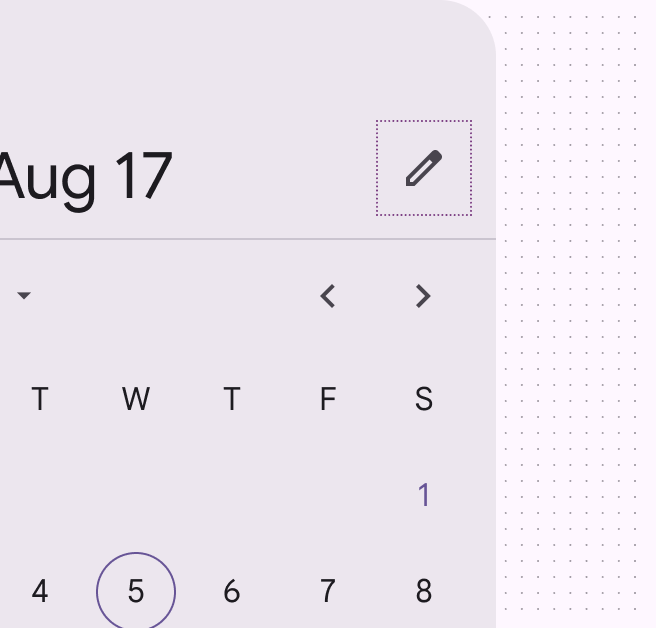
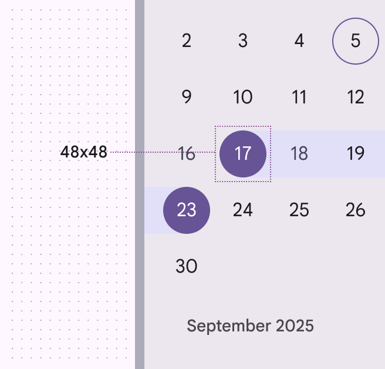
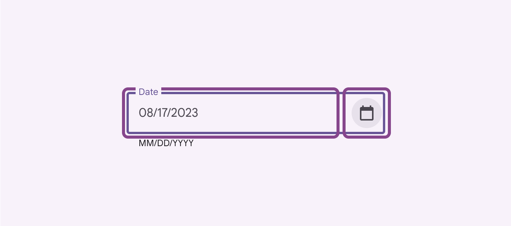
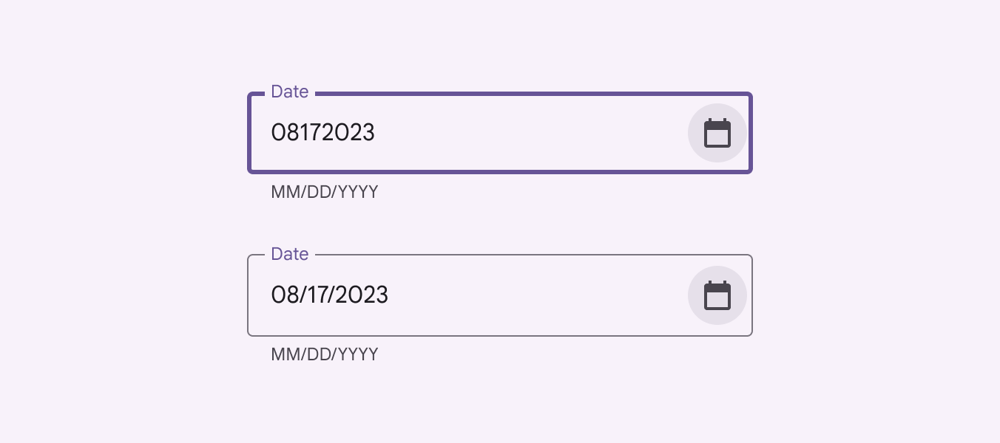
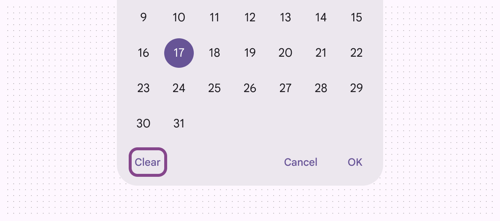
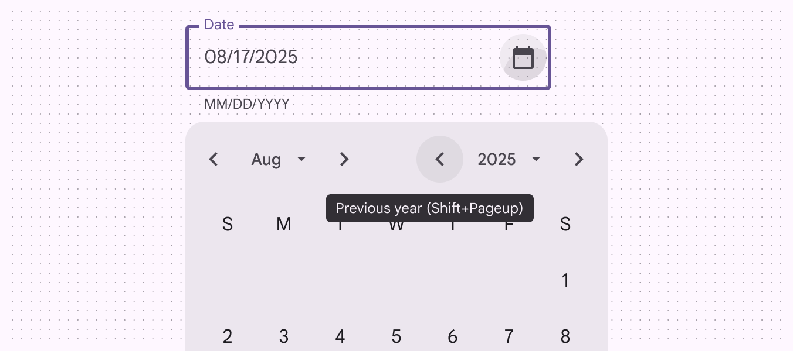
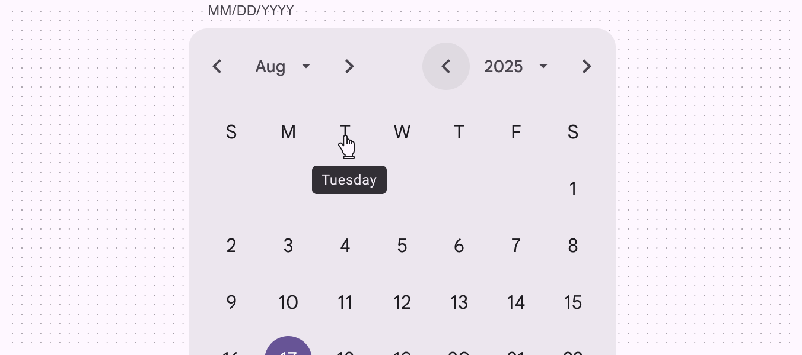
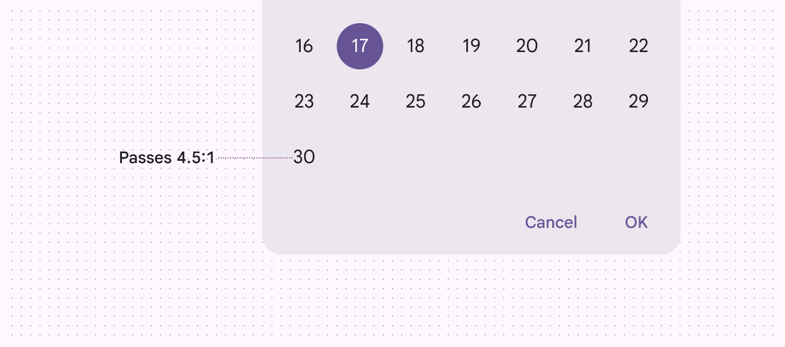
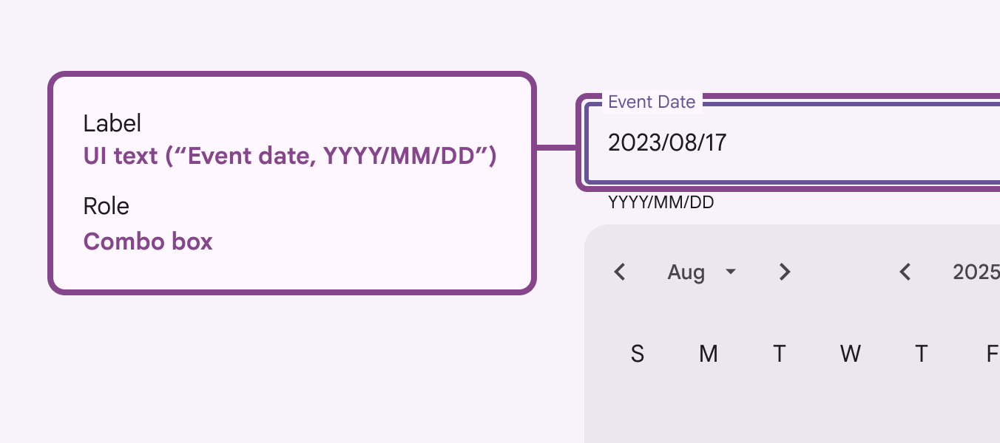
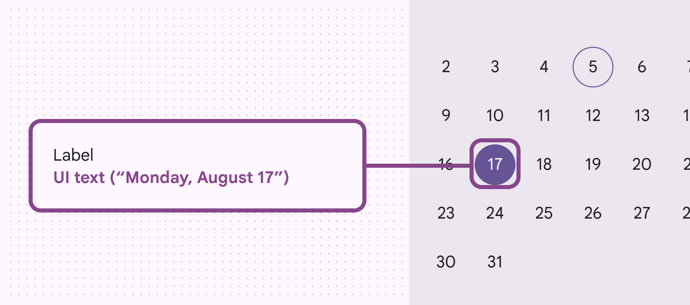

# Date pickers

Date pickers let people select a date, or a range of dates

## Use cases

People should be able to:

- Enter dates manually by inputting text, without using the picker
- Use multiple input methods, making it accessible to those using assistive technology

On the docked date picker [More on docked date picker](/m3/pages/date-pickers/guidelines#523a5a5a-6e35-4fdf-86e5-18d1a23887c4), the text field can be used for input. On the modal date picker [More on modal date picker](/m3/pages/date-pickers/guidelines#c5c0471f-aa8a-4205-ab4b-1ab8cb893c5c), the date input option should be available using the edit icon.

## Interaction & style

The edit icon indicates the ability to switch to the modal date input [More on modal date inputs](/m3/pages/date-pickers/guidelines#c5c0471f-aa8a-4205-ab4b-1ab8cb893c5c). Interactive targets for all elements meet Material's 48x48dp minimum touch target requirement. Increasing density would negatively impact accessibility [More on accessibility](/m3/pages/overview/principles) by limiting tappable/clickable targets.

The edit icon indicates the ability to switch to the modal date input

Touch targets are 48x48dp

## Date entry methods

The date entry component offers two ways to enter a date:

- Direct text entry into a text field
- Through the date picker

The calendar icon is the exclusive entry point for the date picker. This improves efficiency for a screen reader and other keyboard users, as it makes interaction with the date picker optional and reduces the amount of key presses required to input a date. Each input is a separate tab stop, which improves discoverability of the control.

Entering a date either through direct text entry or the date picker

## Accessible date input

Automatically format the date after the user hits “Enter“ or navigates out of the text field. Don't automatically format the date by adding slashes or other special characters while the user is typing (also known as input masks). This can cause confusion for people using screen readers because it changes what they typed. To reduce errors, accept a range of formats including dashes, spaces, slashes, dots, and 0 to the left of a single digit month/day. This is especially helpful for assistive technology users who might be more prone to errors when interacting with complex inputs.

The text field's logic can adapt to the user's actual input format, applying the correct formatting after the user has completed their text entry

## Optional **Clear** button

If it's not needed for your use case, remove the **Clear** button from the screen to reduce the number of tab stops for keyboard users.

Remove non-critical actions to reduce the number of tab stops for keyboard users

## Affordance for keyboard shortcuts

Ensure keyboard shortcuts are readily available for keyboard and screen reader users by providing the shortcut key in the tooltip [More on tooltips](/m3/pages/tooltips/overview). It should be included in the hint description to be read out by the screen reader. As shown here, the previous year button is interactive and can therefore be focused via the keyboard. Upon focus [More on focused state](/m3/pages/interaction-states/applying-states#bc6d6853-48ef-490e-8076-448e89e69f0f), the tooltip explains the behavior of the button and shows the shortcut key.

Keyboard tooltip example for date picker

## Truncated labels & tooltips

Truncating labels isn't ideal, but tooltips allow the full text to be shown on hover [More on hover state](/m3/pages/interaction-states/applying-states#71c347c2-dd75-485b-892e-04d2900bd844) or keyboard focus. Days of the week are not interactive and are therefore not focusable via keyboard, yet the tooltip is available on hover. The date picker relies on the conventionality of these abbreviations for some assistive technology users.

Days of the week are not navigable via keyboard, so the tooltip is shown only on pointer hover

## Color contrast between dates

Dates should have contrast of at least 4.5:1 between the link text colors and the background.

Dates pass the 4.5:1 contrast minimum

## Keyboard navigation

|
**Keys**

 |

**Actions**

 |
| --- | --- |
| Enter/return | Enter/return |
| Enter/return | Closes the calendar and saves the selected date |
| Page up/down | Move to the same date on next/previous month |
| Home/End     | Move to the first day of the month |
| Shift + Page up/down | Moves to the same date in the next/previous year |
| Shift + M | Moves to the month list dropdown |
| Shift + Y | Moves to the year list dropdown |

## Labeling elements

The text field's accessibility label should clearly state the purpose of the input (for example, event date or reservation date) and should match the placeholder text when the field is empty. The helper text (below the text field) should specify the date format (for example, MM/DD/YYYY or YYYY/MM/DD) and act as a description for the text field. The default helper text is "MM/DD/YYYY," but this can be customized.  

The accessibility label clearly states the kind of input as an event date

|
**Element**

 |

**A11y label**

 |

**Role**

 |
| --- | --- | --- |
| Previous / next month and year | “{label}” | Button |
| Month and year dropdowns | “{label}” | Button |
| Days of the week | Column header |  |
| Month grid | Grid |  |

## Screen reader verbalizations

To support screen reader users, labels are used to enumerate the complete date. This allows screen reader users to hear the full context of "Monday, August 17” instead of just part of the date.

Screen readers will state the full day, month, date, and year instead of just the number 17

