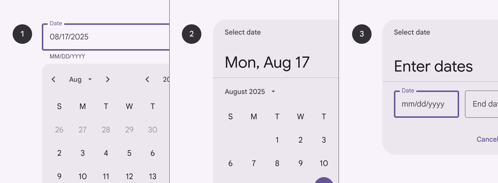
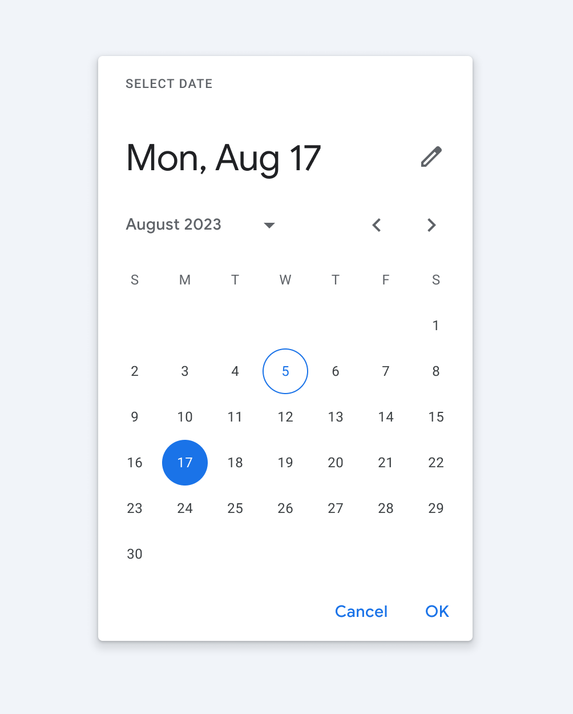
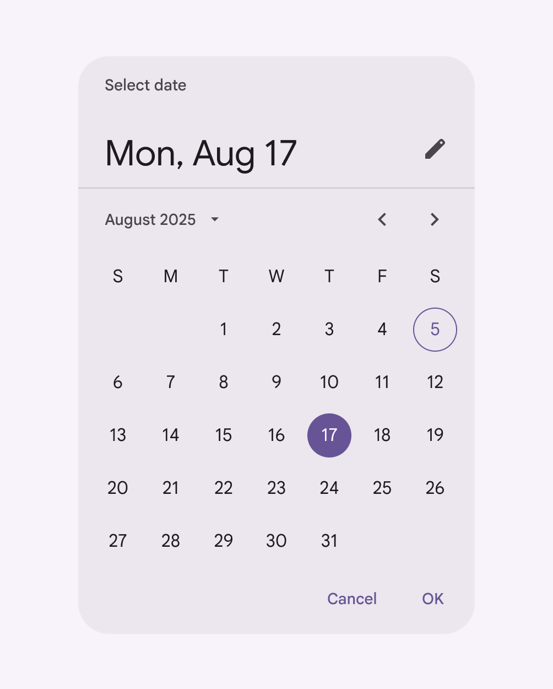

# Date pickers

Date pickers let people select a date, or a range of dates

- Date pickers can display past, present, or future dates
- Three variants: docked [More on docked date pickers](/m3/pages/date-pickers/guidelines#8d78696c-a756-4a4d-b7dd-846d866ba985), modal [More on modal date pickers](/m3/pages/date-pickers/guidelines#ced55f72-28b5-4f5d-a347-fa38214ef2d4), modal input [More on modal date inputs](/m3/pages/date-pickers/guidelines#d91ce7bc-dbc7-43e3-a802-152f2f9c892a)
- Clearly indicate important dates, such as current and selected days
- Follow common patterns, like a calendar view

1. Docked date picker
2. Modal date picker
3. Modal date input

## Availability & resources

| Type | Resource | Status |
| --- | --- | --- |
| Design | [Design Kit (Figma)](https://www.figma.com/community/file/1035203688168086460) | Available |
| Implementation |  | Available |
| Implementation | [Jetpack Compose](https://developer.android.com/develop/ui/compose/components/datepickers) | Available |
| Implementation |  | Available |

## Differences from M2

- Typography and spacing: Titles and labels are larger and have increased spacing to accommodate 48dp target size
- Color: New color mappings and compatibility with dynamic color [More on dynamic color](/m3/pages/dynamic/choosing-a-source)
- Variants: The three variants of date pickers have been renamed to not be device-dependent. The former desktop date picker is now known as the docked date picker [More on docked date picker](https://m3.material.io/m3/pages/date-pickers/guidelines#8d78696c-a756-4a4d-b7dd-846d866ba985). The former mobile date picker and date input are now known as modal date picker [More on modal date picker](https://m3.material.io/m3/pages/date-pickers/guidelines#ced55f72-28b5-4f5d-a347-fa38214ef2d4) and modal date input [More on modal date input](https://m3.material.io/m3/pages/date-pickers/guidelines#d91ce7bc-dbc7-43e3-a802-152f2f9c892a) to reinforce that the user must take an action.

M2: Date pickers had a drop shadow and different color mappings

M3: Date pickers have larger typography, no shadow, and new color mappings compatible with dynamic color

