# Date pickers

Date pickers let people select a date, or a range of dates

## Tokens & specs

Select a component variant below to see its elements, attributes, tokens [More on tokens](/m3/pages/design-tokens/overview), and their values.

```
Date picker - Docked
```

```
Date picker - Docked
```

```
Date picker - Docked
```

```
Date picker - Docked
```

Date picker - Docked

Token

Default, Light

Enabled

Disabled

Hovered

Focused

Pressed (ripple)

## Docked date picker

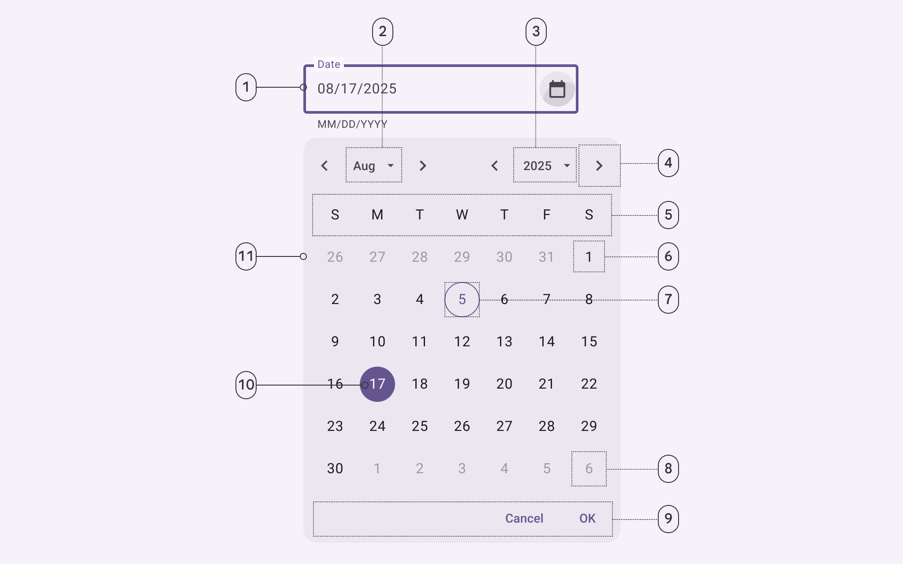

1. Outlined text field
2. Menu button: Month selection
3. Menu button: Year selection
4. Icon button
5. Weekdays label text
6. Unselected date
7. Today’s date
8. Outside month date
9. Text buttons
10. Selected date
11. Container

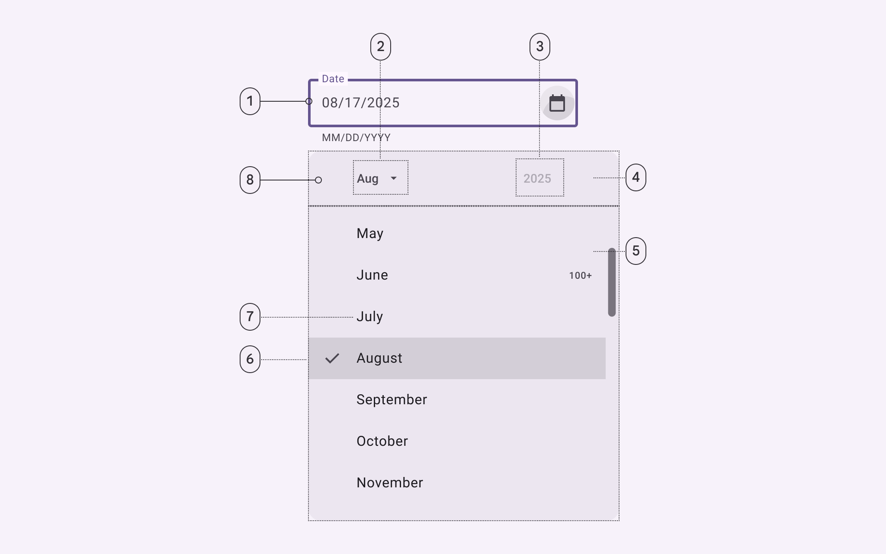

1. Outlined text field
2. Menu button: Month selection (pressed)
3. Menu button: Year selection (disabled)
4. Header
5. Menu
6. Selected list item
7. Unselected menu list item
8. Container

### Docked date picker color

Color values are implemented through design tokens. For design, this means working with color values that correspond with tokens. For implementation, a color value will be a token that references a value. [Learn more about design tokens](/m3/pages/design-tokens/overview/)

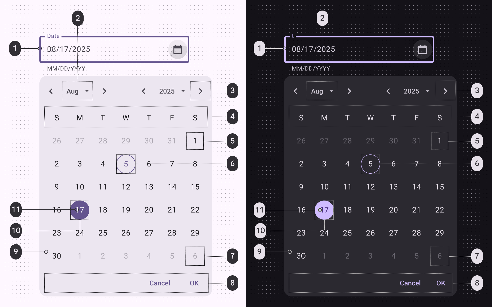

Docked date picker color roles used for light and dark themes:

1. Primary
2. On surface variant
3. On surface variant
4. On surface
5. On surface
6. Primary
7. On surface variant
8. Primary
9. Surface container high
10. Primary
11. On primary

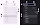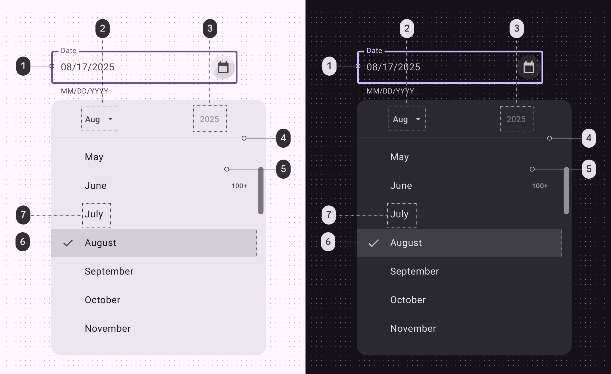

Docked date picker menu color roles used for light and dark themes:

1. Primary
2. On surface variant
3. On surface
4. Outline variant
5. Surface container high
6. Surface variant
7. On surface

### Docked date picker measurements

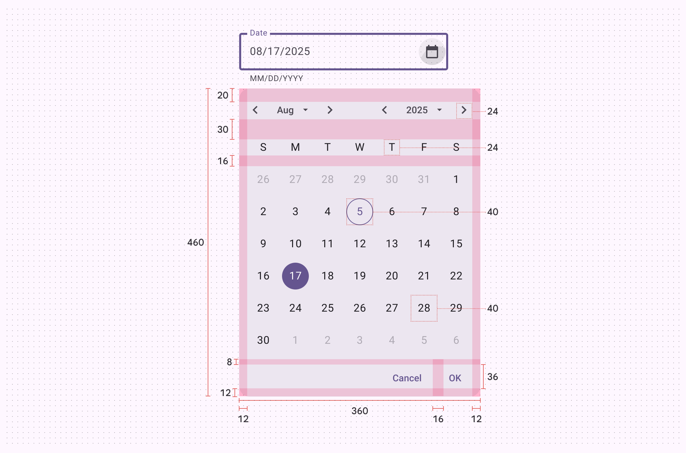

Docked date picker padding and size measurements

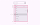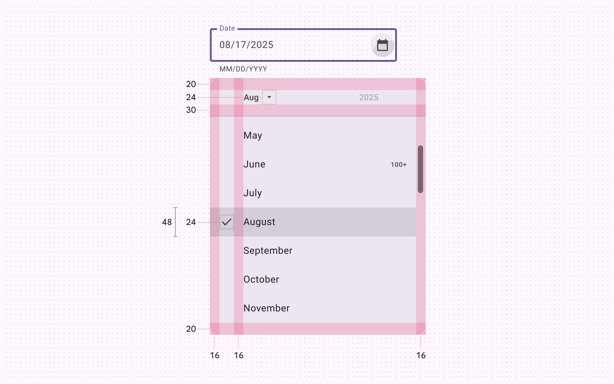

Docked date picker month menu padding and size measurements

### Docked date picker configurations

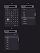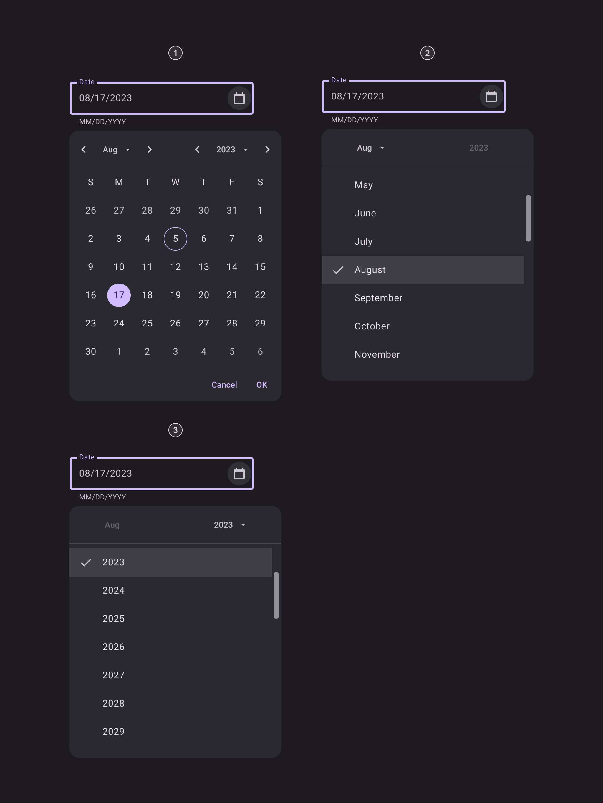

1. Day selection
2. Month selection
3. Year selection

## Modal date picker


1. Headline
2. Supporting text
3. Header
4. Container
5. Icon button
6. Icon buttons
7. Weekdays
8. Today’s date
9. Unselected date
10. Text buttons
11. Selected date
12. Menu button
13. Divider

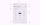

1. Headline
2. Supporting text
3. Header
4. Container
5. Icon button
6. Unselected year
7. Selected year
8. Text buttons
9. Divider
10. Menu button

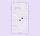

1. Headline
2. Supporting text
3. Icon button
4. Header
5. Text button
6. Icon button
7. Weekdays label text
8. Container
9. Today’s date
10. Unselected date
11. In-range active indicator
12. In-range date
13. Month subhead
14. Selected date
15. Divider

### Modal date picker color

Color values are implemented through design tokens. For design, this means working with color values that correspond with tokens. For implementation, a color value will be a token that references a value. [Learn more about design tokens](/m3/pages/design-tokens/overview/)

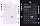

Modal date picker color roles used for light and dark themes in a day selection menu:

1. On surface
2. On surface variant
3. Surface container high
4. On surface variant
5. On surface variant
6. On surface
7. Primary
8. On surface
9. Primary
10. Primary
11. On surface variant
12. Outline variant

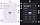

Modal date picker color roles used for light and dark themes in a year selection menu:

1. On surface
2. On surface variant
3. Surface container high
4. On surface variant
5. On surface variant
6. Primary
7. Primary
8. Outline variant
9. On surface variant

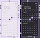

Modal date picker range selector color roles used for light and dark themes:

1. On surface
2. On surface variant
3. On surface variant
4. Surface container high
5. Primary
6. On surface variant
7. On surface
8. Primary
9. On surface
10. Secondary container
11. On secondary container
12. Outline variant
13. On surface variant
14. Primary

### Modal date picker measurements


Modal date picker padding and size measurements


Modal date picker year selector padding and size measurements

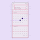

Modal date picker date range selector padding and size measurements

### Modal date picker configurations

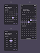

1. Single date selection
2. Date range selection
3. Year selection

## Modal date input


1. Headline
2. Supporting text
3. Header
4. Container
5. Icon button
6. Outlined text field
7. Text buttons
8. Divider

### Modal date input color

Color values are implemented through design tokens. For design, this means working with color values that correspond with tokens. For implementation, a color value will be a token that references a value. [Learn more about design tokens](/m3/pages/design-tokens/overview/)


Modal date input color roles used for light and dark themes:

1. On surface
2. On surface variant
3. Surface container high
4. On surface variant
5. Primary
6. Primary
7. Outline variant

### Modal date input measurements


Modal date input padding and size measurements

### Modal date input configurations


1. Single date input
2. Date range input

## Element states

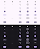

States for date and year selection: 

1. Default (enabled)
2. Disabled
3. Hovered
4. Focused
5. Pressed (ripple)

