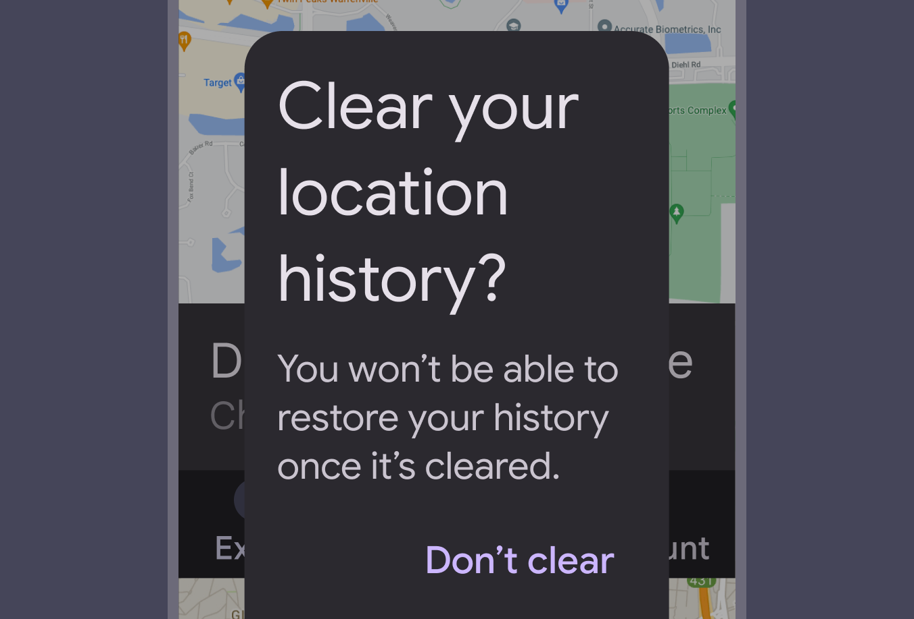
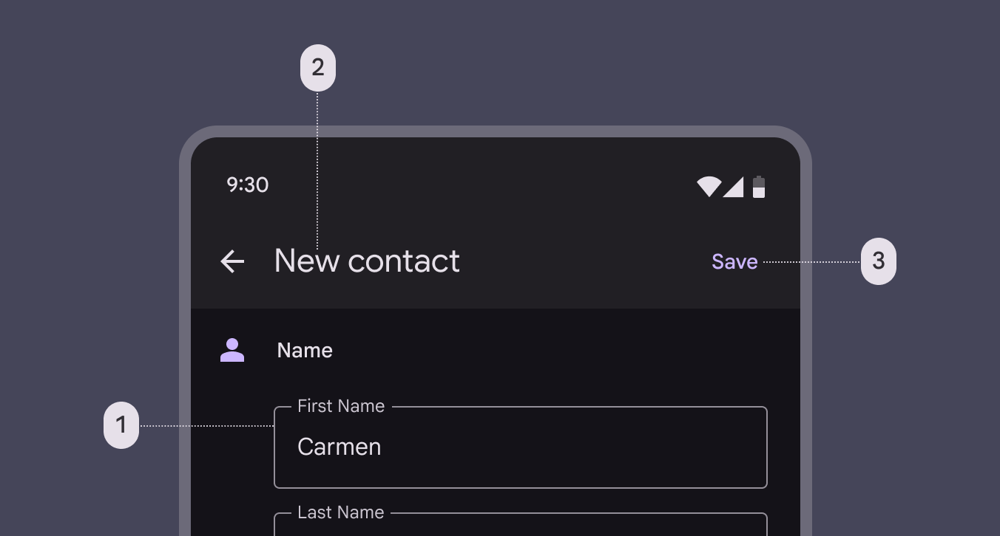
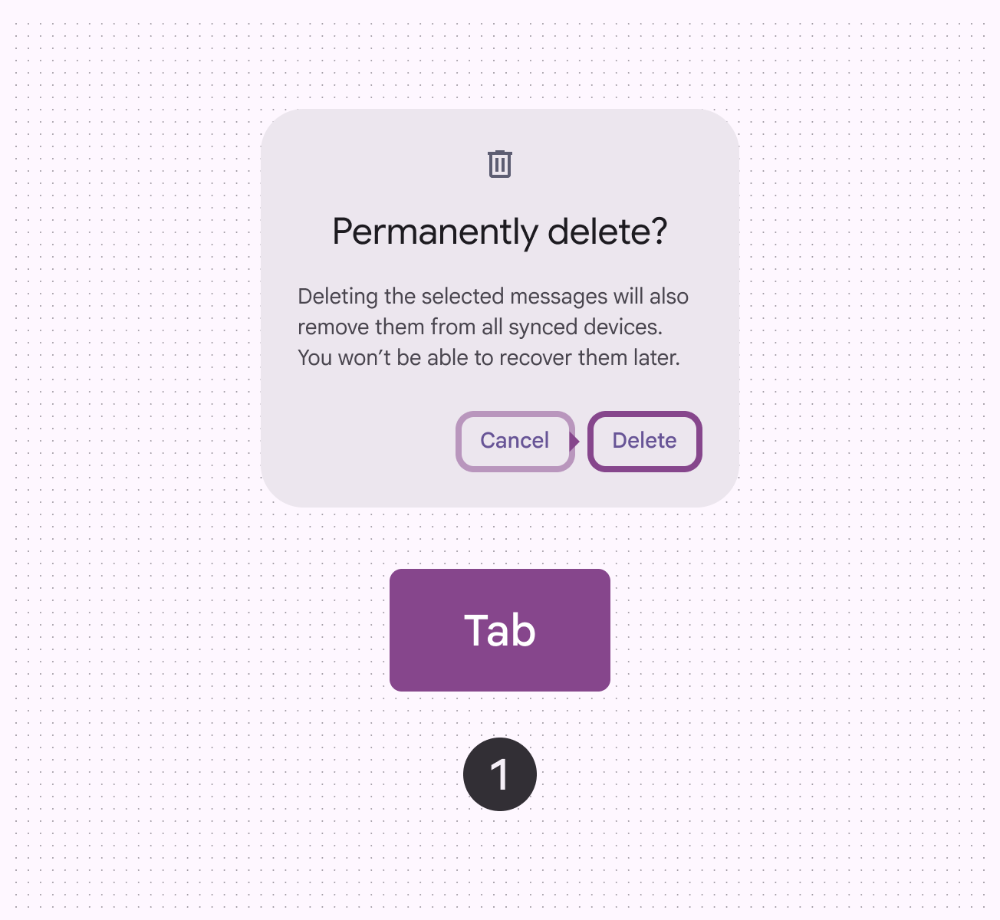
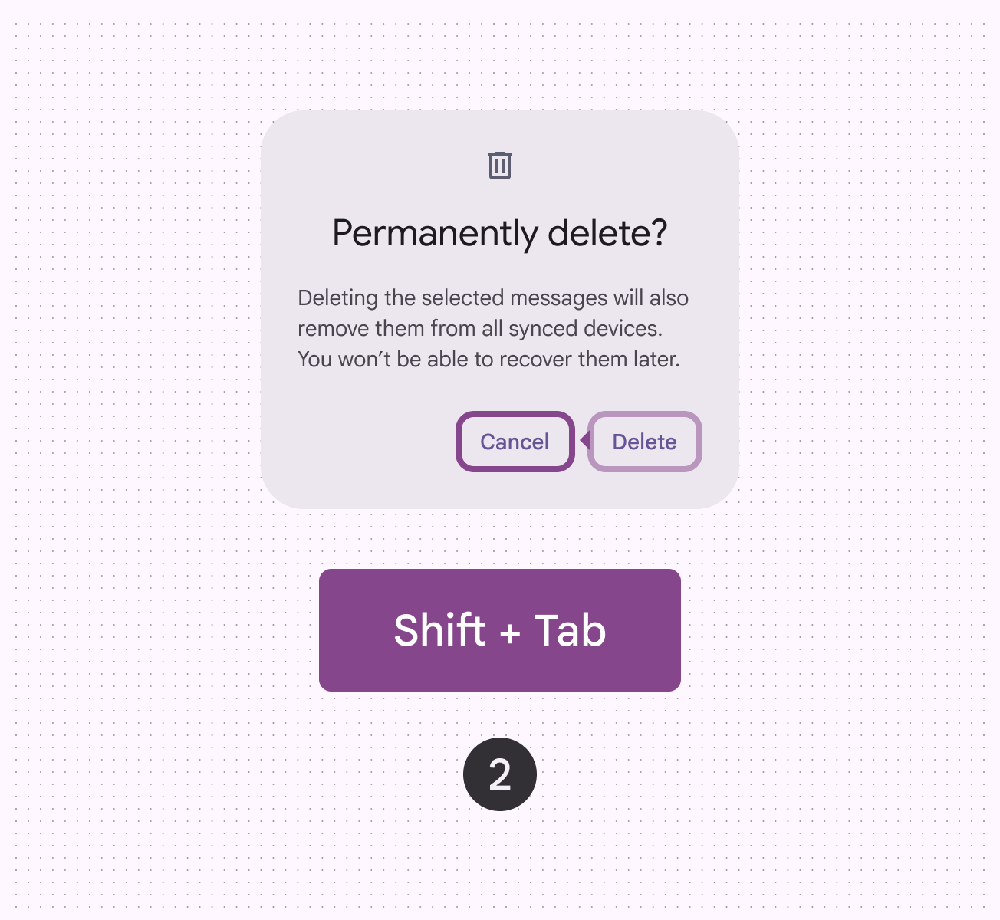
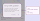
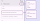

# Dialogs

Dialogs provide important prompts in a user flow

## Use cases

People should be able to use assistive technology to:

- Open and close a dialog
- Provide and submit other inputs if the dialog is interactive, such as a text field [More on text fields](/m3/pages/text-fields/overview) or selectable list [More on lists](/m3/pages/lists/overview)
- Scroll the dialog to access all of its contents if that content extends beyond the container of the dialog

## Interaction & style

### Use sparingly

Dialogs are purposefully interruptive. This means they appear in front of app content and disrupt the flow of content for people who may, for example, be using a screen reader to navigate the page. As such, dialogs should be used sparingly and only to provide critical information. Less critical information should be presented in a non-blocking way within the flow of app content.

check Do Present non-critical information using other UI within the flow of app content

close Don’t Avoid putting non-critical information in a dialog

### 200% text size

Avoid excessive text wrapping or truncation by choosing concise strings. On Android, headlines should be kept concise enough to fit within **four** lines after the text size is increased to 200%. If a headline exceeds this limit and gets truncated, provide an alternative way to access the full content in a single tap.

exclamation Caution

Avoid excessive text wrapping or truncation by choosing concise strings

### Elements within dialogs

Because dialogs can contain various elements within them, refer to the relevant accessibility [More on accessibility](/m3/pages/overview/principles) guidelines for each element. Some common examples include:

1. Text fields [More on text fields](/m3/pages/text-fields/overview)
2. Typography [More on typography](/m3/pages/text-fields/accessibility)
3. Buttons [More on buttons](/m3/pages/common-buttons/overview)

Full-screen dialogs can contain various elements such as (1) text fields, (2) typography, and (3) buttons, which each may have their own accessibility guidelines

## Initial focus

When a dialog appears, focus should automatically land on the first interactive element within the dialog.

Initial focus lands on the first interactive element within a dialog. The tab key moves focus through the next interactive elements in a cycle.

The shift and tab keys together move focus in the opposite direction. The space or enter key triggers or commits the action of the focused element.

## Keyboard navigation

| Keys | Actions |
| --- | --- |
| Tab | Focus lands on the next interactive element contained in the dialog, or the first element if focus is currently on the last element |
| Shift + Tab
 | Focus lands on the previous interactive element contained in the dialog, or the last element if focus is currently on the first element |
| Space or Enter
 | Triggers or commits the action of the focused [More on focused state](/m3/pages/interaction-states/applying-states#bfc1624f-6bcc-4306-b0c1-425e2d8a1bf9) element |
| Escape
 | Closes the dialog |

## Labeling elements

The accessibility [More on accessibility](/m3/pages/overview/principles) label for a dialog is typically the same as the dialog’s title or headline. On web, basic dialogs should have the **alert dialog** role.

Basic dialogs are known as alert dialogs on web

Components contained within the dialog, such as buttons, should be labeled according to the guidelines specific to those components. For common examples, see:

- Buttons [More on buttons](/m3/pages/common-buttons/specs)
- Text fields [More on text fields](/m3/pages/text-fields/overview)

Elements within a dialog should be labeled according to their guidelines

