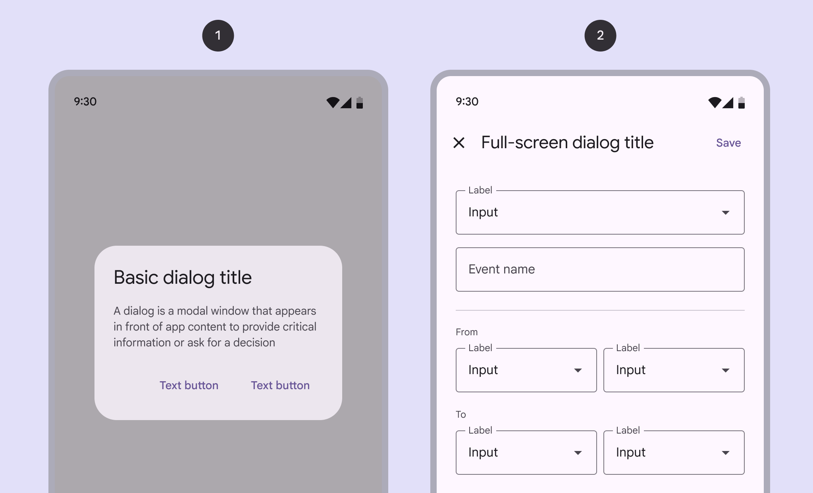
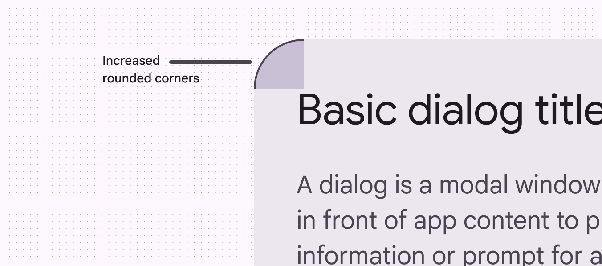

# Dialogs

Dialogs provide important prompts in a user flow

- Use dialogs to make sure users act on information
- Two variants: basic [More on basic dialogs](/m3/pages/dialogs/guidelines#97ac3858-3932-4084-ae8e-73e42b7cb752) and full-screen [More on full-screen dialogs](/m3/pages/dialogs/guidelines#007536b9-76b1-474a-a152-2f340caaff6f)
- Should be dedicated to completing a single task
- Can also display information relevant to the task
- Commonly used to confirm high-risk actions like deleting progress

1. Basic dialog
2. Full-screen dialog

## Availability & resources

| Type | Resource | Status |
| --- | --- | --- |
| Design | [Design Kit (Figma)](https://www.figma.com/community/file/1035203688168086460) | Available |
| Implementation |  | Available |
| Implementation | [Jetpack Compose](https://developer.android.com/develop/ui/compose/components/dialog) | Available |
| Implementation |  | Available |
| Implementation |  | Available |

## Differences from M2

- Color: New color mappings and compatibility with dynamic color [More on dynamic color](/m3/pages/dynamic/choosing-a-source)
- Layout [More on layout](/m3/pages/understanding-layout/overview): Greater padding to account for the increased corner-radius and title size
- Position: Option for custom basic dialog [More on basic dialogs](/m3/pages/dialogs/guidelines#97ac3858-3932-4084-ae8e-73e42b7cb752)positioning
- Shape: Increased corner-radius
- Typography: Larger and darker headline

New updates to color, layout, position, shape, and typography

