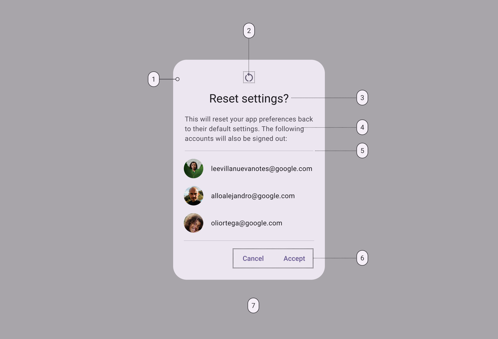
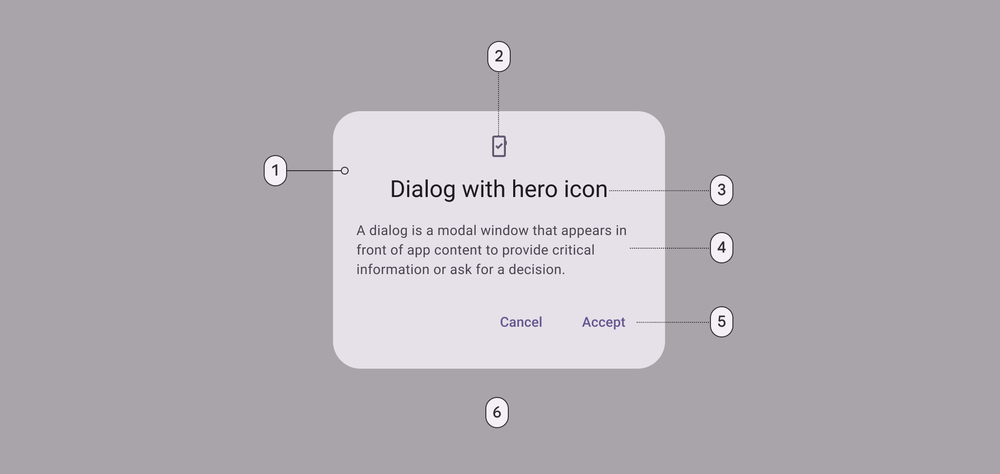
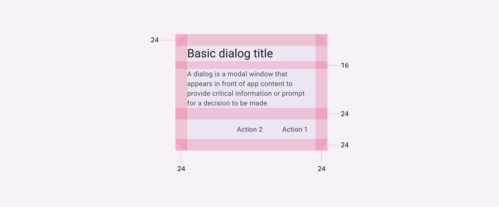
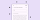
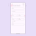

# Dialogs

Dialogs provide important prompts in a user flow

## Tokens & specs

Select a component variant below to see its elements, attributes, tokens [More on tokens](/m3/pages/design-tokens/overview), and their values.

```
Dialog - Basic
```

```
Dialog - Basic
```

```
Dialog - Basic
```

```
Dialog - Basic
```

Dialog - Basic

Token

Default, Light

Enabled

Hovered

Focused

Pressed (ripple)

## Basic dialogs



1. Container
2. Icon (optional)
3. Headline (optional)
4. Supporting text
5. Divider (optional)
6. Button label text
7. Scrim

### Basic dialog color

Color values are implemented through design tokens [More on tokens](/m3/pages/design-tokens/overview). For design, this means working with color values that correspond with tokens. For implementation, a color value will be a token that references a value. [Learn more about design tokens](/m3/pages/design-tokens/overview)



Basic dialog color roles used for light and dark themes:

1. Surface container high
2. Secondary
3. On surface
4. On surface variant
5. Primary
6. Scrim

### Basic dialog measurements



Basic dialog padding and size measurements

| Attribute | Value |
| --- | --- |
| Container shape
 | 28dp corner radius |
| Container height
 | Dynamic |
| Container width
 | Min 280dp; Max 560dp |
| Divider height
 | 1dp |
| Icon size
 | 24dp |
| Minimum width
 | 280dp  |
| Maximum width
 | 560dp |
| Alignment with icon
 | Center-aligned |
| Alignment without icon
 | Start-aligned |
| Top/Left/right/bottom padding
 | 24dp |
| Padding between buttons
 | 8dp |
| Padding between title and body
 | 16dp |
| Padding between icon and title
 | 16dp |
| Padding between body and actions
 | 24dp |

## Full-screen dialogs


1. Container
2. Header
3. Icon (close affordance)
4. Headline (optional)
5. Text button
6. Divider (optional)

### Full-screen dialog color

Color values are implemented through design tokens [More on tokens](/m3/pages/design-tokens/overview). For design, this means working with color values that correspond with tokens. For implementation, a color value will be a token that references a value.



Full-screen dialog color roles used for light and dark themes:

1. Surface container high
2. On surface
3. On surface
4. Primary
5. On surface variant

### Full-screen dialog measurements



Full-screen dialog padding and size measurements

| Attribute | Value |
| --- | --- |
| Container shape
 | 0dp corner radius |
| Container height
 | Dynamic |
| Container width
 | Container width; Max 560dp |
| Header height
 | 56dp |
| Header width
 | Container width |
| Headline text alignment
 | Start-aligned |
| Divider height
 | 1dp |
| Icon (close affordance) size
 | 24dp |
| Bottom action bar height
 | 56dp |
| Bottom action bar width
 | Container width |
| Top/left/right padding
 | 24dp |
| Padding between elements
 | 8dp |

