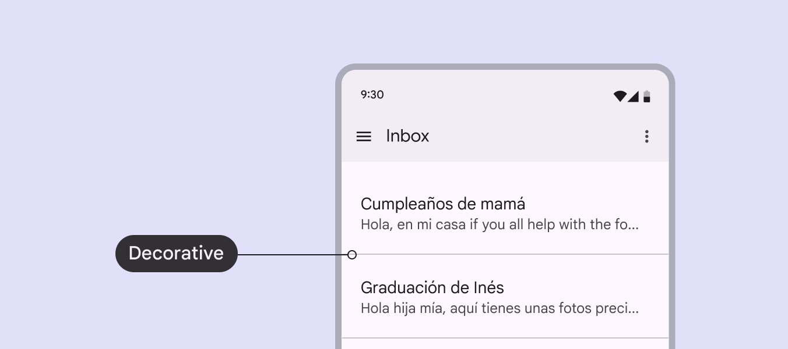

# Divider

Dividers are thin lines that group content in lists or other containers

Dividers are decorative elements, which have no contrast minimums.

Decorative elements have no contrast minimums

