# Divider

Dividers are thin lines that group content in lists or other containers

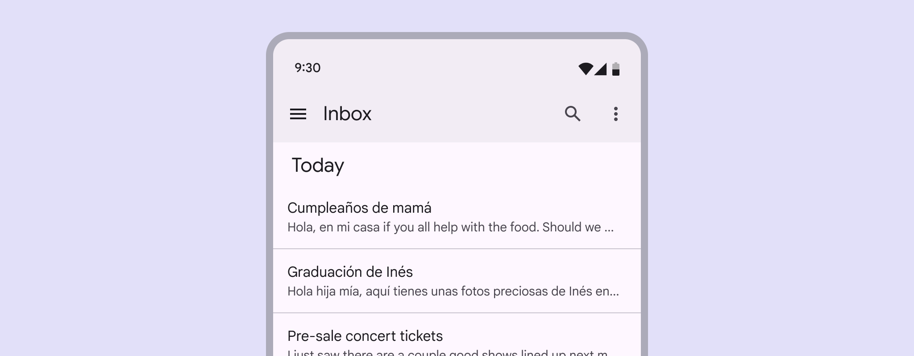

Full-width dividers

## Usage

Dividers are one way to visually group components and create hierarchy. They can also be used to imply nested parent/child relationships. The divider can be used in two ways: 

1. Full width
2. Inset

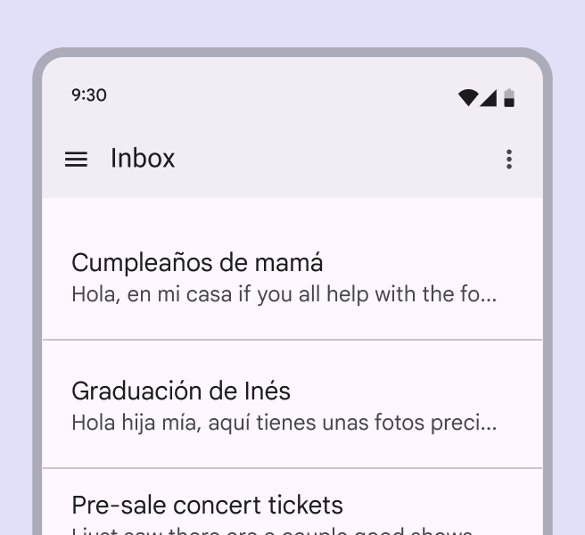

Full-width divider

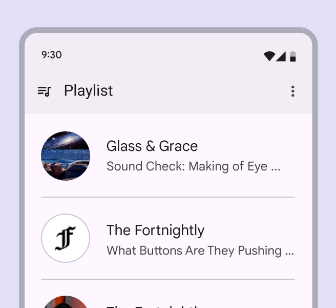

Inset divider

## Anatomy

A divider is a simple line.

1. Divider

## Full-width dividers

Use full-width dividers to separate larger sections of unrelated content. They can be used directly on a surface or inside other components like cards or lists. Full-width dividers can also separate interactive areas from non-interactive areas. They are used to group visual elements together, and indicate when elements are related to each other from an interaction perspective. 

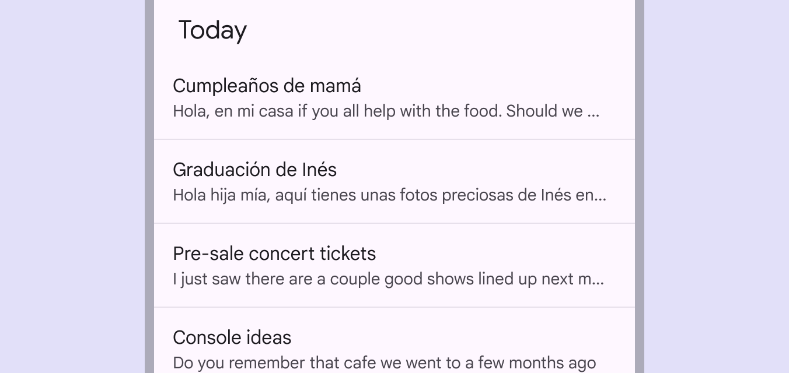

Full-width dividers to indicate separation of content

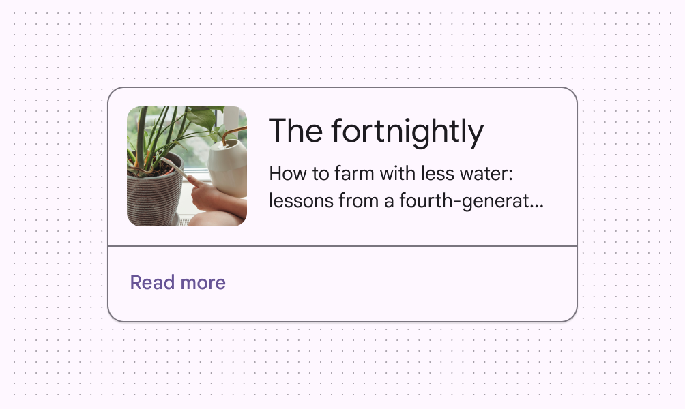

check Do

Use full-width divider lines to separate interactive and non-interactive areas of a container such as a card

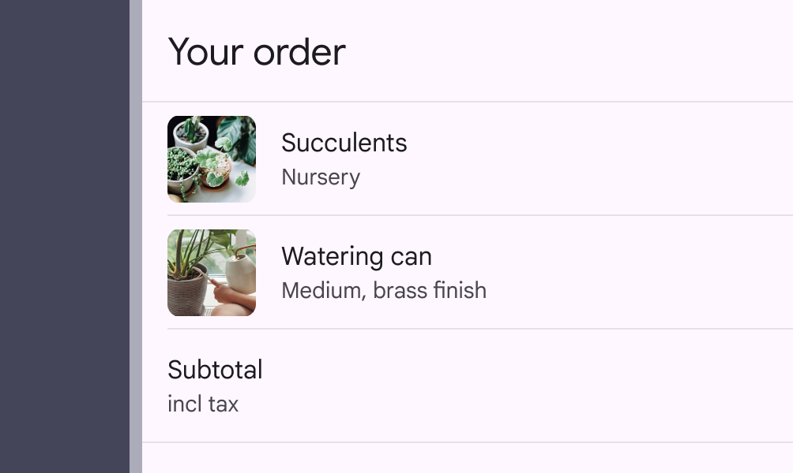

exclamation Caution Use full-width dividers sparingly. Too many divider lines will make an interface look cluttered.

## Inset dividers

Use inset dividers to separate related content within a section. Inset dividers are equally indented from both sides of the screen by default.

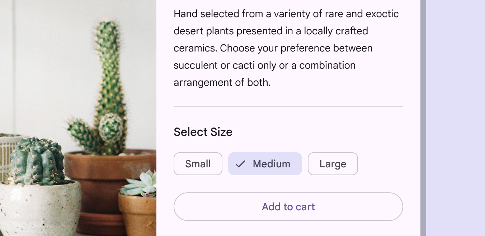

Inset dividers separate related content, such as emails in a list. They should be used with anchoring elements such as icons or avatars, and align with the leading edge of the screen.

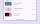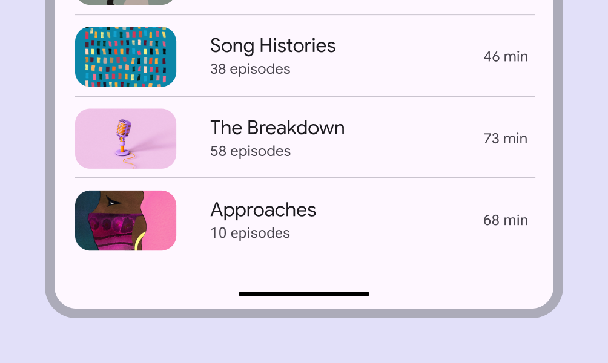

Inset dividers in a list of related items

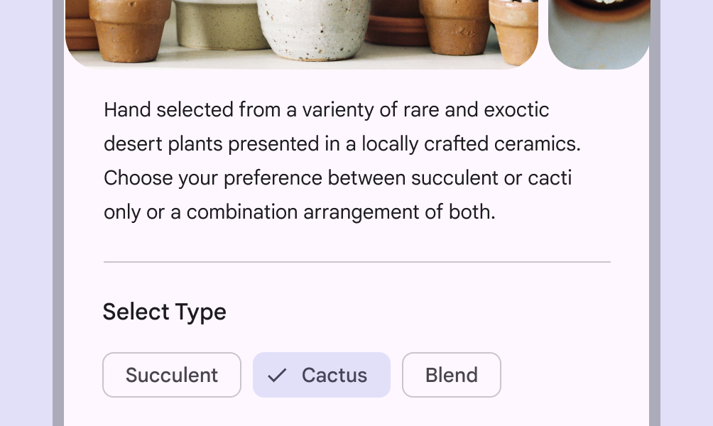

Inset dividers can be placed in the middle of a layout to separate elements such as body text from selection chips

### Using dividers both ways on the same screen

If dividers are used both ways in a UI, they must reinforce the hierarchy of information within different sections.

1. To separate a different kind of content, use a full-width divider
2. To separate nested content items, use inset dividers

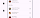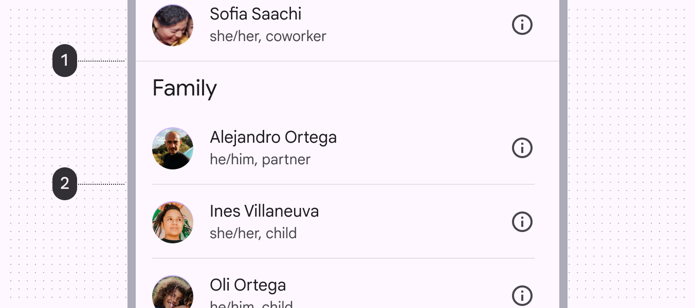

check Do

Use a combination of inset and full-width dividers to reflect the hierarchy of information

List items with repetitive formats may not require an inset divider, in which using only the margin between items is acceptable.

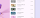

check Do

Content may not require a divider line

## Vertical divider

A vertical divider can be used to arrange content on a larger screen, such as separating paragraph text from video or imagery media.

Vertical divider in a large screen context

