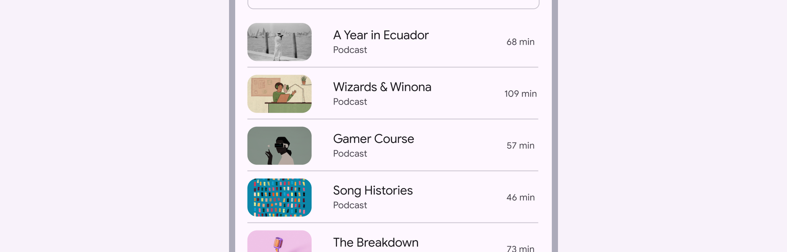

# Divider

Dividers are thin lines that group content in lists or other containers

- Make dividers visible but not bold
- Only use dividers if items can’t be grouped with open space
- Use dividers to group things, not separate individual items

Dividers separating items in a list

## Availability & resources

| Type | Resource | Status |
| --- | --- | --- |
| Design | [Design Kit (Figma)](https://www.figma.com/community/file/1035203688168086460) | Available |
| Implementation |  | Available |
| Implementation | [Jetpack Compose](https://developer.android.com/develop/ui/compose/components/divider) | Available |
| Implementation |  | Available |
| Implementation |  | Available |

## Differences from M2

- Color: New color mappings and compatibility with dynamic color
- Configurations: Ability to have vertical dividers

Dividers have new color mappings

