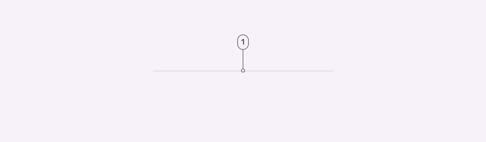
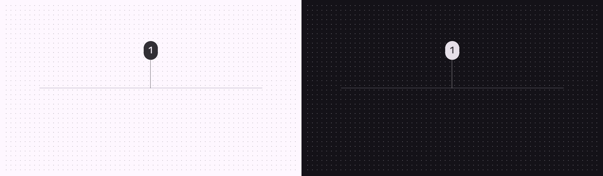
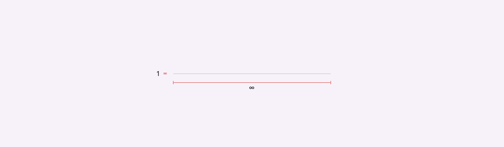

# Divider

Dividers are thin lines that group content in lists or other containers

1. Divider

## Tokens and specs

Browse the component elements, attributes, tokens, and their values. Divider

Token

Default, Light

Enabled

## Color

Color values are implemented through design tokens. For design, this means working with color values that correspond with tokens. For implementation, a color value will be a token that references a value. [Learn more about design tokens](/m3/pages/design-tokens/overview/825906c9-6eed-47d1-8812-450910c1356e)

Divider color roles used for light and dark schemes:

1. Outline variant

## Measurements

Measurements

| Attribute | Value |
| --- | --- |
| Divider full-width
 | 100% |
| Divider inset left margin
 | 16dp |
| Divider inset right margin
 | 0dp |
| Divider middle-inset left margin
 | 16dp |
| Divider middle-inset right margin
 | 16dp |
| Space between divider & supporting-text
 | 4dp |
| Divider right margin
 | 8dp |
| Divider bottom margin | 8dp |

