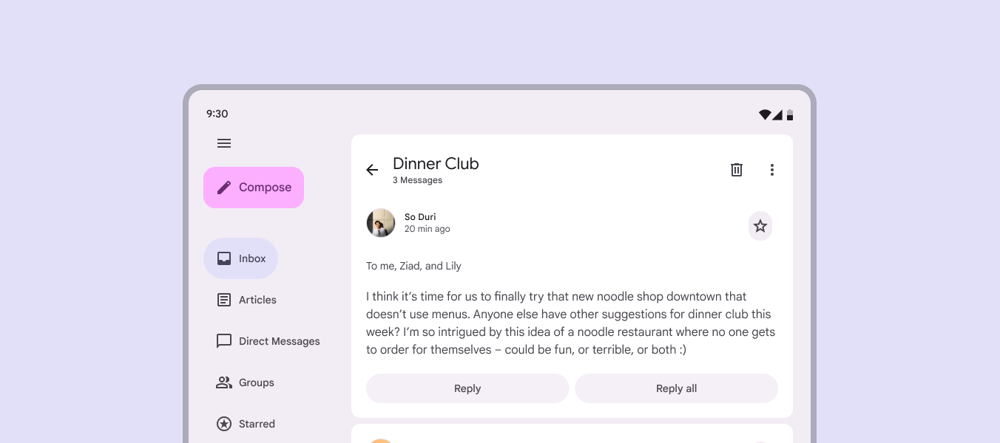
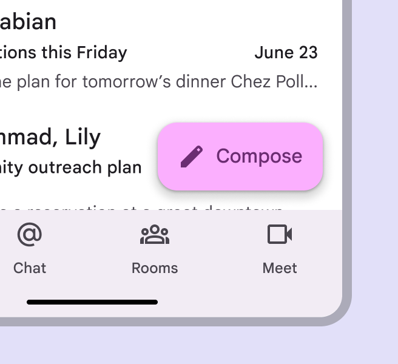
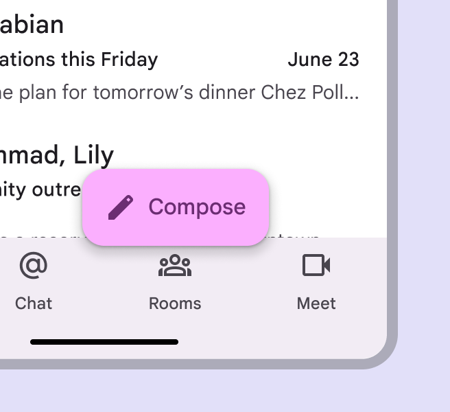
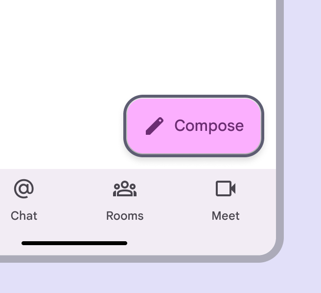
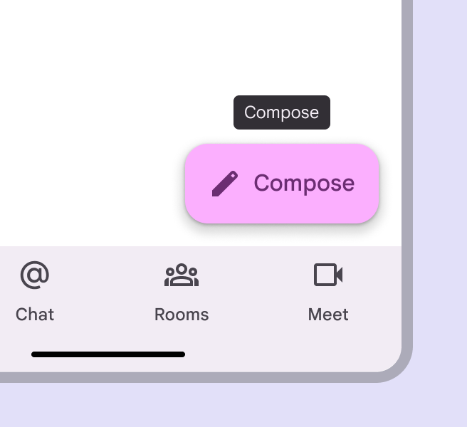
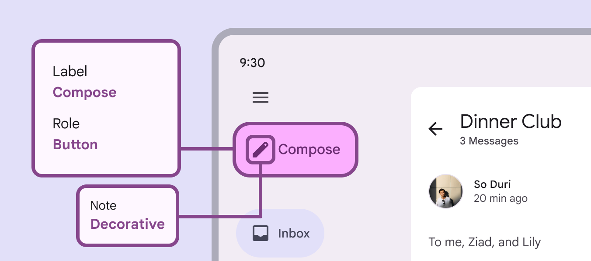

# Extended FABs

Extended floating action buttons (extended FABs) help people take primary actions

## Use cases

People should be able to do the following using assistive technology:

- Navigate to and activate the extended FAB

## Interaction & style

To make it easier for users of screen readers to reach a primary action such as an extended FAB, consider placing the action in the upper left region of large web screens, like in an expanded navigation rail [More on navigation rails](/m3/pages/navigation-rail/overview). In smaller windows, the best place for the extended FAB is the lower right corner of a screen.

Extended FABs can be placed in the expanded navigation rail

check Do

Place extended FABs in an easy-to-reach place that doesn’t obstruct other actions

close Don’t

Don’t place extended FABs over another actionable element

## Initial focus

Ensure the extended FAB is prioritized in the overall focus order to create an efficient experience for people who navigate UIs with assistive tech. On mobile, the focus order may start with the app bar [More on app bars](/m3/pages/app-bars/overview), move to the navigation bar [More on navigation bars](/m3/pages/navigation-bar/overview), and then skip past any other content on the page to land on the extended FAB. When using an extended FAB, both the visible label and icon should be treated as one focusable element. The extended FAB doesn’t need a tooltip because it already has a visible label.

check Do

Ensure extended FABs get focus when navigating with assistive technology

close Don’t

Tooltips aren’t required since the extended FAB has label text

## Keyboard navigation

|
Keys

 |

Actions

 |
| --- | --- |
| **Tab** | Moves focus to the extended FAB |
| **Space** or **Enter**
 | Activates the extended FAB |

## Labeling elements

To ensure the action is clear, use consistent icons and text labels, such as a **Compos****e** icon with a text label. The icon and text label combination should have one distinct purpose. The accessibility label must include the same first word as the visible label. For example, if the visible button is **Create**, then the accessibility label might say **Create a new invite**. 

The accessibility label reads to match the extended FAB's displayed label

