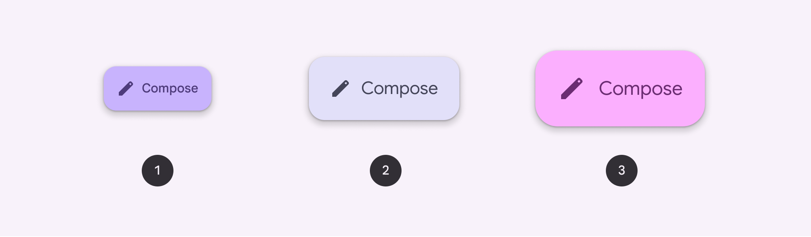
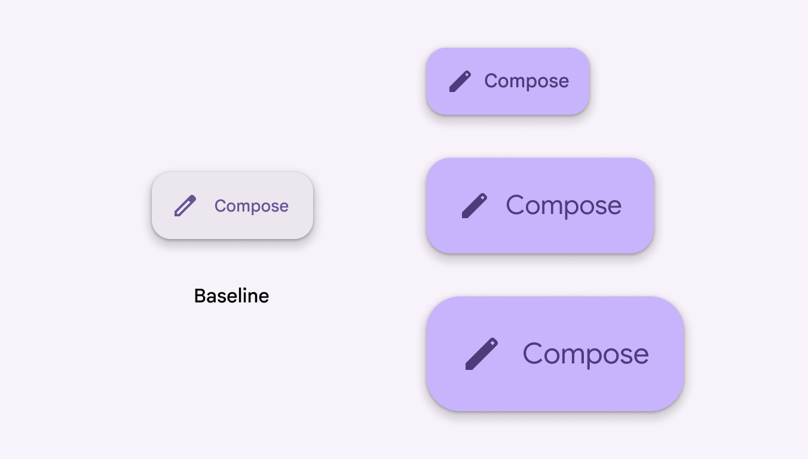
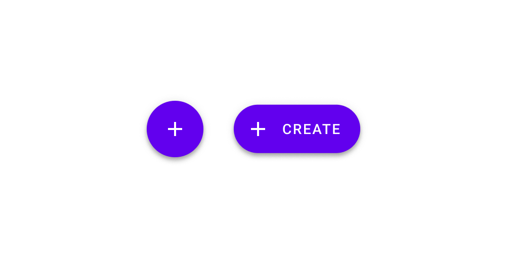
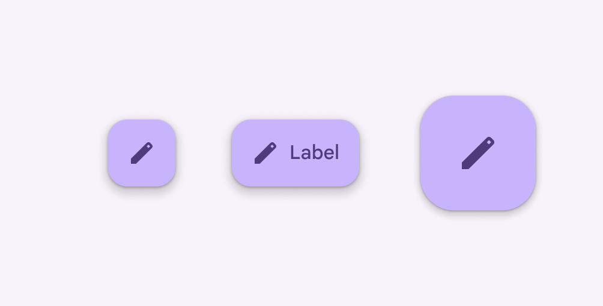

# Extended FABs

Extended floating action buttons (extended FABs) help people take primary actions

- Use for the most common or important action on a screen
- Three variants: small, medium, and large
- Use instead of FAB when label text is needed to understand action

1. Small extended FAB
2. Medium extended FAB
3. Large extended FAB

## Availability & resources

| Type | Resource | Status |
| --- | --- | --- |
| Design | [Design Kit (Figma)](https://www.figma.com/community/file/1035203688168086460) | Available |
| Implementation |  | Available |
| Implementation | [Jetpack Compose](https://developer.android.com/develop/ui/compose/components/fab?hl=en#extended) | Available |
| Implementation | [Jetpack Compose: Expressive](https://developer.android.com/reference/kotlin/androidx/compose/material3/package-summary#ExtendedFloatingActionButton\(kotlin.Function0,androidx.compose.ui.Modifier,androidx.compose.ui.graphics.Shape,androidx.compose.ui.graphics.Color,androidx.compose.ui.graphics.Color,androidx.compose.material3.FloatingActionButtonElevation,androidx.compose.foundation.interaction.MutableInteractionSource,kotlin.Function1\)) | Available |
| Implementation |  | Available |
| Implementation |  | Available |
| Implementation |  | Available |

## M3 Expressive update

**May 2025**

The extended FAB now has three sizes: small, medium, and large, each with updated type styles. These align with the FAB [More on FABs](/m3/pages/fab/overview) sizes for an easier transition between FABs. The baseline extended FAB is no longer recommended and should be replaced with the small extended FAB. Surface and FABs are also no longer recommended. [More on M3 Expressive](https://m3.material.io/blog/building-with-m3-expressive)

Variants and naming:

- Added new sizes

    - Small: 56dp
    - Medium: 80dp
    - Large: 96dp
- No longer recommended

    - Baseline extended FAB (56dp)
    - Surface extended FAB

Updates:

- Adjusted typography to be larger

The baseline extended FAB is replaced with a set of small, medium, and large extended FABs with new typography

## Differences from M2

- Color: New color mappings and compatibility with dynamic color
- Layout: Extended FAB is the same height as the FAB
- Shape: Boxier style with smaller corner radius

M2: Extended FABs are pill-shaped and have a different height and elevation

M3: Extended FABs share the same height, boxier shape, and simpler elevation model as FABs

