# Extended FABs

Extended floating action buttons (extended FABs) help people take primary actions

## Variants

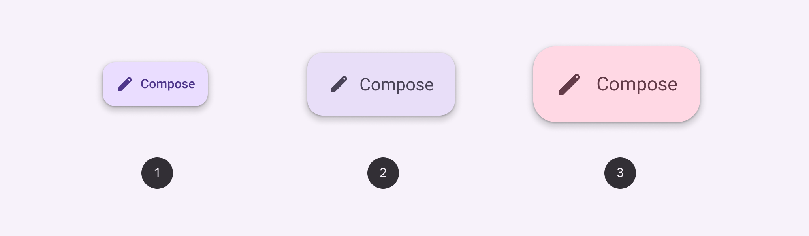

1. Small extended FAB
2. Medium extended FAB
3. Large extended FAB

### Baseline variants

The baseline extended FAB is no longer recommended in the M3 expressive update. Use a small extended FAB; the type style was updated from **label large** to **title medium**, and the inner padding was reduced. [View baseline extended FAB specs](/m3/pages/extended-fab/specs#01e114e6-8c3d-4d39-9376-65aa5c10e01b)

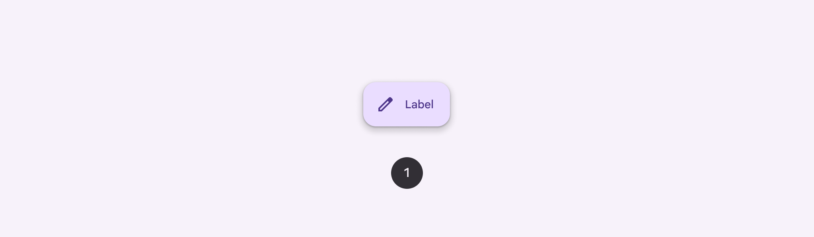

1. Extended FAB

|
Variant

 |

M3

 |

M3 Expressive

 |
| --- | --- | --- |
|

Small extended FAB

 |

\--

 |

Available

 |
|

Medium extended FAB

 |

\--

 |

Available

 |
|

Large extended FAB

 |

\--

 |

Available

 |
|

Extended FAB (baseline) 

 |

Available

 |

Not recommended. Use **small extended FAB.**

 |

## Tokens & specs

Use the table's menu to select a token set. Extended FAB tokens are organized by size and color.

```
Extended FAB - Size - SmallTokenValueExtended FAB small container heightmd.comp.extended-fab.small.container.height56dpExtended FAB small label textmd.comp.extended-fab.small.label-textAaExtended FAB small icon sizemd.comp.extended-fab.small.icon.size24dpExtended FAB small container shapemd.comp.extended-fab.small.container.shapeExtended FAB small leading spacemd.comp.extended-fab.small.leading-space16dpExtended FAB small icon label spacemd.comp.extended-fab.small.icon-label-space8dpExtended FAB small trailing spacemd.comp.extended-fab.small.trailing-space16dp
```

```
Extended FAB - Size - SmallTokenValueExtended FAB small container heightmd.comp.extended-fab.small.container.height56dpExtended FAB small label textmd.comp.extended-fab.small.label-textAaExtended FAB small icon sizemd.comp.extended-fab.small.icon.size24dpExtended FAB small container shapemd.comp.extended-fab.small.container.shapeExtended FAB small leading spacemd.comp.extended-fab.small.leading-space16dpExtended FAB small icon label spacemd.comp.extended-fab.small.icon-label-space8dpExtended FAB small trailing spacemd.comp.extended-fab.small.trailing-space16dp
```

```
Extended FAB - Size - SmallTokenValueExtended FAB small container heightmd.comp.extended-fab.small.container.height56dpExtended FAB small label textmd.comp.extended-fab.small.label-textAaExtended FAB small icon sizemd.comp.extended-fab.small.icon.size24dpExtended FAB small container shapemd.comp.extended-fab.small.container.shapeExtended FAB small leading spacemd.comp.extended-fab.small.leading-space16dpExtended FAB small icon label spacemd.comp.extended-fab.small.icon-label-space8dpExtended FAB small trailing spacemd.comp.extended-fab.small.trailing-space16dp
```

```
Extended FAB - Size - Small
```

```
Extended FAB - Size - Small
```

```
Extended FAB - Size - Small
```

```
Extended FAB - Size - Small
```

Extended FAB - Size - Small

Token

Value

Extended FAB small container height

md.comp.extended-fab.small.container.height

56dp

Extended FAB small label text

md.comp.extended-fab.small.label-text

Aa

Extended FAB small icon size

md.comp.extended-fab.small.icon.size

24dp

Extended FAB small container shape

md.comp.extended-fab.small.container.shape

Extended FAB small leading space

md.comp.extended-fab.small.leading-space

16dp

Extended FAB small icon label space

md.comp.extended-fab.small.icon-label-space

8dp

Extended FAB small trailing space

md.comp.extended-fab.small.trailing-space

16dp

## Anatomy

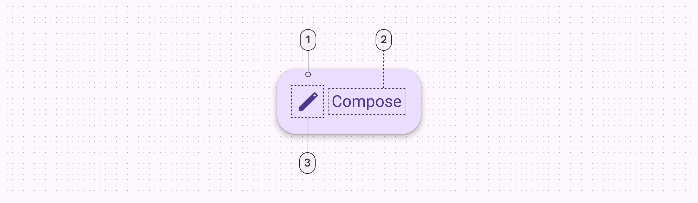

1. Container
2. Label text
3. Icon

## Color

Color values are implemented through design tokens. For design, this means working with color values that correspond with tokens. For implementation, a color value will be a token that references a value. [Learn more about design tokens](/m3/pages/design-tokens/overview/) 

### Color styles

Extended FABs can use several combinations of **color** and **on color** styles, such as **primary** and **on primary**. The following color mappings provide the same level of contrast and functionality, so choose a color mapping based on visual preference.

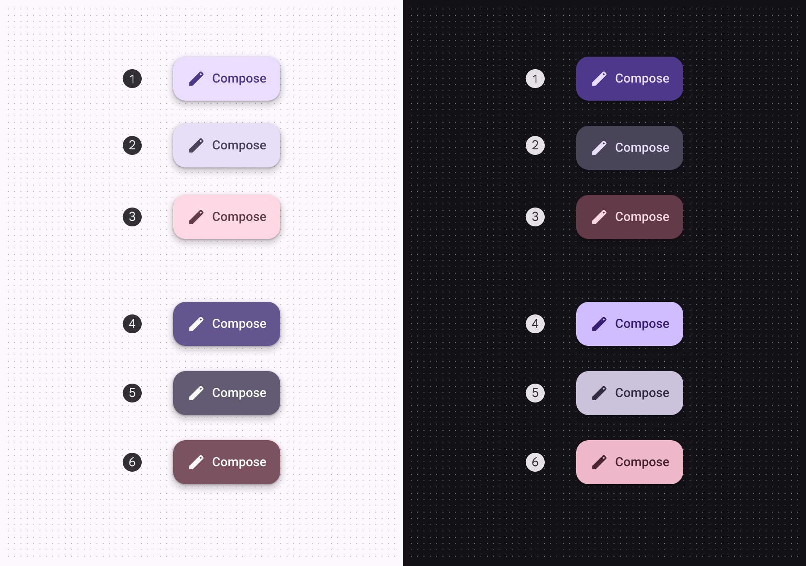

Extended FAB color roles used for light and dark schemes:

1. Primary container & on primary container (default)
2. Secondary container & on secondary container
3. Tertiary container & on tertiary container
4. Primary & on primary
5. Secondary & on secondary
6. Tertiary & on tertiary

### Baseline color styles

Extended FABs should no longer use surface color styles. They’re still available, but not recommended.

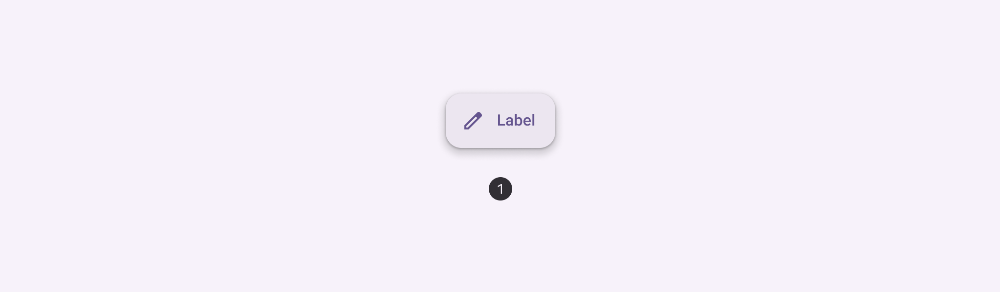

1. Surface container FAB

## States

States are visual representations used to communicate the status of a component or interactive element. [Learn more about interaction states](/m3/pages/interaction-states/overview)

When using a non-default color mapping for extended FABs, make sure the state layer color is the same as the icon color. For example, the state layer color for primary mapping should be md.sys.color.primary.

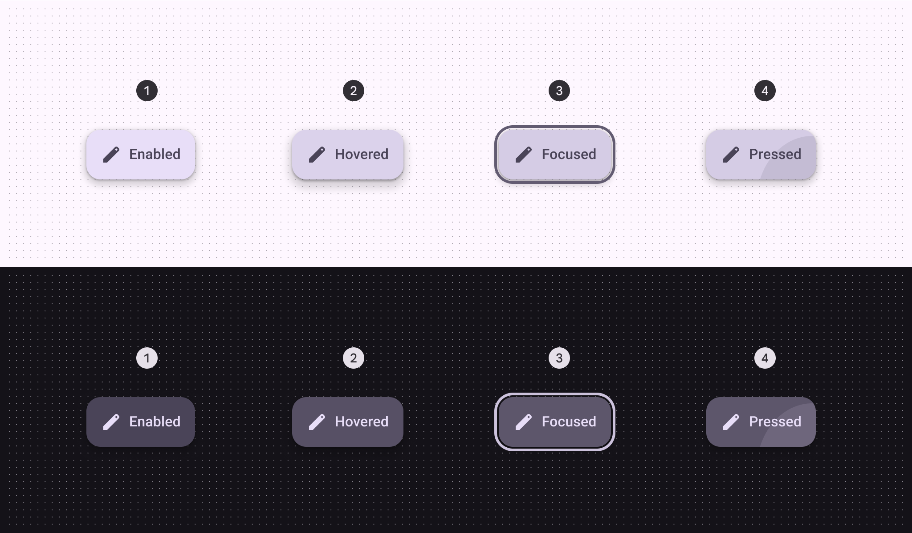

1. Enabled
2. Hovered - elevation 4
3. Focused
4. Pressed

## Measurements

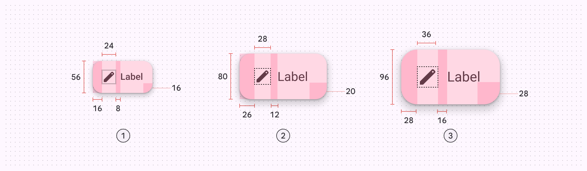

Size and padding measurements of the small, medium, and large extended FABs


Extended FABs should have margins of 16dp

## Baseline extended FAB

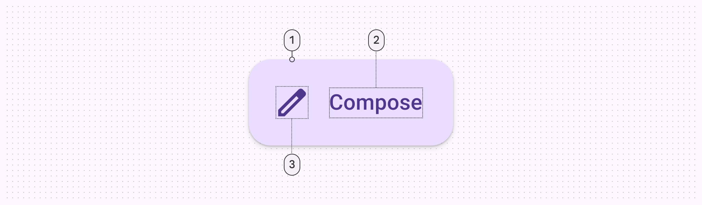

1. Container
2. Label text
3. Icon

### Baseline configurations

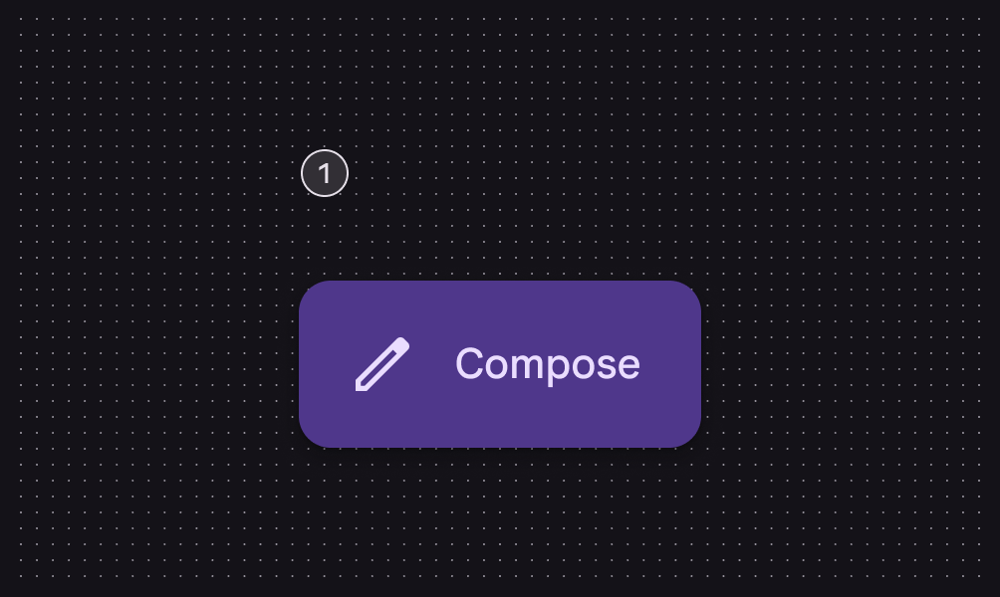

With icon

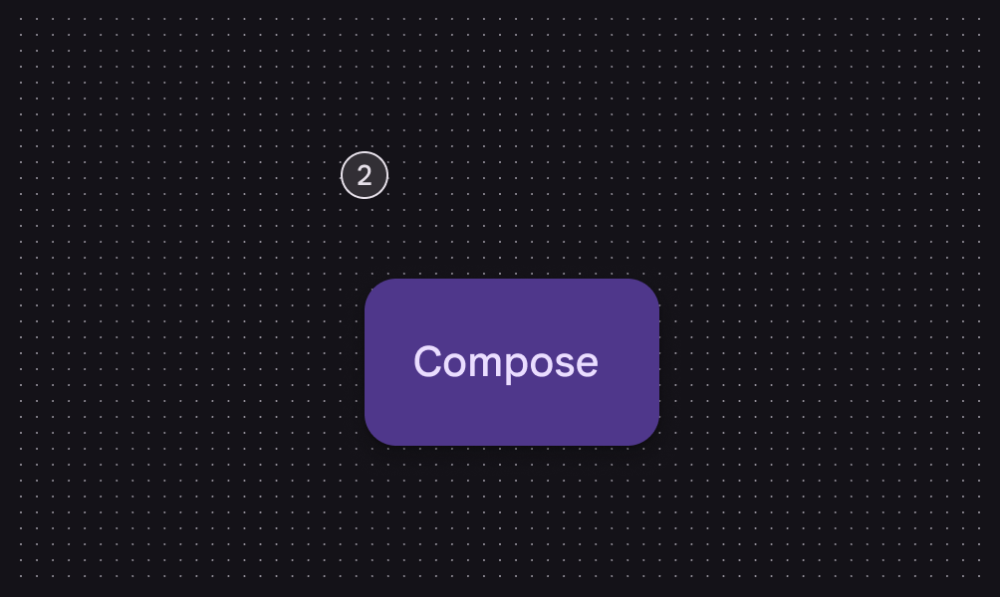

Without icon

### Baseline tokens

Use the table's menu to select a token set. The baseline extended FAB token sets are organized by common tokens, then by surface and branded color styles. Other color styles like primary, secondary, and tertiary are still used by the latest extended FABs.

```
Extended FAB - Color - Tonal primaryTokenValueEnabledHoveredFocusedPressed
```

```
Extended FAB - Color - Tonal primaryTokenValueEnabledHoveredFocusedPressed
```

```
Extended FAB - Color - Tonal primaryTokenValueEnabledHoveredFocusedPressed
```

```
Extended FAB - Color - Tonal primary
```

```
Extended FAB - Color - Tonal primary
```

```
Extended FAB - Color - Tonal primary
```

```
Extended FAB - Color - Tonal primary
```

Extended FAB - Color - Tonal primary

Token

Value

Enabled

Hovered

Focused

Pressed

### Baseline colors

Color values are implemented through design tokens. For design, this means working with color values that correspond with tokens. For implementation, a color value will be a token that references a value. [Learn more about design tokens](/m3/pages/design-tokens/overview/)

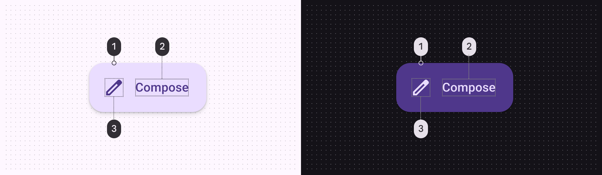

Extended FAB color roles used for light and dark schemes:

1. Primary container + shadow
2. On primary container
3. On primary container

#### Additional color mappings

Extended FABs can use other combinations of container and icon colors. The color mappings below provide the same legibility and functionality as the default, so the color mapping you use depends on style alone.

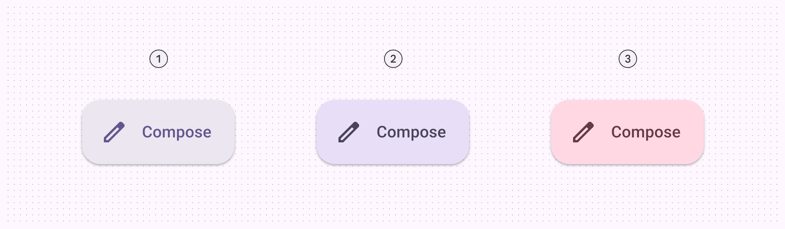

Extended FABs can use different combinations of container and icon colors

### Baseline states

States are visual representations used to communicate the status of a component or interactive element. [Learn more about interaction states](/m3/pages/interaction-states)

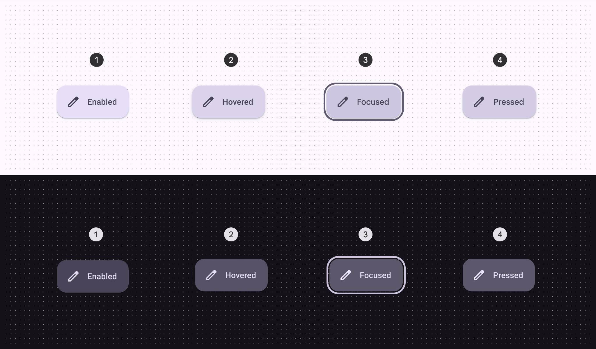

1. Enabled
2. Hovered
3. Focused
4. Pressed

### Baseline measurements

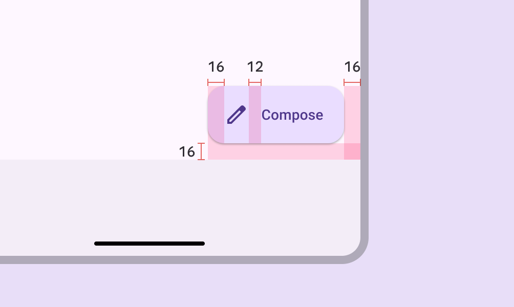

Extended FABs have a padding of 16dp

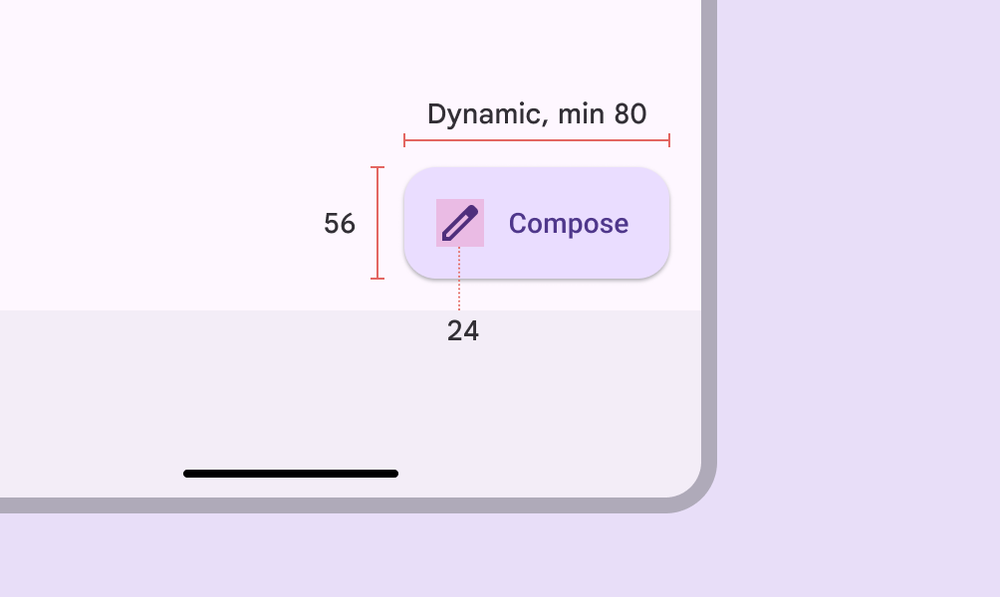

Extended FAB height, width, and icon size

| Attribute | Value |
| --- | --- |
|
Container height

 |

56dp

 |
|

Container width

 |

Dynamic, 80dp min

 |
|

Container shape

 |

16dp corner radius

 |
|

Icon size

 |

24dp

 |
|

Padding

 |

16dp

 |

