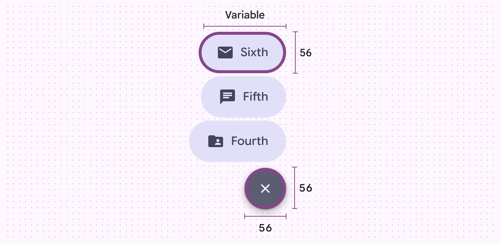
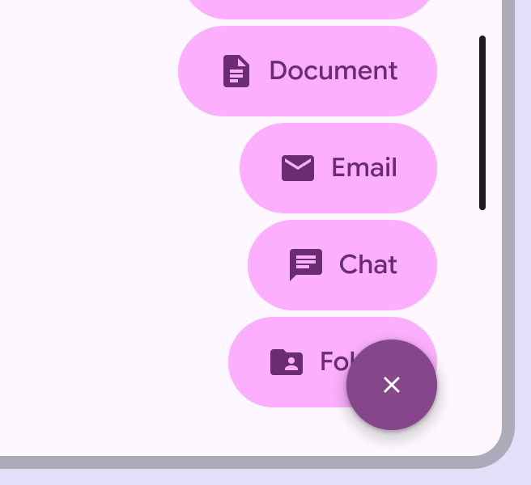
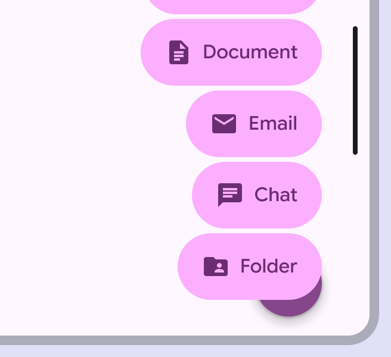
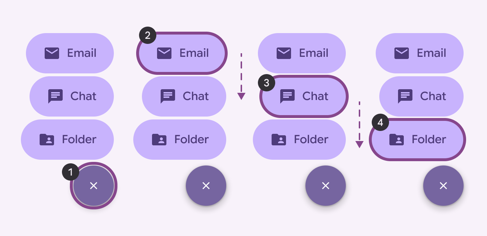
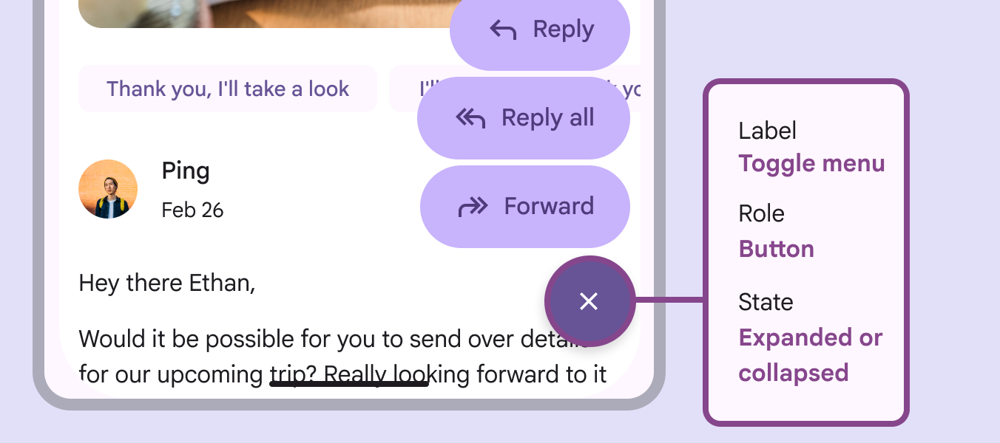
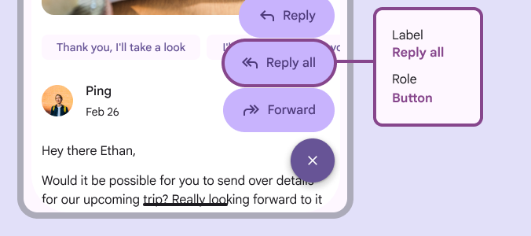

# FAB menu

The floating action button (FAB) menu opens from a FAB to display multiple related actions

## Use cases

People should be able to do the following using assistive technology:

- Navigate and interact with the FAB menu
- Ensure focus is correct when navigating through the menu

## Interaction & style

FAB menu elements meet the minimum target size of 48dp.

FAB menus have 48x48dp minimum width and sufficient spacing by default

When the FAB menu can scroll, make sure the items scroll behind the close button. The close button should always be easy to access and unobstructed.

check Do

Allow the menu items to scroll behind the close button

close Don’t

Don’t obstruct the close button in short screens like horizontal orientation

## Initial focus

When the FAB is selected, the FAB menu opens, and initial focus remains on the close button, which takes the place of the original FAB. Then the focus moves from the top menu item to the bottom.

Focus lands on the close button. People can then navigate through all the items.

1. Close button
2. First menu item
3. Second menu item
4. Third menu item

## Keyboard navigation

|
**Keys**

 |

**Actions**

 |
| --- | --- |
|

**Tab**

 |

Navigate to the next interactive element

 |
|

**Space** or **Enter**

 |

Activate the focused button or item

 |

## Labeling elements

On Android, a FAB menu’s close button should include a state to tell screen readers what action will occur when it's toggled. The close button should be labeled: 

- Label: Toggle menu
- Role: Button
- State: Expanded or collapsed

On Android, the **close button** accessibility labels should include a toggle menu label, button role, and an expanded or collapsed state

FAB menu items should be labeled:

- Label: Match the item’s UI text, such as **Reply all**
- Role: Button

Label FAB menu items to match their UI text, like **Reply all**, and use the button role  

On web, a FAB menu is a combination of a FAB [More on FABs](/m3/pages/fab/overview) and a Menus display a list of choices on a temporary surface. More on menus [More on menus](/m3/pages/menus/overview) component. The FAB opens the menu. Follow the [accessibility guidelines for FABs](/m3/pages/fab/accessibility) and [menus](/m3/pages/menus/accessibility). The FAB's accessibility label should describe the menu that the FAB will open.

