# FAB menu

The floating action button (FAB) menu opens from a FAB to display multiple related actions

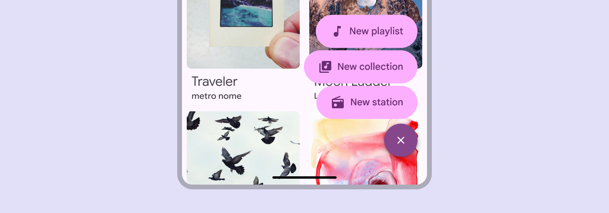

Use the FAB menu to show multiple related actions in a prominent, expressive style

## Usage

A FAB menu opens from a FAB to show multiple related actions. It should always appear in the same place as the FAB that opened it. This makes actions immediately accessible, and keeps the UI clean by concealing actions when they’re not needed. Don’t open a FAB menu from an extended FAB [More on extended FABs](/m3/pages/extended-fab/overview) or any other component.

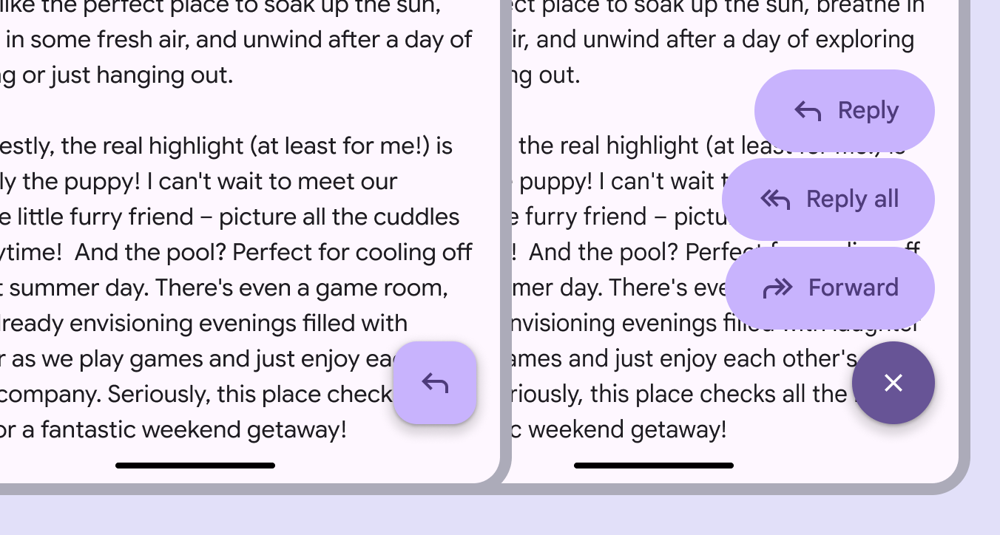

The FAB menu should always open from a FAB

The FAB menu should be aligned to the trailing edge of the window. In right-to-left (RTL) languages, this means the FAB and FAB menu should be aligned to the left edge, and the layout of elements should be mirrored.

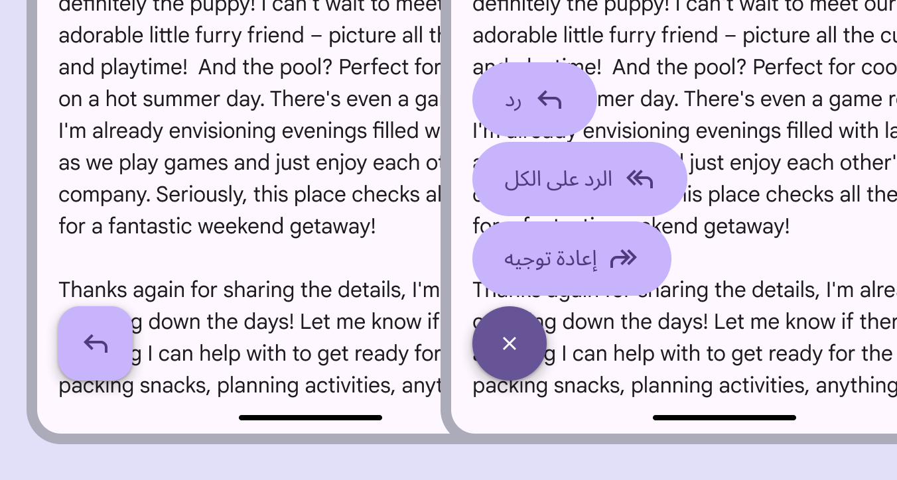

In RTL languages, the FAB menu should be left-aligned with the icon and text placement mirrored

FAB menus can contain 2–6 items. These should be closely related under a single action, like **Share**. Avoid grouping unrelated actions in the same FAB menu.

check Do

FAB menus can have 2-6 items

close Don’t

Don’t use a FAB menu with one item

When a FAB is paired with other components, like the floating toolbar [More on toolbars](/m3/pages/toolbars/overview) or navigation rail [More on navigation rails](/m3/pages/navigation-rail/overview), don’t use the FAB menu. This prevents cognitive overload and interface clutter. 

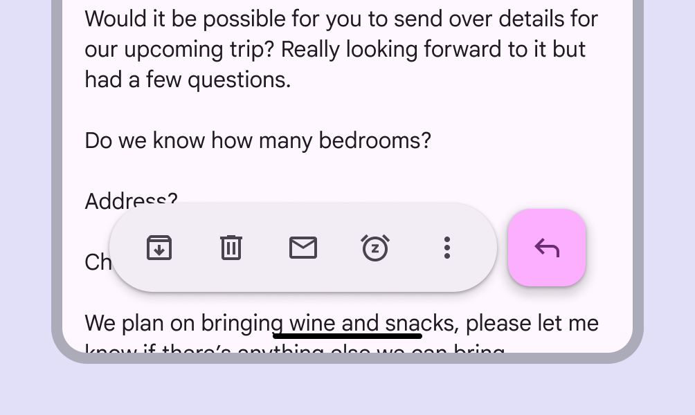

check Do

FABs can be placed next to toolbars and other components

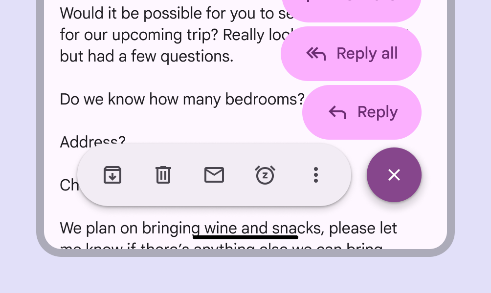

close Don’t

Don't use a FAB menu with a toolbar or navigation rail

### Color sets

FAB menus have three color sets: primary, secondary, and tertiary. Use the color set that best matches the FAB color style. Use the primary FAB menu color set with the **primary** or **primary container** FAB color styles. 

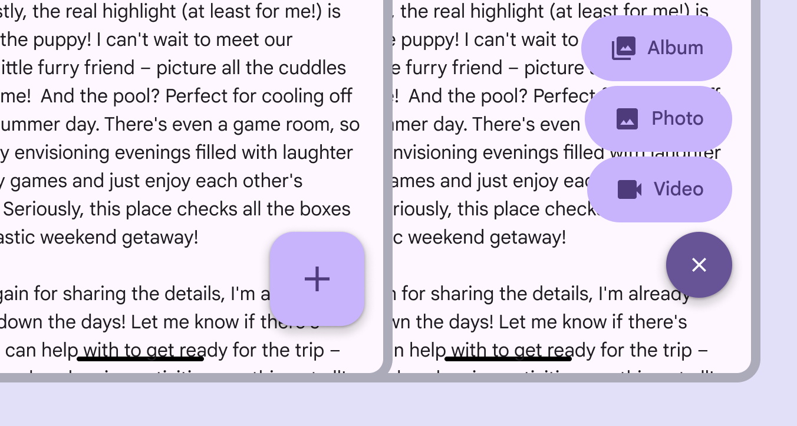

A primary FAB is paired with a primary FAB menu

Use the secondary FAB menu color set with the **secondary** or **secondary container** FAB color styles. 

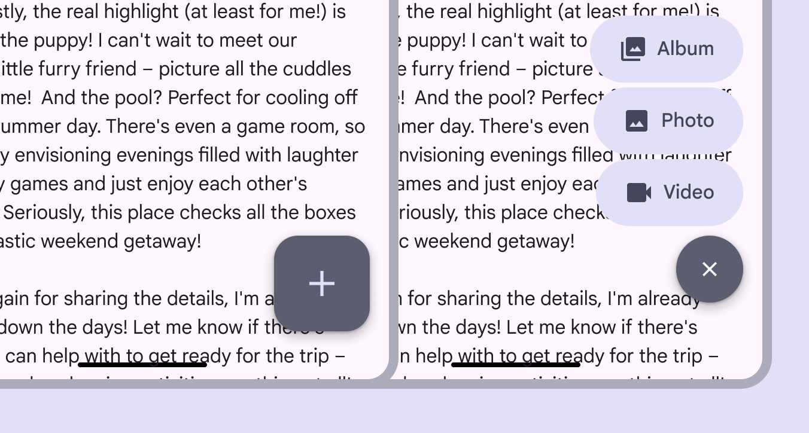

A secondary FAB is paired with a secondary FAB menu

Use the tertiary FAB menu color set with the **tertiary** or **tertiary container** FAB color styles. 

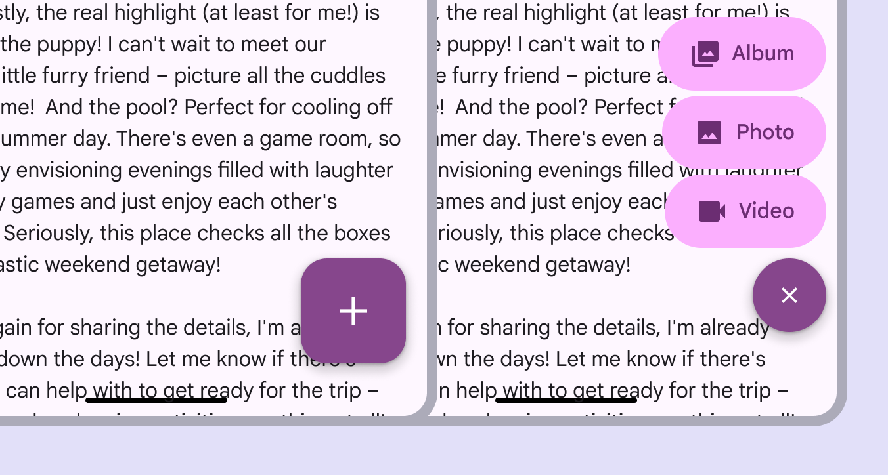

A tertiary FAB is paired with a tertiary FAB menu

## Anatomy

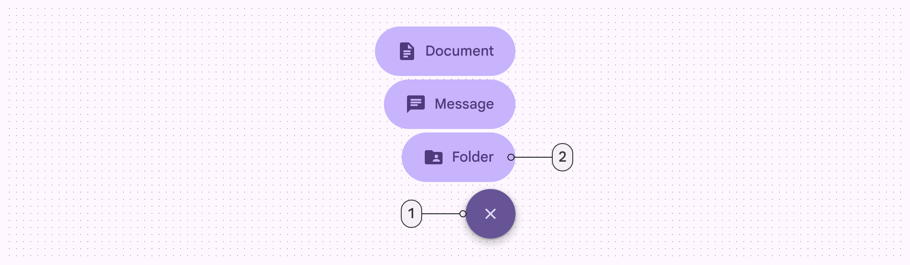

1. Close button
2. List item

FAB menu items should always have label text. The icons shouldn’t be removed since they make each item easy to identify. 

exclamation Caution

Only remove the icon if necessary. The icon provides a differentiation between items.

close Don’t

Don’t remove the label

The list item should always hug its contents and look consistent. Avoid truncating text or setting fixed widths. All FAB menu elements should be rounded.

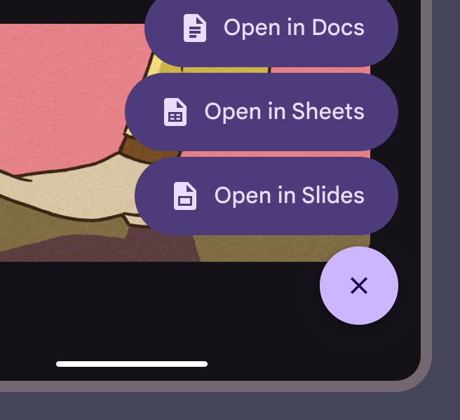

check Do

Keep the padding between the container and icon, icon and text, and text and container consistent

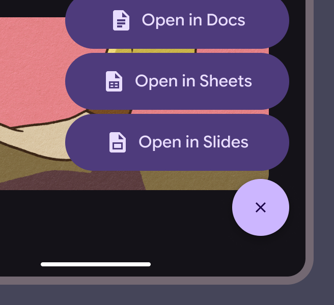

close Don’t

Don’t expand container sizes

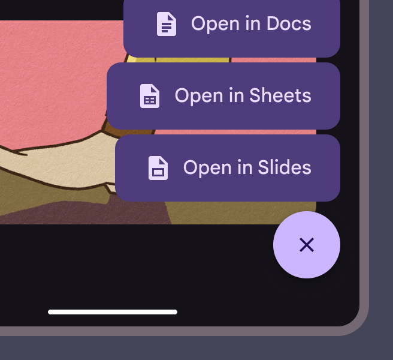

close Don’t

Don’t change FAB menu shapes

## Adaptive layout

The FAB menu can open from any sized FAB [More on FABs](/m3/pages/fab/overview). Use with a FAB size suitable for the window size class. For example, larger FABs are recommended for larger windows. The FAB menu works in any window size. Pair it with the FAB suitable for that window size. The FAB menu should remain anchored to the same corner or edge regardless of window size. In large and extra large windows, the FAB and FAB menu margins should increase from 16dp to 24dp.

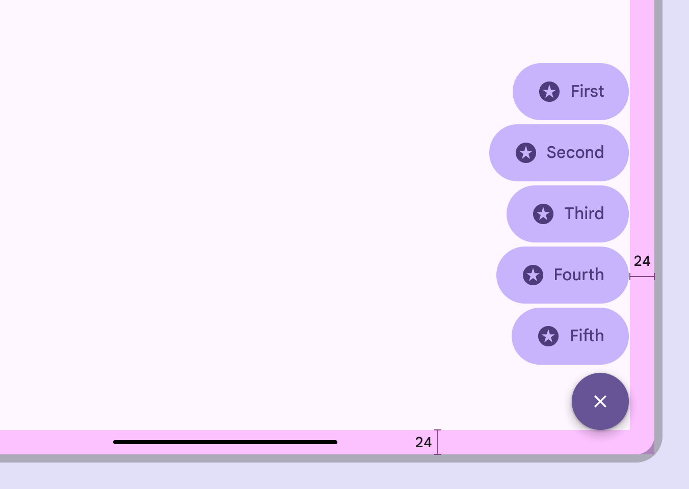

On desktop, use larger FABs and margins

On web, the FAB menu uses a Menus display a list of choices on a temporary surface. More on menus [More on menus](/m3/pages/menus/overview) component for an experience that's consistent with other desktop apps.

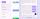

The same FAB menu options on both large window (left) and an Android compact window (right)

## Behavior

### Appearing

The FAB should transform into the close button of the FAB menu. The menu items should appear using the [enter and exit](/m3/pages/motion-transitions/transition-patterns#e1c2a650-d7a4-4a6d-9025-e6b7845291ed) transition. Originate the transition from one of the FAB's trailing corners, preferably the top-aligned corner. Animate FAB menus from the top-aligned corner of FABs

To ensure accessibility for keyboard users on the web, avoid positioning the FAB menu to completely obscure the focus indicator of an actionable element. Partially covering the desired element is fine, as long as the focus indicator is visible.

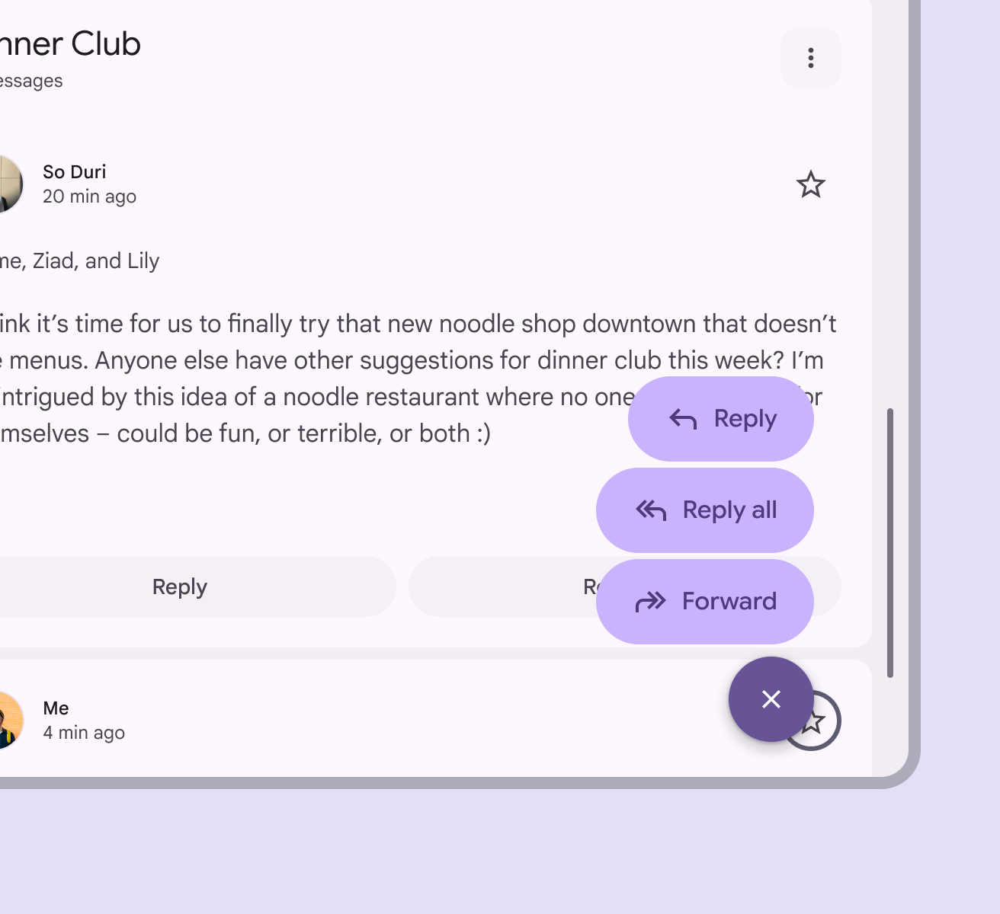

check Do

Ensure the actionable element and its focus indicator are visible behind the FAB menu

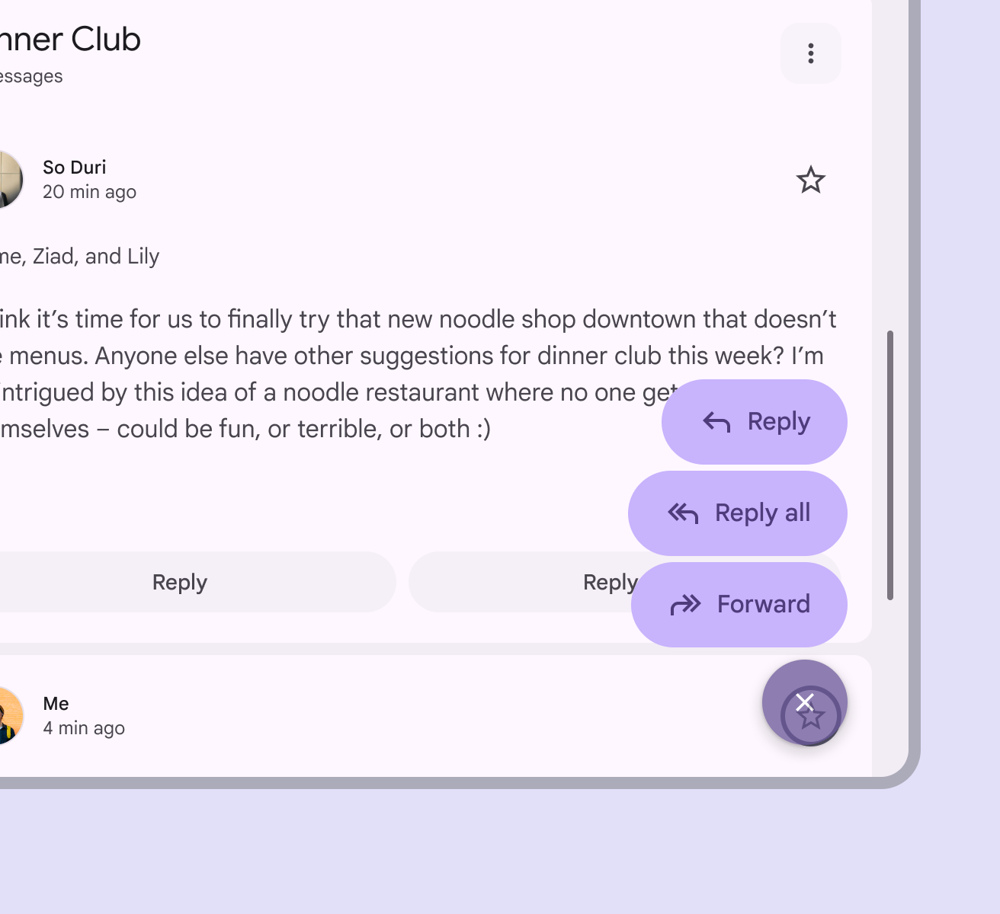

close Don’t

Don’t block an actionable element and its focus indicator completely with the FAB menu

### Scrolling

When window height is limited, like when viewing phones in horizontal orientation, FAB menu items can scroll. The items should scroll behind the close button. FAB menus can scroll if the window height is too short to contain all the options

### Expanding

Any FAB menu item can expand and adapt to any shape using a [container transform](/m3/pages/motion-transitions/transition-patterns#b67cba74-6240-4663-a423-d537b6d21187) transition pattern. This includes a surface that is part of the app structure, or a surface that spans the entire screen. FAB menu items can transition into any kind of shape when selected

