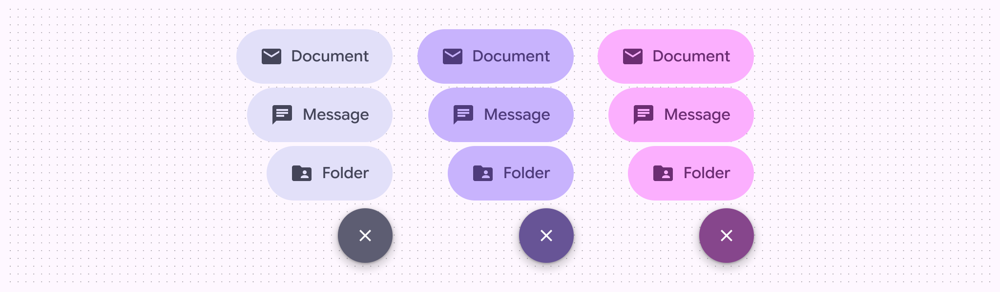
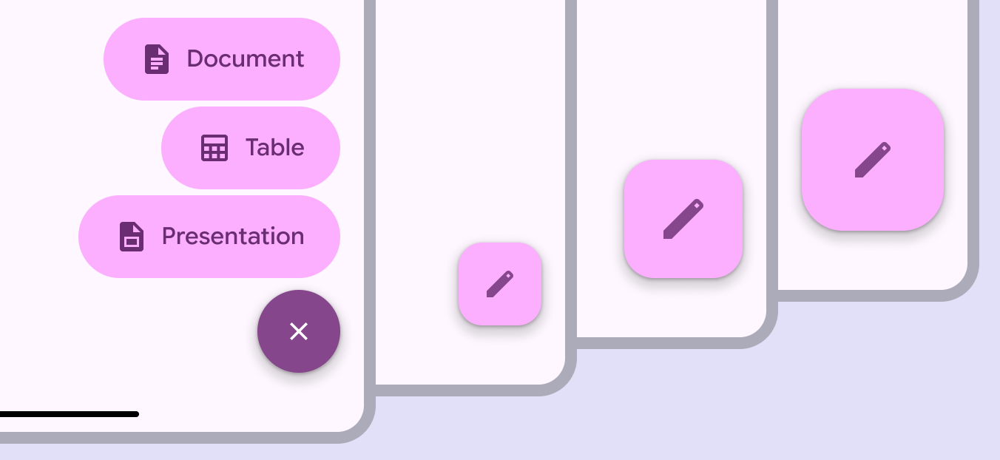
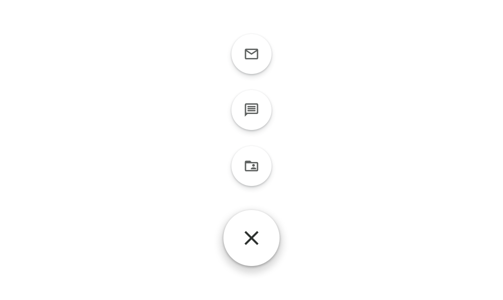
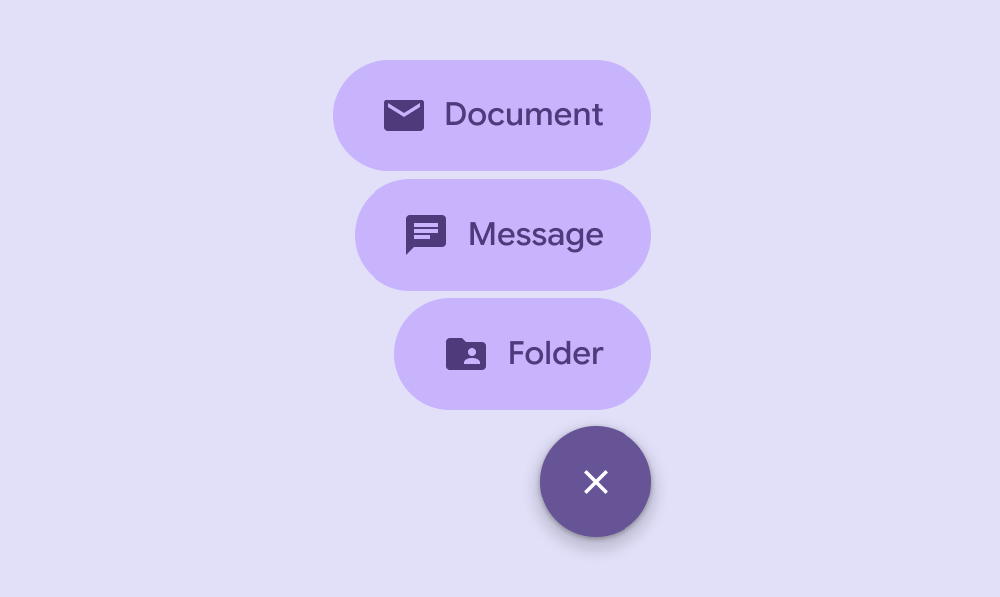

# FAB menu

The floating action button (FAB) menu opens from a FAB to display multiple related actions

- Opens from a FAB [More on FABs](/m3/pages/fab/overview) to show 2–6 related actions floating on screen
- One FAB menu size for all sizes of FABs
- Not used with extended FABs [More on extended FABs](/m3/pages/extended-fab/overview)
- Available in primary, secondary, and tertiary color sets

The FAB menu comes in three color sets: primary, secondary, tertiary

## Availability & resources

| Type | Resource | Status |
| --- | --- | --- |
| Design | [Design Kit (Figma)](https://www.figma.com/community/file/1035203688168086460) | Available |
| Implementation | [Jetpack Compose: Expressive](https://developer.android.com/reference/kotlin/androidx/compose/material3/package-summary#FloatingActionButtonMenu\(kotlin.Boolean,kotlin.Function0,androidx.compose.ui.Modifier,androidx.compose.ui.Alignment.Horizontal,kotlin.Function1\)) | Available |

## M3 Expressive update

**May 2025**

The FAB menu adds more options to the FAB. It should replace the speed dial and any usage of stacked small FABs. [More on M3 Expressive](https://m3.material.io/blog/building-with-m3-expressive)

New component added to catalog:

- One menu size that pairs with any FAB
- Replaces any usage of stacked small FABs

Color:

- Contrasting close button and item colors
- Supports dynamic color
- Compatible with any FAB color style

The FAB menu uses contrasting color and large items to focus attention. It can open from any size FAB.

## Differences from M2

M2: The speed dial used small round FABs

M3: The FAB menu uses dynamic color and a larger item size

