# FAB menu

The floating action button (FAB) menu opens from a FAB to display multiple related actions

## Variants

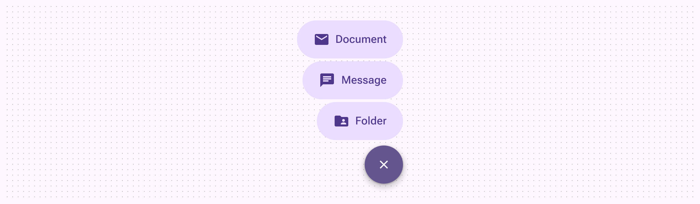

There’s one variant of FAB menu

|
Variant

 |

M3

 |

M3 Expressive

 |
| --- | --- | --- |
|

FAB menu

 |

\--

 |

Available

 |

## Configurations

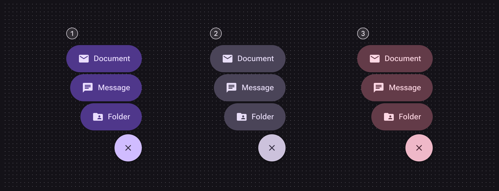

Three color sets:

1. Primary
2. Secondary
3. Tertiary

|
Category

 |

Configuration

 |

M3

 |

M3 Expressive

 |
| --- | --- | --- | --- |
|

Color

 |

Primary set, secondary set, tertiary set

 |

\--

 |

Available

 |

## Tokens & specs

Use the table's menu to switch token sets. The FAB menu has a common token set and six color sets, three for each element (close button and menu item). [Learn about design tokens](/m3/pages/design-tokens/overview/)

```
FAB menu - CommonTokenValueClose buttonList item
```

```
FAB menu - CommonTokenValueClose buttonList item
```

```
FAB menu - CommonTokenValueClose buttonList item
```

```
FAB menu - Common
```

```
FAB menu - Common
```

```
FAB menu - Common
```

```
FAB menu - Common
```

FAB menu - Common

Token

Value

Close button

List item

## Anatomy

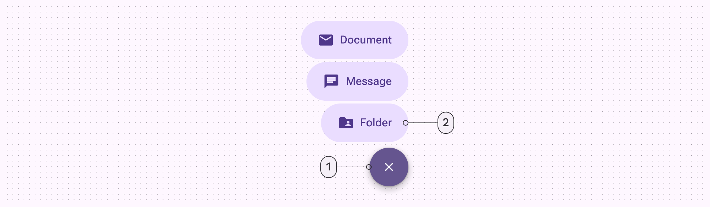

1. Close button
2. Menu item

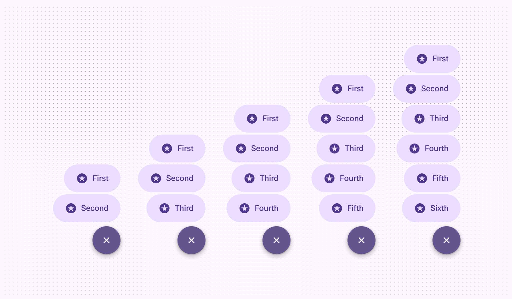

The FAB menu can have up to six items

## Color

Color values are implemented through design tokens. For designers, this means working with color values that correspond with tokens. In implementation, a color value will be a token that references a value. [Learn more about design tokens](/m3/pages/design-tokens/overview)

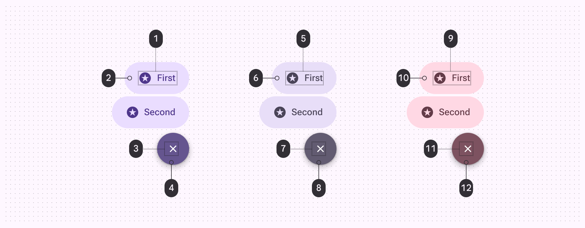

1. On primary container
2. Primary container
3. On primary
4. Primary
5. On secondary container
6. Secondary container
7. On secondary
8. Secondary
9. On tertiary container
10. Tertiary container
11. On tertiary
12. Tertiary

## States

States are visual representations used to communicate the status of a component or interactive element. [Learn more about interaction states](/m3/pages/interaction-states)

### Close button

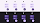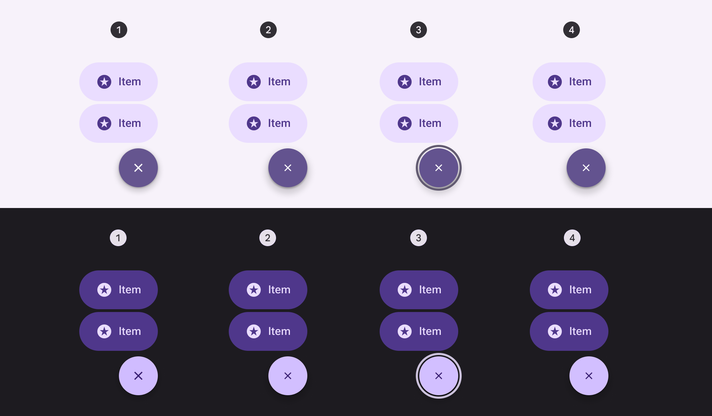

Close button states in light and dark themes: 

1. Enabled
2. Hovered
3. Focused
4. Pressed

### Menu item

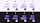

Menu item states in light and dark themes:

1. Enabled
2. Hovered
3. Focused
4. Pressed

## Measurements

FAB menu items share the same measurements as the medium button [More on buttons](/m3/pages/common-buttons/overview) specs. The close button should always be 56dp.

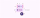

FAB menu size measurements

The FAB menu animates from the top trailing edge of the FAB to ensure a smooth animation.

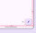

The FAB should always have 16dp margins

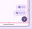

The close button and FAB share the top trailing corner as an anchor and appear in the same place

Larger FABs will place the FAB menu slightly higher, with larger margins underneath.

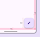

The medium FAB placement has 16dp margins

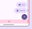

The close button is placed higher to align with the top of the medium FAB

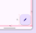

The large FAB placement has 16dp margins

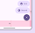

The close button is placed higher to align with the top of the large FAB

On web, the FAB menu opens from the FAB, and inherits its states and specs from the baseline Menus display a list of choices on a temporary surface. More on menus [More on menus](/m3/pages/menus/overview/) component. The gap between the FAB and menu can vary, but 4dp is recommended.

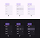

Spacing and interaction on FAB menu for web:

1. Enabled
2. Hovered
3. Selected

