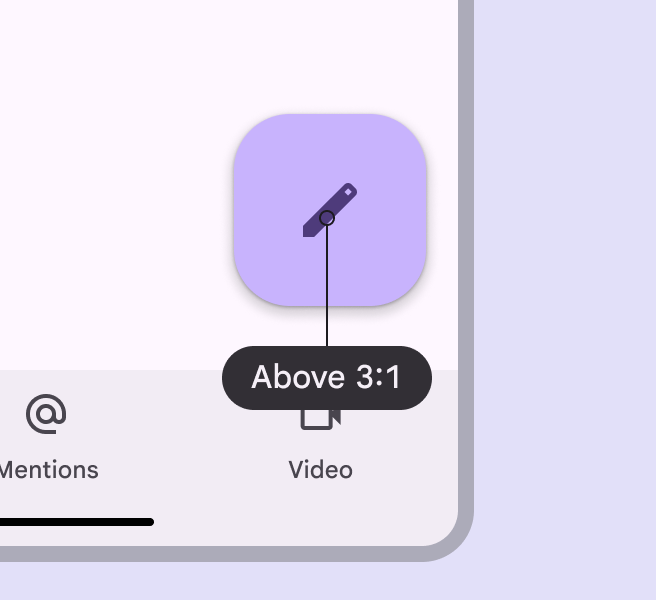
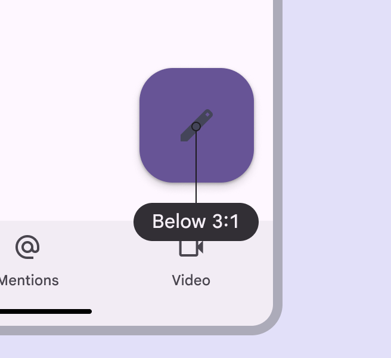
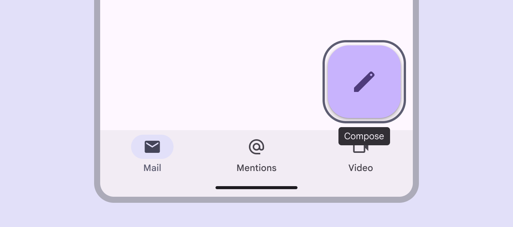
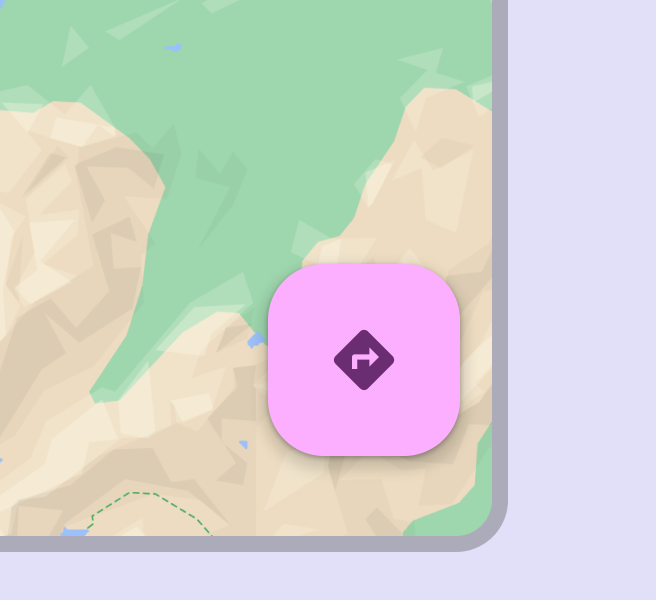
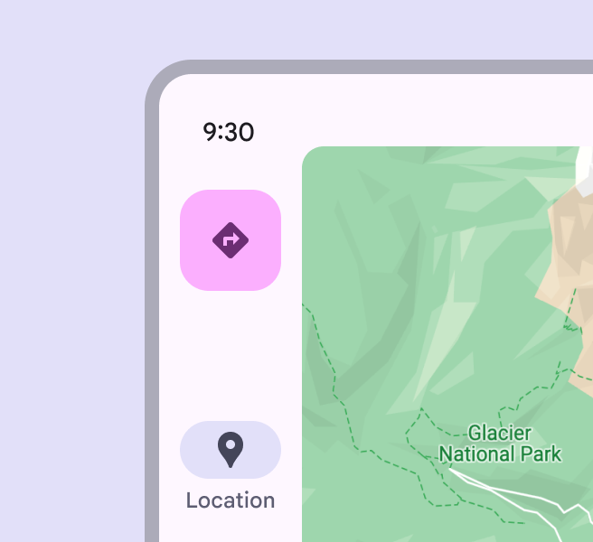
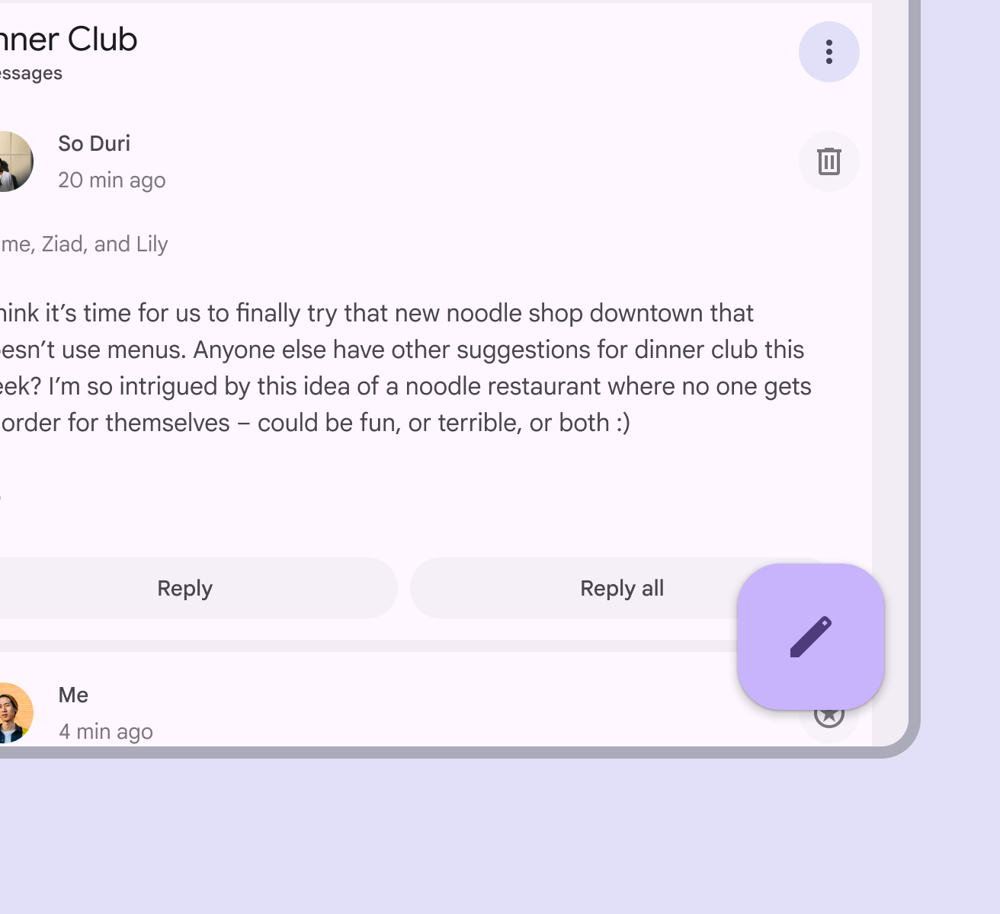
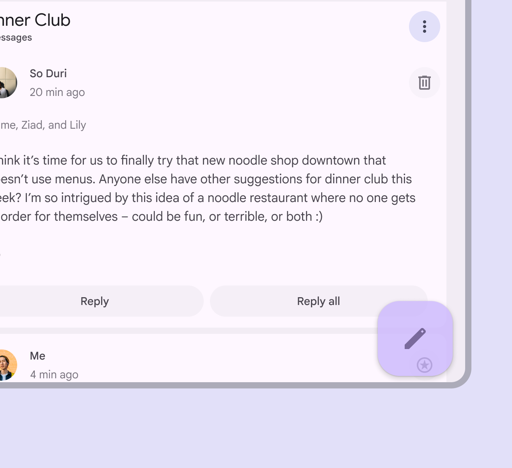
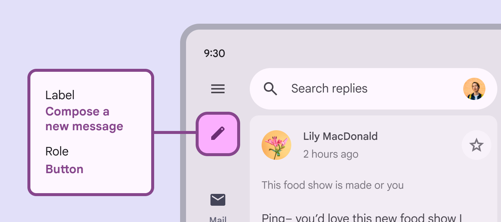

# Floating action buttons (FABs)

Floating action buttons (FABs) help people take primary actions

## Use cases

People should be able to do the following using assistive technology:

- Navigate to and activate the FAB
- Perform an action with the FAB
- Expand and minimize an extended FAB [More on extended FABs](/m3/pages/extended-fab/overview)

## Interaction & style

Don't disable the FAB. If the action represented in the FAB is unavailable, the FAB shouldn't appear. Ensure the icon has a minimum 3:1 contrast ratio with the container.

check Do

FAB icons are above the 3:1 contrast ratio

close Don’t

Avoid using colors with a contrast below 3:1

## Focus

Ensure the FAB is prioritized in the overall focus order to create an efficient experience for people who navigate UIs with assistive tech. On mobile, the focus order may start with the app bar [More on app bars](/m3/pages/app-bars/overview), move to the navigation bar [More on navigation bars](/m3/pages/navigation-bar/overview), and then skip past any other content on the page to land on the FAB. Consider displaying a tooltip when the FAB is focused. This is supported on web.

Tooltips surface the FAB’s label when focused

## Layout & position

To make it easier for users of screen readers to reach a primary action such as a FAB on expanded window sizes [More on expanded window size class](/m3/pages/applying-layout/expanded), consider placing the FAB in the upper left region. However, it’s critical to test placement options with users to see if the upper left region is the best position in all browser windows. For compact [More on compact window size class](/m3/pages/applying-layout/compact) and medium window sizes [More on medium window size class](/m3/pages/applying-layout/medium), the best place for the FAB is the lower right corner of a screen.

In compact windows, place the FAB in the bottom trailing edge

In expanded windows, place the FAB in the navigation rail

To ensure accessibility for keyboard users on the web, avoid positioning the FAB in a way that completely obscures the focus indicator of an actionable element. It’s okay to partially cover the desired element, as long as the focus indicators are still visible.

check Do

The FAB can partially cover an actionable element, as long as the focus indicator is still clearly visible

close Don’t

Don’t completely obscure an actionable element and its focus indicator

## Keyboard navigation

|
**Keys**

 |

**Actions**

 |
| --- | --- |
|

**Tab**

 |

Focus lands on the FAB

 |
|

**Space** or **Enter**

 |

Perform the default action on an item

 |

## Labeling elements

The accessibility label should describe the action that the button is performing, such as .

The accessibility label of the FAB with a pencil icon describes the action of composing a new message

