# Floating action buttons (FABs)

Floating action buttons (FABs) help people take primary actions

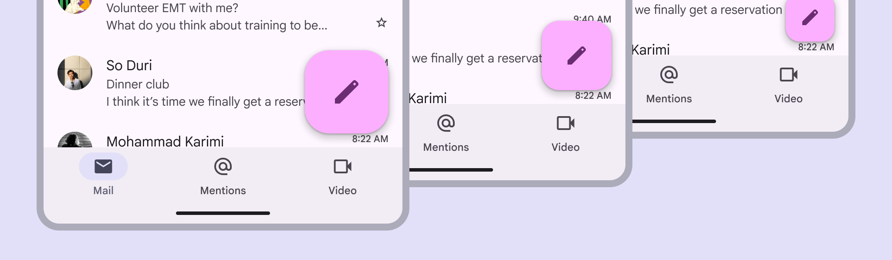

FABs have multiple sizes that scale with the window size

## Usage

Use a FAB for the most important action on a screen; it appears in front of all other content. The FAB can be aligned left, center, or right. It can be positioned above the navigation bar, or nested within it.

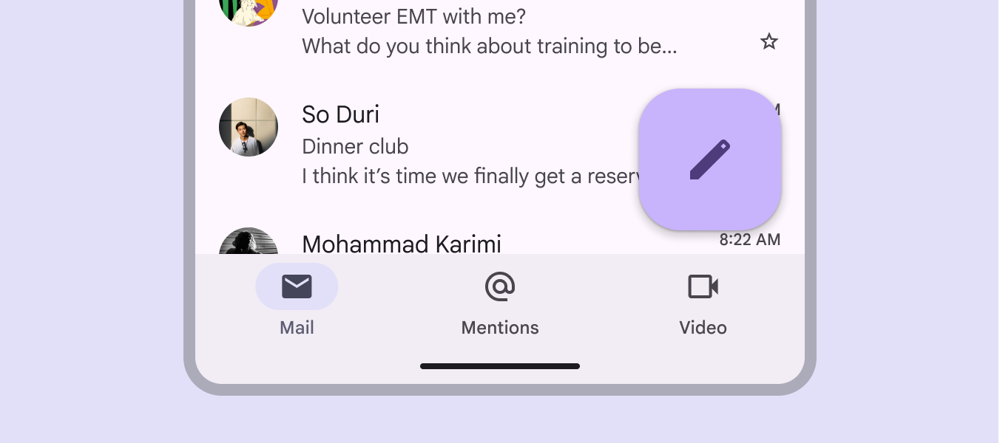

FABs can use dynamic color

There are three FAB sizes:

1. FAB
2. Medium FAB (most recommended)
3. Large FAB

Choose the FAB size based on the visual hierarchy of your layout. Note: The small FAB is no longer recommended.

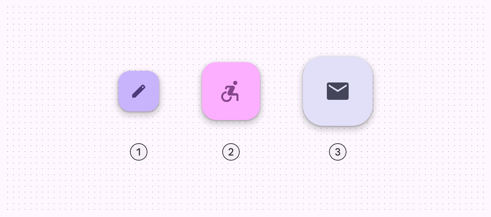

1. FAB
2. Medium FAB
3. Large FAB

The FAB is the smallest size, and is best used in compact windows [More on compact window size class](/m3/pages/breakpoints/compact) where other actions may be present on screen. The medium FAB is recommended for most situations, and works best in compact and medium windows [More on medium window size class](/m3/pages/breakpoints/medium). Use it for important actions without taking up too much space. A large FAB is useful in any window size when the layout calls for a clear and prominent primary action, but is best suited for expanded [More on expanded window size class](/m3/pages/breakpoints/expanded) and larger window sizes, where its size helps draw attention.

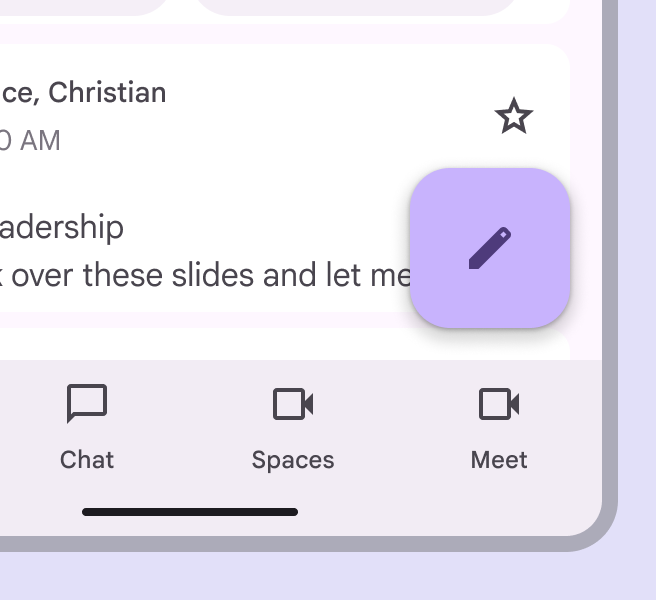

Use a medium FAB in most window sizes

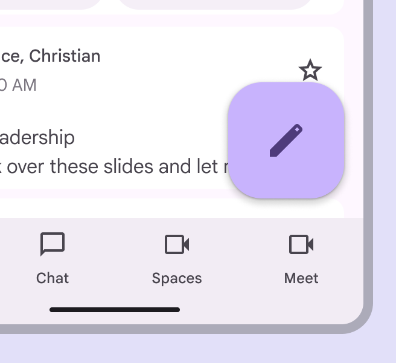

Use a large FAB when the primary action needs to be prominent

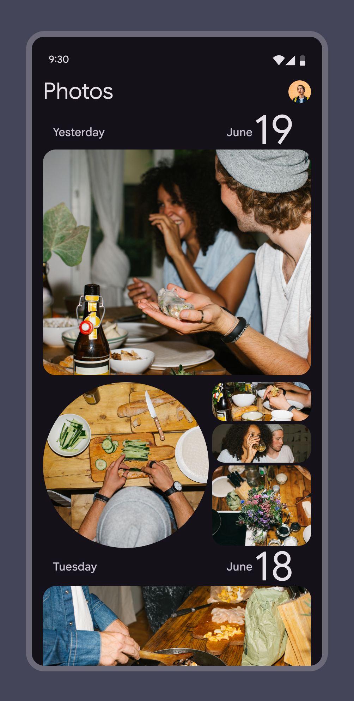

check Do

FABs are not needed on every screen, such as when images represent primary actions

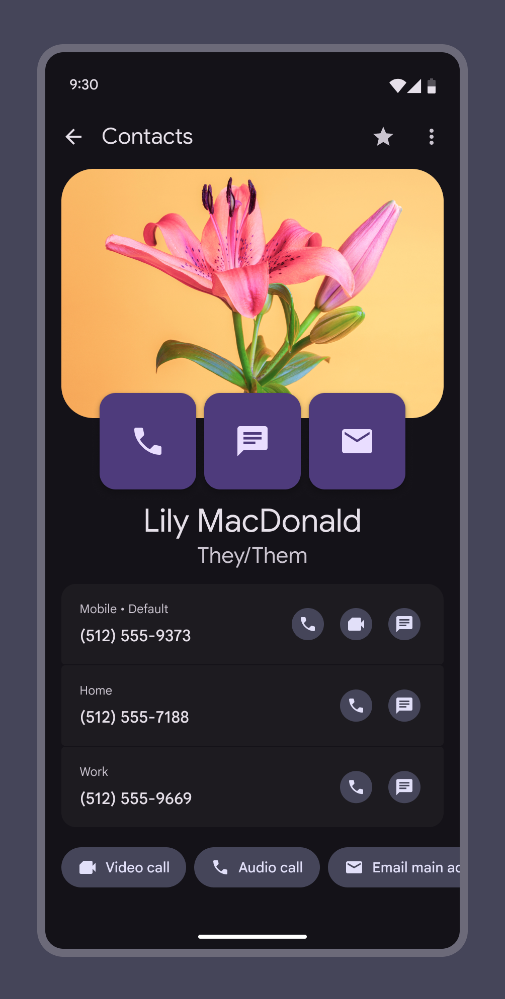

close Don’t

Don't display multiple FABs on a single screen

A FAB can transform into an extended FAB [More on extended FABs](/m3/pages/extended-fab/overview) on larger screens, or it can transition into a FAB menu when selected. Use a FAB menu when there are many kinds of actions relevant to the FAB. 

[More on FAB menus](/m3/pages/fab-menu)

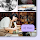

Use the extended FAB when label text is necessary

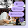

Use the FAB menu when there are many kinds of actions relevant to the FAB

## Actions

A FAB can trigger an action on the current screen, or it can perform an action that creates a new screen. A FAB promotes an important, constructive action such as:

- Create
- Favorite
- Share
- Start a process

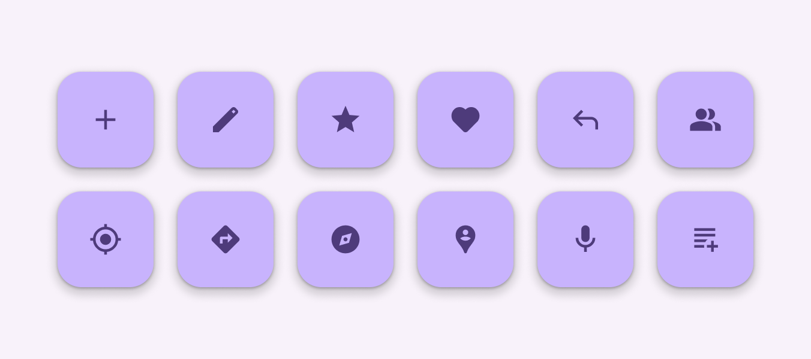

check Do

Use FABs for primary, positive actions

Avoid using a FAB for minor or destructive actions, such as:

- Archive or trash
- Alerts or errors
- Limited tasks like cutting text
- Controls better suited to a toolbar, like to adjust volume or font color

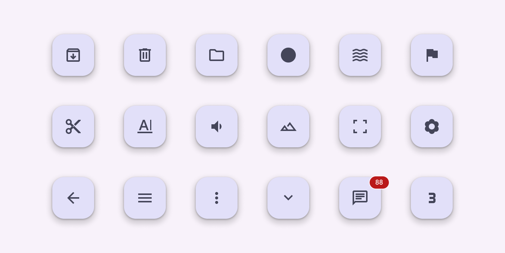

close Don’t

Don’t use FABs for minor, overflow, unclear, or destructive actions

## Anatomy

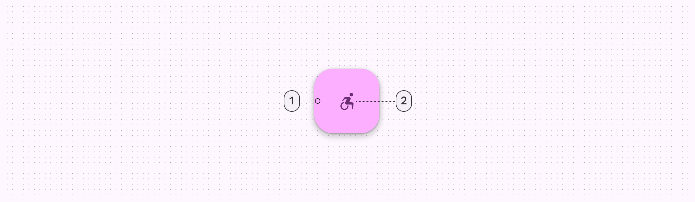

1. Container
2. Icon

### Container

The FAB is typically displayed in a square container. The container shouldn’t be covered by other elements, such as badges. The container must have sufficient color contrast with the surface it’s placed on.

A FAB container color needs to stand out from its background

### Icon

An icon in a FAB should be clear and understandable. When hovering over a FAB on web products, FABs should display a tooltip with an accompanying icon text label. Use a filled icon instead of an outlined icon. A FAB shouldn't contain notifications or actions found elsewhere on a screen.

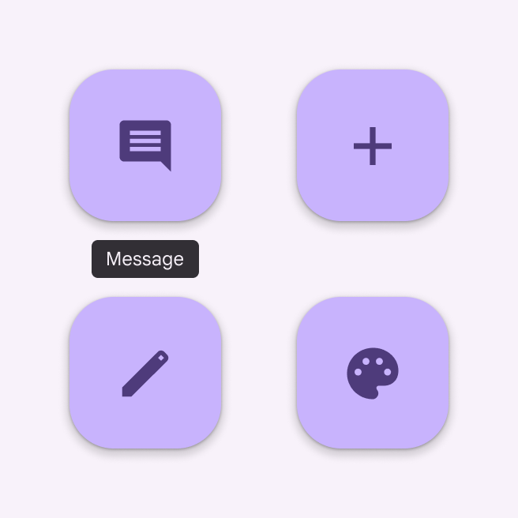

check Do

Use clear and simple icons such as add, message, or edit

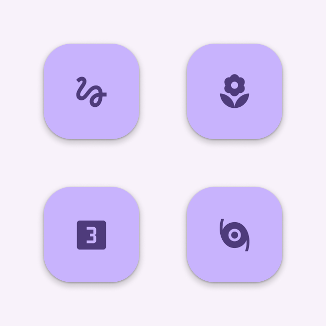

close Don’t

Don’t use confusing or open-ended icons to symbolize less common actions

## Adaptive design

In compact [More on compact window size class](/m3/pages/breakpoints/compact) and medium window sizes [More on medium window size class](/m3/pages/breakpoints/medium), the best place for the FAB is typically the lower right corner of a screen, since it’s easy to reach and is less likely to cover important content. In expanded window sizes [More on expanded window size class](/m3/pages/breakpoints/expanded), consider placing the FAB in the upper left corner, like in the navigation rail [More on navigation rails](/m3/pages/navigation-rail/overview). This positions it as one of the first interactive elements people see when they land on the page. Adjust the size of the FAB based on the context. Use a medium FAB for mobile layouts, and large FAB for tablets and large screens. 

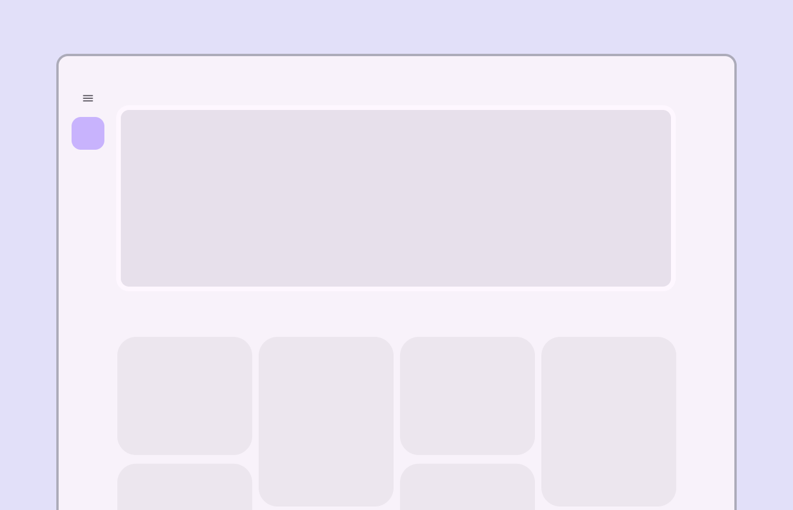

For large screens, place the FAB in the upper left corner

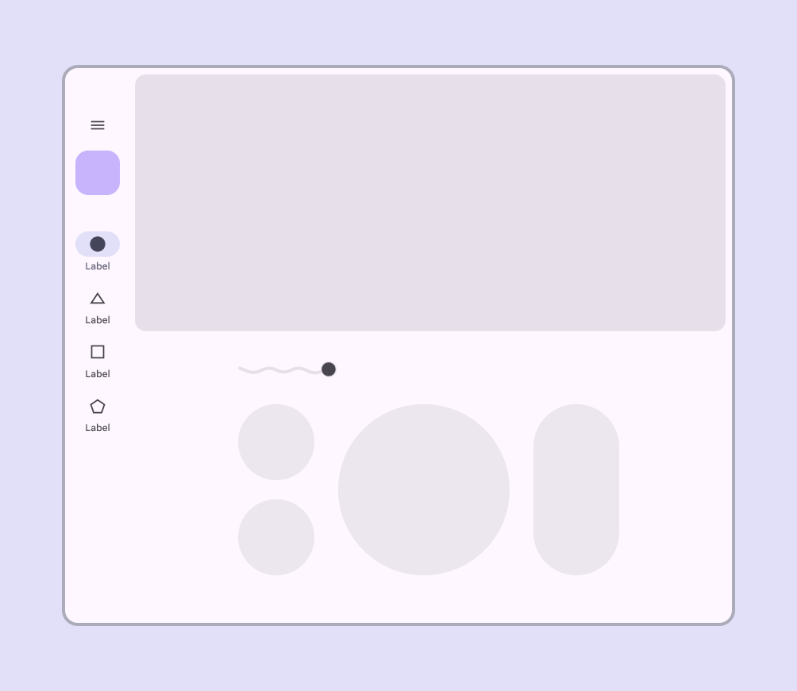

check Do

A FAB can be used within a navigation component, such as a navigation rail

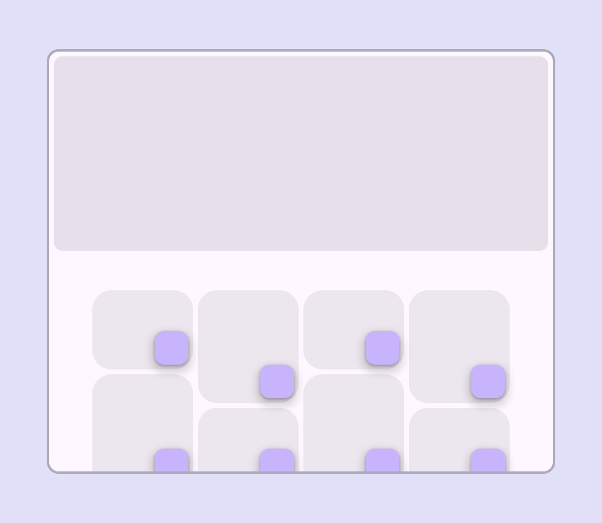

close Don’t

Individual components, such as cards, shouldn’t have their own FAB

## Behaviors

### Appearing

When a FAB animates on screen, it expands outward from a central point. The icon within it can be animated as well. While FABs should be relevant to screen content, they aren't attached to the surface on which content appears. FABs move separately from other UI elements because of their relative importance.

**Screen transitions
**FABs can morph to launch related actions. When a screen changes its layout, the FAB should disappear and reappear during the transition.

**Reappearance
**The FAB should only reappear if it's relevant to the new screen. It should reappear in the same position, if possible. FAB animating on screen

### Expanding

The FAB can expand and adapt to any shape using a container transform transition pattern. This includes a surface that's part of the app structure, or a surface that spans the entire screen. The FAB can also transition into a FAB menu. 

[More on FAB menus](/m3/pages/fab-menu)

FABs can expand and adapt to any shape

### Scrolling

FABs remain in place on scroll. Extended FABs can collapse into a FAB on scroll and expand on reaching the bottom of the view. FABs stay in place above a scrolling background

### Moving across tabs

When tabs are present, the FAB should briefly disappear, then reappear when the new content moves into place. This shows that the FAB is not connected to any particular tab.

check Do

The FAB should disappear and reappear when switching pages

Don't animate the FAB with body content.

close Don’t

Don’t keep the FAB on screen when switching pages

