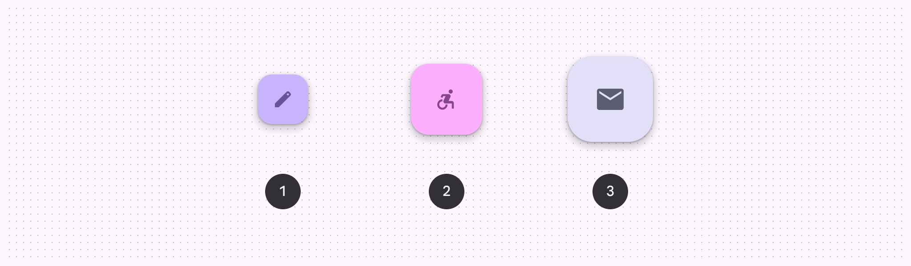
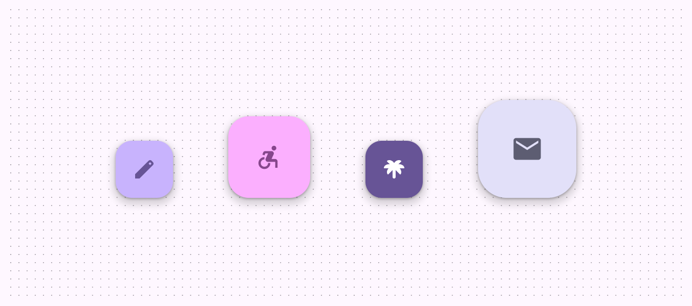
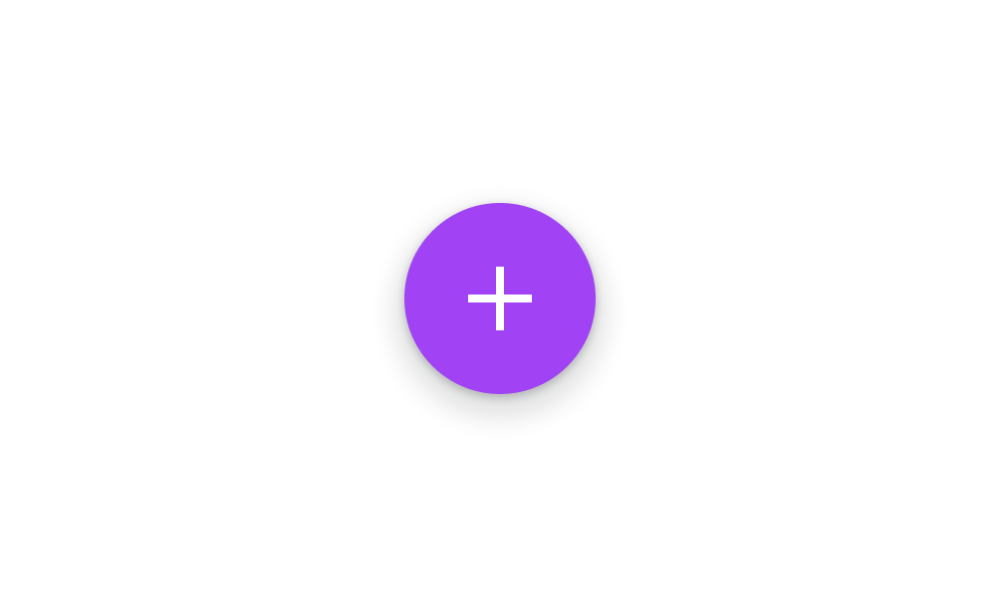
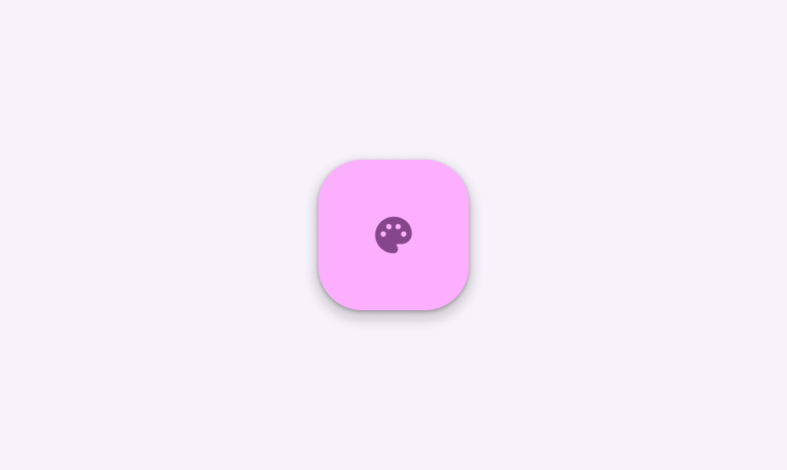

# Floating action buttons (FABs)

Floating action buttons (FABs) help people take primary actions

- Use a FAB for the most common or important action on a screen
- Make sure the icon in a FAB is clear and understandable
- FABs persist on the screen when content is scrolling
- Three variants: FAB, medium FAB, large FAB

1. FAB
2. Medium FAB
3. Large FAB

## Availability & resources

| Type | Resource | Status |
| --- | --- | --- |
| Design | [Design Kit (Figma)](https://www.figma.com/community/file/1035203688168086460) | Available |
| Implementation |  | Available |
| Implementation | [Jetpack Compose](https://developer.android.com/develop/ui/compose/components/fab) | Available |
| Implementation | [Jetpack Compose: Expressive](https://developer.android.com/reference/kotlin/androidx/compose/material3/package-summary#FloatingActionButton\(kotlin.Function0,androidx.compose.ui.Modifier,androidx.compose.ui.graphics.Shape,androidx.compose.ui.graphics.Color,androidx.compose.ui.graphics.Color,androidx.compose.material3.FloatingActionButtonElevation,androidx.compose.foundation.interaction.MutableInteractionSource,kotlin.Function0\)) | Available |
| Implementation |  | Available |
| Implementation |  | Available |
| Implementation |  | Available |

## M3 Expressive update

**May 2025**

The FAB has new sizes to match the extended FAB and more color options. The small FAB is no longer recommended. [More on M3 Expressive](https://m3.material.io/blog/building-with-m3-expressive)

Variants and naming:

- Added **medium** FAB size
- **Small** FAB size is no longer recommended
- FAB and large FAB sizes are unchanged
- FAB variants are based on size, not color

Color:

- Added tone color styles:

    - Primary
    - Secondary
    - Tertiary
- Renamed existing tonal color styles to match their token names:

    - **Primary** to **Primary container**
    - **Secondary** to **Secondary container**
    - **Tertiary** to **Tertiary container**
    - The values haven't changed
- Surface color FABs are no longer recommended

FABs have updated colors and sizes

## Differences from M2

M2: FABs are circles and always have a drop shadow

M3: FABs have a boxier shape, can use dynamic color, and include a new large FAB variation

