# Floating action buttons (FABs)

Floating action buttons (FABs) help people take primary actions

## Variants

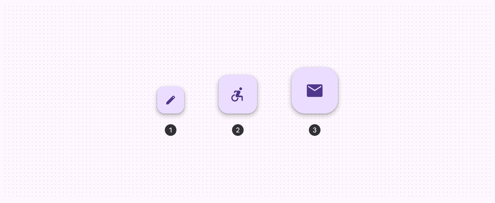

1. FAB
2. Medium FAB
3. Large FAB

### Baseline variants

The small FAB is still available, but no longer recommended. [Jump to baseline specs](/m3/pages/fab/specs#cd336045-e97d-4a6d-ac23-f778fa695e3c)

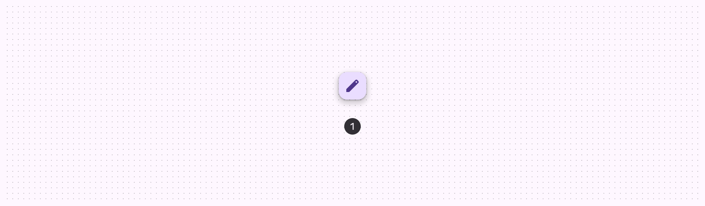

1\. Small FAB

|
Variant

 |

M3

 |

M3 Expressive

 |
| --- | --- | --- |
|

FAB

 |

Available

 |

Available

 |
|

Medium FAB

 |

\--

 |

Available

 |
|

Large FAB

 |

Available

 |

Available

 |
|

Small FAB

 |

Available

 |

Not recommended. Use a larger size.

 |

## Configurations

In the expressive update, the **primary**, **secondary**, and **tertiary** set colors were renamed to **primary container**, **secondary container**, and **tertiary container** to match the actual color roles used. New primary, secondary, and tertiary color styles were created to match the corresponding color roles. [View details in the color styles section](/m3/pages/fab/specs#67e71ec7-b520-405a-aa06-2decfa0b92a3)

|
Category

 |

Configuration

 |

M3

 |

M3 Expressive

 |
| --- | --- | --- | --- |
|

Color

 |

Primary container, secondary container, tertiary container

 |

Available as primary, secondary, tertiary

 |

Available

 |
|

Primary. secondary, tertiary

 |

\--

 |

Available

 |

## Tokens & specs

Use the table's menu to select a token set. FAB tokens are organized by size and color. [Learn more about design tokens](/m3/pages/design-tokens/overview/)

```
FAB - Size - RegularTokenValueFAB container heightmd.comp.fab.container.height56dpFAB container widthmd.comp.fab.container.width56dpFAB icon sizemd.comp.fab.icon.size24dpFAB container shapemd.comp.fab.container.shape
```

```
FAB - Size - RegularTokenValueFAB container heightmd.comp.fab.container.height56dpFAB container widthmd.comp.fab.container.width56dpFAB icon sizemd.comp.fab.icon.size24dpFAB container shapemd.comp.fab.container.shape
```

```
FAB - Size - RegularTokenValueFAB container heightmd.comp.fab.container.height56dpFAB container widthmd.comp.fab.container.width56dpFAB icon sizemd.comp.fab.icon.size24dpFAB container shapemd.comp.fab.container.shape
```

```
FAB - Size - Regular
```

```
FAB - Size - Regular
```

```
FAB - Size - Regular
```

```
FAB - Size - Regular
```

FAB - Size - Regular

Token

Value

FAB container height

md.comp.fab.container.height

56dp

FAB container width

md.comp.fab.container.width

56dp

FAB icon size

md.comp.fab.icon.size

24dp

FAB container shape

md.comp.fab.container.shape

## Anatomy

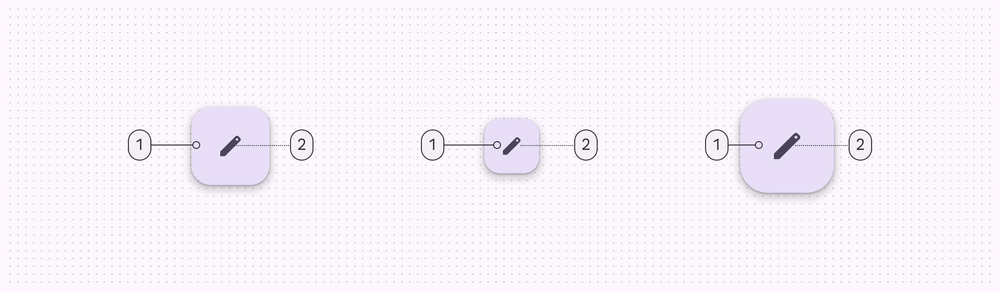

1\. Container

2\. Icon

## Color

Color values are implemented through design tokens. For design, this means working with color values that correspond with tokens. In implementation, a color value will be a token that references a value. [Learn more about design tokens](/m3/pages/design-tokens)

### Color styles

FABs can use several combinations of **color** and **on-color** styles, such as **primary** and **on-primary**. The following color mappings provide the same legibility and functionality, so the color mapping you use depends on style alone.

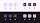

1. Primary container & On primary container (default)
2. Secondary container & On secondary container
3. Tertiary container & On tertiary container
4. Primary & On primary
5. Secondary & On secondary
6. Tertiary & On tertiary

### Baseline color styles

Surface FAB color styles are still available, but no longer recommended.

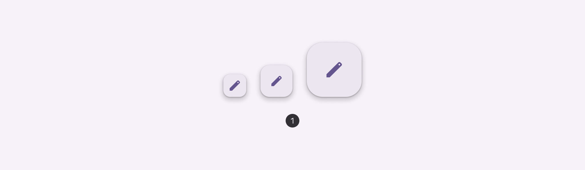

1. Surface FABs

## States

States are visual representations used to communicate the status of a component or interactive element. When using a non-default color mapping for FABs, make sure the state layer color is the same as the icon color. For example, the state layer color for the **primary** color style should be md.sys.color.primary.

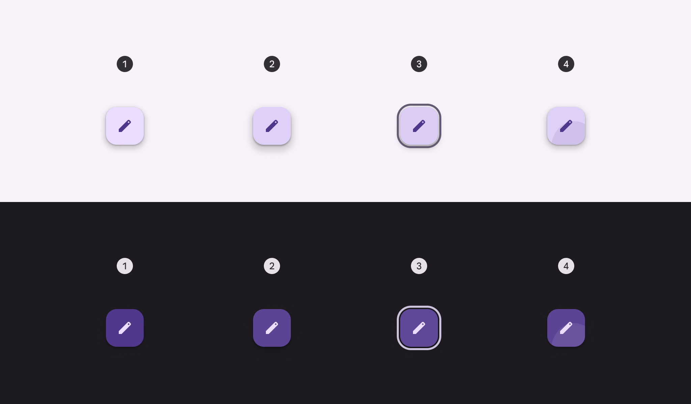

1. Enabled
2. Hovered (8% state layer) - elevation 4
3. Focused (10% state layer)
4. Pressed (10% state layer)

## Measurements

### FAB

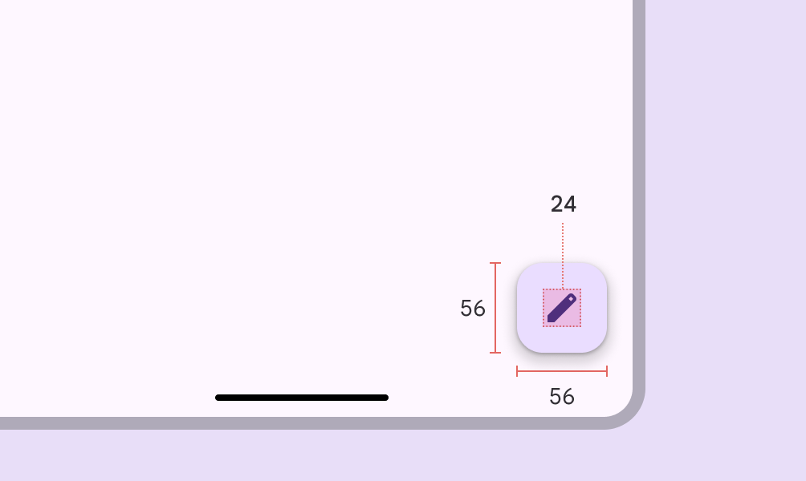

FAB size measurements

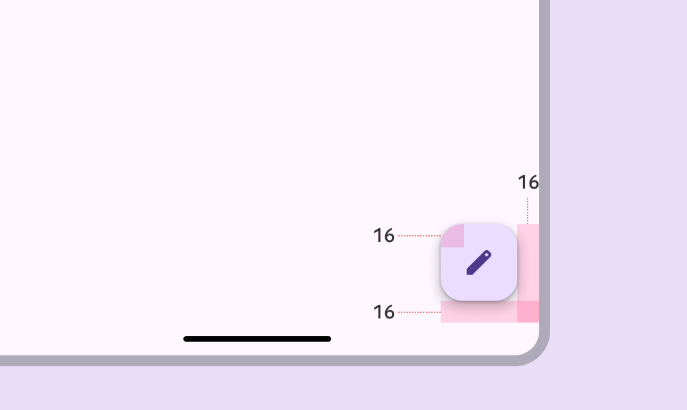

FAB padding measurements

### Medium FAB

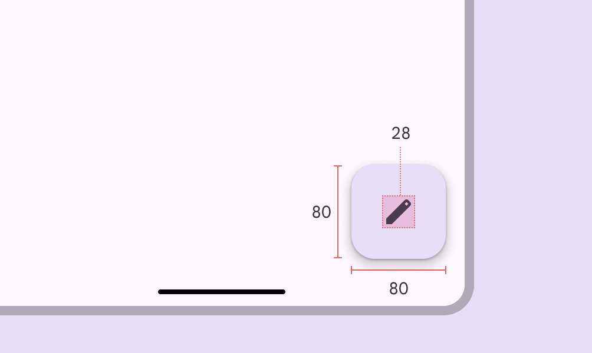

Medium FAB size measurements

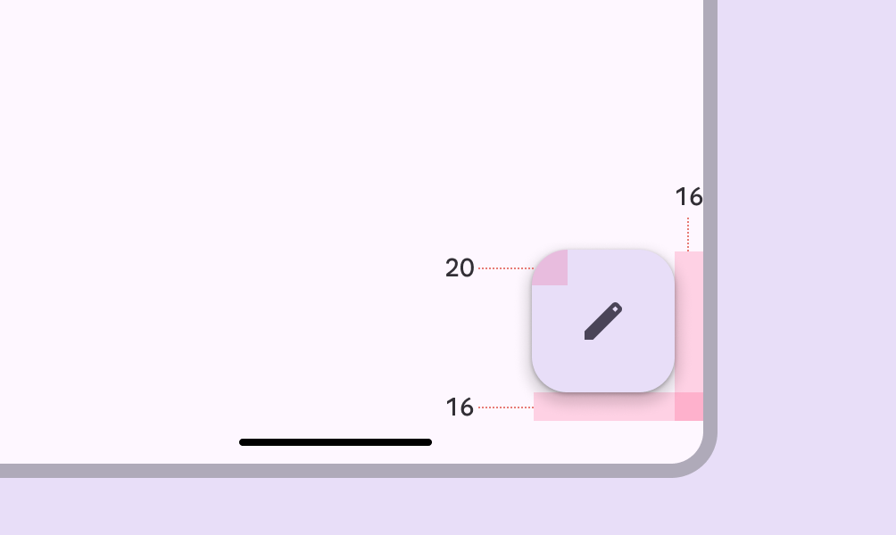

Medium FAB padding measurements

### Large FAB

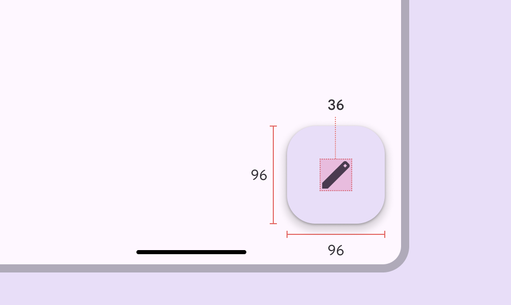

Large FAB size measurements

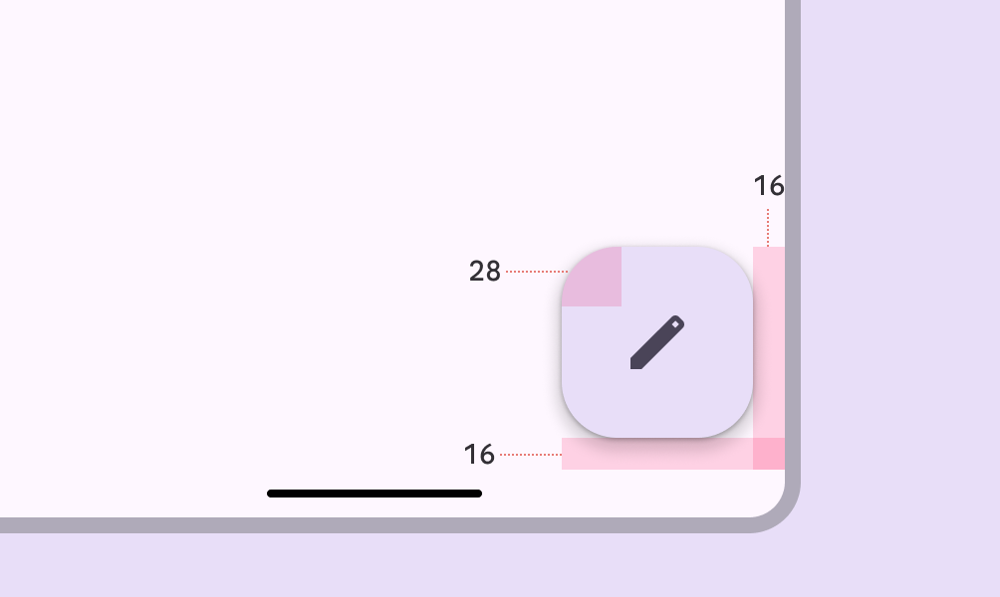

Large FAB padding measurements

## Baseline tokens & specs

Use the table's menu to select a token set. This only includes tokens for small and surface FABs, which are both no longer recommended. It doesn't include other colors, or large or regular FABs, since those are still currently used.

\[Deprecated\] FAB - Size - Small

Token

Value

FAB small container height

md.comp.fab.small.container.height

40dp

FAB small container width

md.comp.fab.small.container.width

40dp

FAB small icon size

md.comp.fab.small.icon.size

24dp

FAB small container shape

md.comp.fab.small.container.shape

