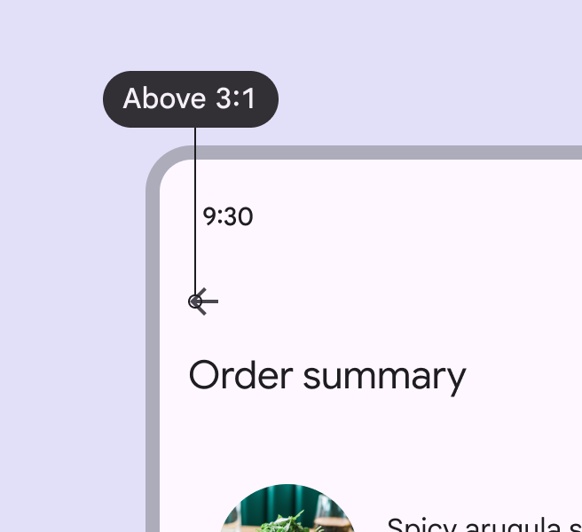
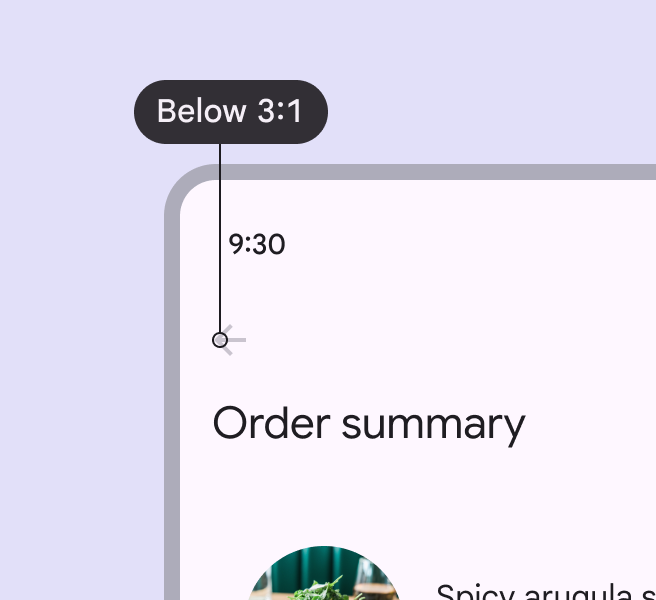
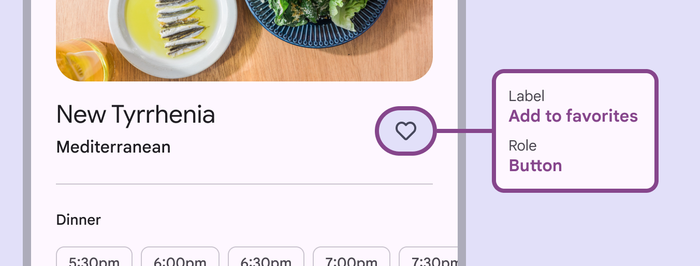
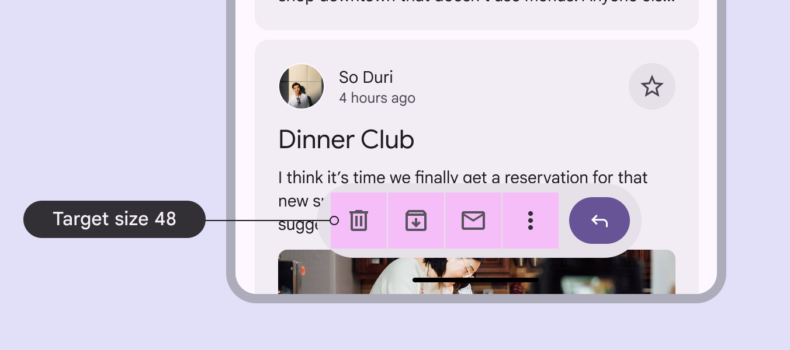
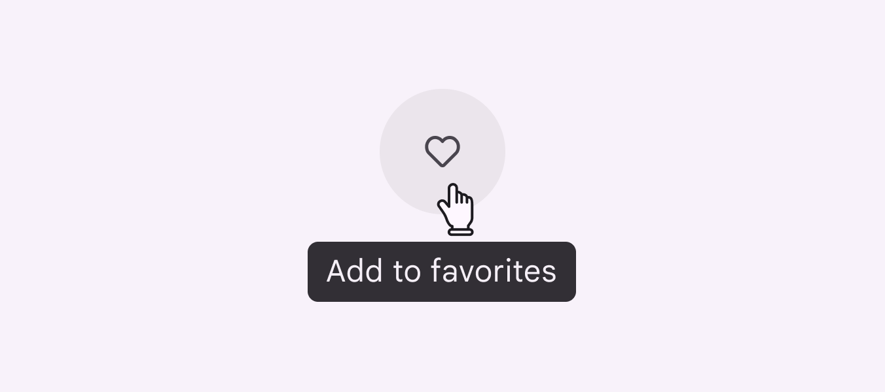

# Icon buttons

Icon buttons help people take actions with a single tap

## Use cases

People should be able to do the following using assistive technology:

- Understand meaning of the icon
- Navigate to and activate an icon button
- When applicable, a tooltip should be available to help describe the icon button's purpose

## Interaction & style

Ensure the icon has contrast of at least 3:1 with the surface or background.

check Do

Icon buttons should have a 3:1 contrast ratio with the surface or background

close Don’t

Avoid using colors with contrast below 3:1

## Keyboard navigation

|
**Keys**

 |

**Actions**

 |
| --- | --- |
| Tab | Focus lands on (non-disabled) icon button |
| Space or Enter | Activates the (non-disabled) icon button |

## Labeling elements

The accessibility label for icon buttons describes the action the button is executing, such as **Add to favorites**, **Bookmark**, or **Send message**.

The icon button label describes the action, such as Add to favorites for the heart icon

## Layout & density

Groups of similar components can be nested together inside a component, or they can stand alone. The target size of each icon button should be at least 48dp, even when nested.

Icon buttons can be used within other components, such as an app bar

### Avoid applying density by default

Don't apply density to icon buttons by default. This lowers their targets below the required 48x48 CSS pixels minimum size. Provide density options that allow people to choose a higher density, such as selecting a denser layout or changing the theme. Controls for adjusting density must maintain a target size of at least 48x48 CSS pixels.

## Hover

On web, icon buttons should display a tooltip with an accessibility label.

The tooltip label text should be clear and concise

